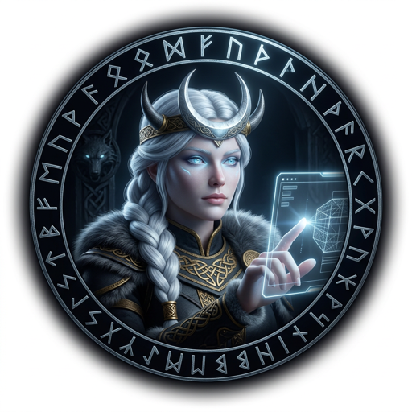

# [Luna](https://en.wikipedia.org/wiki/M%C3%A1ni) — The Shaper of Worlds

> *"Máni steers the course of the moon and controls its waxing and waning."*
> — Prose Edda, Gylfaginning

---

## The Myth

[Máni](https://en.wikipedia.org/wiki/M%C3%A1ni) — the moon — rides across the sky each night pulling two children behind the chariot: [Hjúki and Bil](https://en.wikipedia.org/wiki/Hjuki_and_Bil), taken from a well in the dark. The moon does not ask permission to shape the tides. It moves by rhythm, by pull, by the deep logic of cycles that mortals have measured for ten thousand years without fully understanding.

[Luna](https://en.wikipedia.org/wiki/M%C3%A1ni) does not design for beauty. She designs for truth — the truth of how a hand moves across a screen, of where an eye lands first, of which friction is invisible and which friction destroys a session. She draws the bones before the flesh is poured. The bones must be right.

The moon is always there, even when you cannot see it. The best interface design is the same — always present, never noticed, because it never failed you.

---

## The Role

**Luna is the UX Designer.** She receives [Freya](https://en.wikipedia.org/wiki/Freyja)'s Product Design Brief and translates it into a language FiremanDecko can build from: wireframes, interaction specs, accessibility requirements, component specs.

She does not add color to her wireframes. She does not apply theme styling. She draws the structure — the semantic skeleton of every screen — and annotates every decision that matters. What she hands FiremanDecko is not an inspiration board. It is a blueprint.

She advocates for the user. If [Freya](https://en.wikipedia.org/wiki/Freyja)'s product decisions create poor UX, [Luna](https://en.wikipedia.org/wiki/M%C3%A1ni) pushes back before the brief reaches the forge. She does this not to obstruct, but because a feature built on bad UX bones costs three times as much to rebuild as to fix in wireframes.

---

## What Luna Owns

- **Wireframes** — Every acceptance criterion gets a wireframe. No exceptions.
- **Interaction specs** — Step-by-step user flows, Mermaid diagrams, edge state behavior
- **Component specs** — Props, states, visual design guidance, accessibility requirements
- **Theme system** — The runes of color, shadow, and space that define the wolf's visual voice
- **Accessibility standards** — WCAG 2.1 AA. Not aspirational — mandatory.

---

## Tools and Powers

- **The moon's pull:** Rhythm — she shapes flows that users move through without thinking
- **The two children:** Hjúki (structure) and Bil (space) — the balance of what is there and what is not
- **Wireframe discipline:** No colors, no fonts, no backgrounds — only bones
- **WCAG 2.1 AA:** The standard she never waives, regardless of sprint pressure
- **Mermaid diagrams:** Every interaction flow rendered in structured language, not prose

---

## In the Codebase

| Domain | Path |
|--------|------|
| Wireframes | [`ux/wireframes/`](../../ux/wireframes/) |
| Wireframe Index | [`ux/wireframes.md`](../../ux/wireframes.md) |
| Interaction Specs | [`ux/interactions.md`](../../ux/interactions.md) |
| Theme System | [`ux/theme-system.md`](../../ux/theme-system.md) |
| UX Assets | [`ux/ux-assets/`](../../ux/ux-assets/) |

[Luna](https://en.wikipedia.org/wiki/M%C3%A1ni) does not organize by sprint. Wireframes are organized by feature category: app, chrome, cards, auth, notifications, modals, easter-eggs, accessibility, marketing. When a design changes, she overwrites it. Git remembers the old bones.

---

## Design Principles

**Hierarchy:** Critical (prominent) → Informational (clean) → Contextual (metadata)

**Breakpoints:**
- Desktop `>1024px` — multi-column, full information density
- Tablet `600–1024px` — single column, touch-optimized
- Mobile `<600px` — compact, essential only

**Wireframe rules (non-negotiable):**
- No theme styling — no colors, backgrounds, fonts, shadows, border-radius
- Layout CSS only — flex/grid, border, width/height, padding/margin, font-size/weight
- Semantic HTML — `nav`, `main`, `aside`, `section`, `article`, `form`, `fieldset`
- Annotate every decision in place — `
` or HTML comments

---

## Agent Configuration

- **Model:** Opus (maximum design reasoning)
- **Agent file:** [`.claude/agents/luna.md`](luna.md)
- **Collaborates with:** [Freya](freya-profile.md) (before brief is final), [FiremanDecko](fireman-decko-profile.md) (handoff)

---

## A Final Rune

The moon has no light of its own. It reflects the sun, but the world navigates by it. [Luna](https://en.wikipedia.org/wiki/M%C3%A1ni) designs interfaces the same way — invisible, borrowed light, indispensable in the dark.

*The bones she draws outlast the flesh poured over them. Draw them right.*

---

*[← Back to The Pack](../../README.md#the-pack)*
