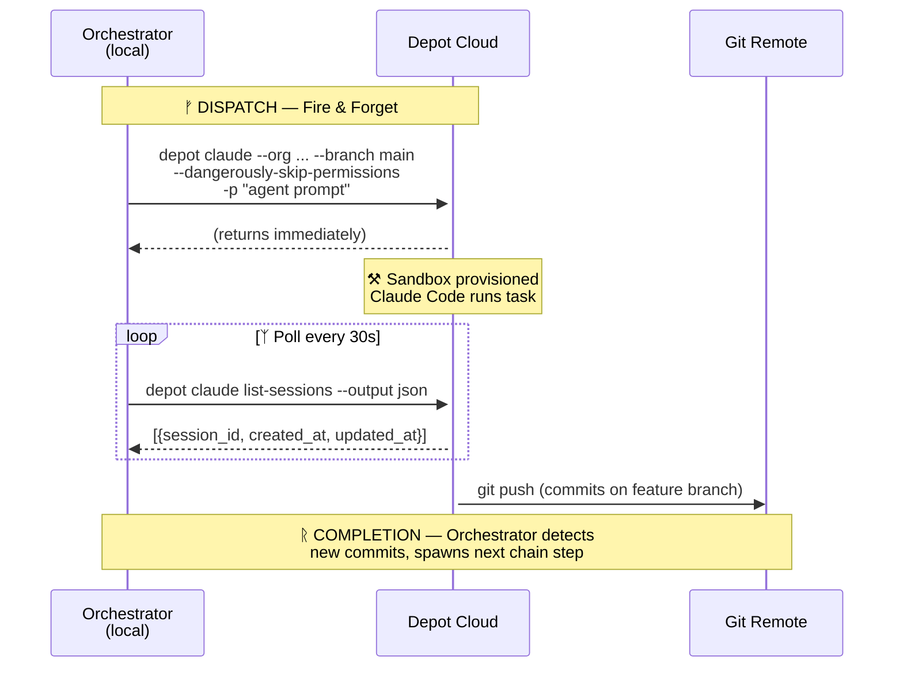
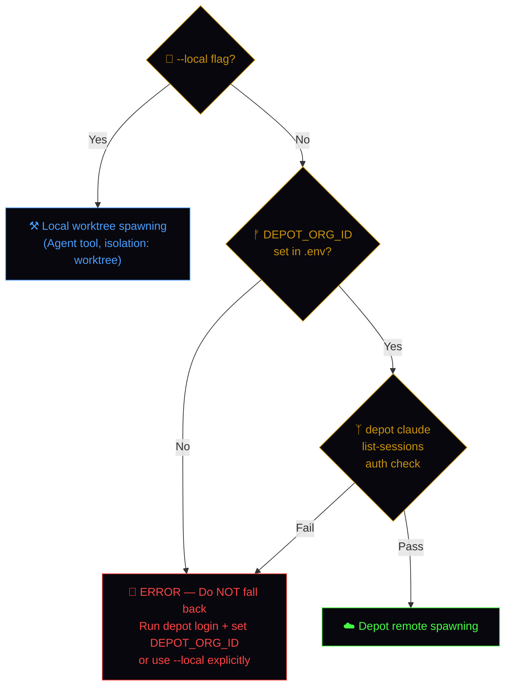

# Fire Next Up — Pull, Dispatch, and Chain Agents

Pulls the next "Up Next" item from the GitHub Project board and runs the full agent chain for that issue type. By default, agents run in **Depot remote sandboxes** (fire-and-forget). Use `--local` to fall back to local worktrees. Each agent in the chain works on the same branch, commits, and hands off to the next agent automatically.

---

## Agent Chains

Each issue type has a defined chain of agents. When one agent completes, the orchestrator automatically spawns the next agent in the chain on the same branch.

| Type | Step 1 | Step 2 | Step 3 |
|------|--------|--------|--------|
| `type:bug` | FiremanDecko (fix) | Loki (validate) | — |
| `type:feature` | FiremanDecko (implement) | Loki (validate) | — |
| `type:ux` | Luna (wireframes) | FiremanDecko (implement) | Loki (validate) |
| `type:security` | Heimdall (fix/audit) | Loki (validate) | — |
| `type:test` | Loki (write tests) | — | — |

**Chain execution rules:**
- All agents in a chain work on the **same branch** — each one commits and pushes before handing off.
- The orchestrator spawns Step 1 in the background. When it completes, the orchestrator spawns Step 2 on the same branch (and Step 3 if applicable).
- The **final agent** in every chain (Loki for multi-step, or the sole agent for `type:test`) creates the PR via `gh pr create`.
- Only Loki's `Fixes #<NUMBER>` in the PR body closes the issue — earlier agents use `Ref #<NUMBER>` in their commits.
- If any agent in the chain fails or reports a blocker, the chain stops and the orchestrator reports to the user.

---

## Flags

| Flag | Effect |
|------|--------|
| `--peek` | Show the prioritized Up Next queue with agent chains — do NOT spawn anything. |
| `--resume #N` | Resume an interrupted chain for issue #N. Detects where the chain left off and spawns the next agent. |
| `--batch N` | Pull the top N **unblocked** items from "Up Next" and start chains for all of them in parallel. Max 5. |
| `--local` | Force local worktree execution instead of Depot remote sandboxes. |
| `#N` | Start a fresh chain for a specific issue number (skip priority selection). |
| *(no flag)* | Default behavior: pick the top item and start the agent chain via **Depot remote sandbox**. |

When `--peek` is passed, run **Step 1 only**, then display the full queue as a table with columns: `#`, `Title`, `Priority`, `Type`, `Chain`. Stop after the table — do not proceed further.

When `--resume #N` is passed, skip Steps 1-4 and jump directly to the **Resume Flow** section below.

When `--batch N` is passed, follow the **Batch Dispatch** section below.

When `--local` is passed, use local worktrees instead of Depot for all agent spawning. All other behavior remains the same.

---

## Execution Modes: Remote (Default) vs Local

### Remote Mode (Default) — Depot Sandboxes

By default, all agent spawning uses **Depot remote sandboxes**. This offloads CPU/memory
from the local machine and allows true parallel execution. The orchestrator stays local,
holds all secrets, and manages the agent chain lifecycle.

**Prerequisites (one-time setup):**

1. Depot CLI installed: `curl -L https://depot.dev/install-cli.sh | sh`
2. Depot login: `depot login` (browser OAuth — no env var token needed)
3. Depot org configured: `DEPOT_ORG_ID` in `.env` (value: `pqtm7s538l`)
4. Claude OAuth token: run `claude setup-token` on a machine with a browser, then
   add via `depot claude secrets add CLAUDE_CODE_OAUTH_TOKEN`
5. Git credentials: `depot claude secrets add GIT_CREDENTIALS` for repo access

See `.claude/scripts/depot-setup.sh` for the automated setup flow.

**How Depot remote execution works:**



### Depot Session Lifecycle

Each agent step in a chain maps to **one Depot session**. The orchestrator manages the
full lifecycle: spawn, poll, detect completion, spawn next step.

#### 1. Spawn (Fire-and-Forget)

Launch a Depot session without `--wait`. The command returns immediately with a session ID.

```bash
depot claude \
  --org "$DEPOT_ORG_ID" \
  --session-id "issue-<NUMBER>-step<N>-<agent>" \
  --repository "https://github.com/declanshanaghy/fenrir-ledger" \
  --branch "main" \
  --dangerously-skip-permissions \
  -p "<AGENT PROMPT>"
```

Session ID naming convention: `issue-<NUMBER>-step<N>-<agent-name>`
Examples: `issue-42-step1-firemandecko`, `issue-42-step2-loki`

**Do NOT pass `--wait`** — the orchestrator must stay responsive to manage multiple
concurrent workers and chains.

#### 2. Poll (list-sessions)

Periodically check session status using `list-sessions`:

```bash
depot claude list-sessions --org "$DEPOT_ORG_ID" --output json
```

Expected JSON output structure:

```json
[
  {
    "id": "issue-42-step1-firemandecko",
    "status": "running",
    "created_at": "2026-03-06T10:00:00Z",
    "updated_at": "2026-03-06T10:05:00Z",
    "repository": "https://github.com/declanshanaghy/fenrir-ledger",
    "branch": "fix/issue-42-description"
  }
]
```

Session states and their meaning:

| Status | Meaning | Orchestrator Action |
|--------|---------|---------------------|
| `running` | Agent is actively working | Continue polling (30s interval) |
| `completed` | Agent exited successfully | Check git for commits, spawn next chain step |
| `failed` | Agent crashed or errored | Log error, report to user, stop chain |
| `stopped` | Manually stopped or timed out | Treat as failure, report to user |

**Polling cadence:**
- First check: 60 seconds after spawn (give the sandbox time to provision)
- Subsequent checks: every 30 seconds
- Timeout: 30 minutes per session (configurable). If exceeded, kill and report.

#### 3. Detect Completion

When `list-sessions` reports `completed` for a session:

1. **Verify git state** — confirm the worker pushed commits to the branch:
   ```bash
   git fetch origin "<BRANCH>"
   git log origin/main..origin/<BRANCH> --oneline
   ```
2. **Check for handoff comment** on the issue (agents are instructed to comment):
   ```bash
   gh issue view <NUMBER> --comments
   ```
3. If commits exist on the branch, proceed to spawn the next chain step.
4. If no commits found despite `completed` status, treat as a silent failure —
   re-run the step or report to the user.

#### 4. Kill Stuck Workers

If a session exceeds the timeout or appears hung (no `updated_at` change in 10 minutes):

```bash
# Sessions can be resumed or left to expire.
# For stuck sessions, note the ID and move on.
# Depot sessions are ephemeral — the only durable state is git.
```

Report to the user:
```
Worker `issue-42-step1-firemandecko` timed out after 30 minutes.
Branch state: <N> commits on origin/<BRANCH>.
Action: Skipping to next chain step / Stopping chain.
```

### Local Mode (`--local`)

When `--local` is passed, the orchestrator uses **local git worktrees** instead of Depot.
This is the original behavior — agents run as background Claude Code sessions on the
local machine using the Agent tool with `isolation: worktree`.

Use `--local` when:
- Depot is down or unreachable
- Debugging an agent prompt locally
- Working offline
- Quick single-issue fixes where remote overhead is not worth it

All chain logic, handoff detection, and PR creation remain identical. Only the spawning
mechanism differs.

### Mode Selection Logic



---

## Pre-Flight — Worktree Health Check

Before any dispatch, verify that no nested or stale worktrees exist. Nested worktrees
are a bug — they occur when a subagent creates `.claude/worktrees/` relative to its
CWD (which is itself a worktree) instead of the repo root.

```bash
REPO_ROOT=$(git worktree list --porcelain | head -1 | sed 's/^worktree //')

# List all worktrees and check for nesting
git worktree list --porcelain | grep '^worktree ' | sed 's/^worktree //' | while read -r wt; do
  # Skip the main worktree
  [ "$wt" = "$REPO_ROOT" ] && continue
  # Count occurrences of .claude/worktrees/ in the path
  COUNT=$(echo "$wt" | grep -o '\.claude/worktrees/' | wc -l)
  if [ "$COUNT" -gt 1 ]; then
    echo "WARNING: Nested worktree detected: $wt"
    echo "Removing nested worktree..."
    git worktree remove "$wt" --force 2>/dev/null || rm -rf "$wt"
  fi
done

# Prune any worktrees whose directories no longer exist
git worktree prune
```

If nested worktrees were found and cleaned, report before continuing:

```
**Worktree health check:** Cleaned up N nested worktree(s). All worktrees now flat under $REPO_ROOT/.claude/worktrees/.
```

If no issues found, proceed silently.

**IMPORTANT:** When spawning agents in `--local` mode, always follow the
`create-worktree` skill to resolve the repo root first. Never create worktrees
relative to CWD.

---

## Step 0 — Orphan PR Check

Before dispatching new work, check for orphaned PRs that need attention.

**An orphaned PR is one that:**
- Is open
- Has no agent chain actively working on it (no recent commits in the last 24h)
- Is missing a Loki QA verdict comment
- OR has a PASS verdict but was never merged

```bash
gh pr list --state open --json number,title,headRefName,updatedAt,labels --jq '.[] | {num: .number, title: .title, branch: .headRefName, updated: .updatedAt, labels: [.labels[].name]}'
```

For each open PR, check:

1. **Has a Loki verdict?** — scan PR comments for `## Loki QA Verdict`:
   ```bash
   gh pr view <NUMBER> --comments --json comments --jq '[.comments[].body | select(test("## Loki QA Verdict"))] | length'
   ```

2. **Verdict was PASS but not merged?** — Loki approved but merge didn't happen:
   ```bash
   gh pr view <NUMBER> --comments --json comments --jq '[.comments[].body | select(test("Verdict.*PASS"))] | length'
   ```

3. **Stale?** — last update was more than 24h ago (no active work):
   Compare `updatedAt` against current time.

### Orphan categories and actions

| Category | Condition | Action |
|----------|-----------|--------|
| **PASS but unmerged** | Loki PASS verdict exists, PR still open | Attempt auto-merge: check CI, `needs-review` label, mergeability. Merge if clear. |
| **No verdict** | PR open, no Loki verdict comment, stale >24h | Resume the chain: run `/fire-next-up --resume #N` for the linked issue. |
| **FAIL verdict** | Loki FAIL verdict, no subsequent fix commits | Report to user: `PR #N failed QA and is stale. Needs attention.` |
| **No linked issue** | PR has no `Fixes #N` or `Ref #N` in body | Report to user: `PR #N has no linked issue. Review manually.` |

### Report format

If orphans are found, report them BEFORE proceeding to Step 1:

```
**Orphaned PRs detected:**

| PR | Title | Status | Action Taken |
|----|-------|--------|-------------|
| #N | ... | PASS but unmerged | Merged |
| #M | ... | No QA verdict, stale 3d | Resuming chain for #X |
| #K | ... | FAIL verdict, stale 2d | Needs manual attention |

Proceeding to dispatch next issue...
```

If no orphans are found, proceed silently to Step 1.

---

## Step 1 — Query the Project Board

Fetch all items from GitHub Project #1 and filter for the "Up Next" status column:

```bash
gh project item-list 1 --owner declanshanaghy --format json \
  --jq '[.items[] | select(.status == "Up Next") | {num: .content.number, title: .content.title}]'
```

If no items are in "Up Next", tell the user:
> No items in "Up Next". Add items to the column at https://github.com/users/declanshanaghy/projects/1 or promote from Todo.

---

## Step 2 — Select the Item

From the "Up Next" list, select the highest-priority item using these rules (in order):

1. **P1-critical** before P2-high before P3-medium before P4-low (read from labels)
2. Within the same priority, prefer **bugs** over **security** over **UX** over **features** over **tests**
3. Within the same priority and type, prefer the **lowest issue number** (oldest first)

Fetch the full issue details:

```bash
gh issue view <NUMBER> --json number,title,body,labels
```

---

## Step 3 — Refine with Odin

Before dispatching, present the selected issue to Odin for refinement. This ensures the
approach is correct and avoids wasted agent cycles on misunderstood requirements.

**Present to Odin:**

```
**Issue #<NUMBER>**: <TITLE>
**Type:** <type label>
**Priority:** <priority label>
**Chain:** <Agent1> → <Agent2> [→ <Agent3>]

**Summary:**
<First 3-4 sentences of the issue body — the problem statement>

**Proposed approach:**
<1-2 sentence summary of what the first agent will do, derived from the issue body and acceptance criteria>

**Acceptance criteria:**
<Bullet list of ACs from the issue>

Odin — does this look right? Any adjustments to the approach, scope, or ACs before I fire it off?
```

**Wait for Odin's response.** Odin may:

| Response | Action |
|----------|--------|
| Approval (e.g. "go", "looks good", "fire it") | Proceed to Step 4. |
| Scope adjustment (e.g. "also fix X", "skip the toggle removal") | Update the agent prompt to reflect Odin's direction. Note the adjustment. |
| Rejection (e.g. "skip this one", "not now") | Skip this issue. Pick the next Up Next item and return to Step 2. |
| Different issue (e.g. "do #154 instead") | Switch to the requested issue and restart from Step 2. |
| Question back | Answer from the issue context, then re-ask for approval. |

**Skip refinement when:**
- `--batch` flag is used (too many items for interactive review)
- Issue body contains `skip-refinement` tag

---

## Step 4 — Determine the Chain

Map the issue type label to its agent chain using the table above. Record the full chain — you will execute it step by step.

If the issue has multiple type labels, use the first match in priority order: bug > security > ux > feature > test.

---

## Step 5 — Build the Branch Name

Construct the branch name from the issue:

```
fix/issue-<NUMBER>-<kebab-description>
```

Where `<kebab-description>` is a 3-5 word kebab-case summary derived from the issue title. Max 50 characters total.

Examples:
- `fix/issue-151-settings-two-column`
- `fix/issue-157-llm-prompt-injection`
- `fix/issue-154-howl-overlaps-menu`

**IMPORTANT:** The orchestrator does NOT create or push this branch. The branch name is
passed to the agent via the prompt. The agent creates the branch itself inside the sandbox
(or worktree) from `main`. This avoids the problem where Depot fails to checkout a
non-existent remote branch.

---

## Step 6 — Spawn Step 1 Agent

### Remote Mode (Default — Depot)

Launch the first agent in the chain as a **Depot remote session** (fire-and-forget):

```bash
depot claude \
  --org "$DEPOT_ORG_ID" \
  --session-id "issue-<NUMBER>-step1-<agent-name>" \
  --repository "https://github.com/declanshanaghy/fenrir-ledger" \
  --branch "main" \
  --dangerously-skip-permissions \
  -p "<AGENT PROMPT FROM TEMPLATES BELOW>"
```

**Always use `--branch main`** — the sandbox clones main and the agent creates its own
feature branch. Passing a non-existent branch causes Depot to fail on checkout.

After launching, immediately start the **polling loop** described in the Depot Session
Lifecycle section. Track the session:

```
Session: issue-<NUMBER>-step1-<agent-name>
Status: spawned, polling every 30s
Timeout: 30 minutes
```

### Local Mode (`--local`)

Launch the first agent in a **local background worktree** using the Agent tool:

- `subagent_type`: first agent in the chain
- `isolation`: `worktree`
- `run_in_background`: `true`
- `description`: `[Step 1/<N>] #<NUMBER>: <short summary>`

### Agent-Specific Prompt Templates

Use the appropriate template based on which agent is being spawned.

#### Luna (UX Designer) — Step 1 for `type:ux`

```
You are Luna, the UX Designer. Design wireframes for GitHub Issue #<NUMBER>: <TITLE>

**First, create your branch:**
git checkout -b <BRANCH> && git push -u origin <BRANCH>

**Issue details:**

<FULL ISSUE BODY>

**Your deliverables:**
- Create HTML wireframe(s) in `ux/wireframes/` for the feature described in the issue.
- Keep wireframes free of theme styling (no colors, no fonts) — structure only.
- Update `ux/wireframes.md` if adding new wireframes.
- Write a brief interaction spec if the feature has non-obvious interactions.
- Commit with message: `design: wireframes for #<NUMBER> — <short description>`
- Use `Ref #<NUMBER>` (not Fixes) — you are not the final agent.
- Push to the branch when done.

**Handoff — REQUIRED before you finish:**
After pushing, comment on the issue with handoff notes for FiremanDecko:
```bash
gh issue comment <NUMBER> --body "## Luna → FiremanDecko Handoff

**Wireframes committed** on branch \`<BRANCH>\`.

**Files created:**
- \`ux/wireframes/<file1>.html\`
- \`ux/wireframes/<file2>.html\` (if applicable)

**Key design decisions:**
- <Brief summary of layout choices, responsive behavior, interactions>

**Implementation notes for FiremanDecko:**
- <Any specific component suggestions, existing patterns to reuse, edge cases to handle>

Ready for implementation. 🔨"
```

**Key reminders:**
- Read the existing wireframes first to match conventions.
- Mobile-first: 375px minimum viewport.
- Follow the git-commit skill for branch workflow and commit format.

Start by reading the issue, then review existing wireframes in ux/wireframes/ for conventions.
```

#### FiremanDecko (Principal Engineer) — for bugs, features, and UX Step 2

```
You are FiremanDecko, the Principal Engineer. Fix GitHub Issue #<NUMBER>: <TITLE>

**First, get on your branch:**
Check if the branch already exists (a previous agent may have created it):
  git fetch origin
  git branch -r | grep '<BRANCH>'
If it exists: git checkout <BRANCH> && git pull origin <BRANCH>
If it does NOT exist: git checkout -b <BRANCH> && git push -u origin <BRANCH>

**Issue details:**

<FULL ISSUE BODY>

**Before you start — read the handoff context:**
1. Read all comments on the issue for handoff notes from previous agents:
   `gh issue view <NUMBER> --comments`
2. Read the commits already on this branch (if any):
   `git log origin/main..HEAD --oneline`
3. <If UX chain: Luna's wireframes are on this branch. Read them: `ux/wireframes/`>
4. Use the previous agent's handoff comment to understand design decisions and what they built.

**Your deliverables:**
- Implement the fix/feature described in the issue.
- <If UX Step 2: Follow Luna's wireframes for layout and structure.>
- Ensure `cd development/frontend && npx tsc --noEmit` passes.
- Ensure `cd development/frontend && npx next build` succeeds.
- Commit with message: `fix: <description> — Ref #<NUMBER>`
- Use `Ref #<NUMBER>` (not Fixes) — Loki will close the issue after validation.
- Push to the branch when done.

**Handoff — REQUIRED before you finish:**
After pushing, comment on the issue with handoff notes for Loki:
```bash
gh issue comment <NUMBER> --body "## FiremanDecko → Loki Handoff

**Implementation committed** on branch \`<BRANCH>\`.

**What changed:**
- \`<file1>\` — <brief description of change>
- \`<file2>\` — <brief description of change>

**How to verify:**
- <Step-by-step verification that maps to acceptance criteria>
- <Key user flows to test>

**Edge cases to cover in tests:**
- <Any tricky scenarios Loki should write tests for>

**Build status:** tsc clean, next build clean.
Ready for QA. 🧪"
```

**Key reminders:**
- Read the existing code first before making changes.
- Follow the git-commit skill for branch workflow and commit format.
- Mobile-friendly: min 375px, two-col collapse pattern.
- Structured logging on backend code (fenrir logger, not raw console.*).

Start by reading the issue comments for handoff context, then the affected files, then implement.
```

#### Heimdall (Security Specialist) — Step 1 for `type:security`

```
You are Heimdall, the Security Specialist. Fix GitHub Issue #<NUMBER>: <TITLE>

**First, create your branch:**
git checkout -b <BRANCH> && git push -u origin <BRANCH>

**Issue details:**

<FULL ISSUE BODY>

**Your deliverables:**
- Implement the security fix described in the issue.
- Update security documentation if the fix changes auth flows, trust boundaries, or threat model.
- Commit with message: `security: <description> — Ref #<NUMBER>`
- Use `Ref #<NUMBER>` (not Fixes) — Loki will close the issue after validation.
- Push to the branch when done.

**Handoff — REQUIRED before you finish:**
After pushing, comment on the issue with handoff notes for Loki:
```bash
gh issue comment <NUMBER> --body "## Heimdall → Loki Handoff

**Security fix committed** on branch \`<BRANCH>\`.

**What changed:**
- \`<file1>\` — <brief description of change>

**Security context for tests:**
- <What the vulnerability was and how it was fixed>
- <What to test: input validation, auth checks, error handling>

**Verification steps:**
- <Specific requests or payloads Loki should test>

Ready for QA. 🧪"
```

**Key reminders:**
- Read the existing code first before making changes.
- Follow the git-commit skill for branch workflow and commit format.
- Secret masking (UNBREAKABLE RULE), OWASP Top 10 awareness.
- Never log secrets, tokens, or credentials.

Start by reading the affected files listed in the issue, then implement the fix.
```

#### Loki (QA Tester) — Final agent in chain (or sole agent for `type:test`)

```
You are Loki, the QA Tester. Validate GitHub Issue #<NUMBER>: <TITLE>

**First, get on the branch:**
Check if the branch already exists (previous agents may have created it):
  git fetch origin
  git branch -r | grep '<BRANCH>'
If it exists: git checkout <BRANCH> && git pull origin <BRANCH>
If it does NOT exist (e.g. you are the sole agent for type:test): git checkout -b <BRANCH> && git push -u origin <BRANCH>

**Issue details:**

<FULL ISSUE BODY>

**Before you start — read the handoff context:**
1. Read all comments on the issue for handoff notes from previous agents:
   `gh issue view <NUMBER> --comments`
2. Read the commits already on this branch:
   `git log origin/main..HEAD --oneline`
3. Use the previous agent's handoff comment to understand what was built, how to verify, and edge cases to test.

**Your deliverables:**
- Write new Playwright tests in `quality/test-suites/<feature-slug>/` covering the acceptance criteria.
- Use the previous agent's "How to verify" and "Edge cases" sections to guide your test design.
- Run the new tests: `cd development/frontend && SERVER_URL=http://localhost:9653 npx playwright test ../../quality/test-suites/<feature-slug>/ --reporter=list`
- Verify build passes: `cd development/frontend && npx tsc --noEmit && npx next build`
- Commit tests with message: `test: validate #<NUMBER> — <short description>`
- Create the PR: `gh pr create --title "<title>" --body "Fixes #<NUMBER>\n\n<summary>"`
- The PR body MUST contain `Fixes #<NUMBER>` to auto-close the issue on merge.
- Push to the branch when done.

**Auto-merge — REQUIRED after creating the PR:**
If your verdict is PASS, attempt to merge the PR automatically:

1. Wait for CI to finish: `gh pr checks <PR_NUMBER> --watch --fail-fast`
2. Check for the `needs-review` label (Odin's veto flag):
   `gh issue view <NUMBER> --json labels --jq '[.labels[].name] | any(. == "needs-review")'`
3. Check the PR is mergeable:
   `gh pr view <PR_NUMBER> --json mergeable --jq '.mergeable'`
4. **If CI green AND no `needs-review` label AND mergeable:**
   `gh pr merge <PR_NUMBER> --squash --delete-branch`
5. **If blocked by any condition**, skip the merge and note it in the verdict comment:
   - CI failing: `Merge blocked — CI failing. Manual review needed.`
   - `needs-review` label: `Merge blocked — needs-review label present. Awaiting Odin's review.`
   - Not mergeable: `Merge blocked — merge conflicts. Rebase needed.`

**Handoff — REQUIRED before you finish:**
After creating the PR (and merging if auto-merge succeeded), comment on the issue with your QA verdict:
```bash
gh issue comment <NUMBER> --body "## Loki QA Verdict

**PR created:** <PR_URL>
**Branch:** \`<BRANCH>\`
**Verdict:** PASS / FAIL

**Tests written:** <N> tests in \`quality/test-suites/<slug>/\`
**Tests passing:** <N>/<N>

**What was validated:**
- <AC-1 result>
- <AC-2 result>

**Build status:** tsc clean, next build clean.

<If PASS and merged: Merged to main. ✅>
<If PASS but merge blocked: Ready for merge — <reason for block>. ⏳>
<If FAIL: Blocked — see failures above. ❌>"
```

**Key reminders:**
- Read the existing code AND the previous commits on this branch to understand what was built.
- Assertions derive from acceptance criteria, not from what the code currently does.
- Each test clears relevant localStorage before running — idempotent by design.
- Follow the git-commit skill for branch workflow and commit format.
- Do NOT run the full regression suite — CI handles that. Only run your new tests.

Start by reading the issue comments for handoff context, then the acceptance criteria, then write and run tests.
```

---

## Step 7 — Chain Execution

### Remote Mode (Default — Depot)

The orchestrator **polls** `depot claude list-sessions --org "$DEPOT_ORG_ID" --output json`
to detect when an agent completes. When a session transitions to `completed`:

1. **Verify git state** — fetch the branch and check for new commits.
2. **Check for handoff comment** on the issue.
3. **If the agent failed** (status `failed` or `stopped`, or no commits despite `completed`),
   stop the chain and tell the user.
4. **If more steps remain in the chain**, spawn the next agent as a new Depot session:
   ```bash
   depot claude \
     --org "$DEPOT_ORG_ID" \
     --session-id "issue-<NUMBER>-step<N>-<agent-name>" \
     --repository "https://github.com/declanshanaghy/fenrir-ledger" \
     --branch "main" \
     --dangerously-skip-permissions \
     -p "<AGENT PROMPT>"
   ```
   The agent's prompt includes instructions to checkout the existing branch.
5. **If this was the final step** (Loki), report completion to the user with the PR URL.

### Local Mode (`--local`)

When a background agent completes (you receive a task notification):

1. **Check the result.** If the agent reported a failure or blocker, stop the chain and tell the user.
2. **If more steps remain in the chain**, spawn the next agent:
   - Same `isolation: worktree` — but resume on the **same branch** (the previous agent already pushed).
   - `run_in_background: true`
   - `description`: `[Step N/<Total>] #<NUMBER>: <short summary>`
   - Use the appropriate prompt template from Step 6.
3. **If this was the final step** (Loki), report completion to the user with the PR URL.

### Chain state tracking

Track the chain progress in your conversation context:

```
Issue #<NUMBER>: <TITLE>
Branch: <BRANCH>
Chain: Luna → FiremanDecko → Loki
Status: Step 2/3 — FiremanDecko running
```

Update this after each agent completes.

---

## Step 8 — Report

After spawning Step 1, report to the user:

```
**#<NUMBER>**: <title>
**Chain:** <Agent1> → <Agent2> → <Agent3>
**Status:** Step 1/<N> — <AgentName> running in background

**Remaining Up Next items:**
| # | Issue | Chain |
|---|-------|-------|
| ... | ... | ... |
```

After each chain step completes, update the user:

```
**#<NUMBER>**: Step <N>/<Total> complete (<AgentName>).
Spawning Step <N+1>: <NextAgentName>...
```

After the final step:

```
**#<NUMBER>**: Chain complete. PR created: <PR_URL>
```

### Worktree Cleanup (Local Mode Only)

After a chain completes (Loki merges or chain fails), clean up the worktrees used
by that chain. This prevents stale worktrees from accumulating.

```bash
REPO_ROOT=$(git worktree list --porcelain | head -1 | sed 's/^worktree //')

# Remove worktrees for this chain's agents
# Pattern: issue-<NUMBER>-* matches all agent worktrees for this issue
for wt in "$REPO_ROOT/.claude/worktrees/issue-<NUMBER>-"*; do
  if [ -d "$wt" ]; then
    echo "Cleaning up worktree: $wt"
    git worktree remove "$wt" --force 2>/dev/null || rm -rf "$wt"
  fi
done

# Prune git's worktree registry for any removed directories
git worktree prune
```

For batch dispatch cleanup (after ALL chains complete):

```bash
REPO_ROOT=$(git worktree list --porcelain | head -1 | sed 's/^worktree //')

# Remove all agent worktrees (keeps the directory structure)
for wt in "$REPO_ROOT/.claude/worktrees/"*; do
  if [ -d "$wt" ]; then
    git worktree remove "$wt" --force 2>/dev/null || rm -rf "$wt"
  fi
done

git worktree prune
```

**Note:** Remote mode (Depot) does not create local worktrees, so cleanup is not
needed. Depot sandboxes are ephemeral and self-destruct after the session ends.

---

## Resume Flow (`--resume #N`)

When a chain is interrupted (session ended, agent failed, context lost), use `--resume #N` to pick up where it left off.

### Detection Steps

1. **Fetch issue details** to determine the chain type:
   ```bash
   gh issue view <N> --json number,title,body,labels
   ```

2. **Find the existing branch** by looking for the issue number:
   ```bash
   git branch -r | grep "issue-<N>"
   ```
   If no branch exists, the chain never started — run a fresh chain instead (same as `/fire-next-up #N`).

3. **Read issue comments** to determine which agents have completed their handoffs:
   ```bash
   gh issue view <N> --comments
   ```

   Look for handoff comment headers to identify completed steps:

   | Comment header | Agent completed | Next agent |
   |----------------|-----------------|------------|
   | `## Luna → FiremanDecko Handoff` | Luna | FiremanDecko |
   | `## FiremanDecko → Loki Handoff` | FiremanDecko | Loki |
   | `## Heimdall → Loki Handoff` | Heimdall | Loki |
   | `## Loki QA Verdict` | Loki (chain complete) | — |

   The **last handoff comment** tells you exactly where the chain stopped and who's next.

4. **Check if a PR already exists** for the branch:
   ```bash
   gh pr list --head "<BRANCH>" --json number,state
   ```
   If a PR exists and Loki's verdict comment is present → chain is complete.

5. **Determine the next step:**
   - No handoff comments → Step 1 agent failed before completing. Re-run Step 1.
   - `Luna → FiremanDecko Handoff` exists but no further → spawn FiremanDecko.
   - `FiremanDecko → Loki Handoff` or `Heimdall → Loki Handoff` exists but no verdict → spawn Loki.
   - `Loki QA Verdict` exists → chain is complete, tell the user.

6. **Fallback — inspect commits** if no handoff comments exist (agent forgot to comment):
   ```bash
   git log origin/main..origin/<BRANCH> --oneline
   ```
   Use commit prefixes (`design:`, `fix:`, `security:`, `test:`) as a secondary signal.

### Resume Execution

Once the next agent is identified:

1. Report to the user what was detected:
   ```
   **Resuming #<N>**: <title>
   **Chain:** <full chain>
   **Completed:** Step 1 (<AgentName>) — found `<commit prefix>` commits
   **Resuming at:** Step <X>/<Total> — spawning <NextAgentName>
   ```

2. Spawn the next agent using the same prompt templates from Step 6, on the **existing branch**.

3. Continue normal chain execution from Step 7 onward.

### Edge Cases

- **Branch exists but no commits beyond main** — the previous agent failed before committing. Re-run that step (same agent, same branch).
- **Multiple agents' commits exist but chain isn't complete** — skip to the next incomplete step.
- **PR exists but CI failed** — tell the user. They may want to fix CI issues manually or re-run the failing agent.
- **Issue is closed** — tell the user the issue is already closed. Do not spawn agents.

---

## Batch Dispatch (`--batch N`)

Pull the top N unblocked items from "Up Next" and start chains for all in parallel. Max 5.

### Steps

1. **Query the board** — same as Step 1.
2. **Prioritize and filter** — same as Step 2, but select the top N items instead of 1.
3. **Check for blocked issues** — for each candidate, scan its body for `Blocked by #N`:

   ```bash
   gh issue view <NUMBER> --json body --jq '.body' | grep -oP 'Blocked by #\K\d+'
   ```

   For each blocking issue number, check if it's still open:

   ```bash
   gh issue view <BLOCKING_NUMBER> --json state --jq '.state'
   ```

   If ANY blocking issue is still `OPEN`, **skip this item** and move to the next in priority order. Report skipped items in the output.

4. **Spawn chains** — for each unblocked item, run Steps 4–6 (determine chain, build branch, spawn Step 1 agent). All chains run in parallel background worktrees.

5. **Report** — show all dispatched chains and any skipped (blocked) items:

   ```
   **Batch dispatched:** N chains

   | # | Title | Chain | Status |
   |---|-------|-------|--------|
   | #A | ... | Decko -> Loki | Running |
   | #B | ... | Luna -> Decko -> Loki | Running |
   | #C | ... | Decko -> Loki | Blocked by #A — skipped |
   ```

6. **Chain execution** — each chain runs independently per Step 7. When a chain completes, report it. When all chains complete, report the batch summary.

### Batch rules

- Max 5 parallel chains — if N > 5, cap at 5 and tell the user.
- Each chain is independent — a failure in one does not stop others.
- Blocked items are skipped, not queued. Run `/fire-next-up` again after blockers resolve.
- If fewer than N unblocked items exist, dispatch whatever is available and report the shortfall.

---

## Dependency Checking

Before dispatching ANY issue (single or batch), check if it's blocked:

1. Read the issue body for `Blocked by #N` references.
2. For each referenced issue, check if it's still open.
3. If blocked:
   - **Single dispatch**: warn the user and ask if they want to proceed anyway or pick the next unblocked item.
   - **Batch dispatch**: skip silently and pick the next unblocked item.

---

## Notes

- Only spawn **one chain per invocation** unless `--batch` is used.
- Each agent in the chain handles its own commits and pushes. Do NOT duplicate their work in the main context.
- The orchestrator's job is to **coordinate the chain**, not to build. Never do an agent's work yourself.
- If an agent goes idle (no completion after a reasonable time), kill and respawn per team norms.
- For `type:test` issues, Loki is both the first and final agent — he writes tests AND creates the PR.
