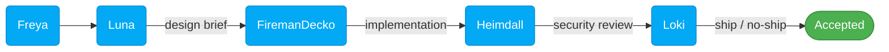

# Fenrir Ledger

<table>
  <tr>
    <td colspan="4">
      <a href="LICENSE.md"></a>
    </td>
  </tr>
  <tr>
    <td colspan="2">
      <a href="https://github.com/declanshanaghy/fenrir-ledger/actions/workflows/vercel-production.yml"></a>
    </td>
    <td colspan="2">
      <a href="https://github.com/declanshanaghy/fenrir-ledger/actions/workflows/vercel-preview.yml"></a>
    </td>
  </tr>
  <tr>
    <td><a href="https://github.com/declanshanaghy/fenrir-ledger/commits/main"></a></td>
    <td><a href="https://nextjs.org"></a></td>
    <td><a href="https://www.typescriptlang.org"></a></td>
    <td><a href="https://tailwindcss.com"></a></td>
  </tr>
</table>

**Break free from fee traps. Harvest every reward. Let no chain hold.**

> *In Norse mythology, Fenrir is the great wolf who shatters the chains the gods forged to bind him.*
> *Fenrir Ledger breaks the invisible chains of forgotten annual fees, expired promotions,*
> *and wasted sign-up bonuses that silently devour your wallet.*

---

<table><tr>
<td align="center" width="33%">

**<a href="https://fenrir-ledger.vercel.app" target="_blank" rel="noopener">Enter the Ledger</a>**

*Name your chains before they name you.*

</td>
<td align="center" width="33%">

**<a href="https://fenrir-ledger.vercel.app/static" target="_blank" rel="noopener">Marketing Site</a>**

*Read the runes. Know what hunts next.*

</td>
<td align="center" width="33%">

**<a href="https://fenrir-ledger.vercel.app/sessions" target="_blank" rel="noopener">Session Chronicles</a>**

*Every session forged in fire, recorded in runes.*

</td>
</tr></table>

---

Track every credit card in your portfolio. Every annual fee deadline, promo expiration, and sign-up bonus threshold — Fenrir watches and howls before the trap snaps shut. Add your cards, set your thresholds, and the wolf does the rest.

**Stack:** Next.js 15 (App Router) · TypeScript · Tailwind · Vercel (serverless) · Stripe (subscriptions) · localStorage (data)

---

## Quick Start

```bash
git clone https://github.com/declanshanaghy/fenrir-ledger.git
cd fenrir-ledger
./development/scripts/setup-local.sh
.claude/scripts/services.sh start
# Open http://localhost:9653
```

---

## The Pack

| Role | Wolf | Scroll | Domain |
|------|------|--------|--------|
| Product Owner | Freya | [Agent](.claude/agents/freya.md) | [product/](product/README.md) |
| UX Designer | Luna | [Agent](.claude/agents/luna.md) | [ux/](ux/README.md) |
| Principal Engineer | FiremanDecko | [Agent](.claude/agents/fireman-decko.md) | [development/](development/README.md) · [architecture/](architecture/) |
| Security Specialist | Heimdall | [Agent](.claude/agents/heimdall.md) | [security/](security/README.md) |
| QA Tester | Loki | [Agent](.claude/agents/loki.md) | [quality/](quality/README.md) — 577 tests across 26 suites |

## The Pipeline



---

## Key Documentation

| Domain | Key Files |
|--------|-----------|
| **Product** | [Product Brief](product-brief.md) · [Design Brief](product/product-design-brief.md) · [Backlog](product/backlog/README.md) |
| **UX** | [Theme System](ux/theme-system.md) · [Wireframes](ux/wireframes.md) · [Interactions](ux/interactions.md) |
| **Architecture** | [System Design](architecture/system-design.md) · [ADRs](architecture/adrs/) · [Pipeline](architecture/pipeline.md) |
| **Security** | [Security Index](security/README.md) · [Google API Review](security/reports/2026-03-02-google-api-integration.md) |
| **Quality** | [Test Suites](quality/test-suites/) · [Quality Report](quality/quality-report.md) · [Test Plan](quality/test-plan.md) |
| **Operations** | [Git Convention](.claude/skills/git-commit/SKILL.md) · [Mermaid Guide](ux/ux-assets/mermaid-style-guide.md) · [Depot Setup](.claude/scripts/depot-setup.sh) · [Fire Next Up](.claude/skills/fire-next-up/SKILL.md) |

---

## Lineage

Forged from [ZeroForge](https://github.com/declanshanaghy/zeroforge) with improvements from [Vulcan Brownout](https://github.com/declanshanaghy/vulcan-brownout). Claude Code multi-agent infrastructure adapted from [claude-code-hooks-multi-agent-observability](https://github.com/disler/claude-code-hooks-multi-agent-observability) by [@disler](https://github.com/disler).

*"Though it looks like silk ribbon, no chain is stronger."* — Prose Edda, Gylfaginning

---

## License

Copyright (C) 2026 Declan Shanaghy. Licensed under the [Elastic License 2.0 (ELv2)](LICENSE.md) — free for personal use; no competing hosted/managed service.
