# ᛟ Fenrir Ledger

<table>
  <tr>
    <td colspan="4">
      <a href="LICENSE.md"></a>
    </td>
  </tr>
  <tr>
    <td colspan="2">
      <a href="https://github.com/declanshanaghy/fenrir-ledger/actions/workflows/vercel-production.yml"></a>
    </td>
    <td colspan="2">
      <a href="https://github.com/declanshanaghy/fenrir-ledger/actions/workflows/vercel-preview.yml"></a>
    </td>
  </tr>
  <tr>
    <td><a href="https://github.com/declanshanaghy/fenrir-ledger/commits/main"></a></td>
    <td><a href="https://nextjs.org"></a></td>
    <td><a href="https://www.typescriptlang.org"></a></td>
    <td><a href="https://tailwindcss.com"></a></td>
  </tr>
</table>

**Break free from fee traps. Harvest every reward. Let no chain hold.**

> *In Norse mythology, Fenrir is the great wolf who shatters the chains the gods forged to bind him.*
> *Fenrir Ledger breaks the invisible chains of forgotten annual fees, expired promotions,*
> *and wasted sign-up bonuses that silently devour your wallet.*

---

<table><tr>
<td align="center" width="33%">

### ᛟ
**<a href="https://fenrir-ledger.vercel.app" target="_blank" rel="noopener">Enter the Ledger →</a>**

*The wolf does not wait. Step into the forge and name your chains before they name you.*

</td>
<td align="center" width="33%">

### ᚱ
**<a href="https://fenrir-ledger.vercel.app/static" target="_blank" rel="noopener">Visit the Marketing Site →</a>**

*Read the runes. Know what was built, why it was built, and what hunts next.*

</td>
<td align="center" width="33%">

### ᛏ
**<a href="https://fenrir-ledger.vercel.app/sessions" target="_blank" rel="noopener">Session Chronicles →</a>**

*Every session forged in fire, recorded in runes. The wolf remembers what the gods tried to bury.*

</td>
</tr></table>

---

Track every fee-wyrm in your portfolio. Every chain forged, every promo deadline, every fee-serpent's strike date — Fenrir watches and howls before the trap snaps shut. Add your cards, name your thresholds, and the wolf does the rest: reminding you to spend, transfer, downgrade, or close before you lose a single dollar to a fee you didn't choose to pay.

*Sprints 1–5 shipped. The app lives at `development/frontend/` (Next.js on Vercel). Sprint 4 delivered Ragnarok threshold, milestones, Gleipnir completion, accessibility, and Wolf Hunger. Sprint 5 delivered Google Sheets import. The dedicated backend server has been removed in favor of serverless-only.*

---

## The Pack

| Role | Wolf | Model | Scroll |
|------|------|-------|--------|
| Product Owner | Freya | Sonnet | [AGENT](.claude/agents/freya.md) |
| UX Designer | Luna | Sonnet | [AGENT](.claude/agents/luna.md) |
| Principal Engineer | FiremanDecko | Sonnet | [AGENT](.claude/agents/fireman-decko.md) |
| Security Specialist | Heimdall | Sonnet | [AGENT](.claude/agents/heimdall.md) |
| QA Tester | Loki | Haiku | [AGENT](.claude/agents/loki.md) |

## The Pipeline

```mermaid
graph LR
    classDef primary fill:#03A9F4,stroke:#0288D1,color:#FFF
    classDef healthy fill:#4CAF50,stroke:#388E3C,color:#FFF
    classDef warning fill:#FF9800,stroke:#F57C00,color:#FFF
    classDef neutral fill:#F5F5F5,stroke:#E0E0E0,color:#212121

    %% Roles
    po(Freya<br/>Product Owner)
    ux(Luna<br/>UX Designer)
    eng(FiremanDecko<br/>Principal Engineer)
    sec(Heimdall<br/>Security Specialist)
    qa(Loki<br/>QA Tester)

    %% Artifacts
    brief[Design Brief]
    sysdesign[System Design<br/>+ API Contracts]
    impl[Implementation]
    review[Security Review]
    ship([Accepted ✓])

    %% Pipeline
    po -->|collaborates| ux
    ux -->|produces| brief
    brief -->|handed off| eng
    eng -->|produces| sysdesign
    sysdesign -->|guides| impl
    impl -->|audited by| sec
    sec -->|produces| review
    review -->|tested by| qa
    qa -->|ship / no-ship| ship

    class po primary
    class ux primary
    class eng primary
    class sec warning
    class qa warning
    class brief neutral
    class sysdesign neutral
    class impl neutral
    class review neutral
    class ship healthy
```



Kanban · Max 5 chains per sprint · The forge-script runs every sprint

---

## The Scrolls

### ᛟ Foundation

- [Product Brief](product-brief.md) — What the wolf hunts, why, and for whom. The prioritized backlog.
- [Patient Zero](patient-zero.md) — Pack composition, pipeline summary, quick-reference setup.

### ᚢ [Freya — Product Owner](product/README.md)

*The voice of the user. Nothing moves downstream without her word.*

- [product/README.md](product/README.md) — Product domain index: mythology map, copywriting guide, backlog
- [product/product-design-brief.md](product/product-design-brief.md) — Design philosophy, anonymous-first identity model
- [product/backlog/README.md](product/backlog/README.md) — Groomed backlog index (all stories, Patreon brief, deferred items)
- [product/handoff-to-luna-anon-auth.md](product/handoff-to-luna-anon-auth.md) — Handoff to Luna: anonymous-first auth + cloud sync UX brief

### [ᚱ The Saga Ledger — Design](ux/README.md)

*Luna's domain. The visual soul of the wolf.*

- [ux/README.md](ux/README.md) — Full design system guide, in the voice of Fenrir
- [ux/theme-system.md](ux/theme-system.md) — Color palette, typography, CSS tokens, Tailwind extensions
- [ux/wireframes.md](ux/wireframes.md) — Layout specs, component hierarchy, responsive breakpoints

### ᚲ [The Forge — Architecture + Development](development/README.md)

*FiremanDecko's domain. Where the chains are forged.*

- [development/README.md](development/README.md) — Index of all development artifacts, scripts, and specs
- [architecture/system-design.md](architecture/system-design.md) — Component architecture, data model, data flow diagrams
- [architecture/adrs/](architecture/adrs/) — Architecture Decision Records (ADR-001 through ADR-009)
- [development/frontend/](development/frontend/) — The forge itself. Next.js source code lives here.

### ᛉ [Bifrost Watch — Security](security/README.md)

*Heimdall's domain. The all-seeing eye that guards the bridge between trusted code and hostile input.*

- [security/README.md](security/README.md) — Index of all security documentation: reports, architecture, checklists, advisories
- [security/reports/2026-03-02-google-api-integration.md](security/reports/2026-03-02-google-api-integration.md) — Heimdall review: Google API integration (0C / 3H / 4M / 3L / 3I)

### ᛏ [Loki's Domain — Quality](quality/README.md)

*The trickster tests. His verdicts are final.*

- [quality/README.md](quality/README.md) — Index of all QA artifacts, verdicts, and test execution guide
- [quality/test-suites/](quality/test-suites/) — Playwright test suites: easter eggs, navigation, accessibility, responsive, import, valhalla, layout, patreon, anon-patreon-client, feature-flags, theme-toggle, stripe-direct, auth, card-crud (299+ tests)
- [quality/test-suites/auth/sign-in.spec.ts](quality/test-suites/auth/sign-in.spec.ts) — 17-test suite: /sign-in page rendering, heading variants, Google button, responsive (PR #138)
- [quality/test-suites/auth/auth-callback.spec.ts](quality/test-suites/auth/auth-callback.spec.ts) — 13-test suite: /auth/callback graceful degradation (missing params, PKCE errors, CSRF, loading state) (PR #138)
- [quality/test-suites/card-crud/edit-card.spec.ts](quality/test-suites/card-crud/edit-card.spec.ts) — 16-test suite: card edit form pre-population, editable fields, save, cancel, edge cases (PR #138)
- [quality/test-suites/stripe-direct/stripe-direct.spec.ts](quality/test-suites/stripe-direct/stripe-direct.spec.ts) — 37-test suite: PR #119+#120 Stripe Direct Integration AC-1 through AC-14 (all passing)
- [quality/test-suites/theme-toggle/theme-foundation.spec.ts](quality/test-suites/theme-toggle/theme-foundation.spec.ts) — 20-test suite: PR #116 Story 1 theme foundation (17 pass, 3 fail — DEF-TF-001)
- [quality/test-suites/feature-flags/feature-flags.spec.ts](quality/test-suites/feature-flags/feature-flags.spec.ts) — 12-test suite: PR #113 feature flag registry + Patreon route guards (all 7 routes verified in default mode)
- [quality/test-suites/anon-patreon-client/anon-patreon-client.spec.ts](quality/test-suites/anon-patreon-client/anon-patreon-client.spec.ts) — 34-test suite: PR #110 anonymous Patreon client AC-1 through AC-7
- [quality/test-plan.md](quality/test-plan.md) — Test strategy and coverage plan
- [quality/quality-report.md](quality/quality-report.md) — Latest QA verdict: PR #119/#120 PASS — Stripe Direct Integration (37/37 Playwright tests passing)

### ᚠ Pack Operations

- [Pipeline](architecture/pipeline.md) — Full Kanban workflow orchestration
- [Git Convention](.claude/skills/git-commit/SKILL.md) — Commit format and pre-commit oaths
- [Mermaid Style Guide](ux/ux-assets/mermaid-style-guide.md) — Diagram conventions for all pack members

### ᛁ Templates

- [Create Product Brief](prompts/create-product-brief.md) — Prompt template for generating product briefs (ZeroForge convention)

---

## The Forge — Quick Start

```bash
# Clone the pack's work
git clone https://github.com/declanshanaghy/fenrir-ledger.git
cd fenrir-ledger

# Prepare the forge (idempotent)
./development/scripts/setup-local.sh

# Stoke the fire — start the frontend
.claude/scripts/services.sh start

# Or start individually:
#   .claude/scripts/frontend-server.sh start   # port 9653

# Open http://localhost:9653
```

### Release History

*Sprints 1–5 shipped. Sprint 4 delivered Ragnarok threshold, milestones, Gleipnir completion, accessibility, and Wolf Hunger. Sprint 5 delivered Google Sheets import.*

- [Sprint History](architecture/sprint-history.md) — Per-sprint artifact listings (Sprints 1–3)
- [Sprint 4 details](product/backlog/README.md) — Stories 4.1–4.5 in the backlog index

---

## Lineage

Fenrir Ledger was forged from [ZeroForge](https://github.com/declanshanaghy/zeroforge) — a reusable AI agent team starter kit — with structural improvements carried forward from [Vulcan Brownout](https://github.com/declanshanaghy/vulcan-brownout): explicit input/output file mappings per agent, a flat output directory structure, and the `patient-zero.md` quick-reference pattern.

The Claude Code hooks, agents, and skills infrastructure under `.claude/` is adapted from [claude-code-hooks-multi-agent-observability](https://github.com/disler/claude-code-hooks-multi-agent-observability) by [@disler](https://github.com/disler). The following files originate from that project (modified for Fenrir Ledger):

- `.claude/hooks/` — Hook scripts (PreToolUse, PostToolUse, Notification, Stop, etc.)
- `.claude/agents/docs-scraper.md` — Documentation scraping agent
- `.claude/agents/meta-agent.md` — Agent definition generator
- `.claude/agents/scout-report-suggest.md` / `scout-report-suggest-fast.md` — Codebase scout agents
- `.claude/agents/team/builder.md` / `validator.md` — Builder and validator team agents
- `.claude/commands/plan_w_team.md` — Team planning command
- `.claude/commands/orchestrate.md` — Full pipeline orchestration
- `.claude/commands/create-worktree.md` / `remove-worktree.md` / `list-worktrees.md` — Git worktree management
- `.claude/commands/t_metaprompt_workflow.md` — Slash command generator
- `.claude/skills/meta-skill/` — Skill creation skill
- `.claude/output-styles/` — Response formatting presets

*"Though it looks like silk ribbon, no chain is stronger."*
— Prose Edda, Gylfaginning

---

## License

Copyright (C) 2026 Declan Shanaghy. Licensed under the [Elastic License 2.0 (ELv2)](LICENSE.md) — free for personal use; no competing hosted/managed service.

---

## The Pack's Oaths

- **Diagrams**: All Mermaid, following the [mermaid-style-guide.md](ux/ux-assets/mermaid-style-guide.md)
- **Commits**: Strict format per [git-commit/SKILL.md](.claude/skills/git-commit/SKILL.md)
- **Secrets**: `.env` file, never committed, `.env.example` as the template
- **Sprints**: Max 5 stories. The forge-script runs every sprint. No exceptions.
- **Output**: Each wolf writes to its top-level folder (`product/`, `ux/`, `architecture/`, `development/`, `security/`, `quality/`). Git tracks the history — files are overwritten each sprint, no subdirectories.
