# ᛟ Fenrir Ledger

[](https://github.com/declanshanaghy/fenrir-ledger/actions/workflows/vercel.yml)

**Break free from fee traps. Harvest every reward. Let no chain hold.**

> *In Norse mythology, Fenrir is the great wolf who shatters the chains the gods forged to bind him.*
> *Fenrir Ledger breaks the invisible chains of forgotten annual fees, expired promotions,*
> *and wasted sign-up bonuses that silently devour your wallet.*

---

<table><tr>
<td align="center" width="33%">

### ᛟ
**<a href="https://fenrir-ledger.vercel.app" target="_blank" rel="noopener">Enter the Ledger →</a>**

*The wolf does not wait. Step into the forge and name your chains before they name you.*

</td>
<td align="center" width="33%">

### ᚱ
**<a href="https://fenrir-ledger.vercel.app/static" target="_blank" rel="noopener">Visit the Marketing Site →</a>**

*Read the runes. Know what was built, why it was built, and what hunts next.*

</td>
<td align="center" width="33%">

### ᛏ
**<a href="https://fenrir-ledger.vercel.app/sessions" target="_blank" rel="noopener">Session Chronicles →</a>**

*Every session forged in fire, recorded in runes. The wolf remembers what the gods tried to bury.*

</td>
</tr></table>

---

Track every fee-wyrm in your portfolio. Every chain forged, every promo deadline, every fee-serpent's strike date — Fenrir watches and howls before the trap snaps shut. Add your cards, name your thresholds, and the wolf does the rest: reminding you to spend, transfer, downgrade, or close before you lose a single dollar to a fee you didn't choose to pay.

*Sprint 2 complete — the Saga Ledger theme is live and six easter eggs are shipped. Sprint 3 next: animations, Howl panel, Valhalla.*

---

## The Pack

| Role | Wolf | Model | Scroll |
|------|------|-------|--------|
| Product Owner | Freya | Sonnet | [AGENT](.claude/agents/freya.md) |
| UX Designer | Luna | Sonnet | [AGENT](.claude/agents/luna.md) |
| Principal Engineer | FiremanDecko | Sonnet | [AGENT](.claude/agents/fireman-decko.md) |
| QA Tester | Loki | Haiku | [AGENT](.claude/agents/loki.md) |

## The Pipeline

```mermaid
graph LR
    classDef primary fill:#03A9F4,stroke:#0288D1,color:#FFF
    classDef healthy fill:#4CAF50,stroke:#388E3C,color:#FFF
    classDef warning fill:#FF9800,stroke:#F57C00,color:#FFF
    classDef neutral fill:#F5F5F5,stroke:#E0E0E0,color:#212121

    %% Roles
    po(Freya<br/>Product Owner)
    ux(Luna<br/>UX Designer)
    eng(FiremanDecko<br/>Principal Engineer)
    qa(Loki<br/>QA Tester)

    %% Artifacts
    brief[Design Brief]
    sysdesign[System Design<br/>+ API Contracts]
    impl[Implementation]
    ship([Accepted ✓])

    %% Pipeline
    po -->|collaborates| ux
    ux -->|produces| brief
    brief -->|handed off| eng
    eng -->|produces| sysdesign
    sysdesign -->|guides| impl
    impl -->|tested by| qa
    qa -->|ship / no-ship| ship

    class po primary
    class ux primary
    class eng primary
    class qa warning
    class brief neutral
    class sysdesign neutral
    class impl neutral
    class ship healthy
```



Kanban · Max 5 chains per sprint · The forge-script runs every sprint

---

## The Scrolls

### ᛟ Foundation

- [Product Brief](product-brief.md) — What the wolf hunts, why, and for whom. The prioritized backlog.
- [Patient Zero](patient-zero.md) — Pack composition, pipeline summary, quick-reference setup.

### ᚢ [Freya — Product Owner](product/README.md)

*The voice of the user. Nothing moves downstream without her word.*

- [product/README.md](product/README.md) — Product domain index: mythology map, copywriting guide, backlog
- [product/backlog/README.md](product/backlog/README.md) — Groomed backlog index
- [product/backlog/story-auth-oidc-google.md](product/backlog/story-auth-oidc-google.md) — P1: OIDC Authentication — Google Login (Iteration 1)

### [ᚱ The Saga Ledger — Design](ux/README.md)

*Freya + Luna's domain. The visual soul of the wolf.*

- [ux/README.md](ux/README.md) — The wolf speaks. A guide to the full design system, in the voice of Fenrir.
- [product/product-design-brief.md](product/product-design-brief.md) — Design philosophy, three pillars, aesthetic direction
- [ux/theme-system.md](ux/theme-system.md) — Color palette, typography, CSS tokens, Tailwind extensions
- [product/mythology-map.md](product/mythology-map.md) — Nine Realms → card states, Norns, Huginn & Muninn, Hati & Sköll
- [product/copywriting.md](product/copywriting.md) — Kennings, Edda quotes, empty states, action labels, error voice
- [ux/easter-eggs.md](ux/easter-eggs.md) — Gleipnir Hunt, Konami howl, Loki mode, console ASCII, all hidden lore
- [ux/interactions.md](ux/interactions.md) — Animations, saga-enter stagger, status ring, Howl panel patterns
- [ux/wireframes.md](ux/wireframes.md) — Layout specs, component hierarchy, responsive breakpoints
- [architecture/implementation-brief.md](architecture/implementation-brief.md) — FiremanDecko integration plan, wave strategy, open questions
- [ux/easter-egg-modal.md](ux/easter-egg-modal.md) — Shared modal template for all easter egg discovery moments

### ᚲ [The Forge — Architecture + Development](development/README.md)

*FiremanDecko's domain. Where the chains are forged.*

- [development/README.md](development/README.md) — Index of all development artifacts: source code, scripts, implementation plan, QA handoff, and technical specs
- [architecture/system-design.md](architecture/system-design.md) — Component architecture, data model, data flow diagrams (updated through Sprint 2)
- [architecture/sprint-plan.md](architecture/sprint-plan.md) — Rolling multi-sprint plan: Sprint 1 (historical), Sprint 2 (delivered), Sprint 3–4 (upcoming)
- [architecture/adrs/](architecture/adrs/) — Architecture Decision Records (ADR-001, ADR-002, ADR-003)
- [architecture/adrs/ADR-004-oidc-auth-and-persistence.md](architecture/adrs/ADR-004-oidc-auth-and-persistence.md) — ADR-004: OIDC auth + Supabase persistence
- [development/spec-auth-oidc-google.md](development/spec-auth-oidc-google.md) — Technical spec: Google OIDC login (Iteration 1)
- `architecture/api-contracts.md` — API surface, data shapes, endpoint specs *(future sprint)*
- [development/src/](development/src/) — The forge itself. Next.js source code lives here.
- [development/implementation-plan.md](development/implementation-plan.md) — Ordered task breakdown, what was built
- [development/qa-handoff.md](development/qa-handoff.md) — Handoff to Loki: deploy steps, test focus, known limits
- [development/scripts/](development/scripts/) — Idempotent build and deploy scripts

### ᛏ [Loki's Domain — Quality](quality/README.md)

*The trickster tests. His verdicts are final.*

- [quality/README.md](quality/README.md) — Index of all QA artifacts and test execution guide
- [quality/test-plan.md](quality/test-plan.md) — Easter eggs test strategy and coverage plan (283 lines)
- [quality/test-cases.md](quality/test-cases.md) — 22 test cases for all implemented eggs (Konami #2, Mountain #3, Fish #5, Forgemaster #9, Loki Mode) (480 lines)
- [quality/EASTER-EGGS-AUDIT.md](quality/EASTER-EGGS-AUDIT.md) — Final verdict report: READY TO SHIP, 0 defects (369 lines)
- [quality/easter-eggs-transparency-report.md](quality/easter-eggs-transparency-report.md) — SVG artifact validation and background transparency audit (236 lines)
- [quality/scripts/test-easter-eggs.spec.ts](quality/scripts/test-easter-eggs.spec.ts) — Playwright automation suite, 22 tests across 8 test suites (596 lines)

### ᚠ Pack Operations

- [Pipeline](architecture/pipeline.md) — Full Kanban workflow orchestration
- [Git Convention](.claude/skills/git-commit/SKILL.md) — Commit format and pre-commit oaths
- [Mermaid Style Guide](ux/ux-assets/mermaid-style-guide.md) — Diagram conventions for all pack members

### ᛁ Templates

- [Create Product Brief](prompts/create-product-brief.md) — Prompt template for generating product briefs (ZeroForge convention)

---

## The Forge — Quick Start

```bash
# Clone the pack's work
git clone https://github.com/declanshanaghy/fenrir-ledger.git
cd fenrir-ledger

# Prepare the forge (idempotent)
./development/scripts/setup-local.sh

# Stoke the fire
cd development/src && npm run dev

# Open http://localhost:9999
```

### Sprint 2 — Forged Artifacts

**Easter Eggs Implemented**
- Easter Egg #4 (Console ASCII art) — `development/src/src/components/layout/ConsoleSignature.tsx`
- Easter Egg #5 (HTML source signature) — JSDoc comment block in `development/src/src/app/layout.tsx`
- Easter Egg #7 (Runic meta tag cipher) — `metadata.other["fenrir:runes"]` in `layout.tsx`
- Easter Egg #2 (Konami Code Howl) — `development/src/src/components/layout/KonamiHowl.tsx` (↑↑↓↓←→←→BA)
- Easter Egg #3 (Loki Mode) — Footer "Loki" span: 7 clicks shuffles card grid + random realm badges for 5 s
- Easter Egg #1 Fragment 5 (Breath of a Fish) — Footer © hover triggers `GleipnirFishBreath` modal

**Footer Component**
- [Footer.tsx](development/src/src/components/layout/Footer.tsx) — Three-column layout, brand wordmark, About nav, team colophon, both easter eggs wired

---

### Sprint 1 — Forged Artifacts

**The Architecture**
- [Sprint Plan](architecture/sprint-plan.md) — 5 stories, acceptance criteria, technical notes
- [System Design](architecture/system-design.md) — Component architecture, data model, data flow diagrams
- [ADR-001: Tech Stack](architecture/adrs/ADR-001-tech-stack.md) — Why Next.js + TypeScript + Tailwind + shadcn/ui
- [ADR-002: Data Model](architecture/adrs/ADR-002-data-model.md) — Household-scoped schema from day one
- [ADR-003: Local Storage](architecture/adrs/ADR-003-local-storage.md) — localStorage for Sprint 1 + the migration path

**The Implementation**
- [Implementation Plan](development/implementation-plan.md) — Ordered task breakdown
- [QA Handoff](development/qa-handoff.md) — Files created, test focus areas, known limits
- [Setup Script](development/scripts/setup-local.sh) — Idempotent local dev setup
- [Source Code](development/src/) — Next.js project root

---

## Lineage

Fenrir Ledger was forged from [ZeroForge](https://github.com/declanshanaghy/zeroforge) — a reusable AI agent team starter kit — with structural improvements carried forward from [Vulcan Brownout](https://github.com/declanshanaghy/vulcan-brownout): explicit input/output file mappings per agent, a flat output directory structure, and the `patient-zero.md` quick-reference pattern.

*"Though it looks like silk ribbon, no chain is stronger."*
— Prose Edda, Gylfaginning

---

## License

Copyright (C) 2026 Declan Shanaghy. Licensed under the [GNU Affero General Public License v3.0](LICENSE.md).

---

## The Pack's Oaths

- **Diagrams**: All Mermaid, following the [mermaid-style-guide.md](ux/ux-assets/mermaid-style-guide.md)
- **Commits**: Strict format per [git-commit/SKILL.md](.claude/skills/git-commit/SKILL.md)
- **Secrets**: `.env` file, never committed, `.env.example` as the template
- **Sprints**: Max 5 stories. The forge-script runs every sprint. No exceptions.
- **Output**: Each wolf writes to its top-level folder (`product/`, `ux/`, `architecture/`, `development/`, `quality/`). Git tracks the history — files are overwritten each sprint, no subdirectories.
