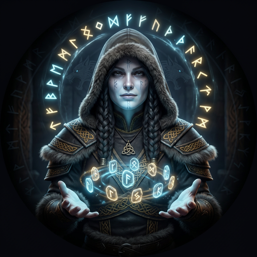
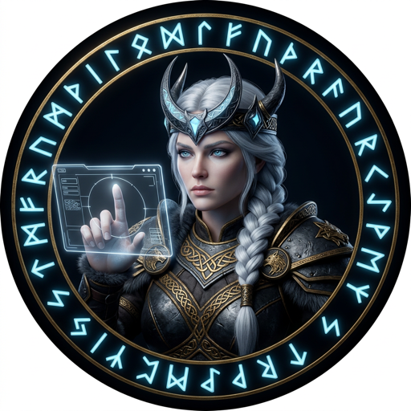
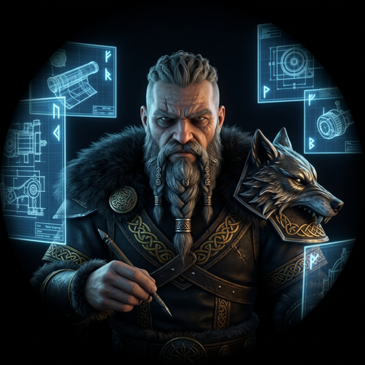
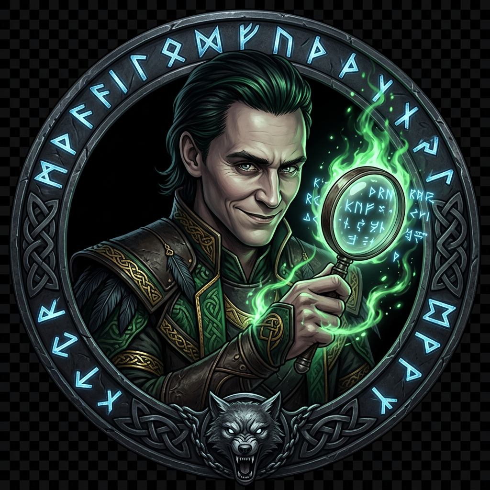

# Fenrir Ledger

<table>
  <tr>
    <td colspan="4">
      <a href="LICENSE.md"></a>
    </td>
  </tr>
  <tr>
    <td colspan="4">
      <a href="https://github.com/declanshanaghy/fenrir-ledger/actions/workflows/vercel-production.yml"></a>
    </td>
  </tr>
  <tr>
    <td><a href="https://github.com/declanshanaghy/fenrir-ledger/commits/main"></a></td>
    <td><a href="https://nextjs.org"></a></td>
    <td><a href="https://www.typescriptlang.org"></a></td>
    <td><a href="https://tailwindcss.com"></a></td>
  </tr>
</table>

**Break free from fee traps. Harvest every reward. Let no chain hold.**

> *In Norse mythology, Fenrir is the great wolf who shatters the chains the gods forged to bind him.*
> *Fenrir Ledger breaks the invisible chains of forgotten annual fees, expired promotions,*
> *and wasted sign-up bonuses that silently devour your wallet.*

---

<table><tr>
<td align="center" width="33%">

**<a href="https://fenrir-ledger.vercel.app" target="_blank" rel="noopener">Enter the Ledger</a>**

*Name your chains before they name you.*

</td>
<td align="center" width="33%">

**<a href="https://fenrir-ledger.vercel.app/static" target="_blank" rel="noopener">Marketing Site</a>**

*Read the runes. Know what hunts next.*

</td>
<td align="center" width="33%">

**<a href="https://fenrir-ledger.vercel.app/sessions" target="_blank" rel="noopener">Session Chronicles</a>**

*Every session forged in fire, recorded in runes.*

</td>
</tr></table>

---

Track every credit card in your portfolio. Every annual fee deadline, promo expiration, and sign-up bonus threshold — Fenrir watches and howls before the trap snaps shut. Add your cards, set your thresholds, and the wolf does the rest.

**Stack:** Next.js 15 (App Router) · TypeScript · Tailwind · Vercel (serverless) · Stripe (subscriptions) · localStorage (data)

---

## Quick Start

```bash
git clone https://github.com/declanshanaghy/fenrir-ledger.git
cd fenrir-ledger
./development/scripts/setup-local.sh
.claude/scripts/services.sh start
# Open http://localhost:9653
```

---

## The Pack

*Six wolves, one purpose. Each forged in a different fire, each bound by the same chain — to build the ledger that [Fenrir](https://en.wikipedia.org/wiki/Fenrir) never could break.*

---

<table>
<tr>
<td width="80" align="center" valign="top">
<br><sub>ᚨ</sub>
</td>
<td valign="top">

**[Odin — The All-Father](https://en.wikipedia.org/wiki/Odin)** · *Orchestrator of the Pack* · [Full Profile](.claude/agents/odin-profile.md)

[Odin](https://en.wikipedia.org/wiki/Odin) does not build with his hands — he sees with his ravens, commands with his runes, and shapes the will of the pack. He owns the mission, guards the vision, and decides what the wolf hunts next. Where others forge and test and question, the All-Father watches the horizon — and speaks when the path must change.

</td>
</tr>
<tr>
<td width="80" align="center" valign="top">
<br><sub>ᚠ</sub>
</td>
<td valign="top">

**[Freya — The Seer of Fates](https://en.wikipedia.org/wiki/Freyja)** · *Product Owner* · [Full Profile](.claude/agents/freya-profile.md)

[Freya](https://en.wikipedia.org/wiki/Freyja) reads what is coming before the rest of the pack can smell it. She owns the backlog, names the hunts, and decides when a feature is worthy of the wolf's bite. No engineer lifts a hammer, no designer draws a rune, until Freya has spoken. She is the voice the user never hears — but always feels.

</td>
</tr>
<tr>
<td width="80" align="center" valign="top">
<br><sub>ᛚ</sub>
</td>
<td valign="top">

**[Luna — The Shaper of Worlds](https://en.wikipedia.org/wiki/M%C3%A1ni)** · *UX Designer* · [Full Profile](.claude/agents/luna-profile.md)

Before steel is poured, [Luna](https://en.wikipedia.org/wiki/M%C3%A1ni) draws the bones. She designs every screen that a mortal hand will touch — wireframes carved from bone and shadow, interaction flows mapped with the precision of tides. What she shapes, FiremanDecko builds. What she guards, the user never has to think about.

</td>
</tr>
<tr>
<td width="80" align="center" valign="top">
<br><sub>ᛞ</sub>
</td>
<td valign="top">

**FiremanDecko — The Forge-Master** · *Principal Engineer* · [Full Profile](.claude/agents/fireman-decko-profile.md)

FiremanDecko receives the brief and turns vision into iron. He architects the system, pours the code, and carries the full technical weight from design to deployment. No dependency goes unvetted, no API contract unsigned. Every line he writes is built to endure — not just through testing, but through the long silence after [Ragnarök](https://en.wikipedia.org/wiki/Ragnar%C3%B6k).

</td>
</tr>
<tr>
<td width="80" align="center" valign="top">
<br><sub>ᛏ</sub>
</td>
<td valign="top">

**[Loki — Son of the Wolf](https://en.wikipedia.org/wiki/Loki)** · *QA Tester* · [Full Profile](.claude/agents/loki-profile.md)

In the old songs, [Loki](https://en.wikipedia.org/wiki/Loki) is father to [Fenrir](https://en.wikipedia.org/wiki/Fenrir) — and here, the trickster's blood runs true. Loki does not confirm that the code works. He proves it doesn't. Every edge case is his hunting ground, every assumption a trap he walks into on purpose. If FiremanDecko's forge did not hold, Loki will find the crack before [Ragnarök](https://en.wikipedia.org/wiki/Ragnar%C3%B6k) does.

</td>
</tr>
<tr>
<td width="80" align="center" valign="top">
<br><sub>ᚺ</sub>
</td>
<td valign="top">

**[Heimdall — Guardian of the Bifröst](https://en.wikipedia.org/wiki/Heimdall)** · *Security Specialist* · [Full Profile](.claude/agents/heimdall-profile.md)

[Heimdall](https://en.wikipedia.org/wiki/Heimdall) stands at the boundary between what is trusted and what is not. He watches the [Bifröst](https://en.wikipedia.org/wiki/Bifr%C3%B6st) — every API route, every token, every input that arrives from outside the walls. If a secret travels unmasked, if an auth check is missing, if data crosses without validation, Heimdall sees it before it lands. Nothing enters this codebase unwatched.

</td>
</tr>
</table>

---

## The Pipeline


---

## ᚱ Sacred Scrolls of the Pack ᚱ

*Herein lie the runes of our craft — etched by each wolf in their own hand, bound together by a single thread of purpose. Read well, wanderer, for these paths were not laid lightly.*

---

### ᚠ Product — *Freya speaks from the high seat*

> *"I have walked the threads of fate and returned with the shape of what must be built. These scrolls carry the pack's purpose — read them before you lift hammer or pen."*

- [Product Brief](product-brief.md) — The vision I have laid before the pack, the reason the wolf hunts
- [Design Brief](product/product-design-brief.md) — My counsel to the forge-master, where strategy becomes structure
- [Backlog](designs/product/backlog/) — The hunts I have ordered by urgency, each weighted on the scales of Jera ᛃ

---

### ᛚ UX — *Luna shapes the bones of worlds*

> *"Before a single rune of code is carved, I draw the bones. Every screen is a ritual space — every interaction, a step in the dance between wolf and wanderer."*

- [Theme System](ux/theme-system.md) — The runes of color and shadow I have woven into the wolf's skin
- [Wireframes](ux/wireframes.md) — Bones of every screen, drawn before steel is poured
- [Interactions](ux/interactions.md) — How the wolf moves when touched, precise as tides beneath Mani's gaze

---

### ᛞ Architecture — *FiremanDecko speaks from the forge*

> *"What I build, I build to endure Ragnarok. Every beam is load-tested, every joint fire-hardened. Read these blueprints — they are the skeleton on which all iron hangs."*

- [System Design](architecture/system-design.md) — The load-bearing bones of this hall, forged to outlast the age
- [ADRs](architecture/adrs/) — Every decision struck in fire, recorded so none may undo them lightly
- [Pipeline](architecture/pipeline.md) — The channel through which all work flows, from raw ore to tempered steel
- [Remote Builders (ADR-007)](architecture/adrs/ADR-007-remote-builder-platforms.md) — Why Depot carries our iron across the Bifrost

---

### ᛉ Security — *Heimdall watches from the Bifrost*

> *"I stand where the trusted world ends and the wild begins. Nothing crosses this bridge unexamined — no key unmasked, no token unchecked, no route unguarded."*

- [Security Index](security/README.md) — My vigil across all nine worlds; nothing passes unwatched
- [Google API Review](security/reports/2026-03-02-google-api-integration.md) — The reckoning of keys and scopes I have audited beneath Sowilo's light ᛊ

---

### ᛏ Quality — *Loki tests the chains*

> *"Do not tell me it works. I will find where it doesn't. Every assumption is a trap I walk into on purpose — and if the iron cracks, better it cracks in my hands than in the wild."*

- [Test Suites](quality/test-suites/) — Every trap I have laid to catch the careless and the overconfident
- [Quality Report](quality/quality-report.md) — My verdict on what stands and what crumbles to ash
- [Test Plan](quality/test-plan.md) — The chaos I have scheduled, methodical as the tides of Laguz ᛚ

---

### ᛟ Operations — *the pack's shared craft, bound by Othala*

> *"These rites belong to no single wolf — they are the heritage of the pack, the customs that keep us running as one."*

- [Git Convention](.claude/skills/git-commit/SKILL.md) — How all wolves mark their kills, signed with Kenaz ᚲ
- [Mermaid Guide](ux/ux-assets/mermaid-style-guide.md) — Runes for rendering diagrams, clear as Dagaz ᛞ
- [Depot Setup](.claude/scripts/depot-setup.sh) — Lighting the forge from cold iron, the first spark of Fehu ᚠ
- [Fire Next Up](.claude/skills/fire-next-up/SKILL.md) — The rite of passing the flame from one wolf to the next

---

## Lineage

Forged from [ZeroForge](https://github.com/declanshanaghy/zeroforge) with improvements from [Vulcan Brownout](https://github.com/declanshanaghy/vulcan-brownout). Claude Code multi-agent infrastructure adapted from [claude-code-hooks-multi-agent-observability](https://github.com/disler/claude-code-hooks-multi-agent-observability) by [@disler](https://github.com/disler).

*"Though it looks like silk ribbon, no chain is stronger."* — Prose Edda, Gylfaginning

---

## License

Copyright (C) 2026 Declan Shanaghy. Licensed under the [Elastic License 2.0 (ELv2)](LICENSE.md) — free for personal use; no competing hosted/managed service.
