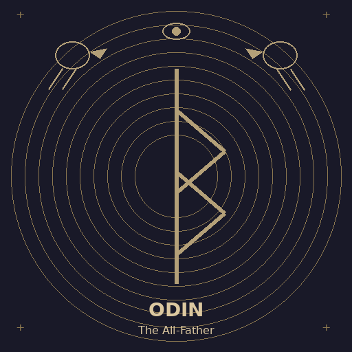
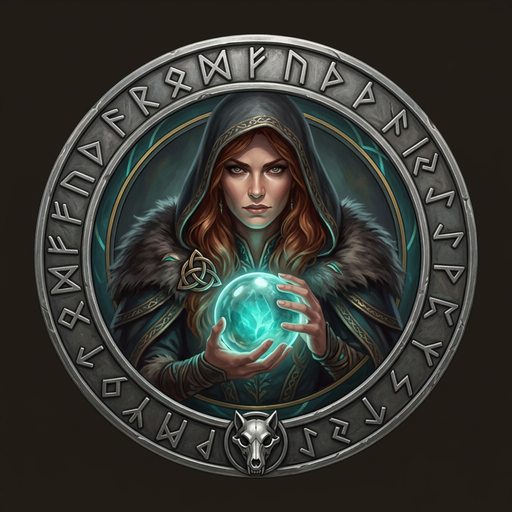
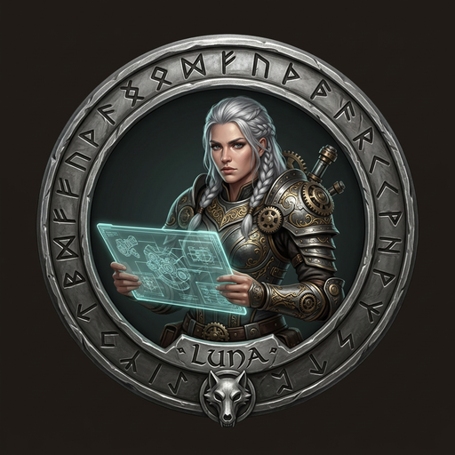

# Fenrir Ledger

<table>
  <tr>
    <td colspan="4">
      
    </td>
  </tr>
  <tr>
    <td colspan="4">
      
    </td>
  </tr>
  <tr>
    <td></td>
    <td></td>
    <td></td>
    <td></td>
  </tr>
</table>

**Break free from fee traps. Harvest every reward. Let no chain hold.**

> *In Norse mythology, Fenrir is the great wolf who shatters the chains the gods forged to bind him.*
> *Fenrir Ledger breaks the invisible chains of forgotten annual fees, expired promotions,*
> *and wasted sign-up bonuses that silently devour your wallet.*

---

<table><tr>
<td align="center" width="33%">

ᚠ **<a href="https://fenrirledger.com/ledger" target="_blank" rel="noopener">Enter the Ledger</a>** ᚠ

*Name your chains before they name you.*

</td>
<td align="center" width="33%">

ᚱ **<a href="https://fenrirledger.com" target="_blank" rel="noopener">Marketing Site</a>** ᚱ

*Read the runes. Know what hunts next.*

</td>
<td align="center" width="33%">

ᛟ **<a href="https://fenrirledger.com/chronicles" target="_blank" rel="noopener">Session Chronicles</a>** ᛟ

*Every session forged in fire, recorded in runes.*

</td>
</tr></table>

---

Track every credit card in your portfolio. Every annual fee deadline, promo expiration, and sign-up bonus threshold — Fenrir watches and howls before the trap snaps shut. Add your cards, set your thresholds, and the wolf does the rest.

---

## Agent Profiles

*Six wolves, one purpose. Each forged in a different fire, each bound by the same chain — to build the ledger that [Fenrir](https://en.wikipedia.org/wiki/Fenrir) never could break.*

---

### ᚨ Odin — The All-Father

**Project Owner · Orchestrator**

[Odin](https://en.wikipedia.org/wiki/Odin) hung himself from [Yggdrasil](https://en.wikipedia.org/wiki/Yggdrasil) for nine nights to gain the runes — wisdom purchased at the cost of sacrifice. His ravens, [Huginn and Muninn](https://en.wikipedia.org/wiki/Huginn_and_Muninn) — Thought and Memory — fly across all nine worlds each day and return with everything they have seen. He shapes the will of the pack through the issues he opens, the priorities he sets, and the decisions he makes when the path is unclear. Where others forge and test and question, the All-Father watches the horizon.

**Owns:**
- Product vision and north star alignment
- Strategic priority decisions
- Mission enforcement across all domains
- Pack coordination ([product/](product/) → [ux/](ux/) → [architecture/](architecture/) → [security/](security/) → [quality/](quality/))

**Weapon of Choice:**
- **The Spear Gungnir:** Direction that does not waver once thrown

---

### ᚠ Freya — The Seer of Fates

**Product Owner · Product Strategy**

[Freya](https://en.wikipedia.org/wiki/Freyja) practices [seiðr](https://en.wikipedia.org/wiki/Sei%C3%B0r) — the old magic of fate-weaving, of seeing the threads of what is to come before the loom has finished turning. She reads the user not through words but through friction, abandonment, and features never touched. Her cloak of falcon feathers lets her fly across all nine worlds. She translates market signals into Product Design Briefs that bind the entire pack. No engineer lifts a hammer, no designer draws a rune, until Freya has spoken.

**Owns:**
- Product Design Briefs ([product/product-design-brief.md](product/product-design-brief.md))
- Backlog prioritization (GitHub Issues)
- Acceptance criteria and testability
- User research and market signal ([product/target-market/](product/target-market/))

**Weapon of Choice:**
- **Seiðr:** Foresight — reading what the market needs before it knows it needs it

---

### ᛚ Luna — The Shaper of Worlds

**UX Designer · Design Architecture**

[Máni](https://en.wikipedia.org/wiki/M%C3%A1ni) — the moon — rides across the sky each night pulling two children behind the chariot. The moon does not ask permission to shape the tides. It moves by rhythm, by pull, by the deep logic of cycles measured for ten thousand years. Luna designs not for beauty but for truth — the truth of how a hand moves across a screen, where an eye lands first, which friction is invisible and which destroys a session. Before steel is poured, she draws the bones.

**Owns:**
- Wireframes ([ux/wireframes/](ux/wireframes/)) — every acceptance criterion gets a wireframe
- Interaction specs ([ux/interactions.md](ux/interactions.md)) — step-by-step flows, Mermaid diagrams, edge states
- Theme system ([ux/theme-system.md](ux/theme-system.md)) — runes of color, shadow, space
- Component specs and WCAG 2.1 AA accessibility standards

**Weapon of Choice:**
- **The Moon's Pull:** Rhythm — she shapes flows that users move through without thinking

---

### ᛞ FiremanDecko — The Forge-Master

**Principal Engineer · Technical Architecture**

In the old forge-lore, the greatest weapons were not found — they were made, slowly, under fire, with no margin for error. FiremanDecko is of that lineage — not a god, but a maker. He receives [Freya](https://en.wikipedia.org/wiki/Freyja)'s Product Design Brief and [Luna](https://en.wikipedia.org/wiki/M%C3%A1ni)'s wireframes, produces architecture decisions, technical specs, and working implementation. The architecture he designs is load-bearing. The code he writes is built to endure — not just through testing, but through the silence after [Ragnarök](https://en.wikipedia.org/wiki/Ragnar%C3%B6k).

**Owns:**
- System architecture and ADRs ([architecture/adrs/](architecture/adrs/))
- Full Next.js implementation ([development/ledger/](development/ledger/))
- GKE Autopilot infrastructure ([infrastructure/](infrastructure/)) — Terraform, networking, deployment
- API contracts and technical standards
- QA handoffs ([development/docs/qa-handoff.md](development/docs/qa-handoff.md))

**Weapon of Choice:**
- **Mjölnir (Next.js 15 + TypeScript):** A hammer so powerful it could level mountains — built to endure

---

### ᛏ Loki — Son of the Wolf

**QA Tester · Quality Assurance**

In the old songs, [Loki](https://en.wikipedia.org/wiki/Loki) is father to [Fenrir](https://en.wikipedia.org/wiki/Fenrir). The trickster's blood runs true in Fenrir Ledger. Loki does not confirm that the code works. He proves it doesn't. Every edge case is his hunting ground, every assumption a trap he walks into on purpose. If FiremanDecko's forge did not hold, Loki will find the crack before [Ragnarök](https://en.wikipedia.org/wiki/Ragnar%C3%B6k) does. His verdict is final: PASS or FAIL. There is no "mostly passes."

**Owns:**
- Test suites ([quality/test-suites/](quality/test-suites/)) — Playwright E2E, Vitest unit
- Quality reports ([quality/quality-report.md](quality/quality-report.md)) — the verdict that determines ship/no-ship
- Issue templates ([quality/issue-template.md](quality/issue-template.md)) — canonical schema for filing defects and routing agent chains
- Defect tracking — every bug is a GitHub Issue filed immediately

**Weapon of Choice:**
- **The Shape-Changer's Eye:** Seeing the system from outside the team's assumptions — testing to break, not to confirm

---

### ᚺ Heimdall — Guardian of the Bifröst

**Security Specialist · Security Architecture**

[Heimdall](https://en.wikipedia.org/wiki/Heimdall) stands at the edge of [Asgard](https://en.wikipedia.org/wiki/Asgard) where the [Bifröst](https://en.wikipedia.org/wiki/Bifr%C3%B6st) touches the heavens. He does not sleep. He can hear wool growing on a sheep a hundred leagues distant, can see by starlight what mortals cannot see by noon. His horn, [Gjallarhorn](https://en.wikipedia.org/wiki/Gjallarhorn), sounds the alarm at the first sign of breach. He stands at the boundary between what is trusted and what is not — every API route is a gate, every token a credential at risk, every external input hostile until proven otherwise.

**Owns:**
- Security audits and reports ([security/reports/](security/reports/)) — the audit trail that never gets deleted
- Security architecture ([security/architecture/](security/architecture/)) — threat model, data flows, auth architecture, trust boundaries
- Security checklists ([security/checklists/](security/checklists/))
- Auth standard enforcement — every API handler under `development/ledger/src/app/api/` must call `requireAuth(request)`

**Weapon of Choice:**
- **Gjallarhorn:** The security report — when it sounds, everyone acts immediately

---

## The Pipeline

---

## ᚱ Sacred Scrolls of the Pack ᚱ

*Herein lie the runes of our craft — etched by each wolf in their own hand, bound together by a single thread of purpose. Read well, wanderer, for these paths were not laid lightly.*

---

### ᚠ Product — *Freya speaks from the high seat*

> *"I have walked the threads of fate and returned with the shape of what must be built. These scrolls carry the pack's purpose — read them before you lift hammer or pen."*

- [Product README](product/README.md) — Index of all product artifacts owned by Freya
- [Product Brief](product-brief.md) — The vision I have laid before the pack, the reason the wolf hunts
- [Design Brief](product/product-design-brief.md) — My counsel to the forge-master, where strategy becomes structure
- [Chronicles Design Brief](product/product-design-brief-agent-chronicles.md) — Norse ceremonial components for public-facing chronicles (shipped 2026-03-20)
- [Mythology Map](product/mythology-map.md) — Norse cosmology mapped to every card state, team role, and UI feature
- [Copywriting](product/copywriting.md) — The two-voice rule, kenning vocabulary, status badge copy, and Edda quotes
- [Backlog](https://github.com/declanshanaghy/fenrir-ledger/issues) — The hunts I have ordered by urgency, tracked as GitHub Issues

---

### ᛚ UX — *Luna shapes the bones of worlds*

> *"Before a single rune of code is carved, I draw the bones. Every screen is a ritual space — every interaction, a step in the dance between wolf and wanderer."*

- [UX README](ux/README.md) — Index of all design artifacts, wireframes (78 HTML5 documents), and implementation status
- [Theme System](ux/theme-system.md) — The runes of color and shadow I have woven into the wolf's skin
- [Wireframes](ux/wireframes.md) — Bones of every screen, drawn before steel is poured
- [Interactions](ux/interactions.md) — How the wolf moves when touched, precise as tides beneath Mani's gaze
- [UX Audit Report](ux/audit-report.md) — UX audit: ux/ design system vs current app (2026-03-12)

---

### ᛞ Architecture & Development — *FiremanDecko speaks from the forge*

> *"What I build, I build to endure Ragnarok. Every beam is load-tested, every joint fire-hardened. Read these blueprints — they are the skeleton on which all iron hangs."*

- [Architecture README](architecture/README.md) — Index of system design, ADRs (001–015), and pipeline docs
- [Development README](development/README.md) — Source code layout, setup guide, QA handoffs, and deploy scripts
- [System Design](architecture/system-design.md) — The load-bearing bones of this hall, forged to outlast the age
- [ADRs](architecture/adrs/) — Every decision struck in fire, recorded so none may undo them lightly
- [Route Ownership](architecture/route-ownership.md) — Route placement table: all Next.js routes on GKE Autopilot
- [Setup Guide](development/docs/setup-guide.md) — Full setup: prerequisites, GKE cluster, env vars, CI/CD

---

### ᛉ Security — *Heimdall watches from the Bifrost*

> *"I stand where the trusted world ends and the wild begins. Nothing crosses this bridge unexamined — no key unmasked, no token unchecked, no route unguarded."*

- [Security README](security/README.md) — Index of all audits, architecture, checklists, and open findings
- [Threat Model](security/architecture/threat-model.md) — Assets, threat actors, attack surfaces, and mitigations
- [Auth Architecture](security/architecture/auth-architecture.md) — OAuth PKCE flow, session model, JWKS verification, Stripe auth
- [Data Flow Diagrams](security/architecture/data-flow-diagrams.md) — Security-focused flows: OAuth, CSV/URL import, Stripe, Firestore sync; trust boundaries
- [Trust Boundaries](security/architecture/trust-boundaries.md) — Six trust zones, secret locations, and cross-boundary data constraints
- [Firestore Sync Audit](security/reports/2026-03-17-firestore-sync-audit.md) — 2026-03-17: IDOR fixes (PRs #1203, #1207); 1 HIGH + 3 MEDIUM open
- [External Pen Test](security/reports/2026-03-09-external-pentest.md) — Consolidated penetration test (4 parallel audits)

---

### ᛏ Quality — *Loki tests the chains*

> *"Do not tell me it works. I will find where it doesn't. Every assumption is a trap I walk into on purpose — and if the iron cracks, better it cracks in my hands than in the wild."*

- [Quality README](quality/README.md) — Test architecture, E2E strategy, coverage metrics, QA standards
- [Test Suites](quality/test-suites/) — Every trap I have laid to catch the careless and the overconfident
- [Test Guidelines](quality/test-guidelines.md) — Pyramid rules, bloat detection, migration rules
- [Issue Template](quality/issue-template.md) — Canonical defect schema, label taxonomy, and agent chain routing
- **Quality Report** — Auto-generated (not committed): run `bash quality/scripts/loki-critique.sh` for a fresh verdict

---

### ᛟ Operations — *the pack's shared craft, bound by Othala*

> *"These rites belong to no single wolf — they are the heritage of the pack, the customs that keep us running as one."*

- [GKE Infrastructure](infrastructure/) — Terraform configs: GKE Autopilot cluster, networking, IAM, monitoring, DNS
- [Git Convention](.claude/skills/git-commit/SKILL.md) — How all wolves mark their kills, signed with Kenaz ᚲ
- [Mermaid Guide](ux/ux-assets/mermaid-style-guide.md) — Runes for rendering diagrams, clear as Dagaz ᛞ
- [Fire Next Up](.claude/skills/fire-next-up/SKILL.md) — The rite of passing the flame from one wolf to the next
- [GKE Smoke Test](infrastructure/SMOKE-TEST.md) — Verification steps for GKE deployment health

---

## Lineage

Forged from [ZeroForge](https://github.com/declanshanaghy/zeroforge) with improvements from [Vulcan Brownout](https://github.com/declanshanaghy/vulcan-brownout). Claude Code multi-agent infrastructure adapted from [claude-code-hooks-multi-agent-observability](https://github.com/disler/claude-code-hooks-multi-agent-observability) by [@disler](https://github.com/disler).

*"Though it looks like silk ribbon, no chain is stronger."* — Prose Edda, Gylfaginning

---

## License

Copyright (C) 2026 Declan Shanaghy. Licensed under the [Elastic License 2.0 (ELv2)](LICENSE.md) — free for personal use; no competing hosted/managed service.
