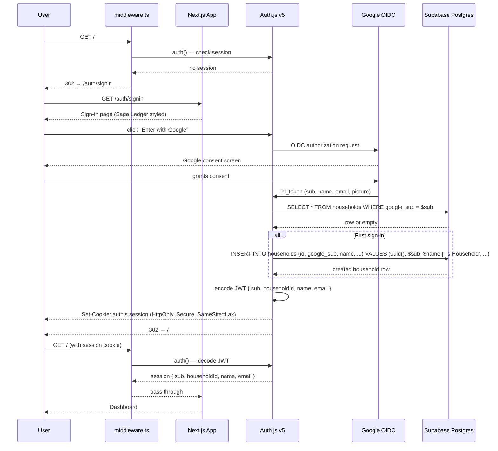

# ADR-004: OIDC Authentication and Server-Side Persistence

## Status: Proposed

## Date: 2026-02-27

---

## Context

Fenrir Ledger currently stores all card and household data in the browser's `localStorage`
(ADR-003). This was the right call for Sprint 1 — zero dependencies, works offline, trivial to
debug. It is the wrong call for any user who:

- Switches devices (phone, second laptop, work machine)
- Shares a household with a partner
- Expects financial data to survive a browser storage clear

The `Household` entity and `householdId` on every `Card` were placed into the schema from Sprint 1
precisely so that this moment could arrive cleanly (ADR-002). The data model is ready; the
infrastructure is not.

**The hard constraint**: auth without server-side persistence delivers zero user value. A user can
log in but their cards still live on one device's `localStorage`. Auth and persistence must ship
in the same sprint. This ADR covers both decisions together.

**The current state to replace**:
- `DEFAULT_HOUSEHOLD_ID = "default-household"` in `constants.ts`
- All reads/writes go through `storage.ts` → `window.localStorage`
- No concept of identity, sessions, or multi-device access

---

## Decisions

### Decision 1: Auth Library — Auth.js v5 (NextAuth.js)

**Options considered**:

1. **Auth.js v5 (NextAuth.js)** — The Next.js App Router-native auth library. Purpose-built for
   the stack. OSS, MIT license. Supports Google OIDC, JWT sessions, database sessions, server
   components, and server actions natively.

   Pros: App Router-first design (no legacy workarounds), first-class Vercel support, adapter
   ecosystem covers every major DB (Supabase, Drizzle, Prisma), HttpOnly cookie session by default,
   zero config for Google OIDC, well-documented NEXTAUTH_URL handling for Vercel previews.

   Cons: v5 is still Release Candidate as of early 2026 (though production-stable). API changed
   significantly from v4 — community examples are sometimes for the wrong version.

2. **Clerk** — Hosted auth-as-a-service. Drop-in components for sign-in UI.

   Pros: Zero backend setup. Beautiful sign-in UI out of the box.

   Cons: Vendor lock-in. Cost scales with users. Opinionated component system fights the Saga
   Ledger design system (we'd be fighting Clerk's UI to apply Cinzel fonts and void-black styling).
   Data is stored in Clerk's infrastructure, not ours.

3. **Lucia Auth** — Minimal, headless auth library.

   Pros: Full control, no magic.

   Cons: More boilerplate for OAuth flows. Smaller ecosystem. Auth.js already does everything we
   need with less code.

4. **Custom OIDC implementation** — Roll our own using `openid-client`.

   Cons: Significant complexity for a solved problem. Auth is not our differentiator.

**Decision**: Auth.js v5 (`next-auth@beta`).

Rationale: It is the right tool for the stack. The App Router integration (`auth()` in server
components, middleware via `auth` exported from `auth.ts`) is exactly what we need. HttpOnly
cookie sessions are default. The Vercel preview URL problem has a documented solution
(`AUTH_URL` with `NEXTAUTH_URL_INTERNAL` fallback). The Google provider is a two-line config.
Clerk's cost model and design-system conflict eliminate it for a product with a strong visual
identity. Lucia requires more hand-rolling than is justified.

---

### Decision 2: Session Strategy — JWT (Stateless)

**Options considered**:

1. **JWT sessions (stateless)** — Session data encoded in a signed, HttpOnly cookie. No session
   table in the database. Each request decodes the cookie to get the user identity.

   Pros: No DB round-trip on every request just to validate the session. Simpler schema (no
   `sessions` table). Works perfectly for our use case: we need the user's `householdId` on every
   API call; that fits in a JWT payload. Vercel edge middleware can read the JWT without a DB call.

   Cons: Sessions cannot be individually revoked (short of rotating the secret). Token is valid
   until expiry. Fine for our threat model — this is a personal finance tracker, not a banking app.

2. **Database sessions** — Session record stored in a `sessions` table. Every request does a DB
   lookup to validate the session ID in the cookie.

   Pros: Instant revocation (delete the row). Audit trail.

   Cons: Every authenticated request incurs a DB round-trip. Adds a `sessions` table to maintain.
   Overkill for our threat model.

**Decision**: JWT sessions.

Rationale: We need the `householdId` on every API call. A JWT payload containing
`{ sub, householdId, name, email }` eliminates a DB lookup per request. Session revocation (e.g.,
sign-out on one device revoking all sessions) is deferred — log a backlog story if needed. The
session expiry default in Auth.js (30 days) with a `maxAge` we can tune is sufficient. If forced
revocation becomes a requirement, we add a `jti` (JWT ID) blocklist table later; it does not
require a full architecture change.

---

### Decision 3: Backend Data Store — Supabase (PostgreSQL)

**Options considered**:

1. **Supabase** — Managed Postgres with a PostgREST API, Row Level Security (RLS), built-in auth
   (we won't use their auth — we're using Auth.js — but their DB is excellent), realtime, and a
   generous free tier.

   Pros: True Postgres. RLS is a defence-in-depth layer that sits below our API layer. Free tier
   covers development and early production (500 MB, 2 CPU, unlimited API calls on free plan).
   Supabase's Vercel integration makes environment variable injection automatic. The `@supabase/supabase-js`
   client is mature. The Auth.js Supabase adapter exists and is maintained.

   Cons: Another managed service to depend on. Supabase projects pause after 1 week of inactivity
   on the free tier (relevant for dev/staging; production is fine). Requires some Supabase console
   setup.

2. **Vercel Postgres (Neon)** — Neon serverless Postgres, integrated into Vercel dashboard.

   Pros: Single-dashboard operations (Vercel manages the DB). Automatic environment variable
   injection via Vercel integration.

   Cons: More expensive than Supabase at scale. No built-in RLS. Slightly thinner ecosystem.
   Vendor lock-in to Vercel deeper than we already are.

3. **PlanetScale (MySQL serverless)** — Branching-based MySQL-compatible DB.

   Pros: Branch-per-PR workflow is elegant.

   Cons: PlanetScale ended their free tier in 2024 — minimum $39/month. MySQL vs Postgres is a
   minor concern but Supabase Postgres is strictly better for our use case. Not worth the cost for
   a project at this stage.

4. **Firebase Firestore** — NoSQL document DB.

   Cons: NoSQL document model fights a relational household→cards structure. Schema evolution is
   harder. Not worth the impedance mismatch.

**Decision**: Supabase (PostgreSQL).

Rationale: Postgres is the right data model for household-scoped relational data. Supabase's free
tier is genuinely generous. RLS gives us a second enforcement layer on top of our API-layer scoping
(see Decision 4). The Auth.js adapter and `@supabase/supabase-js` client are both mature. The
Vercel integration auto-populates environment variables, reducing deployment friction.

We will use Supabase's Postgres only — not their auth service. Auth.js owns the session; Supabase
owns the data.

---

### Decision 4: Multi-Tenant Isolation — API Layer (Primary) + RLS (Defence in Depth)

**Options considered**:

1. **API layer only** — Every query includes a `WHERE household_id = $householdId` clause derived
   from the validated JWT. No RLS policies.

   Pros: Single enforcement point. Easier to reason about. No Supabase-specific config.

   Cons: A single missed `WHERE` clause is a data leak. No fallback protection.

2. **RLS only** — Supabase Row Level Security policies prevent any query from returning rows that
   don't belong to the authenticated user.

   Pros: Automatic enforcement at the DB layer. Cannot be bypassed by a buggy query.

   Cons: Complex to set up correctly. Can be slow if policies are poorly written. Debugging
   requires understanding Supabase policy evaluation. Using the service role key bypasses RLS
   entirely — dangerous if misused.

3. **API layer (primary) + RLS (defence in depth)** — Both.

   Pros: Belt and suspenders. The API layer is the primary enforcement point (explicit, testable).
   RLS is a fallback that catches any query that forgets the `WHERE` clause.

   Cons: Two places to keep in sync. Slightly more setup.

**Decision**: API layer as primary enforcement; RLS as defence in depth.

Rationale: Every API route handler will extract `householdId` from the JWT and inject it into
every query. This is explicit, code-reviewable, and testable. RLS policies are added as a
secondary layer — not for everyday protection but as a catch for missed clauses. The service role
key (which bypasses RLS) is NEVER used in application code; it is used only in migration scripts
run at deploy time. The standard anon/service key used in API routes will have RLS applied.

---

### Decision 5: localStorage Migration — Defer to Iteration 5

**Options considered**:

1. **Wire the migration hook now** — On first sign-in, detect `fenrir_ledger:cards` in localStorage
   and offer an import prompt.

   Pros: Sprint-1 users get a smooth upgrade path. Good UX.

   Cons: Significantly expands Sprint 3 scope. The migration UI requires its own design (Luna
   needs to spec it). The data mapping from localStorage to Supabase adds edge cases. Premature:
   the app has zero public users at this point, so no one has Sprint-1 data to migrate.

2. **Defer entirely** — Log as a backlog story (Iteration 5 per Freya's story).

   Pros: Sprint 3 stays focused on auth + persistence foundation. The migration path is documented
   in ADR-003 and Freya's story already lists it as Iteration 5.

   Cons: Sprint-1-era localStorage data is abandoned on this sprint. Acceptable given there are no
   public users yet.

**Decision**: Defer the migration UI to Iteration 5 (separate backlog story). Do NOT wire a
migration hook in Sprint 3.

Rationale: There are no users with Sprint-1 data in production yet. The app is under active
development and has not been marketed. Wiring a migration hook now adds non-trivial scope without
serving any real user. The migration path is documented. When real users exist and Iteration 5 is
scoped, the `fenrir_ledger:*` localStorage keys and `storage.ts` abstraction provide a clean read
path for the import.

The only Sprint-3 change to `storage.ts` is its **retirement from use** — it becomes dead code
that is not called by any server-side path. It can remain in the codebase for the migration use
case without causing harm.

---

### Decision 6: Household Naming on First Sign-in

Freya's proposal: `"{Google display name}'s Household"`

Decision: Accepted.

The Google `name` claim from the OIDC token is used as the display name. The household name is
set to `${name}'s Household` on first sign-in. This is stored as an editable field — future
sprints can add a household rename flow.

---

### Decision 7: Vercel Preview Deployment URLs

**The problem**: `NEXTAUTH_URL` must match the deployment URL for CSRF and callback URL
validation. Preview deployments get dynamic URLs like
`https://fenrir-ledger-git-branch-declanshanaghy.vercel.app`.

**Auth.js v5 solution**: Auth.js v5 reads `AUTH_URL` (and falls back to `NEXTAUTH_URL` for
backward compat) and also supports `AUTH_TRUST_HOST=1` which tells Auth.js to trust the
`X-Forwarded-Host` header that Vercel sets on every request. This allows dynamic preview URLs
without hardcoding.

**Decision**:
- Production: set `NEXTAUTH_URL=https://fenrir-ledger.vercel.app` in Vercel production environment
- Preview: set `AUTH_TRUST_HOST=1` in Vercel preview environment (do not set `NEXTAUTH_URL`)
- Development: set `NEXTAUTH_URL=http://localhost:9653` in `.env.local`

The `AUTH_TRUST_HOST` approach is documented in Auth.js v5 and is the recommended Vercel preview
pattern. It does not weaken CSRF protection — Auth.js still validates the CSRF token; it just
uses the forwarded host for the callback URL construction.

---

## Architecture Sketch

The following diagram shows the layers that change when auth + persistence lands.

```mermaid
graph TD
    classDef primary fill:#03A9F4,stroke:#0288D1,color:#FFF
    classDef healthy fill:#4CAF50,stroke:#388E3C,color:#FFF
    classDef warning fill:#FF9800,stroke:#F57C00,color:#FFF
    classDef neutral fill:#F5F5F5,stroke:#E0E0E0,color:#212121
    classDef background fill:#2C2C2C,stroke:#444,color:#FFF

    %% Client Layer
    browser(Browser)
    signin[Sign-in Page<br/>/auth/signin]
    dashboard[Dashboard<br/>/ protected]

    %% Next.js Layer
    middleware[middleware.ts<br/>Auth.js session check]
    authroute[Route: /api/auth/[...nextauth]<br/>Auth.js handler]
    cardsroute[Route: /api/cards<br/>CRUD handlers]
    householdroute[Route: /api/households<br/>lookup / create]

    %% Data Layer
    authjs{{Auth.js v5<br/>JWT + Google OIDC}}
    supabase[(Supabase<br/>PostgreSQL)]
    google{{Google<br/>OIDC Provider}}

    %% Flows
    browser -->|unauthenticated request| middleware
    middleware -->|redirect| signin
    browser -->|sign in click| authroute
    authroute -->|OIDC redirect| google
    google -.->|id_token + profile| authroute
    authroute -->|upsert household on first login| supabase
    authroute -.->|JWT session cookie| browser
    browser -->|authenticated request| middleware
    middleware -->|pass through| dashboard
    dashboard -->|fetch cards| cardsroute
    cardsroute -->|WHERE household_id = ?| supabase
    supabase -.->|rows| cardsroute
    cardsroute -.->|JSON| dashboard

    class browser neutral
    class middleware primary
    class authroute primary
    class cardsroute primary
    class householdroute primary
    class authjs warning
    class supabase healthy
    class google warning
    class signin background
    class dashboard background
```

---

## Sign-in Flow (Sequence)



---

## Consequences

### Positive
- Users can access their card portfolio from any device.
- Financial data is private — tied to Google identity.
- `householdId` is a real UUID derived from Google `sub`. The `"default-household"` placeholder is
  retired.
- Supabase free tier is sufficient for development and early production.
- Auth.js handles CSRF, token rotation, and HttpOnly cookies out of the box.
- RLS is a low-cost defence-in-depth layer that catches query bugs.
- JWT sessions mean no DB round-trip per request for session validation.

### Negative / Trade-offs
- Sprint 3 scope is large: auth setup, Supabase schema, data access layer swap, API routes for
  cards and households, middleware, sign-in page, `.env.example` update, and deployment config.
  Story splitting (see spec) is critical.
- Supabase project setup is a manual step — documented in deployment scripts.
- Sprint-1 localStorage data is abandoned (no migration in this sprint).
- JWT sessions are not individually revocable without a blocklist (deferred).
- Auth.js v5 is RC — we accept minor API churn risk in exchange for App Router compatibility.

### Deferred
- localStorage migration wizard (Iteration 5, separate backlog story)
- Session revocation / force-logout (log as backlog story if needed)
- Microsoft / GitHub / Apple OIDC providers (Iterations 2–3)
- Household sharing / invite flow (Iteration 4)
- Account deletion / data export
