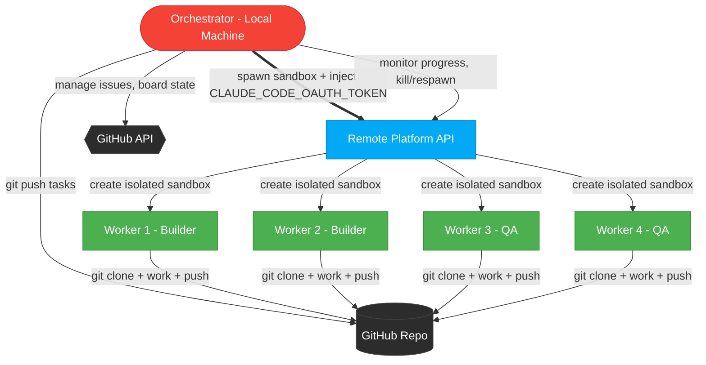
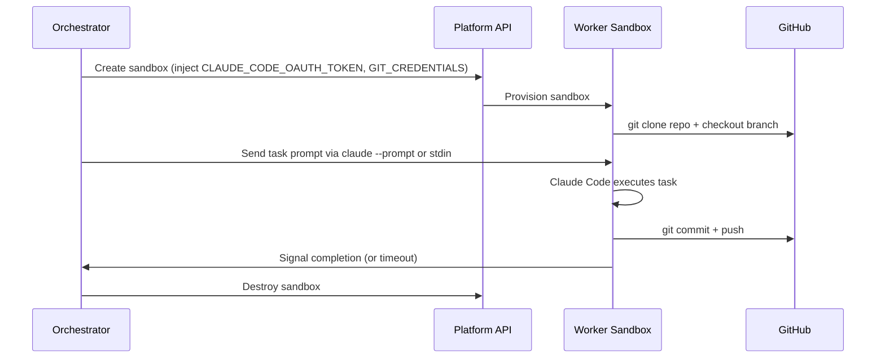

# ADR-007 — Remote Builder Platforms for Parallel Agent Orchestration

**Status:** Accepted
**Date:** 2026-03-06
**Authors:** FiremanDecko (Principal Engineer)
**Ref:** GitHub Issue #175, #192 (implementation)

---

## Context

The Fenrir Ledger team uses a multi-agent orchestration pattern where a local
orchestrator (running on Odin's machine) spawns parallel Claude Code sessions —
typically 4 builders and 4 QA validators — across git worktrees. This works, but
**CPU and memory saturation on the local machine is killing productivity**. Tasks
choke when implementation runs alongside orchestration, issue tracking, and
everything else.

We need to **offload worker compute to remote sandboxes** while keeping the
orchestrator local. The orchestrator must hold all secrets, manage issue tracking,
ensure task ordering, and coordinate stateless workers that can be killed or
respawned at will. Git push is the checkpoint — workers are disposable.

### Critical Constraint: Claude Code Subscription Auth

Odin runs Claude Code under a **Claude Max subscription** (not API billing). Workers
must authenticate under this same subscription. This is the single most important
technical constraint because it determines which platforms are viable.

---

## How Claude Code Authentication Works (Research Findings)

### `claude setup-token` Command

Claude Code provides a `setup-token` command specifically for headless/remote
environments. Running `claude setup-token` on a machine with a browser generates a
**long-lived OAuth token valid for 1 year**. This token is set via the environment
variable:

```bash
export CLAUDE_CODE_OAUTH_TOKEN=<token>
```

**Requirements:**
- Claude Pro or Max subscription
- Must be generated on a machine with a browser
- Must be regenerated before expiration (1 year)
- Token grants full access to the subscription — store securely

### `CLAUDE_CODE_OAUTH_TOKEN` Environment Variable

When this variable is set, Claude Code skips the interactive OAuth browser flow
entirely. This enables headless operation in containers, VMs, sandboxes, and CI
runners. The token is the **sole mechanism** for running Claude Code under a
subscription on a remote machine without a browser.

### Known Limitations

| Issue | Impact |
|-------|--------|
| Token expires after ~1 year | Must regenerate periodically on a machine with a browser |
| Docker sandbox auth bugs | Some users report "Invalid bearer token" errors in containers ([Issue #8938](https://github.com/anthropics/claude-code/issues/8938)) |
| No device-code flow yet | [Issue #22992](https://github.com/anthropics/claude-code/issues/22992) requests RFC 8628 device-code auth, not yet implemented |
| Token refresh uncertainty | Refresh tokens may expire, requiring full re-auth |

### Verdict: Subscription Auth on Remote Workers IS Viable

The `setup-token` + `CLAUDE_CODE_OAUTH_TOKEN` pattern **does work** for remote
headless environments. Both Depot and Coder explicitly document this flow. The 1-year
token lifetime is acceptable for our use case. The orchestrator generates the token
once and distributes it to workers as a secret.

---

## Platforms Evaluated

### 1. Depot (depot.dev)

**What it is:** Purpose-built remote agent sandbox platform with first-class Claude
Code support.

| Attribute | Detail |
|-----------|--------|
| **Pricing** | $0.01/min (~$0.60/hr), tracked per-second, no minimums |
| **Plans** | Developer (free tier, 500 build-min), Startup ($200/mo), Business (custom) |
| **Sandbox specs** | 2 vCPU, 4 GB RAM default |
| **Startup time** | Not published, but sandboxes persist filesystem and conversation |
| **Claude Code support** | First-class — `depot claude` CLI, secrets management built in |
| **Auth method** | `CLAUDE_CODE_OAUTH_TOKEN` via `depot claude secrets add` |
| **Secret model** | Organization-level secrets, injected into sandboxes at runtime |
| **Git access** | Depot Code GitHub app or Git credentials as secrets |
| **Session persistence** | Yes — filesystem and context survive stop/start |
| **SDK/API** | `depot claude` CLI for launch, resume, share |

**Strengths:**
- Purpose-built for exactly our use case
- Explicit `setup-token` documentation and support
- Organization secrets model aligns with "orchestrator holds secrets" pattern
- Session persistence means workers can be paused/resumed
- Included in existing Depot plans (no separate agent pricing)

**Weaknesses:**
- Relatively new product (launched late 2025)
- 2 vCPU / 4 GB may be tight for large codebases
- No self-hosting option
- Vendor lock-in to Depot's CLI

### 2. E2B (e2b.dev)

**What it is:** Cloud sandbox platform designed for AI agent code execution.

| Attribute | Detail |
|-----------|--------|
| **Pricing** | ~$0.05/hr (1 vCPU), per-second billing |
| **Plans** | Hobby (free, $100 credit), Pro ($150/mo, 24h sessions), Enterprise ($3K/mo min) |
| **Sandbox specs** | Configurable CPU/RAM on Pro |
| **Startup time** | ~150ms cold start |
| **Claude Code support** | Not first-class — general-purpose sandbox |
| **Auth method** | Environment variables injected via SDK |
| **Secret model** | Passed programmatically via E2B SDK at sandbox creation |
| **Git access** | Manual setup inside sandbox |
| **Session persistence** | Snapshots available, but designed for ephemeral use |
| **SDK** | Python and TypeScript SDKs |

**Strengths:**
- Extremely fast cold start (150ms)
- Cheapest per-hour cost
- Open-source core
- Strong SDK in both Python and TypeScript
- Good for ephemeral "spin up, run, destroy" pattern

**Weaknesses:**
- No first-class Claude Code integration — must install `claude` CLI manually
- Session cap: 1 hour on Hobby, 24 hours on Pro
- No built-in Claude Code auth support — must handle `CLAUDE_CODE_OAUTH_TOKEN` manually
- Designed for code execution snippets, not full development environments
- No Git/LSP tooling built in

### 3. Daytona (daytona.io)

**What it is:** Secure infrastructure for running AI-generated code, pivoted from
dev environments to agent sandboxes.

| Attribute | Detail |
|-----------|--------|
| **Pricing** | ~$0.067/hr (1 vCPU, 1 GiB), usage-based |
| **Plans** | Free $200 credit, startups up to $50K credits |
| **Sandbox specs** | Configurable |
| **Startup time** | ~90ms (fastest in benchmarks) |
| **Claude Code support** | Not first-class |
| **Auth method** | Environment variables via SDK |
| **Secret model** | Programmatic via SDK |
| **Git access** | Full Git and LSP support built in |
| **Session persistence** | Stateful — pause, fork, snapshot, resume, destroy |
| **SDK** | Python and TypeScript SDKs |
| **Max runtime** | Unlimited |

**Strengths:**
- Fastest cold start (90ms)
- Unlimited runtime (no session caps)
- Full Git and LSP support — closest to a real dev environment
- Stateful sandboxes with fork/snapshot
- Generous startup credits ($200 free, up to $50K)

**Weaknesses:**
- No first-class Claude Code integration
- Must handle Claude Code auth manually
- Newer pivot to agent sandbox space
- Self-hosting only on Enterprise tier

### 4. GitHub Codespaces

**What it is:** GitHub's cloud development environment.

| Attribute | Detail |
|-----------|--------|
| **Pricing** | $0.18/hr (2-core), up to $2.88/hr (32-core) + $0.07/GB/mo storage |
| **Plans** | 60 free hours/mo for individuals, pay-as-you-go after |
| **Sandbox specs** | 2-core to 32-core machines |
| **Startup time** | 30-90 seconds (with prebuilds) |
| **Claude Code support** | Not first-class |
| **Auth method** | Standard GitHub auth, must install Claude Code manually |
| **Secret model** | Codespaces secrets (encrypted, injected as env vars) |
| **Git access** | Native — it IS GitHub |
| **Session persistence** | Full — persists until deleted |
| **API** | REST API for programmatic creation/management |

**Strengths:**
- Deep GitHub integration (our repo is on GitHub)
- REST API for programmatic creation
- Codespaces secrets align with orchestrator secret model
- Mature, stable platform
- Familiar devcontainer spec

**Weaknesses:**
- Most expensive option ($0.18/hr for just 2 cores)
- Slowest startup (30-90s even with prebuilds)
- Not designed for ephemeral agent workloads
- 60 free hours would be consumed in 1-2 orchestration runs
- Overkill — full VS Code environment when we just need CLI

### 5. Coder (coder.com)

**What it is:** Self-hosted cloud development environment platform with first-class
Claude Code module.

| Attribute | Detail |
|-----------|--------|
| **Pricing** | Community: free (self-hosted), Premium: contact sales |
| **Plans** | Community (open-source) and Premium |
| **Sandbox specs** | Whatever you provision (self-hosted on your infra) |
| **Startup time** | Depends on infra — Terraform-based provisioning |
| **Claude Code support** | First-class — official Coder Registry module |
| **Auth method** | `CLAUDE_CODE_OAUTH_TOKEN` or API key via module config |
| **Secret model** | Workspace-level env vars, Terraform-managed |
| **Git access** | Full — workspaces are complete dev environments |
| **Session persistence** | Full — workspaces persist |
| **Infrastructure** | Self-hosted on AWS, GCP, Azure, bare metal |

**Strengths:**
- First-class Claude Code module with explicit OAuth token support
- Anthropic's own engineers use Coder for remote Claude Code
- Self-hosted = full control over infrastructure and secrets
- Community edition is free
- Terraform templates enable repeatable workspace provisioning
- "Lethal traffic" security model — isolated workspaces

**Weaknesses:**
- Requires self-hosting infrastructure (VMs, Kubernetes, etc.)
- Significant operational overhead to set up and maintain
- Premium features (autoscaling, audit logging) require paid tier
- Slower to get started than managed platforms

### 6. claude-code-action (GitHub Actions)

**What it is:** Official GitHub Action for running Claude Code in CI/CD workflows.

| Attribute | Detail |
|-----------|--------|
| **Pricing** | GitHub Actions minutes (free tier: 2000 min/mo, then ~$0.008/min) |
| **Claude Code auth** | Primarily `ANTHROPIC_API_KEY` (API billing) |
| **Subscription support** | `claude_code_oauth_token` input exists BUT tokens expire in ~1 day |
| **Secret model** | GitHub Actions secrets |
| **Best for** | PR review, code review, CI-triggered tasks |

**Strengths:**
- Official Anthropic product
- Deep GitHub integration (PR comments, reviews)
- GitHub Actions secrets model works well

**Weaknesses:**
- **OAuth tokens expire in ~1 day** — unreliable for subscription auth
- Designed for CI/CD event triggers, not orchestrated parallel workers
- Using `ANTHROPIC_API_KEY` means API billing, not subscription
- No persistent workspace — each run starts fresh
- Not designed for long-running agent sessions

---

## Platform Comparison Matrix

| Criterion | Depot | E2B | Daytona | Codespaces | Coder | GH Actions |
|-----------|-------|-----|---------|------------|-------|------------|
| **Hourly cost** | $0.60 | $0.05 | $0.07 | $0.18-$2.88 | Free (self-host) | ~$0.48 |
| **Cold start** | Unknown | 150ms | 90ms | 30-90s | Varies | 30-60s |
| **Claude Code native** | Yes | No | No | No | Yes | Yes (CI only) |
| **Subscription auth** | Yes | Manual | Manual | Manual | Yes | Unreliable |
| **Orchestrator-secret model** | Yes | Partial | Partial | Yes | Yes | Yes |
| **Kill/respawn workers** | Yes | Yes | Yes | Slow | Yes | N/A |
| **Git-push checkpoint** | Yes | Manual | Yes | Yes | Yes | Yes |
| **Session persistence** | Yes | Snapshots | Yes | Yes | Yes | No |
| **Self-hosting** | No | OSS core | Enterprise | No | Yes (free) | No |
| **Operational overhead** | Low | Medium | Medium | Low | High | Low |
| **Max runtime** | Unknown | 24h (Pro) | Unlimited | Unlimited | Unlimited | 6h default |

---

## Architecture: Orchestrator Holds Secrets, Workers Are Dumb

The following architecture satisfies Odin's hard requirements:



### Secret Flow

1. **Odin runs `claude setup-token`** locally once. This generates a 1-year OAuth
   token stored securely in `.env` or a secrets manager.
2. **Orchestrator reads the token** from `.env` at startup.
3. **Orchestrator injects `CLAUDE_CODE_OAUTH_TOKEN`** into each sandbox as an
   environment variable at creation time.
4. **Workers never see other secrets** — they only get the Claude auth token and
   Git credentials needed to clone/push. The orchestrator holds GitHub tokens,
   Vercel tokens, and everything else.
5. **Workers are disposable** — if one hangs, the orchestrator kills it and spawns
   a replacement. Git push is the only durable state.

### Worker Lifecycle



---

## Decision

### Primary Recommendation: Depot

**Depot is the recommended platform** for the following reasons:

1. **First-class Claude Code support** — `depot claude` CLI is purpose-built for
   this exact workflow. No manual Claude Code installation or auth wiring.

2. **Explicit `setup-token` support** — Depot documents the
   `CLAUDE_CODE_OAUTH_TOKEN` flow and provides `depot claude secrets add` for
   secure token storage. This directly satisfies the "run under Odin's
   subscription" requirement.

3. **Organization secrets model** — aligns perfectly with "orchestrator holds
   secrets, workers are dumb." Secrets are stored at the org level and injected
   into sandboxes at runtime.

4. **Low operational overhead** — fully managed platform, no infrastructure to
   maintain.

5. **Reasonable cost** — at $0.60/hr per sandbox, running 4 parallel workers for
   2 hours costs ~$4.80. Monthly estimate for heavy use (20 orchestration runs of
   4 workers x 2 hours): ~$96/mo.

6. **Session persistence** — workers can be paused and resumed, useful for
   debugging failed tasks.

### Fallback Recommendation: Daytona

If Depot proves unsuitable (e.g., sandbox specs too small, reliability issues),
**Daytona** is the fallback:

- Cheapest per-hour cost ($0.07/hr)
- Fastest cold start (90ms)
- Unlimited runtime, full Git/LSP support
- Stateful sandboxes with fork/snapshot
- Requires manual Claude Code installation and auth wiring, but the
  `CLAUDE_CODE_OAUTH_TOKEN` env var approach is straightforward

### Future Consideration: Coder

If the team grows or needs self-hosted infrastructure for security/compliance,
**Coder** is the long-term option. It has first-class Claude Code support and
Anthropic's own engineers use it. The operational overhead is high but it gives
full control.

### Not Recommended

| Platform | Reason |
|----------|--------|
| **E2B** | 1-hour session cap on free tier, no Claude Code integration, designed for code snippets not full dev sessions |
| **GitHub Codespaces** | Too expensive, too slow to start, overkill for agent workloads |
| **claude-code-action** | OAuth tokens expire in ~1 day — subscription auth is unreliable; designed for CI triggers, not orchestrated parallel workers |

---

## Proof-of-Concept Plan

### Phase 1: Token Generation (30 minutes)

1. Odin runs `claude setup-token` to generate a 1-year OAuth token
2. Store token securely (not in repo — `.env` only)
3. Verify token works: `CLAUDE_CODE_OAUTH_TOKEN=<token> claude --version`

### Phase 2: Depot Setup (1-2 hours)

1. Create Depot account and organization
2. Install Depot CLI: `curl https://depot.dev/install-cli.sh | sh`
3. Add secrets:
   ```bash
   depot claude secrets add CLAUDE_CODE_OAUTH_TOKEN --value "<token>"
   depot claude secrets add GIT_CREDENTIALS --value "<github-pat>"
   ```
4. Launch a test sandbox:
   ```bash
   depot claude session start \
     --repo https://github.com/declanshanaghy/fenrir-ledger \
     --branch fix/poc-remote-worker
   ```
5. Verify Claude Code runs and can interact with the codebase

### Phase 3: Orchestrator Integration (2-4 hours)

1. Modify the `fire-next-up` skill to optionally spawn remote workers
2. Add `REMOTE_BUILDER=depot` flag to `.env`
3. Implement sandbox lifecycle management:
   - Create sandbox with injected secrets
   - Send task prompt
   - Monitor for git push (completion signal)
   - Destroy sandbox on completion or timeout
4. Test with a single story end-to-end

### Phase 4: Parallel Execution (2-4 hours)

1. Spawn 4 parallel sandboxes (2 builders + 2 QA)
2. Verify workers operate independently on separate branches
3. Verify orchestrator can kill and respawn a stuck worker
4. Measure CPU/memory usage on local machine during remote execution
5. Compare wall-clock time vs. local-only execution

### Success Criteria

- [ ] Local CPU usage drops below 30% during orchestrated builds
- [ ] Workers authenticate via Odin's Max subscription (no API billing)
- [ ] Workers can be killed and respawned without data loss
- [ ] Git push is the sole durable state — no worker-local state matters
- [ ] End-to-end orchestration completes a build+QA cycle remotely

---

## Consequences

### Positive

- **Immediate relief** from CPU/memory saturation on Odin's machine
- **More parallel workers** possible — not limited by local cores
- **Workers are truly disposable** — kill -9 is always safe
- **Subscription billing** preserved — no surprise API costs
- **Orchestrator stays local** — full control over secrets and coordination

### Negative

- **New dependency** on Depot (or chosen platform) for builds
- **Network latency** added to git operations
- **Token management** — must regenerate setup-token before annual expiry
- **Cost** — ~$96/mo estimated for heavy use (offset by productivity gains)
- **Debugging remote workers** is harder than local worktrees
- **Experimental** — Claude Code Agent Teams are still experimental; remote
  execution adds another layer of complexity

### Risks

| Risk | Mitigation |
|------|------------|
| Depot goes down | Fallback to Daytona or local worktrees |
| OAuth token bugs in containers | Monitor [Issue #8938](https://github.com/anthropics/claude-code/issues/8938); test in PoC |
| Rate limiting under Max subscription | Monitor usage; Anthropic may throttle parallel sessions |
| Sandbox specs too small for codebase | Request larger instances or switch to Daytona/Coder |

---

## References

- [Claude Code Authentication Docs](https://code.claude.com/docs/en/authentication)
- [Claude Code Agent Teams Docs](https://code.claude.com/docs/en/agent-teams)
- [Depot Remote Agent Sandboxes](https://depot.dev/docs/agents/overview)
- [Depot Claude Code Quickstart](https://depot.dev/docs/agents/claude-code/quickstart)
- [Coder Claude Code Module](https://registry.coder.com/modules/coder/claude-code)
- [Anthropic Engineers Using Coder](https://coder.com/blog/building-for-2026-why-anthropic-engineers-are-running-claude-code-remotely-with-c)
- [E2B Pricing](https://e2b.dev/pricing)
- [Daytona.io](https://www.daytona.io/)
- [AI Code Sandbox Benchmark 2026](https://www.superagent.sh/blog/ai-code-sandbox-benchmark-2026)
- [Claude Code Headless Auth Issue #7100](https://github.com/anthropics/claude-code/issues/7100)
- [Device-Code Auth Request Issue #22992](https://github.com/anthropics/claude-code/issues/22992)
- [claude-code-action Setup Docs](https://github.com/anthropics/claude-code-action/blob/main/docs/setup.md)
- [Headless VPS Auth Gist](https://gist.github.com/coenjacobs/d37adc34149d8c30034cd1f20a89cce9)
