# Fenrir Ledger Team Pipeline — Kanban Workflow

This pipeline orchestrates the four Fenrir Ledger team agents in a Kanban flow. Work moves through the board from left to right, with each stage building on the previous stage's output.

## Diagrams

All diagrams produced by any team member must use Mermaid syntax following the style guide at:
`../ux/ux-assets/mermaid-style-guide.md`

Every agent must read this guide before creating diagrams in any deliverable.

## Model Assignments

| Agent | Name | Model | Rationale |
|-------|------|-------|-----------|
| Product Owner | **Freya** | **Opus** | Product vision requires strong reasoning |
| UX Designer | **Luna** | **Opus** | Wireframing and interaction design quality |
| Principal Engineer | **FiremanDecko** | **Opus** | Architecture + implementation is heaviest work |
| QA Tester | **Loki** | **Sonnet** | Extra firepower for devil's advocate testing |

When spawning agents, use the model specified above for each role.

## Kanban Board

*The pack hunts in order. No wolf runs ahead of the chain.*

```mermaid
graph LR
    classDef primary fill:#03A9F4,stroke:#0288D1,color:#FFF
    classDef warning fill:#FF9800,stroke:#F57C00,color:#FFF
    classDef healthy fill:#4CAF50,stroke:#388E3C,color:#FFF
    classDef neutral fill:#F5F5F5,stroke:#E0E0E0,color:#212121

    %% Stages
    backlog[ᚠ Backlog<br/>Freya writes<br/>the stories]
    product[ᚢ Product<br/>Freya defines<br/>what &amp; why]
    ux[ᚱ UX Design<br/>Luna draws<br/>the runes]
    build[ᚲ Build<br/>FiremanDecko<br/>forges the chain]
    validate[ᛏ Validate<br/>Loki tests<br/>the binding]
    done([ᛟ Done<br/>Ship / Hold])

    %% Flow
    backlog -->|story pulled| product
    product -->|product brief| ux
    ux -->|ux artifacts| build
    build -->|asks if unclear| ux
    build -->|implementation ready| validate
    validate -->|ship / no-ship| done

    class backlog neutral
    class product primary
    class ux primary
    class build primary
    class validate warning
    class done healthy
```



## Pipeline Execution

### Input
The pipeline accepts:
- A **product brief** (for initial project setup)
- A **feature request or story** (for new work)
- A **change request** (for modifications)

### Stage 1: PRODUCT — Product Owner (Freya)

Read: `.claude/agents/freya.md`

Freya defines what to build and why. She produces the **Product Design Brief** covering:
- Problem statement and target user
- Desired outcome and acceptance criteria (testable)
- Priority, constraints, and sprint target
- Open questions for the Principal Engineer

**Output**: `product/product-design-brief.md`

### Stage 2: UX DESIGN — UX Designer (Luna)

Read: `.claude/agents/luna.md`

Luna reads Freya's product brief and independently produces all UX artifacts. She does not edit `product/` — her output lives entirely in `ux/`.

- Wireframes (HTML5, no theme styling) → `ux/wireframes/`
- Interaction specs and user flows → `ux/interactions.md`
- Component recommendations and look & feel direction

If Freya's brief is ambiguous about UX requirements, Luna asks before producing wireframes.

**Output**: `ux/wireframes/`, `ux/interactions.md`, and related `ux/` files.

### Stage 3: BUILD — Principal Engineer Design + Implementation

Read: `.claude/agents/fireman-decko.md`

The Principal Engineer receives the Product Design Brief and produces both the technical architecture and the working implementation.

**Important**: If anything in the brief is ambiguous or technically concerning, the Principal Engineer asks the UX Designer or Product Owner directly before proceeding. Frame questions clearly with context, options, and impact.

**Output**:
- Architecture Decision Records (ADRs)
- System design with component diagrams
- API contracts (endpoints, message formats, data shapes)
- Sprint stories (max 5) with technical notes
- Working code files in the project structure
- Implementation plan documenting what was built
- Code specifications for each module
- Handoff notes for QA Tester (how to deploy, what to test)

### Stage 4: VALIDATE — QA Tester

Read: `.claude/agents/loki.md`

The QA Tester validates everything from a devil's advocate perspective. Creates **idempotent, reusable scripts** for:

1. **Deployment** — Scripts to deploy to a stable test environment. Safe to run repeatedly.
2. **Backend API testing** — Automated tests for every API endpoint.
3. **Frontend UI testing** — Browser automation tests for the UI.

All scripts must be idempotent — running them twice produces the same result with no side effects.

**Infrastructure constraints:**
- All testing runs against a **predefined test server** (not local dev)
- All secrets (SSH keys, tokens, server addresses) stored in a **`.env` file** loaded at runtime
- `.env` is in `.gitignore` — never committed. A `.env.example` template is committed for reference.
- Every script validates that `.env` exists and all required variables are set before proceeding

**Output**:
- Deployment scripts (`scripts/deploy.sh`, `setup-test-env.sh`, etc.) — all loading secrets from `.env`
- Backend test suite
- Frontend test suite
- Test plan and quality report
- Ship / No Ship recommendation

## Output Directory Structure

Each wolf writes to its top-level folder. Git tracks the history — files are overwritten each sprint. No sprint subdirectories.

```
ux/
├── wireframes.md              # UX wireframes
├── interactions.md            # UX interaction specs
├── theme-system.md            # Visual tokens, palette, typography
├── easter-eggs.md             # Easter egg specifications
└── ux-assets/                 # Mermaid style guide and other assets

product/
├── product-design-brief.md    # Freya's product brief (Luna reads, does not edit)
├── copywriting.md             # Norse copy, kennings, empty states
└── mythology-map.md           # Nine Realms → CardStatus mapping

architecture/
├── pipeline.md                # This file — team Kanban workflow
└── implementation-brief.md    # FiremanDecko integration plan

development/
├── implementation-plan.md         # What was built and how
├── qa-handoff.md                  # Handoff notes for Loki
└── frontend/                      # Next.js project root (Vercel Root Directory)
    └── src/                       # Next.js source code

quality/
├── test-plan.md                   # Test plan
├── test-cases.md                  # Detailed test cases
├── EASTER-EGGS-AUDIT.md           # Final quality report
└── scripts/                       # Idempotent test/deploy scripts
    ├── test-easter-eggs.spec.ts
    └── ...
```

## Kanban Rules

1. **WIP Limit**: One story moves through the pipeline at a time. Don't start the next story until the current one reaches DONE or is explicitly parked.
2. **Pull, Don't Push**: Each stage pulls work when ready, doesn't have work pushed onto it.
3. **Blocker Escalation**: If any stage is blocked, escalate to the previous stage (FiremanDecko asks Luna or Freya, Loki asks FiremanDecko).
4. **Max 5 Stories per Sprint**: From the product brief. The PO enforces this constraint.
5. **Definition of Done**: A story is DONE when QA signs off with a Ship recommendation and all idempotent test scripts pass.

## Automated Orchestration

Work flows through two skills:

| Skill | Purpose |
|-------|---------|
| `/plan_w_team` | Break work into GitHub Issues with labels, dependencies, and acceptance criteria. Interviews Odin via Freya, wireframes via Luna (if UI). |
| `/fire-next-up` | Pull the next issue from "Up Next" on the Project board and run the full agent chain (design -> build -> validate) in a background worktree. |

### How it works

1. **Plan**: `/plan_w_team "add CSV export"` — Freya interviews Odin, Luna wireframes (if UI), then files 1-5 GitHub Issues to Project #1.
2. **Execute**: `/fire-next-up` — picks the top unblocked issue from "Up Next", determines the agent chain from the `type:` label, and runs each agent sequentially on the same branch.
3. **Batch**: `/fire-next-up --batch 3` — picks top 3 unblocked issues and runs chains in parallel.
4. **Resume**: `/fire-next-up --resume #N` — detects where an interrupted chain left off (via issue comments) and spawns the next agent.

### Agent Chains

Each issue type maps to a chain of agents. Earlier agents use `Ref #N`; only the final agent (Loki) uses `Fixes #N` in the PR to auto-close the issue.

| Type label | Chain |
|------------|-------|
| `type:bug` | FiremanDecko -> Loki |
| `type:feature` | FiremanDecko -> Loki |
| `type:ux` | Luna -> FiremanDecko -> Loki |
| `type:security` | Heimdall -> Loki |
| `type:test` | Loki |

### Dependencies

Issues created by `/plan_w_team` may include `Blocked by #N` in their body. `/fire-next-up` checks blocking issues before dispatching — blocked items are skipped until their dependencies close.

### Worktree Strategy

Each agent chain runs in an isolated background worktree. The chain orchestrator creates the worktree, spawns agents sequentially on the same branch, and each agent commits and pushes before handing off.

Agents post structured handoff comments on the GitHub Issue (e.g. `## FiremanDecko -> Loki Handoff`) so the next agent in the chain can read context via `gh issue view <N> --comments`.
