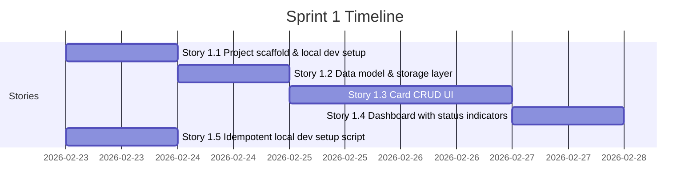

# Sprint Plan — Current State

This file reflects the latest sprint completion state. Sprint 1 and Sprint 2 are complete. Sprint 3 is next.

---

## Sprint 2 — COMPLETED

**Goal**: Integrate the Saga Ledger design system into the Sprint 1 foundation. Apply the dark Nordic War Room aesthetic, Norse copy, persistent app shell, and the first wave of easter eggs. Deploy to Vercel.

**Sprint 2 Deliverables — All Shipped**:

- Saga Ledger theme: void-black (`#07070d`) background, gold accent (`#c9920a`), aged parchment text
- Norse typefaces via `next/font/google`: Cinzel Decorative (display), Cinzel (headings), Source Serif 4 (body), JetBrains Mono (data)
- Persistent app shell with collapsible sidebar navigation (`AppShell`, `SideNav`, `TopBar`, `SiteHeader`)
- `Footer.tsx` — three-column layout
- Easter Egg #4 — Console ASCII art (Elder Futhark rune glyphs): `ConsoleSignature.tsx`
- Easter Egg #5 — HTML source JSDoc signature: `layout.tsx`
- Easter Egg #7 — Runic meta tag: `metadata.other["fenrir:runes"]` in `layout.tsx`
- Easter Egg #2 — Konami Code Howl: `KonamiHowl.tsx`
- Easter Egg #3 — Loki Mode: Footer 7-click shuffle
- Easter Egg #1 Fragment 5 — Breath of a Fish: `GleipnirFishBreath` modal from Footer hover
- Deployed to Vercel: https://fenrir-ledger.vercel.app
- Static marketing site: `/static/index.html` (GitHub Pages)
- Next.js upgraded to 15.1.12 (CVE-2025-66478 fix)

**Outstanding / Deferred to Sprint 3**:
- Norse copy pass not complete (generic copy remains in some areas)
- `getRealmLabel()` / `realm-utils.ts` not implemented
- No animation layer (Framer Motion)
- The Howl panel not built
- Valhalla route not built

---

## Sprint 1 — COMPLETED (Historical Record)

**Goal**: Deliver a working local-only credit card tracker. Add, view, edit, and delete cards, with a dashboard showing card status indicators. Anyone can clone the repo and run the app in under 5 minutes.

**Sprint 1 Timeline**:

### Story 1.1: Project Scaffold — DONE
- Next.js + TypeScript + Tailwind + shadcn/ui scaffolded
- `npm run dev` starts at `http://localhost:3000`
- TypeScript strict mode, ESLint passing, `npm run build` clean

### Story 1.2: Data Model and Storage Layer — DONE
- `src/lib/types.ts` — `Household`, `Card`, `SignUpBonus`, `CardStatus`
- `src/lib/storage.ts` — typed localStorage abstraction
- `src/lib/card-utils.ts` — `computeCardStatus()` pure function
- Schema version `1`, `migrateIfNeeded()` on app startup

### Story 1.3: Card CRUD UI — DONE
- Add, view, edit, delete cards
- `CardForm.tsx` with react-hook-form + Zod validation
- All required fields validated; data persists across refresh

### Story 1.4: Dashboard with Card Status Indicators — DONE
- Root page (`/`) shows card grid with status badges
- Status colors: Active (green), Fee Approaching (amber), Promo Expiring (amber), Closed (grey)
- Attention count summary; empty state prompt; mobile-responsive grid

### Story 1.5: Idempotent Local Dev Setup — DONE
- `development/scripts/setup-local.sh` — checks Node.js, installs deps, creates `.env.local`
- Idempotent; works on macOS and Linux

---

## Sprint 3 — UPCOMING

**Goal**: Authentication, server-side persistence, animation layer, and remaining Norse mythology features.

**Planned Stories (from `implementation-brief.md` and ADR-004)**:

### Story 3.1: Auth.js v5 + Google OIDC
- Install and configure `next-auth@beta`
- Add `src/auth.ts`, `src/middleware.ts`
- Google OIDC provider, JWT session strategy
- Sign-in page (`/auth/signin`) styled with Saga Ledger theme
- Household upsert on first sign-in: `"{name}'s Household"`
- **Complexity**: L

### Story 3.2: Supabase PostgreSQL + Data Access Layer
- Provision Supabase project; define schema (households, cards tables)
- Replace `storage.ts` localStorage reads/writes with Supabase client calls
- API routes: `GET/POST /api/cards`, `PUT/DELETE /api/cards/[id]`, `GET/POST /api/households`
- RLS policies as defence-in-depth
- **Complexity**: L

### Story 3.3: Framer Motion + Card Animations
- Install `framer-motion`
- `saga-enter` stagger animation on card grid load
- `AnimatePresence` for card add/remove
- Skeleton shimmer loading state
- **Complexity**: M

### Story 3.4: The Howl Panel + StatusRing
- `HowlPanel.tsx` — urgent cards sidebar (slide-in via Framer Motion)
- `StatusRing.tsx` — SVG progress ring around card issuer initials
- `getRealmLabel()` in `src/lib/realm-utils.ts`
- **Complexity**: M

### Story 3.5: Valhalla Archive (`/valhalla`)
- New route: `src/app/valhalla/page.tsx`
- Tombstone card style (darker, sepia, `ᛏ` rune)
- Entry animation; net value calculation (rewards - fees paid)
- **Complexity**: M

---

## Sprint 4 — BACKLOG

- Ragnarök threshold mode (easter egg #8)
- Card count milestone toasts (easter egg #11)
- Gleipnir Hunt full implementation (easter egg #1) — larger story, may split
- `?` shortcut → About modal (easter egg #9)
- localStorage migration wizard (Iteration 5, per ADR-004)
- Star Trek LCARS mode (easter egg #6) — optional/bonus
