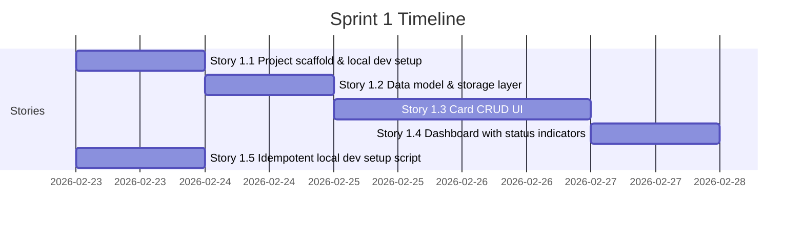

# Sprint 1 Plan

**Goal**: Deliver a working local-only credit card tracker — add, view, edit, and delete cards, with a dashboard showing card status indicators. Anyone can clone the repo and run the app in under 5 minutes.

**Sprint 1 Timeline**:

---

## Stories

### Story 1.1: Project Scaffold

- **As a**: developer
- **I want**: a Next.js + TypeScript + Tailwind + shadcn/ui project that runs locally with `npm run dev`
- **So that**: the team has a working foundation to build Sprint 1 features on
- **Acceptance Criteria**:
  - `npm run dev` from `development/src/` starts the app at `http://localhost:3000`
  - TypeScript strict mode is enabled and there are zero type errors
  - Tailwind CSS is configured and applies styles correctly
  - shadcn/ui is initialized with the correct theme (`neutral` base, CSS variables)
  - ESLint passes with zero warnings or errors
  - `npm run build` succeeds with zero errors
- **Technical Notes**:
  - Run `npx create-next-app@latest . --typescript --tailwind --eslint --app --src-dir --import-alias "@/*"` from within `development/src/`
  - Then run `npx shadcn@latest init` (select: Style=Default, Base Color=Neutral, CSS variables=yes)
  - Add `"use client"` to any component that uses hooks or browser APIs
  - Configure `next.config.ts` with no special settings for Sprint 1 (defaults are fine)
  - Add `.env.example` with placeholder values; `.gitignore` must exclude `.env` and `.env.*`
- **Estimated Complexity**: S
- **UX Reference**: N/A — scaffold only

---

### Story 1.2: Data Model and Storage Layer

- **As a**: developer
- **I want**: a typed data model and localStorage abstraction layer
- **So that**: card data persists across page refreshes and the rest of the codebase has no direct coupling to localStorage
- **Acceptance Criteria**:
  - TypeScript interfaces `Household`, `Card`, `SignUpBonus`, `CardStatus` are defined in `development/src/src/lib/types.ts`
  - `development/src/src/lib/storage.ts` exports typed read/write functions for households and cards
  - Default household `"default-household"` is initialized on first app load if not present
  - Schema version `1` is written to `fenrir_ledger:schema_version` on init
  - `migrateIfNeeded()` is called on app startup and handles the version-0 → version-1 path
  - All functions have TypeScript return types and JSDoc comments
  - No component directly calls `window.localStorage`
- **Technical Notes**:
  - Define all types in `src/lib/types.ts`
  - `storage.ts` uses the key prefix `fenrir_ledger:` for all keys
  - `CardStatus` is a computed field: `"fee_approaching"` if annual fee date is within 60 days; `"promo_expiring"` if sign-up bonus deadline is within 30 days; `"closed"` if explicitly closed; `"active"` otherwise
  - Export a `computeCardStatus(card: Card): CardStatus` pure function from `src/lib/card-utils.ts`
  - Wrap localStorage access in try/catch to handle quota exceeded or SSR contexts
- **Estimated Complexity**: S
- **UX Reference**: N/A — data layer only

---

### Story 1.3: Card CRUD UI

- **As a**: credit card churner
- **I want**: to add, view, edit, and delete credit cards
- **So that**: I can build and manage my complete card portfolio in the app
- **Acceptance Criteria**:
  - User can add a new card with: issuer, card name, open date, credit limit, annual fee amount, annual fee due date, promo period (months), sign-up bonus (type, amount, spend requirement, deadline), notes
  - All required fields are validated before save (open date, card name, issuer are required)
  - User can view a list of all cards in the household
  - User can click a card to open an edit form pre-populated with existing values
  - User can delete a card (with a confirmation prompt)
  - Data persists after page refresh
  - Forms are mobile-responsive
  - Date fields use a date picker or standard HTML date input
- **Technical Notes**:
  - Card list: `src/app/page.tsx` (root page = dashboard, which renders `CardList` component)
  - Add card form: `src/app/cards/new/page.tsx`
  - Edit card form: `src/app/cards/[id]/edit/page.tsx`
  - Shared form component: `src/components/cards/CardForm.tsx`
  - Card list item: `src/components/cards/CardListItem.tsx`
  - Use `shadcn/ui` components: `Button`, `Card`, `Input`, `Label`, `Select`, `Dialog`, `Badge`
  - Use `react-hook-form` for form state management with Zod schema validation
  - Install: `npm install react-hook-form zod @hookform/resolvers`
  - Generate a UUID for new card IDs: use `crypto.randomUUID()` (available in modern browsers and Node.js 14.17+)
  - Call `computeCardStatus()` when saving a card and store the result in `card.status`
- **Estimated Complexity**: L
- **UX Reference**: Dashboard wireframe (card list), Add Card form

---

### Story 1.4: Dashboard with Card Status Indicators

- **As a**: credit card churner
- **I want**: a dashboard showing all my cards with clear status indicators
- **So that**: I can see at a glance which cards need my attention
- **Acceptance Criteria**:
  - Dashboard is the root page (`/`)
  - Each card is displayed as a card tile showing: issuer, card name, status badge, annual fee date, sign-up bonus deadline (if applicable), credit limit
  - Status badges use distinct colors: Active (green), Fee Approaching (amber), Promo Expiring (amber), Closed (grey)
  - Dashboard shows a count summary: total cards, cards needing attention
  - Empty state: when no cards exist, show a prompt to add the first card
  - Dashboard is mobile-responsive (single column on mobile, grid on desktop)
  - Clicking a card navigates to the edit form for that card
- **Technical Notes**:
  - `src/app/page.tsx` is the dashboard — must include `"use client"` since it reads from localStorage
  - Dashboard component: `src/components/dashboard/Dashboard.tsx`
  - Card tile: `src/components/dashboard/CardTile.tsx`
  - Status badge: `src/components/dashboard/StatusBadge.tsx`
  - Color mapping for status badges:
    - `active` → shadcn `Badge` variant with green styling (`#4CAF50`)
    - `fee_approaching` → amber (`#FF9800`)
    - `promo_expiring` → amber (`#FF9800`)
    - `closed` → grey (`#9E9E9E`)
  - Grid layout: `grid-cols-1 sm:grid-cols-2 lg:grid-cols-3 gap-4`
  - Attention count: cards with status `fee_approaching` or `promo_expiring`
- **Estimated Complexity**: M
- **UX Reference**: Dashboard wireframe

---

### Story 1.5: Idempotent Local Dev Setup

- **As a**: developer or QA tester
- **I want**: to clone the repo and have the app running in under 5 minutes
- **So that**: the team can work on the project without environment setup friction
- **Acceptance Criteria**:
  - `development/scripts/setup-local.sh` exists and is executable
  - Running `./development/scripts/setup-local.sh` from the repo root:
    - Checks for Node.js (>= 18) and errors clearly if not found
    - Installs all npm dependencies in `development/src/`
    - Creates `development/src/.env.local` from `.env.example` if not already present
    - Prints instructions to start the dev server
  - Script is idempotent — running it twice produces the same result with no errors
  - `README.md` FiremanDecko section includes a "Quick Start" that references the script
  - `development/src/.env.example` is committed with placeholder values
  - `development/src/.env.local` and `development/src/.env` are in `.gitignore`
- **Technical Notes**:
  - Script uses `#!/usr/bin/env bash` shebang
  - Check `node --version` and `npm --version` at script start
  - Use `npm ci` if `package-lock.json` exists, else `npm install`
  - Script must work on macOS and Linux (no macOS-specific commands)
  - Print colored output using ANSI codes: green for success, yellow for warnings, red for errors
- **Estimated Complexity**: S
- **UX Reference**: N/A — developer tooling
