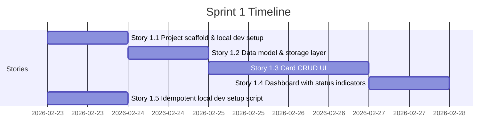

# Sprint Plan — Current State

This file reflects the latest sprint completion state. Sprints 1–4 are complete. Sprint 5 (import workflow) has shipped.

---

## Sprint 4 — COMPLETED (v4.0.0)

**Goal**: Deep mythology layer — Ragnarok threshold, milestone toasts, Gleipnir hunt completion, accessibility polish, and Wolf Hunger Meter.

**Sprint 4 Deliverables — All Shipped**:

| Story | PR | What |
|-------|----|------|
| 4.1 Ragnarok Threshold | #38 | `RagnarokContext`, overlay when >= 5 urgent cards, title change, HowlPanel dramatic mode |
| 4.2 Milestone Toasts | #36 | `milestone-utils.ts`, Norse toast on card counts 1/5/9/13/20, sonner integration |
| 4.3 Gleipnir 4+6 | #39 | Fragment 4 (7th save), Fragment 6 (15s Valhalla idle), Gleipnir Complete card, DEF-001 fix |
| 4.4 Accessibility | #40 | StatusRing aria-labels, WCAG AA contrast docs, reduced-motion audit |
| 4.5 Wolf Hunger | #37 | `WolfHungerMeter` in AboutModal + ForgeMasterEgg, aggregates met bonuses |

---

## Sprint 3 — COMPLETED

**Goal**: Google OIDC auth (anonymous-first, localStorage-scoped), animation layer, Howl Panel + StatusRing, Valhalla archive, and the remaining Norse copy / realm utilities deferred from Sprint 2.

**Data layer constraint**: localStorage remains the persistence layer. Remote storage deferred until GA. Auth is anonymous-first (ADR-006); optional Google sign-in scopes localStorage to the authenticated user's `householdId`.

**Sprint 3 Deliverables — All Shipped**:

### Story 3.1: Auth — Anonymous-First + Google OIDC
- Authorization Code + PKCE flow with server token proxy (ADR-005, superseding ADR-004's Auth.js approach)
- Anonymous-first model (ADR-006): no auth gate, anonymous `householdId` via `crypto.randomUUID()`
- `src/lib/auth/pkce.ts`, `session.ts`, `household.ts`, `require-auth.ts`, `verify-id-token.ts`
- `src/contexts/AuthContext.tsx` — `"loading" | "authenticated" | "anonymous"` status
- `src/hooks/useAuth.ts` — exposes `householdId` directly
- Sign-in page at `/sign-in` reframed as opt-in upgrade; `UpsellBanner` component
- OAuth callback at `/auth/callback`; server proxy at `/api/auth/token`

### Story 3.2: Norse Copy Pass + `getRealmLabel()`
- `getRealmLabel()` implemented in `src/lib/realm-utils.ts`
- Realm labels wired into `StatusBadge.tsx`
- Copy pass across dashboard, empty states, form labels

### Story 3.3: Framer Motion + Card Animations
- `framer-motion` installed
- `AnimatedCardGrid.tsx` — stagger animation on card grid load
- `CardSkeletonGrid.tsx` — gold palette shimmer loading state
- `AnimatePresence` for card add/remove

### Story 3.4: The Howl Panel + StatusRing
- `HowlPanel.tsx` — urgent cards sidebar (layout component, slide-in via Framer Motion)
- `StatusRing.tsx` — SVG progress ring around card issuer initials
- Muspel-pulse animation when `daysRemaining <= 30`

### Story 3.5: Valhalla Archive (`/valhalla`)
- `src/app/valhalla/page.tsx` + `layout.tsx`
- Tombstone card style, descend entry animation

---

## Sprint 2 — COMPLETED

**Goal**: Integrate the Saga Ledger design system into the Sprint 1 foundation. Apply the dark Nordic War Room aesthetic, Norse copy, persistent app shell, and the first wave of easter eggs. Deploy to Vercel.

**Sprint 2 Deliverables — All Shipped**:

- Saga Ledger theme: void-black (`#07070d`) background, gold accent (`#c9920a`), aged parchment text
- Norse typefaces via `next/font/google`: Cinzel Decorative (display), Cinzel (headings), Source Serif 4 (body), JetBrains Mono (data)
- Persistent app shell with collapsible sidebar navigation (`AppShell`, `SideNav`, `TopBar`, `SiteHeader`)
- `Footer.tsx` — three-column layout
- Easter Egg #4 — Console ASCII art (Elder Futhark rune glyphs): `ConsoleSignature.tsx`
- Easter Egg #5 — HTML source JSDoc signature: `layout.tsx`
- Easter Egg #7 — Runic meta tag: `metadata.other["fenrir:runes"]` in `layout.tsx`
- Easter Egg #2 — Konami Code Howl: `KonamiHowl.tsx`
- Easter Egg #3 — Loki Mode: Footer 7-click shuffle
- Easter Egg #1 Fragment 5 — Breath of a Fish: `GleipnirFishBreath` modal from Footer hover
- Deployed to Vercel: https://fenrir-ledger.vercel.app
- Static marketing site: `/static/index.html` (GitHub Pages)
- Next.js upgraded to 15.1.12 (CVE-2025-66478 fix)

---

## Sprint 1 — COMPLETED (Historical Record)

**Goal**: Deliver a working local-only credit card tracker. Add, view, edit, and delete cards, with a dashboard showing card status indicators. Anyone can clone the repo and run the app in under 5 minutes.

**Sprint 1 Timeline**:

### Story 1.1: Project Scaffold — DONE
- Next.js + TypeScript + Tailwind + shadcn/ui scaffolded
- `npm run dev` starts at `http://localhost:3000`
- TypeScript strict mode, ESLint passing, `npm run build` clean

### Story 1.2: Data Model and Storage Layer — DONE
- `src/lib/types.ts` — `Household`, `Card`, `SignUpBonus`, `CardStatus`
- `src/lib/storage.ts` — typed localStorage abstraction
- `src/lib/card-utils.ts` — `computeCardStatus()` pure function
- Schema version `1`, `migrateIfNeeded()` on app startup

### Story 1.3: Card CRUD UI — DONE
- Add, view, edit, delete cards
- `CardForm.tsx` with react-hook-form + Zod validation
- All required fields validated; data persists across refresh

### Story 1.4: Dashboard with Card Status Indicators — DONE
- Root page (`/`) shows card grid with status badges
- Status colors: Active (green), Fee Approaching (amber), Promo Expiring (amber), Closed (grey)
- Attention count summary; empty state prompt; mobile-responsive grid

### Story 1.5: Idempotent Local Dev Setup — DONE
- `development/scripts/setup-local.sh` — checks Node.js, installs deps, creates `.env.local`
- Idempotent; works on macOS and Linux

---

## Sprint 5 — COMPLETED (Import Workflow)

**Goal**: Three-path import workflow (Google Sheets URL, CSV upload, manual entry) with serverless architecture on Vercel.

**Key deliverables**:
- Import wizard (`ImportWizard.tsx`) with three entry methods
- `ShareUrlEntry.tsx`, `CsvUpload.tsx`, `ImportDedupStep.tsx` components
- `useSheetImport.ts` hook for import state management
- `/api/sheets/import` API route for server-side sheet processing
- `AuthGate` component to hide import buttons for anonymous users
- Fly.io backend removed — fully serverless on Vercel (#60)

---

## Post-Sprint 5 — Shipped

- Clean up unstaged changes and obsolete spec files (#63)
- Move sprint-3 audit report from specs/ to quality/ (#62)
