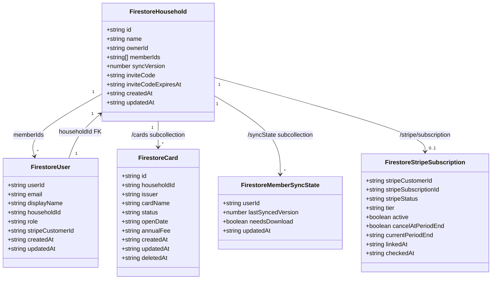
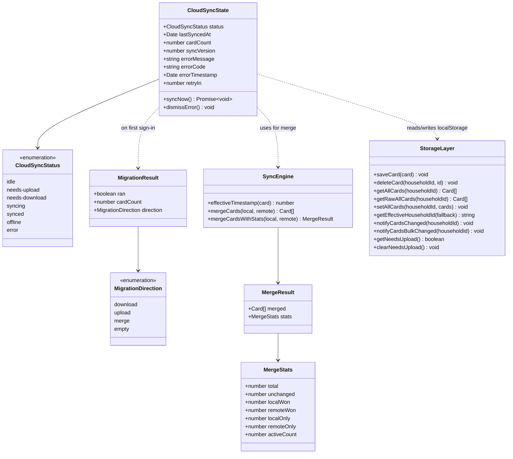
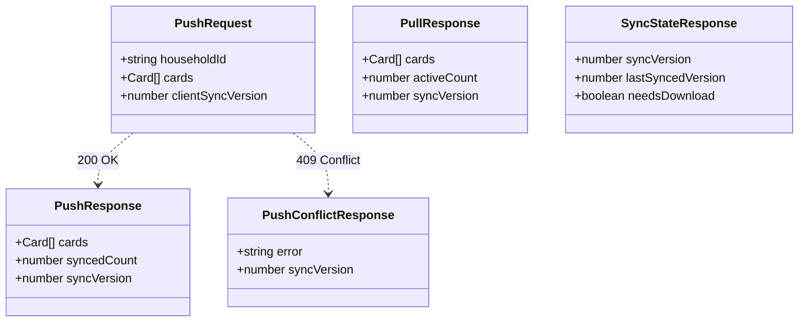
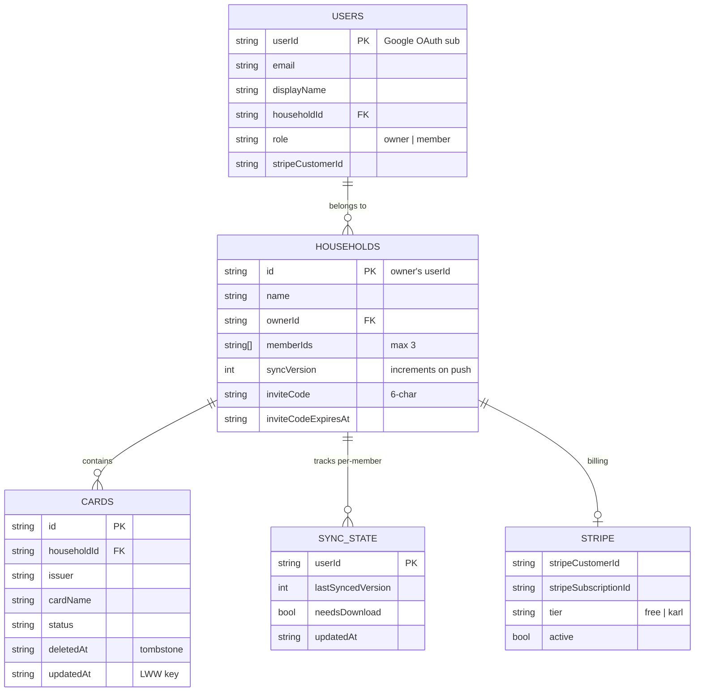
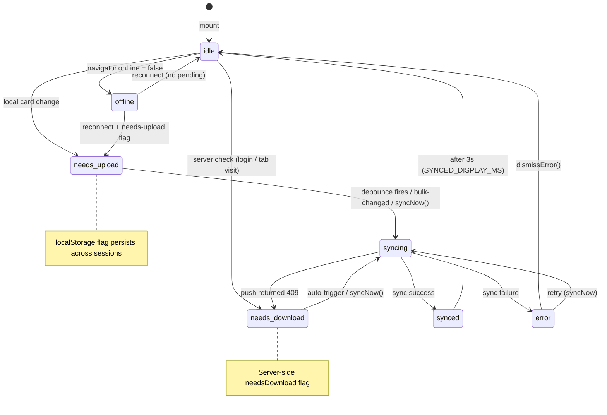
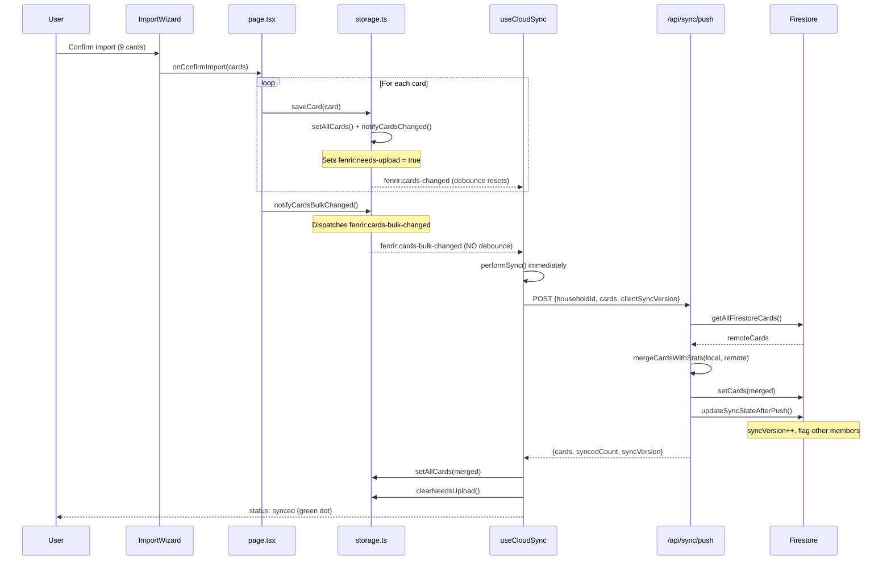
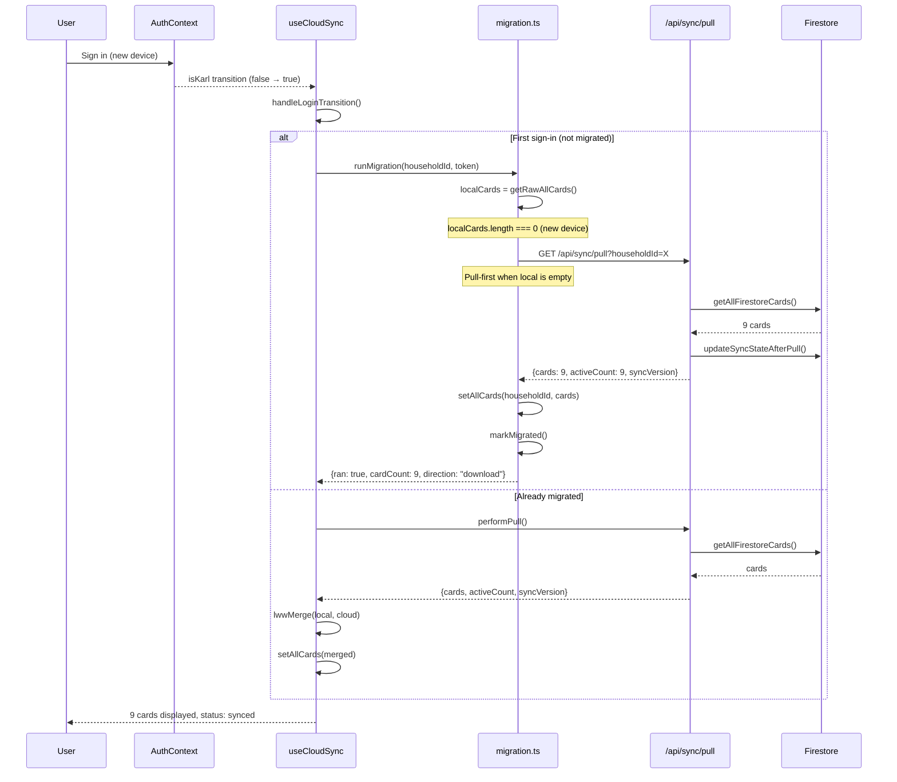
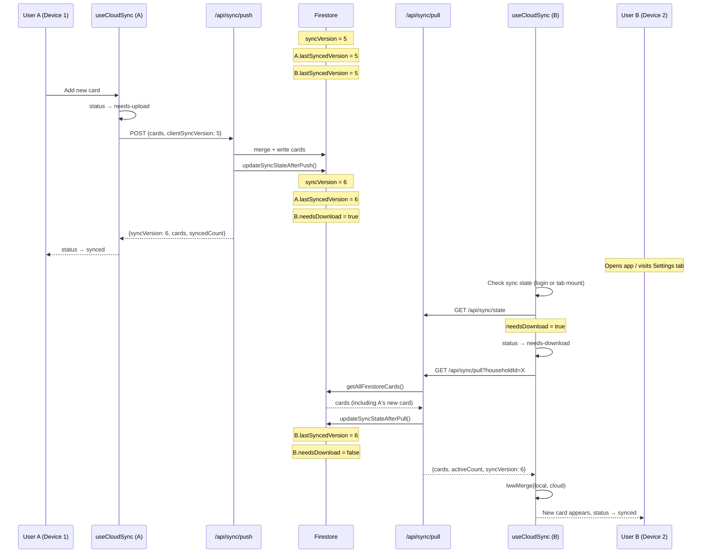
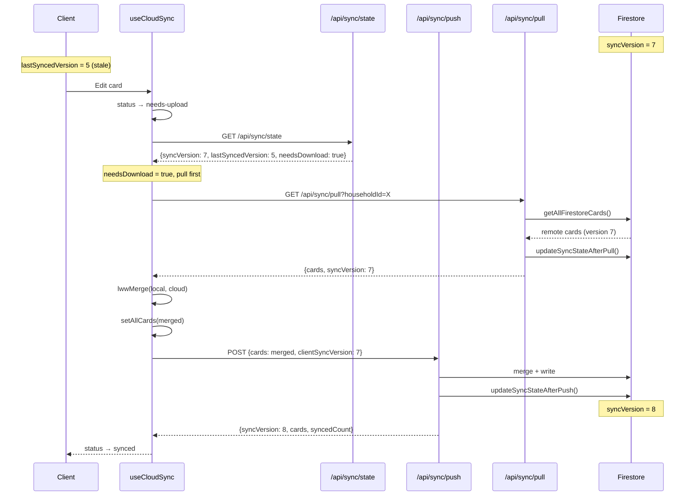
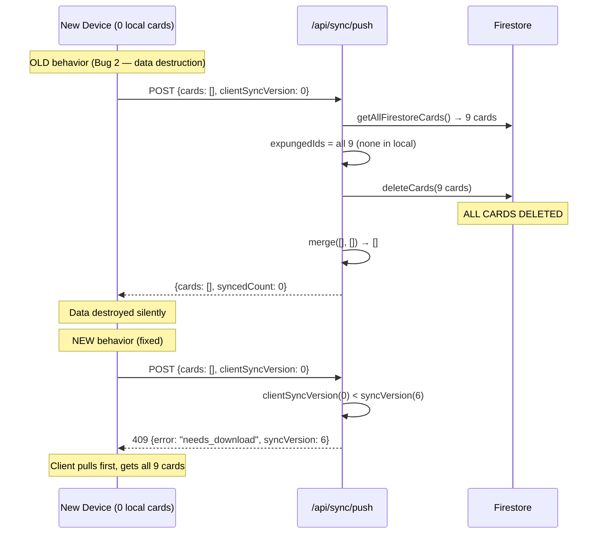

# Sync Architecture — Fenrir Ledger

Multi-device, multi-user household cloud sync with server-side version tracking.

## Overview

Fenrir Ledger uses an offline-first architecture: cards live in localStorage and are synced to Firestore for Karl-tier users. Sync is household-scoped — all members of a household share the same card portfolio.

### Design Principles

1. **Offline-first**: localStorage is the primary store; Firestore is the backup
2. **Household-scoped**: all sync operations use the household ID, not user ID
3. **Pull-before-push**: clients must download before uploading to prevent data loss
4. **Server-side versioning**: a `syncVersion` counter on the household doc tracks change generations
5. **Last-write-wins (LWW)**: per-card conflict resolution using `effectiveTimestamp`

---

## UML Class Diagrams

### Firestore Data Model

### Client-Side Sync Interfaces

### API Route Interfaces

---

## Firestore Collection Structure

---

## State Machine — CloudSyncStatus

---

## Sequence Diagrams

### 1. Card Import + Auto-Push (Bug 1 Fix)

### 2. New Device Login + Pull (Bug 2 Fix)

### 3. Multi-User Household Sync

### 4. Conflict Resolution — 409 Stale Version

### 5. Push Expunge Safety Guard

---

## Sync Protocol Rules

### Pull-Before-Push Ordering

1. Before any push, client calls `GET /api/sync/state`
2. If `needsDownload = true` OR `lastSyncedVersion < syncVersion`: pull first
3. Push includes `clientSyncVersion` — server rejects with 409 if stale
4. This prevents the expunge-on-empty-device bug and ensures LWW merge has full context

### Version Tracking

- `syncVersion` on household doc: incremented atomically on every successful push
- `lastSyncedVersion` per member: updated on pull to match current `syncVersion`
- `needsDownload` per member: set `true` for all OTHER members on push, cleared on pull

### Conflict Resolution (LWW)

- Per-card, not per-field
- `effectiveTimestamp = max(updatedAt, deletedAt)` — tombstones participate in LWW
- Later timestamp wins; ties favor the remote version (cloud wins)
- Merge is deterministic: same inputs always produce same output

### Auto-Sync Triggers

| Trigger | Action | Debounce |
|---------|--------|----------|
| `saveCard()` / `deleteCard()` | `fenrir:cards-changed` → push | 10s |
| Bulk import complete | `fenrir:cards-bulk-changed` → push | None (immediate) |
| Login (Karl transition) | Pull (or migration) | None |
| Settings/Household tab mount | Check state → auto-sync if dirty | None |
| `syncNow()` button | Push (with pull-first check) | None |
| Network reconnect | Restore to idle (no auto-push) | N/A |

### Tier Gating

- **Karl**: Full sync (push + pull + auto-sync)
- **Trial**: No sync — same as Thrall (sync is Karl-only per #1122)
- **Thrall**: No sync — status always "idle", all operations are no-ops

---

## Key Files

| File | Purpose |
|------|---------|
| `src/hooks/useCloudSync.ts` | Client sync state machine + push/pull orchestration |
| `src/hooks/useCloudSync.helpers.ts` | Toast messages, error parsing, first-sync flag |
| `src/lib/sync/sync-engine.ts` | Pure LWW merge logic |
| `src/lib/sync/migration.ts` | One-time first-sign-in migration |
| `src/lib/storage.ts` | localStorage CRUD + event dispatch |
| `src/app/api/sync/push/route.ts` | Push endpoint: merge + write + version tracking |
| `src/app/api/sync/pull/route.ts` | Pull endpoint: read + version update |
| `src/app/api/sync/state/route.ts` | Sync state query endpoint |
| `src/lib/firebase/firestore.ts` | Firestore Admin SDK operations |
| `src/lib/firebase/firestore-types.ts` | Firestore document type definitions |
| `src/components/sync/SyncSettingsSection.tsx` | Cloud Sync UI card in settings |
| `src/components/layout/SyncIndicator.tsx` | Fixed bottom-right sync status dot |
