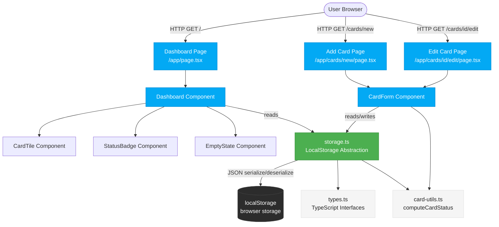
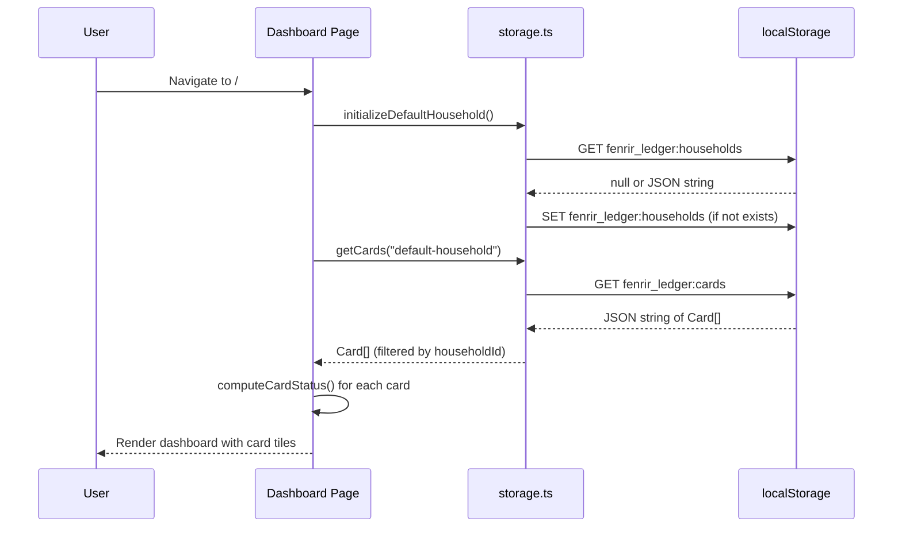
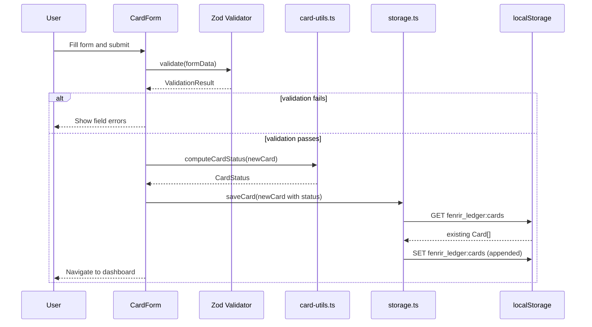
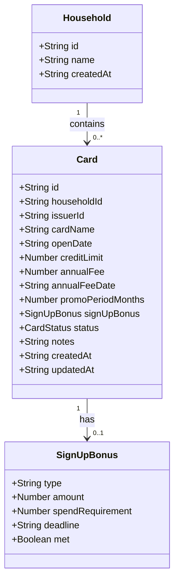
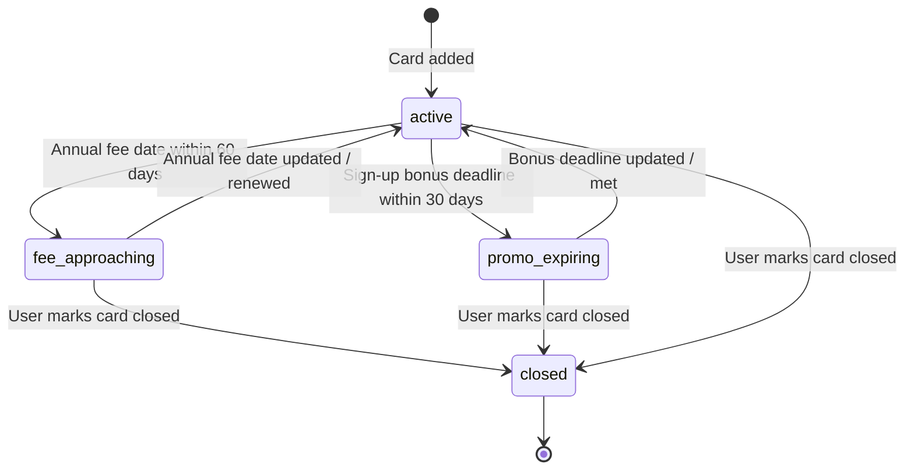

# System Design: Fenrir Ledger Sprint 1

## Overview

Fenrir Ledger Sprint 1 is a client-side-only Next.js application. No backend, no API, no authentication. All data is persisted in the browser's localStorage behind a typed abstraction layer. The app runs at `http://localhost:3000` during Sprint 1.

---

## Architecture

### Component Architecture



### Data Flow: Load Dashboard



### Data Flow: Add Card



---

## Data Model

### Entity Relationship



### Card Status State Machine



### localStorage Key Schema

| Key | Type | Description |
|-----|------|-------------|
| `fenrir_ledger:schema_version` | string (integer) | Schema version number. Sprint 1 = `"1"` |
| `fenrir_ledger:households` | JSON string (Household[]) | All households. Sprint 1 has exactly one. |
| `fenrir_ledger:cards` | JSON string (Card[]) | All cards across all households. |

---

## File Structure

```
development/src/
├── .env.example                     # Committed placeholder env template
├── .env.local                       # Local secrets (gitignored)
├── next.config.ts                   # Next.js configuration
├── tailwind.config.ts               # Tailwind configuration
├── components.json                  # shadcn/ui configuration
├── src/
│   ├── app/
│   │   ├── layout.tsx               # Root layout (fonts, global styles)
│   │   ├── page.tsx                 # Dashboard (/) — "use client"
│   │   ├── globals.css              # Tailwind base + shadcn/ui CSS vars
│   │   └── cards/
│   │       ├── new/
│   │       │   └── page.tsx         # Add card page — "use client"
│   │       └── [id]/
│   │           └── edit/
│   │               └── page.tsx     # Edit card page — "use client"
│   ├── components/
│   │   ├── ui/                      # shadcn/ui generated components
│   │   │   ├── button.tsx
│   │   │   ├── card.tsx
│   │   │   ├── input.tsx
│   │   │   ├── label.tsx
│   │   │   ├── select.tsx
│   │   │   ├── badge.tsx
│   │   │   ├── dialog.tsx
│   │   │   └── textarea.tsx
│   │   ├── dashboard/
│   │   │   ├── Dashboard.tsx        # "use client" — reads cards from storage
│   │   │   ├── CardTile.tsx         # Card display tile with status badge
│   │   │   ├── StatusBadge.tsx      # Color-coded status badge
│   │   │   └── EmptyState.tsx       # Prompt shown when card list is empty
│   │   └── cards/
│   │       ├── CardForm.tsx         # "use client" — shared add/edit form
│   │       └── CardListItem.tsx     # Compact list item (used in mobile views)
│   └── lib/
│       ├── types.ts                 # TypeScript interfaces: Household, Card, etc.
│       ├── storage.ts               # localStorage abstraction layer
│       ├── card-utils.ts            # Pure functions: computeCardStatus, etc.
│       └── constants.ts             # STORAGE_KEY_PREFIX, DEFAULT_HOUSEHOLD, etc.
```

---

## Component Responsibilities

### `src/lib/types.ts`
Defines all shared TypeScript interfaces. No logic — types only.

### `src/lib/constants.ts`
Defines all magic values: storage key prefixes, default household ID, status threshold days (60 for fee approaching, 30 for promo expiring).

### `src/lib/storage.ts`
The localStorage abstraction. All reads/writes to `window.localStorage` go through here. Wraps operations in try/catch. Calls `migrateIfNeeded()` on module load.

### `src/lib/card-utils.ts`
Pure utility functions. `computeCardStatus(card, today)` is deterministic and takes an optional `today` parameter for testability.

### `src/app/page.tsx` (Dashboard)
Client component. On mount: calls `initializeDefaultHousehold()`, loads all cards for the default household, renders the `Dashboard` component.

### `src/components/dashboard/Dashboard.tsx`
Renders the card grid, summary counts, and empty state. Receives `cards: Card[]` as props. All data-fetching is in the parent page.

### `src/components/dashboard/CardTile.tsx`
Displays a single card. Shows issuer, name, status badge, annual fee date, sign-up bonus deadline. Clicking navigates to `/cards/[id]/edit`.

### `src/components/cards/CardForm.tsx`
Shared form for both add and edit flows. Accepts `initialValues?: Card` for edit mode. Uses `react-hook-form` + Zod. On submit: generates/preserves card ID, computes status, calls `saveCard()`, redirects to dashboard.

---

## Dependencies

### Runtime
| Package | Version | Purpose |
|---------|---------|---------|
| `next` | latest | Framework |
| `react` | latest | UI |
| `react-dom` | latest | DOM renderer |
| `react-hook-form` | ^7.x | Form state management |
| `zod` | ^3.x | Schema validation |
| `@hookform/resolvers` | ^3.x | Bridge between react-hook-form and Zod |

### Dev
| Package | Version | Purpose |
|---------|---------|---------|
| `typescript` | ^5.x | Type checking |
| `tailwindcss` | ^3.x | Styling |
| `eslint` | ^8.x | Linting |
| `@types/react` | latest | React type definitions |
| `@types/node` | latest | Node.js type definitions |

### shadcn/ui (copy-owned, not a package dependency)
Components installed via `npx shadcn@latest add`: `button`, `card`, `input`, `label`, `select`, `badge`, `dialog`, `textarea`

---

## Technical Constraints and Decisions

| Constraint | Detail |
|-----------|--------|
| All components using hooks or browser APIs | Must have `"use client"` at top |
| No direct `window.localStorage` access | Must go through `src/lib/storage.ts` |
| Schema changes | Must bump `SCHEMA_VERSION` in `storage.ts` and add migration |
| All money amounts | Stored as integer cents (not floats) to avoid floating-point errors |
| All dates | Stored as ISO 8601 strings (YYYY-MM-DD for dates, full ISO for timestamps) |
| Card IDs | Generated with `crypto.randomUUID()` |
| Household ID | Hardcoded `"default-household"` in Sprint 1 |
