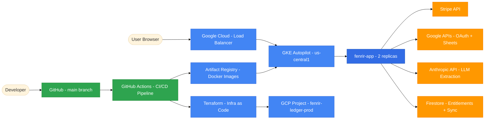
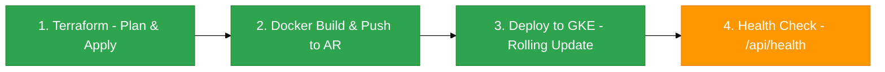
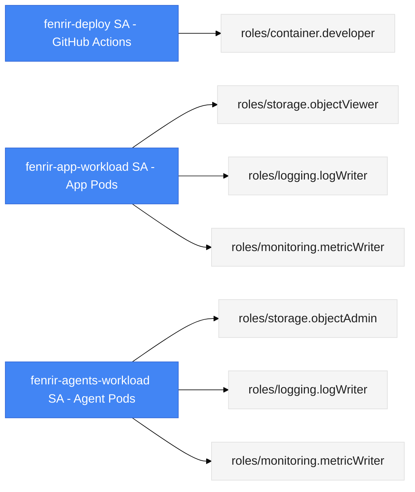
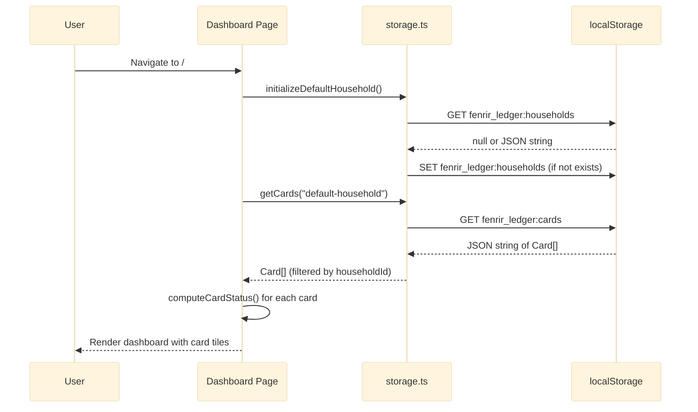
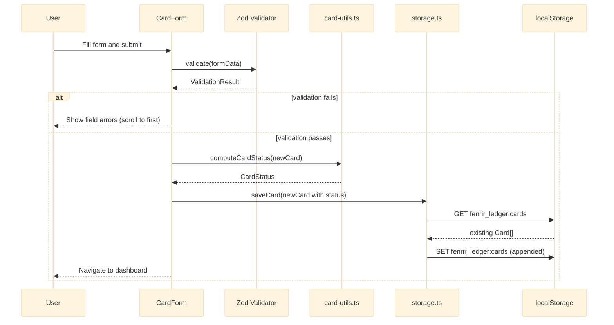
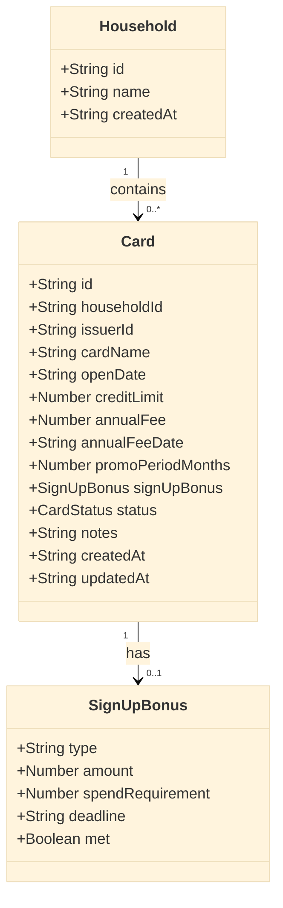
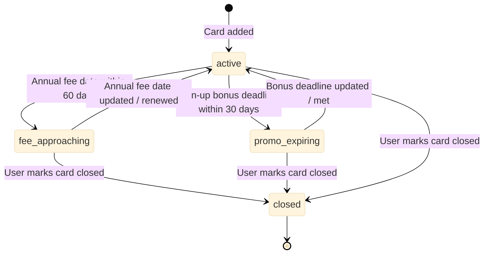

# System Design: Fenrir Ledger (Post-GKE Migration — Current)

## Overview

Fenrir Ledger is a client-side Next.js 15 application deployed on GKE Autopilot in `us-central1`. All user data is persisted in localStorage behind a typed abstraction layer, namespaced per household. Authentication is anonymous-first (ADR-006): users can use the app immediately without signing in. Optional Google OIDC sign-in (Authorization Code + PKCE, ADR-005) enables cloud sync and Stripe subscription management. Subscription entitlements are managed via Stripe Direct (ADR-010) with webhook-driven updates stored in **Firestore** (server-side, keyed by Google `sub`). SubscriptionGate is soft-only: it always renders children but prepends an upsell card for non-subscribers. The app includes a three-path import workflow (Google Sheets URL, CSV upload, manual entry), Framer Motion animations, and a deep Norse mythology easter egg layer. Patreon has been fully removed; Stripe is the sole subscription platform.

---

## Infrastructure Architecture

### 10,000ft Overview



### GKE Cluster Details

| Property | Value |
|----------|-------|
| **Project** | `fenrir-ledger-prod` |
| **Cluster** | `fenrir-autopilot` |
| **Region** | `us-central1` |
| **Type** | GKE Autopilot (Google manages nodes, scaling, patching) |
| **Artifact Registry** | `us-central1-docker.pkg.dev/fenrir-ledger-prod/fenrir-images` |
| **VPC** | `fenrir-vpc` with subnet `fenrir-subnet` (pods + services CIDR ranges) |
| **Release Channel** | REGULAR |

### Kubernetes Resources

```mermaid
%%{init: {'theme': 'base', 'themeVariables': {'fontSize': '18px'}}}%%
graph TD
    classDef ns fill:#326CE5,stroke:#2558B1,color:#FFF
    classDef resource fill:#F5F5F5,stroke:#E0E0E0,color:#212121
    classDef config fill:#4CAF50,stroke:#388E3C,color:#FFF

    ns_app[Namespace: fenrir-app] --> deploy[Deployment - 2 replicas]
    deploy --> pod1[Pod 1 - fenrir-app:latest]
    deploy --> pod2[Pod 2 - fenrir-app:latest]
    ns_app --> svc[Service - ClusterIP :80 to :3000]
    ns_app --> ingress[Ingress - GCE Load Balancer]
    ns_app --> cert[ManagedCertificate - fenrirledger.com]
    ns_app --> backend[BackendConfig - Health: /api/health]
    ns_app --> secrets[Secret - fenrir-app-secrets]
    ns_app --> sa[ServiceAccount - fenrir-app-sa]
    sa --> wi[Workload Identity - fenrir-app-workload@GCP]

    ns_agents[Namespace: fenrir-agents] --> jobs[Agent Jobs - K8s Jobs on demand]
    ns_agents --> sa_agents[ServiceAccount - fenrir-agents-sa]
    sa_agents --> wi_agents[Workload Identity - fenrir-agents-workload@GCP]

    class ns_app ns
    class ns_agents ns
    class deploy resource
    class pod1 resource
    class pod2 resource
    class svc resource
    class ingress resource
    class cert resource
    class backend resource
    class secrets config
    class sa config
    class wi config
    class jobs resource
    class sa_agents config
    class wi_agents config
```



### CI/CD Pipeline

Every push to `main` triggers a 4-stage pipeline (`.github/workflows/deploy.yml`):



1. **Terraform** — ensures cluster, VPC, IAM, and SSL resources are up to date (idempotent)
2. **Build & Push** — Docker build with GHA cache, push to Artifact Registry (SHA + latest tags)
3. **Deploy** — creates namespace + SA if needed, applies K8s manifests, sets image tag, waits for rollout
4. **Health Check** — curls `/api/health` on the Ingress IP, retries up to 5 times

### IAM & Workload Identity



### Networking

- **Private cluster** — nodes have no public IPs, control plane accessible via auth
- **Master authorized networks** — currently open (restrict in production)
- **Ingress** — GCE external HTTP(S) Load Balancer with BackendConfig health checks
- **SSL** — Google-managed certificate for `fenrirledger.com` via Cloud DNS
- **DNS** — Google Cloud DNS managed zone with A records for apex and www

---

## Application Architecture

### Component Architecture

```mermaid
%%{init: {'theme': 'base', 'themeVariables': {'fontSize': '18px'}}}%%
graph TD
    classDef primary fill:#03A9F4,stroke:#0288D1,color:#FFF
    classDef neutral fill:#F5F5F5,stroke:#E0E0E0,color:#212121
    classDef healthy fill:#4CAF50,stroke:#388E3C,color:#FFF
    classDef warning fill:#FF9800,stroke:#F57C00,color:#FFF
    classDef background fill:#2C2C2C,stroke:#444,color:#FFF

    %% Entry points
    browser([User Browser]) -->|GET /ledger| dashpage[Dashboard Page - /ledger]
    browser -->|GET /ledger/cards/new| newpage[Add Card Page - /ledger/cards/new]
    browser -->|GET /ledger/cards/id/edit| editpage[Edit Card Page - /ledger/cards/id/edit]
    browser -->|GET /ledger/valhalla| valpage[Valhalla Page - /ledger/valhalla]
    browser -->|GET /ledger/sign-in| signinpage[Sign-In Page - /ledger/sign-in]
    browser -->|GET /ledger/auth/callback| callbackpage[Auth Callback - /ledger/auth/callback]
    browser -->|GET /ledger/settings| settingspage[Settings Page - /ledger/settings]

    %% Auth + entitlement contexts
    authctx[AuthContext -anonymous or authenticated] --> dashpage
    authctx --> newpage
    authctx --> editpage
    authctx --> valpage
    entctx[EntitlementContext -Stripe subscription state] --> dashpage
    entctx --> settingspage

    %% App shell
    dashpage --> appshell[AppShell -layout wrapper]
    appshell --> topbar[TopBar]
    appshell --> sidenav[SideNav]
    appshell --> footer[Footer]
    appshell --> upsell[UpsellBanner]
    appshell --> howlpanel[HowlPanel -urgent cards sidebar]

    %% Dashboard page components
    dashpage --> dashboard[Dashboard Component]
    dashboard --> animgrid[AnimatedCardGrid]
    dashboard --> skeleton[CardSkeletonGrid]
    animgrid --> cardtile[CardTile Component]
    cardtile --> statusbadge[StatusBadge Component]
    cardtile --> statusring[StatusRing -SVG deadline ring]
    dashboard --> emptyst[EmptyState Component]

    %% Form pages
    newpage --> cardform[CardForm Component]
    editpage --> cardform
    cardform --> gleipnir[Gleipnir Fragment -Components]

    %% Import flow
    dashpage --> importwiz[ImportWizard]
    importwiz --> shareurl[ShareUrlEntry]
    importwiz --> csvupload[CsvUpload]
    importwiz --> pickerstep[PickerStep -Google Picker]
    importwiz --> dedupstep[ImportDedupStep]
    importwiz --> authgate[AuthGate]

    %% Entitlement / Stripe
    settingspage --> stripesettings[StripeSettings]
    settingspage --> subgate[SubscriptionGate -soft-only upsell]
    subgate --> sealedmodal[SealedRuneModal]
    subgate --> upsellent[UpsellBanner -entitlement]
    stripesettings --> unlinkdlg[UnlinkConfirmDialog]

    %% Easter eggs
    appshell --> konami[KonamiHowl]
    appshell --> ragnarok[RagnarokContext -threshold overlay]
    footer --> lokimode[Loki Mode trigger]
    footer --> fishbreath[GleipnirFishBreath modal]
    appshell --> consolesig[ConsoleSignature -client-only, console art]
    appshell --> forgemaster[ForgeMasterEgg]

    %% Shared
    dashboard --> wolfhunger[WolfHungerMeter]

    %% Shared lib
    dashboard -->|reads| storage[storage.ts -LocalStorage Abstraction]
    cardform -->|reads/writes| storage
    importwiz -->|writes| storage
    storage -->|JSON serialize/deserialize| ls[(localStorage -browser storage)]

    %% Auth lib
    signinpage -->|PKCE flow| authlib[auth/pkce.ts -auth/session.ts]
    callbackpage -->|token exchange| tokenapi[/api/auth/token -server proxy]
    authlib --> ls

    %% API routes
    importwiz -->|POST| sheetsapi[/api/sheets/import]
    importwiz -->|GET| pickerapi[/api/config/picker]
    stripesettings -->|POST| stripecheck[/api/stripe/checkout]
    stripesettings -->|GET| stripemember[/api/stripe/membership]
    stripesettings -->|POST| stripeportal[/api/stripe/portal]
    stripesettings -->|POST| stripeunlink[/api/stripe/unlink]
    browser -->|POST webhook| stripewebhook[/api/stripe/webhook]

    %% Utilities
    storage --> types[types.ts -TypeScript Interfaces]
    cardform --> cardutils[card-utils.ts -computeCardStatus]
    statusbadge --> realmutils[realm-utils.ts -getRealmLabel]
    dashboard --> milestoneutils[milestone-utils.ts]
    dashboard --> gleipnirutils[gleipnir-utils.ts]

    class dashpage primary
    class newpage primary
    class editpage primary
    class valpage primary
    class signinpage primary
    class callbackpage primary
    class settingspage primary
    class dashboard primary
    class cardform primary
    class appshell primary
    class topbar primary
    class sidenav primary
    class footer primary
    class importwiz primary
    class storage healthy
    class ls background
    class types neutral
    class cardutils neutral
    class realmutils neutral
    class milestoneutils neutral
    class gleipnirutils neutral
    class konami warning
    class lokimode warning
    class fishbreath warning
    class consolesig neutral
    class gleipnir neutral
    class ragnarok warning
    class forgemaster warning
    class authlib healthy
    class authctx healthy
    class entctx healthy
    class tokenapi healthy
    class sheetsapi healthy
    class pickerapi healthy
    class howlpanel primary
    class statusring neutral
    class animgrid primary
    class wolfhunger neutral
    class stripesettings primary
    class subgate primary
    class sealedmodal primary
    class upsellent primary
    class unlinkdlg primary
    class pickerstep primary
    class stripecheck healthy
    class stripemember healthy
    class stripeportal healthy
    class stripeunlink healthy
    class stripewebhook healthy
```

### Data Flow: Load Dashboard



### Data Flow: Add Card



---

## Data Model

### Entity Relationship



### Card Status State Machine



### localStorage Key Schema

| Key | Type | Description |
|-----|------|-------------|
| `fenrir_ledger:schema_version` | string (integer) | Schema version number |
| `fenrir_ledger:households` | JSON string (Household[]) | All households. Single default household initially. |
| `fenrir_ledger:cards` | JSON string (Card[]) | All cards across all households. |

---

## Subsystem Responsibilities

### Data Persistence

All user data lives in `localStorage` behind a typed abstraction layer. Every read/write goes through the storage module — no direct `window.localStorage` access anywhere. Keys are namespaced per household ID. Schema migrations run on module load when the version changes.

Card status is computed deterministically from dates: `computeCardStatus(card, today)` returns one of `active`, `fee_approaching`, `promo_expiring`, or `closed`. Norse realm labels (Asgard-bound, Muspelheim, Hati approaches, In Valhalla) are display-only mappings.

### Authentication

Anonymous-first design (ADR-006). Users get a UUID household ID immediately and can use every feature without signing in. Optional Google OIDC (Authorization Code + PKCE, ADR-005) upgrades the session. The server-side token proxy adds `client_secret` during code exchange. When a user signs in after using the app anonymously, their localStorage data merges into the authenticated namespace.

Every API route (except the token exchange proxy) enforces auth via `requireAuth(request)` — returning early if the request lacks valid credentials.

### Entitlement & Subscription

Stripe Direct (ADR-010) is the sole subscription platform. Two tiers: Thrall (free) and Karl ($3.99/mo). Stripe webhooks update entitlement state in **Firestore** (server-side, keyed by Google `sub`). The SubscriptionGate is soft-only — it always renders children but prepends a Norse-themed upsell card for non-subscribers. The SealedRuneModal presents locked features with a link to Stripe Checkout.

### Import Pipeline

Three-path import wizard for credit card data:
1. **URL** — paste a Google Sheets URL, server fetches CSV, LLM extracts card data
2. **Google Picker** — GIS consent + Picker UI + Sheets v4 API + LLM extraction
3. **CSV Upload** — direct file upload + LLM extraction

All three paths converge at a deduplication step before writing to localStorage. The LLM extraction layer supports Anthropic (primary) and OpenAI (fallback).

### App Shell & Navigation

The AppShell wraps every page: TopBar (mobile) / SiteHeader (desktop), collapsible SideNav, HowlPanel (urgent cards sidebar with Framer Motion slide-in), UpsellBanner, main content slot, and Footer. Routes live under `/ledger` (dashboard, cards, valhalla, settings, auth). Marketing pages own `/`.

### Dashboard & Card Display

The dashboard renders an animated card grid (Framer Motion stagger) with shimmer loading states. Each CardTile shows issuer, name, StatusBadge (Norse realm label), StatusRing (SVG progress arc driven by days remaining), annual fee date, and sign-up bonus deadline. The WolfHungerMeter aggregates met bonuses. Milestone toasts fire at card counts 1/5/9/13/20.

### Card Form

Shared react-hook-form + Zod form for add and edit flows. Generates/preserves card ID, computes status, saves to storage, redirects to dashboard. Scroll-to-first-error on validation failure (DOM position order, not schema order).

### Easter Egg Layer (Gleipnir Hunt)

Six hidden fragments referencing the mythological ingredients of Gleipnir (the binding of Fenrir). Each fragment triggers a Norse-themed reveal modal with a unique SVG artifact. Additional eggs: Konami code howl, LCARS overlay, console ASCII runes, ForgeMaster, and Ragnarok threshold (overlay when >= 5 cards are urgent).

### Structured Logging

tslog wrapper with automatic secret masking via regex and key patterns. JSON output in production, pretty in development. Every backend function logs at entry (inputs) and exit (return value summary). Frontend uses `console.*` with `[ModuleName]` prefix.

---

## UI Patterns and Component Conventions

### Button Alignment

All form and dialog action buttons follow a single global rule. This convention applies to every form, dialog, and confirmation panel in the application.

| Position | Button type | Examples |
|----------|-------------|---------|
| Far right | Primary / positive action | Save, Add, Continue, OK |
| Immediately left of primary | Cancel | Cancel |
| Far left (isolated) | Destructive action (only when co-present with primary) | Close Card, Delete |

**Desktop layout** (single row):

```
[ Destructive ]                    [ Cancel ] [ Primary ]
```

**Mobile layout** (stacked, primary on top):

```
[ Primary     ]
[ Cancel      ]
[ Destructive ]
```

Implementation guidance:
- Use `justify-between` on the button row container when a destructive action is present; `justify-end` otherwise.
- On mobile apply `flex-col md:flex-row` with `md:justify-end` (or `md:justify-between` when destructive is present).
- Touch targets must be at least 44 x 44 px (see team norms).
- See `ux/wireframes.md` for the full visual specification.

---

## Dependencies

### Runtime
| Package | Version | Purpose |
|---------|---------|---------|
| `next` | ^15.1.12 | Framework (upgraded for CVE-2025-66478 fix) |
| `react` | ^19.0.0 | UI |
| `react-dom` | ^19.0.0 | DOM renderer |
| `react-hook-form` | ^7.54.2 | Form state management |
| `zod` | ^3.24.1 | Schema validation |
| `@hookform/resolvers` | ^3.9.1 | Bridge between react-hook-form and Zod |
| `framer-motion` | ^12.34.3 | Card animations, Howl panel slide, AnimatePresence |
| `sonner` | ^2.0.7 | Toast notifications (milestone toasts) |
| `lucide-react` | ^0.469.0 | Icon set |
| `class-variance-authority` | ^0.7.1 | Component variant management |
| `clsx` | ^2.1.1 | Conditional class names |
| `tailwind-merge` | ^2.6.0 | Tailwind class deduplication |
| `tailwindcss-animate` | ^1.0.7 | Animation utilities |
| `stripe` | — | Stripe SDK for server-side API calls |
| `jose` | — | JWT/JWKS verification for Google id_token |
| `tslog` | — | Structured logging with secret masking |

### Dev
| Package | Version | Purpose |
|---------|---------|---------|
| `typescript` | ^5.x | Type checking |
| `tailwindcss` | ^3.4.1 | Styling |
| `eslint` | ^8.x | Linting |
| `@types/react` | ^19 | React type definitions |
| `@types/node` | ^20 | Node.js type definitions |
| `playwright` | — | E2E testing |

### shadcn/ui (copy-owned, not a package dependency)
Components installed via `npx shadcn@latest add`: `button`, `card`, `input`, `label`, `select`, `badge`, `dialog`, `textarea`, `checkbox`

### Fonts (via `next/font/google`, no extra dependencies)
Cinzel Decorative (display), Cinzel (headings), Source Serif 4 (body), JetBrains Mono (data)

---

## Technical Constraints and Decisions

| Constraint | Detail |
|-----------|--------|
| All components using hooks or browser APIs | Must have `"use client"` at top |
| No direct `window.localStorage` access | Must go through `src/lib/storage.ts` |
| Schema changes | Must bump `SCHEMA_VERSION` in `storage.ts` and add migration |
| All money amounts | Stored as integer cents (not floats) to avoid floating-point errors |
| All dates | Stored as ISO 8601 strings (YYYY-MM-DD for dates, full ISO for timestamps) |
| Card IDs | Generated with `crypto.randomUUID()` |
| Household ID | Anonymous UUID via `getOrCreateAnonHouseholdId()`; Google `sub` claim when signed in |
| Docker image source | `development/frontend/` (Dockerfile at repo root) |
| Font loading | `next/font/google` with `display: 'swap'` on all four Norse typefaces |
| API route auth | Every API route (except `/api/auth/token`) must call `requireAuth(request)` |
| Subscription platform | Stripe Direct only (Patreon fully removed) |
| SubscriptionGate mode | Soft-only: always renders children, prepends upsell for non-subscribers |

---

## Architecture Evolution Notes

### Auth progression (ADR-004 to ADR-005 to ADR-006)
- ADR-004 proposed Auth.js v5 with server-side sessions — superseded.
- ADR-005 replaced with Authorization Code + PKCE, server token proxy — accepted.
- ADR-006 removed the auth gate, made the app anonymous-first — accepted (current).

### Backend removal (Sprint 5 to serverless)
- Sprint 5 initially introduced a dedicated backend server. This was removed in PR #60 in favour of Next.js API routes. The import workflow now uses `/api/sheets/import` as a Next.js API route.

### Subscription platform (Patreon to Stripe Direct)
- Patreon was the original subscription platform. Feature flags (adr-feature-flags) enabled the Stripe pivot. Patreon has been fully removed; all Patreon API routes, components, and library code are deleted. Stripe Direct (ADR-010) is the sole subscription platform. SubscriptionGate operates in soft-only mode — it never blocks content, only prepends upsell for non-subscribers.

### Deployment (Vercel to GKE)
- Originally deployed on Vercel (serverless). Migrated to GKE Autopilot for cost control and infrastructure ownership.
- Docker image built and pushed to Google Artifact Registry on every merge to `main`.
- 2-replica rolling deployment with zero-downtime updates.
- Terraform manages all GCP infrastructure (cluster, networking, IAM, SSL).
- Firestore used for entitlement state (Stripe webhook updates, keyed by Google `sub`). Redis was removed in issues #1516–#1521 (fully migrated to Firestore).
