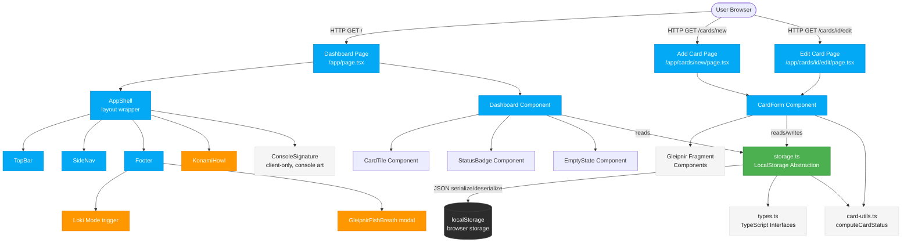
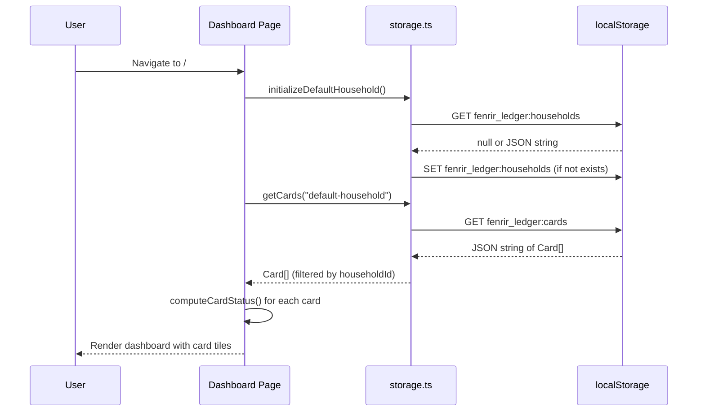
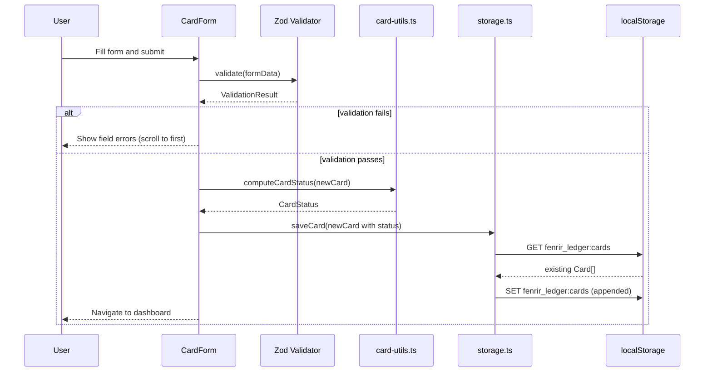
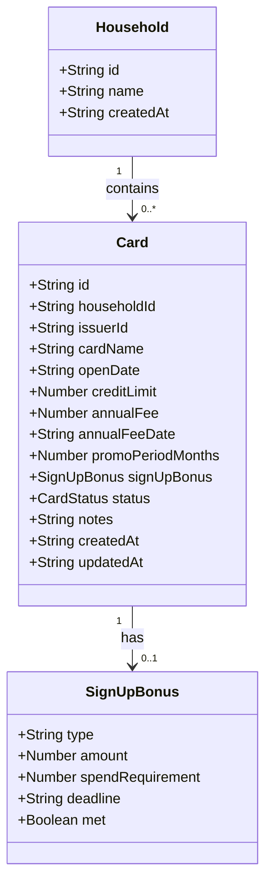
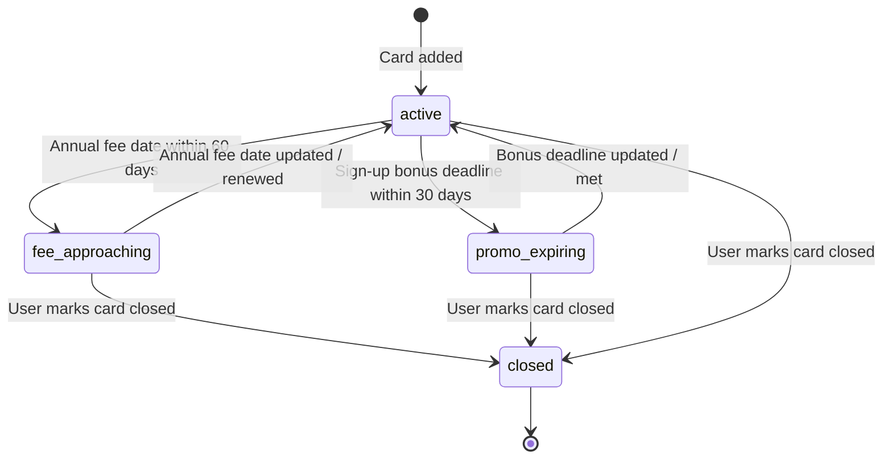

# System Design: Fenrir Ledger (Sprint 2 — Current)

## Overview

Fenrir Ledger is a client-side Next.js 15 application. As of Sprint 2, all data is persisted in the browser's localStorage behind a typed abstraction layer. The app is deployed to Vercel at https://fenrir-ledger.vercel.app. Sprint 3 will introduce OIDC authentication and Supabase server-side persistence (see ADR-004).

---

## Architecture

### Component Architecture



### Data Flow: Load Dashboard



### Data Flow: Add Card



---

## Data Model

### Entity Relationship



### Card Status State Machine



### localStorage Key Schema

| Key | Type | Description |
|-----|------|-------------|
| `fenrir_ledger:schema_version` | string (integer) | Schema version number. Sprint 2 = `"1"` (unchanged from Sprint 1) |
| `fenrir_ledger:households` | JSON string (Household[]) | All households. Single default household in Sprint 2. |
| `fenrir_ledger:cards` | JSON string (Card[]) | All cards across all households. |

---

## File Structure

```
development/src/
├── .env.example                     # Committed placeholder env template
├── .env.local                       # Local secrets (gitignored)
├── next.config.ts                   # Next.js configuration
├── tailwind.config.ts               # Tailwind configuration (Saga Ledger theme extensions)
├── components.json                  # shadcn/ui configuration
├── src/
│   ├── app/
│   │   ├── layout.tsx               # Root layout (fonts, global styles, metadata)
│   │   ├── page.tsx                 # Dashboard (/) — "use client"
│   │   ├── globals.css              # Saga Ledger theme: void-black bg, gold accents, Norse fonts
│   │   └── cards/
│   │       ├── new/
│   │       │   └── page.tsx         # Add card page — "use client"
│   │       └── [id]/
│   │           └── edit/
│   │               └── page.tsx     # Edit card page — "use client"
│   ├── components/
│   │   ├── ui/                      # shadcn/ui generated components
│   │   │   ├── button.tsx
│   │   │   ├── card.tsx
│   │   │   ├── input.tsx
│   │   │   ├── label.tsx
│   │   │   ├── select.tsx
│   │   │   ├── badge.tsx
│   │   │   ├── dialog.tsx
│   │   │   ├── checkbox.tsx
│   │   │   └── textarea.tsx
│   │   ├── layout/
│   │   │   ├── AppShell.tsx         # Root layout wrapper: TopBar + SideNav + main content + Footer
│   │   │   ├── TopBar.tsx           # Mobile top bar with hamburger menu
│   │   │   ├── SiteHeader.tsx       # Desktop site header (logo, actions)
│   │   │   ├── SideNav.tsx          # Collapsible sidebar navigation
│   │   │   ├── Footer.tsx           # Footer with Loki easter egg + GleipnirFishBreath trigger
│   │   │   ├── ConsoleSignature.tsx # Console ASCII art (client-only, runs once per session)
│   │   │   ├── KonamiHowl.tsx       # Konami code easter egg
│   │   │   ├── AboutModal.tsx       # About/credits modal
│   │   │   └── ForgeMasterEgg.tsx   # Additional easter egg component
│   │   ├── dashboard/
│   │   │   ├── Dashboard.tsx        # "use client" — reads cards from storage
│   │   │   ├── CardTile.tsx         # Card display tile with status badge
│   │   │   ├── StatusBadge.tsx      # Realm-mapped status badge
│   │   │   └── EmptyState.tsx       # Saga Ledger empty state with Gleipnir copy
│   │   └── cards/
│   │       ├── CardForm.tsx         # "use client" — shared add/edit form
│   │       ├── GleipnirFishBreath.tsx    # Gleipnir ingredient easter egg fragment
│   │       ├── GleipnirBearSinews.tsx
│   │       ├── GleipnirBirdSpittle.tsx
│   │       ├── GleipnirCatFootfall.tsx
│   │       ├── GleipnirMountainRoots.tsx
│   │       └── GleipnirWomansBeard.tsx
│   └── lib/
│       ├── types.ts                 # TypeScript interfaces: Household, Card, etc.
│       ├── storage.ts               # localStorage abstraction layer
│       ├── card-utils.ts            # Pure functions: computeCardStatus, etc.
│       ├── constants.ts             # STORAGE_KEY_PREFIX, DEFAULT_HOUSEHOLD, etc.
│       └── utils.ts                 # General utility helpers (shadcn cn())
```

---

## Component Responsibilities

### `src/lib/types.ts`
Defines all shared TypeScript interfaces. No logic — types only.

### `src/lib/constants.ts`
Defines all magic values: storage key prefixes, default household ID, status threshold days (60 for fee approaching, 30 for promo expiring).

### `src/lib/storage.ts`
The localStorage abstraction. All reads/writes to `window.localStorage` go through here. Wraps operations in try/catch. Calls `migrateIfNeeded()` on module load.

### `src/lib/card-utils.ts`
Pure utility functions. `computeCardStatus(card, today)` is deterministic and takes an optional `today` parameter for testability. `getRealmLabel()` is deferred to Sprint 3.

### `src/components/layout/AppShell.tsx`
Root layout wrapper providing the persistent shell: TopBar (mobile), SiteHeader (desktop), SideNav (collapsible), main content slot, Footer. Also mounts ConsoleSignature and easter egg components.

### `src/components/layout/Footer.tsx`
Three-column footer. Contains the Loki Mode 7-click trigger and the GleipnirFishBreath "Breath of a Fish" easter egg hover trigger.

### `src/components/layout/ConsoleSignature.tsx`
Client-only component that prints Elder Futhark ASCII art spelling ᚠᛖᚾᚱᛁᚱ (FENRIR) to the browser console once per session.

### `src/components/layout/KonamiHowl.tsx`
Listens for the Konami code sequence and triggers a full-screen howl animation.

### `src/app/page.tsx` (Dashboard)
Client component. On mount: calls `initializeDefaultHousehold()`, loads all cards for the default household, renders the `Dashboard` component.

### `src/components/dashboard/Dashboard.tsx`
Renders the card grid, summary counts, and empty state. Receives `cards: Card[]` as props. All data-fetching is in the parent page.

### `src/components/dashboard/CardTile.tsx`
Displays a single card with the Saga Ledger theme. Shows issuer, name, status badge, annual fee date, sign-up bonus deadline. Clicking navigates to `/cards/[id]/edit`.

### `src/components/dashboard/StatusBadge.tsx`
Renders a Norse realm-labelled badge for the card's status. Color and label are mapped to the Saga Ledger realm vocabulary. `getRealmLabel()` integration deferred to Sprint 3.

### `src/components/cards/CardForm.tsx`
Shared form for both add and edit flows. Accepts `initialValues?: Card` for edit mode. Uses `react-hook-form` + Zod. On submit: generates/preserves card ID, computes status, calls `saveCard()`, redirects to dashboard. Scroll-to-first-error on validation failure.

---

## UI Patterns and Component Conventions

### Button Alignment

All form and dialog action buttons follow a single global rule. This convention applies to every form, dialog, and confirmation panel in the application.

| Position | Button type | Examples |
|----------|-------------|---------|
| Far right | Primary / positive action | Save, Add, Continue, OK |
| Immediately left of primary | Cancel | Cancel |
| Far left (isolated) | Destructive action (only when co-present with primary) | Close Card, Delete |

**Desktop layout** (single row):

```
[ Destructive ]                    [ Cancel ] [ Primary ]
```

**Mobile layout** (stacked, primary on top):

```
[ Primary     ]
[ Cancel      ]
[ Destructive ]
```

Implementation guidance:
- Use `justify-between` on the button row container when a destructive action is present; `justify-end` otherwise.
- On mobile apply `flex-col md:flex-row` with `md:justify-end` (or `md:justify-between` when destructive is present).
- Touch targets must be at least 44 x 44 px (see team norms).
- See `ux/wireframes.md` for the full visual specification.

---

## Dependencies

### Runtime
| Package | Version | Purpose |
|---------|---------|---------|
| `next` | ^15.1.12 | Framework (upgraded from latest for CVE-2025-66478 fix) |
| `react` | ^19.0.0 | UI |
| `react-dom` | ^19.0.0 | DOM renderer |
| `react-hook-form` | ^7.54.2 | Form state management |
| `zod` | ^3.24.1 | Schema validation |
| `@hookform/resolvers` | ^3.9.1 | Bridge between react-hook-form and Zod |
| `lucide-react` | ^0.469.0 | Icon set |
| `class-variance-authority` | ^0.7.1 | Component variant management |
| `clsx` | ^2.1.1 | Conditional class names |
| `tailwind-merge` | ^2.6.0 | Tailwind class deduplication |
| `tailwindcss-animate` | ^1.0.7 | Animation utilities |

### Dev
| Package | Version | Purpose |
|---------|---------|---------|
| `typescript` | ^5.x | Type checking |
| `tailwindcss` | ^3.4.1 | Styling |
| `eslint` | ^8.x | Linting |
| `@types/react` | ^19 | React type definitions |
| `@types/node` | ^20 | Node.js type definitions |

### shadcn/ui (copy-owned, not a package dependency)
Components installed via `npx shadcn@latest add`: `button`, `card`, `input`, `label`, `select`, `badge`, `dialog`, `textarea`, `checkbox`

---

## Technical Constraints and Decisions

| Constraint | Detail |
|-----------|--------|
| All components using hooks or browser APIs | Must have `"use client"` at top |
| No direct `window.localStorage` access | Must go through `src/lib/storage.ts` |
| Schema changes | Must bump `SCHEMA_VERSION` in `storage.ts` and add migration |
| All money amounts | Stored as integer cents (not floats) to avoid floating-point errors |
| All dates | Stored as ISO 8601 strings (YYYY-MM-DD for dates, full ISO for timestamps) |
| Card IDs | Generated with `crypto.randomUUID()` |
| Household ID | Hardcoded `"default-household"` in Sprint 2; replaced by real UUID in Sprint 3 (ADR-004) |
| Vercel Root Directory | Set to `development/src/` |
| Font loading | `next/font/google` with `display: 'swap'` on all four Norse typefaces |

---

## Sprint 3 Planned Changes

The following architectural changes are planned for Sprint 3 (see ADR-004):
- Replace localStorage persistence with Supabase PostgreSQL
- Add Auth.js v5 OIDC authentication (Google provider)
- Add Next.js middleware for session-protected routes
- Add API routes: `/api/cards`, `/api/households`
- Add Framer Motion animation layer
- Add `HowlPanel.tsx` (urgent cards sidebar)
- Add `StatusRing.tsx` (SVG deadline ring)
- Add `/valhalla` route (closed cards archive)
- Implement `getRealmLabel()` in `src/lib/realm-utils.ts`
