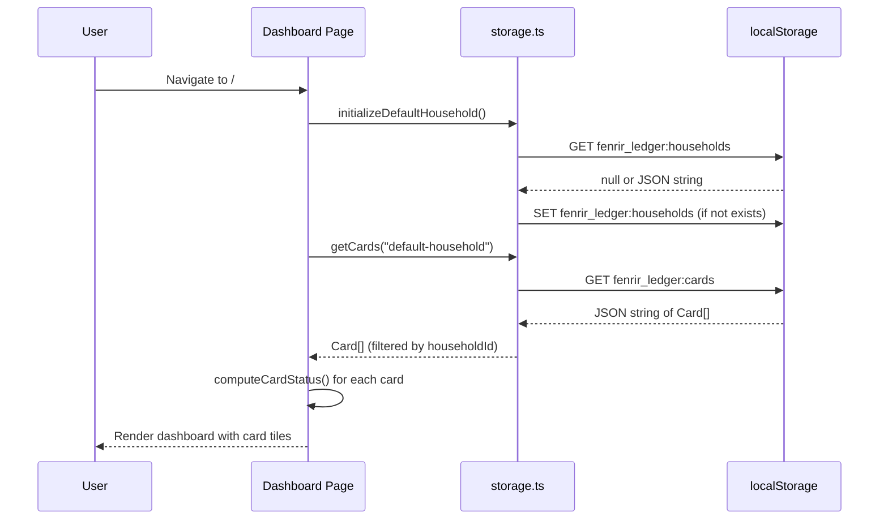
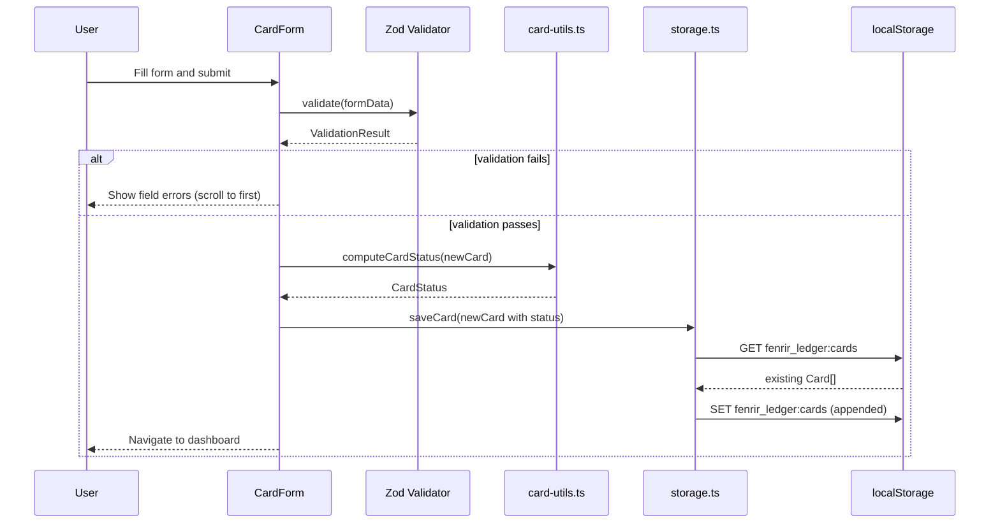
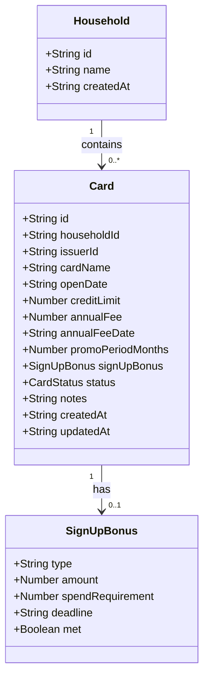
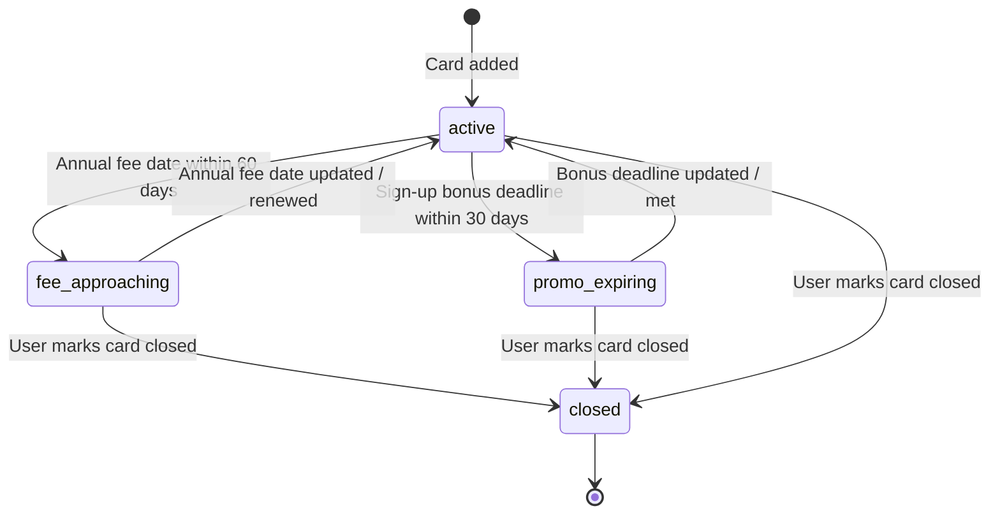

# System Design: Fenrir Ledger (Post-Stripe Direct — Current)

## Overview

Fenrir Ledger is a client-side Next.js 15 application deployed on Vercel at https://fenrir-ledger.vercel.app. All user data is persisted in localStorage behind a typed abstraction layer, namespaced per household. Authentication is anonymous-first (ADR-006): users can use the app immediately without signing in. Optional Google OIDC sign-in (Authorization Code + PKCE, ADR-005) enables cloud sync and Stripe subscription management. Subscription entitlements are managed via Stripe Direct (ADR-010) with webhook-driven updates stored in Vercel KV. SubscriptionGate is soft-only: it always renders children but prepends an upsell card for non-subscribers. The app includes a three-path import workflow (Google Sheets URL, CSV upload, manual entry), Framer Motion animations, and a deep Norse mythology easter egg layer. Patreon has been fully removed; Stripe is the sole subscription platform.

---

## Architecture

### Component Architecture

```mermaid
graph TD
    classDef primary fill:#03A9F4,stroke:#0288D1,color:#FFF
    classDef neutral fill:#F5F5F5,stroke:#E0E0E0,color:#212121
    classDef healthy fill:#4CAF50,stroke:#388E3C,color:#FFF
    classDef warning fill:#FF9800,stroke:#F57C00,color:#FFF
    classDef background fill:#2C2C2C,stroke:#444,color:#FFF

    %% Entry points
    browser([User Browser]) -->|HTTP GET /| dashpage[Dashboard Page\n/app/page.tsx]
    browser -->|HTTP GET /cards/new| newpage[Add Card Page\n/app/cards/new/page.tsx]
    browser -->|HTTP GET /cards/id/edit| editpage[Edit Card Page\n/app/cards/id/edit/page.tsx]
    browser -->|HTTP GET /valhalla| valpage[Valhalla Page\n/app/valhalla/page.tsx]
    browser -->|HTTP GET /sign-in| signinpage[Sign-In Page\n/app/sign-in/page.tsx]
    browser -->|HTTP GET /auth/callback| callbackpage[Auth Callback\n/app/auth/callback/page.tsx]
    browser -->|HTTP GET /settings| settingspage[Settings Page\n/app/settings/page.tsx]

    %% Auth + entitlement contexts
    authctx[AuthContext\nanonymous or authenticated] --> dashpage
    authctx --> newpage
    authctx --> editpage
    authctx --> valpage
    entctx[EntitlementContext\nStripe subscription state] --> dashpage
    entctx --> settingspage

    %% App shell
    dashpage --> appshell[AppShell\nlayout wrapper]
    appshell --> topbar[TopBar]
    appshell --> sidenav[SideNav]
    appshell --> footer[Footer]
    appshell --> upsell[UpsellBanner]
    appshell --> howlpanel[HowlPanel\nurgent cards sidebar]

    %% Dashboard page components
    dashpage --> dashboard[Dashboard Component]
    dashboard --> animgrid[AnimatedCardGrid]
    dashboard --> skeleton[CardSkeletonGrid]
    animgrid --> cardtile[CardTile Component]
    cardtile --> statusbadge[StatusBadge Component]
    cardtile --> statusring[StatusRing\nSVG deadline ring]
    dashboard --> emptyst[EmptyState Component]

    %% Form pages
    newpage --> cardform[CardForm Component]
    editpage --> cardform
    cardform --> gleipnir[Gleipnir Fragment\nComponents]

    %% Import flow
    dashpage --> importwiz[ImportWizard]
    importwiz --> shareurl[ShareUrlEntry]
    importwiz --> csvupload[CsvUpload]
    importwiz --> pickerstep[PickerStep\nGoogle Picker]
    importwiz --> dedupstep[ImportDedupStep]
    importwiz --> authgate[AuthGate]

    %% Entitlement / Stripe
    settingspage --> stripesettings[StripeSettings]
    settingspage --> subgate[SubscriptionGate\nsoft-only upsell]
    subgate --> sealedmodal[SealedRuneModal]
    subgate --> upsellent[UpsellBanner\nentitlement]
    stripesettings --> unlinkdlg[UnlinkConfirmDialog]

    %% Easter eggs
    appshell --> konami[KonamiHowl]
    appshell --> ragnarok[RagnarokContext\nthreshold overlay]
    footer --> lokimode[Loki Mode trigger]
    footer --> fishbreath[GleipnirFishBreath modal]
    appshell --> consolesig[ConsoleSignature\nclient-only, console art]
    appshell --> forgemaster[ForgeMasterEgg]

    %% Shared
    dashboard --> wolfhunger[WolfHungerMeter]

    %% Shared lib
    dashboard -->|reads| storage[storage.ts\nLocalStorage Abstraction]
    cardform -->|reads/writes| storage
    importwiz -->|writes| storage
    storage -->|JSON serialize/deserialize| ls[(localStorage\nbrowser storage)]

    %% Auth lib
    signinpage -->|PKCE flow| authlib[auth/pkce.ts\nauth/session.ts]
    callbackpage -->|token exchange| tokenapi[/api/auth/token\nserver proxy]
    authlib --> ls

    %% API routes
    importwiz -->|POST| sheetsapi[/api/sheets/import]
    importwiz -->|GET| pickerapi[/api/config/picker]
    stripesettings -->|POST| stripecheck[/api/stripe/checkout]
    stripesettings -->|GET| stripemember[/api/stripe/membership]
    stripesettings -->|POST| stripeportal[/api/stripe/portal]
    stripesettings -->|POST| stripeunlink[/api/stripe/unlink]
    browser -->|POST webhook| stripewebhook[/api/stripe/webhook]

    %% Utilities
    storage --> types[types.ts\nTypeScript Interfaces]
    cardform --> cardutils[card-utils.ts\ncomputeCardStatus]
    statusbadge --> realmutils[realm-utils.ts\ngetRealmLabel]
    dashboard --> milestoneutils[milestone-utils.ts]
    dashboard --> gleipnirutils[gleipnir-utils.ts]

    class dashpage primary
    class newpage primary
    class editpage primary
    class valpage primary
    class signinpage primary
    class callbackpage primary
    class settingspage primary
    class dashboard primary
    class cardform primary
    class appshell primary
    class topbar primary
    class sidenav primary
    class footer primary
    class importwiz primary
    class storage healthy
    class ls background
    class types neutral
    class cardutils neutral
    class realmutils neutral
    class milestoneutils neutral
    class gleipnirutils neutral
    class konami warning
    class lokimode warning
    class fishbreath warning
    class consolesig neutral
    class gleipnir neutral
    class ragnarok warning
    class forgemaster warning
    class authlib healthy
    class authctx healthy
    class entctx healthy
    class tokenapi healthy
    class sheetsapi healthy
    class pickerapi healthy
    class howlpanel primary
    class statusring neutral
    class animgrid primary
    class wolfhunger neutral
    class stripesettings primary
    class subgate primary
    class sealedmodal primary
    class upsellent primary
    class unlinkdlg primary
    class pickerstep primary
    class stripecheck healthy
    class stripemember healthy
    class stripeportal healthy
    class stripeunlink healthy
    class stripewebhook healthy
```

### Data Flow: Load Dashboard



### Data Flow: Add Card



---

## Data Model

### Entity Relationship



### Card Status State Machine



### localStorage Key Schema

| Key | Type | Description |
|-----|------|-------------|
| `fenrir_ledger:schema_version` | string (integer) | Schema version number |
| `fenrir_ledger:households` | JSON string (Household[]) | All households. Single default household initially. |
| `fenrir_ledger:cards` | JSON string (Card[]) | All cards across all households. |

---

## File Structure

```
development/frontend/
├── .env.example                     # Committed placeholder env template
├── .env.local                       # Local secrets (gitignored)
├── next.config.ts                   # Next.js configuration
├── tailwind.config.ts               # Tailwind configuration (Saga Ledger theme extensions)
├── components.json                  # shadcn/ui configuration
├── src/
│   ├── app/
│   │   ├── layout.tsx               # Root layout (fonts, global styles, metadata)
│   │   ├── page.tsx                 # Dashboard (/) — "use client"
│   │   ├── globals.css              # Saga Ledger theme: void-black bg, gold accents, Norse fonts
│   │   ├── sign-in/
│   │   │   └── page.tsx             # Sign-in page (opt-in upgrade, not a gate)
│   │   ├── auth/
│   │   │   └── callback/
│   │   │       └── page.tsx         # OAuth callback — PKCE code exchange
│   │   ├── valhalla/
│   │   │   ├── layout.tsx           # Valhalla layout
│   │   │   └── page.tsx             # Closed cards archive
│   │   ├── settings/
│   │   │   ├── layout.tsx           # Settings layout
│   │   │   └── page.tsx             # Subscription settings (Stripe management, unlink)
│   │   ├── cards/
│   │   │   ├── new/
│   │   │   │   └── page.tsx         # Add card page — "use client"
│   │   │   └── [id]/
│   │   │       └── edit/
│   │   │           └── page.tsx     # Edit card page — "use client"
│   │   └── api/
│   │       ├── auth/
│   │       │   └── token/
│   │       │       └── route.ts     # Server proxy — adds client_secret for Google token exchange
│   │       ├── config/
│   │       │   └── picker/
│   │       │       └── route.ts     # Auth-gated Google Picker API key endpoint
│   │       ├── sheets/
│   │       │   └── import/
│   │       │       └── route.ts     # Google Sheets import API (server-side)
│   │       └── stripe/
│   │           ├── checkout/
│   │           │   └── route.ts     # Stripe Checkout session creation
│   │           ├── membership/
│   │           │   └── route.ts     # Stripe membership/entitlement lookup
│   │           ├── portal/
│   │           │   └── route.ts     # Stripe Customer Portal session creation
│   │           ├── unlink/
│   │           │   └── route.ts     # Unlink Stripe subscription from account
│   │           └── webhook/
│   │               └── route.ts     # Stripe webhook handler (entitlement updates)
│   ├── contexts/
│   │   ├── AuthContext.tsx           # Auth state: "loading" | "authenticated" | "anonymous"
│   │   ├── EntitlementContext.tsx    # Stripe subscription entitlement state
│   │   └── RagnarokContext.tsx       # Ragnarok threshold provider (>= 5 urgent cards)
│   ├── hooks/
│   │   ├── useAuth.ts               # Auth hook exposing householdId, status, session
│   │   ├── useDriveToken.ts         # Manages Drive-scoped access token for Google Picker
│   │   ├── useEntitlement.ts        # Stripe entitlement hook (hasFeature, isLoading)
│   │   ├── usePickerConfig.ts       # Fetches Picker API key from server
│   │   └── useSheetImport.ts        # Google Sheets import state management
│   ├── components/
│   │   ├── ui/                      # shadcn/ui generated components
│   │   │   ├── button.tsx
│   │   │   ├── card.tsx
│   │   │   ├── input.tsx
│   │   │   ├── label.tsx
│   │   │   ├── select.tsx
│   │   │   ├── badge.tsx
│   │   │   ├── dialog.tsx
│   │   │   ├── checkbox.tsx
│   │   │   └── textarea.tsx
│   │   ├── layout/
│   │   │   ├── AppShell.tsx         # Root layout wrapper: TopBar + SideNav + main + Footer
│   │   │   ├── TopBar.tsx           # Top bar with auth state (anonymous rune / signed-in avatar)
│   │   │   ├── SiteHeader.tsx       # Desktop site header (logo, actions)
│   │   │   ├── SideNav.tsx          # Collapsible sidebar navigation
│   │   │   ├── Footer.tsx           # Footer with Loki easter egg + GleipnirFishBreath trigger
│   │   │   ├── HowlPanel.tsx        # Urgent cards sidebar (Framer Motion slide-in)
│   │   │   ├── UpsellBanner.tsx     # Dismissible cloud sync upsell for anonymous users
│   │   │   ├── SyncIndicator.tsx    # Sync status indicator (Gleipnir fragment 1 trigger)
│   │   │   ├── ConsoleSignature.tsx # Console ASCII art (client-only, runs once per session)
│   │   │   ├── KonamiHowl.tsx       # Konami code easter egg
│   │   │   ├── AboutModal.tsx       # About/credits modal (includes WolfHungerMeter)
│   │   │   ├── ForgeMasterEgg.tsx   # Forge Master easter egg component
│   │   │   └── ThemeToggle.tsx      # Theme toggle component
│   │   ├── dashboard/
│   │   │   ├── Dashboard.tsx        # "use client" — reads cards from storage
│   │   │   ├── AnimatedCardGrid.tsx # Framer Motion stagger animation grid
│   │   │   ├── CardSkeletonGrid.tsx # Gold palette shimmer loading state
│   │   │   ├── CardTile.tsx         # Card display tile with status badge + StatusRing
│   │   │   ├── StatusBadge.tsx      # Realm-mapped status badge (uses getRealmLabel)
│   │   │   ├── StatusRing.tsx       # SVG deadline progress ring
│   │   │   └── EmptyState.tsx       # Saga Ledger empty state with Gleipnir copy
│   │   ├── entitlement/
│   │   │   ├── index.ts             # Barrel export
│   │   │   ├── SubscriptionGate.tsx # Soft-only gate: always renders children, prepends upsell
│   │   │   ├── SealedRuneModal.tsx  # Norse-themed modal for locked features
│   │   │   ├── StripeSettings.tsx   # Stripe subscription management panel
│   │   │   ├── UpsellBanner.tsx     # Entitlement-aware upsell banner
│   │   │   └── UnlinkConfirmDialog.tsx # Confirm dialog for unlinking Stripe subscription
│   │   ├── shared/
│   │   │   ├── WolfHungerMeter.tsx  # Aggregate bonus summary meter
│   │   │   └── AuthGate.tsx         # Hides children for anonymous users
│   │   ├── cards/
│   │   │   ├── CardForm.tsx         # "use client" — shared add/edit form
│   │   │   ├── GleipnirFishBreath.tsx
│   │   │   ├── GleipnirBearSinews.tsx
│   │   │   ├── GleipnirBirdSpittle.tsx
│   │   │   ├── GleipnirCatFootfall.tsx
│   │   │   ├── GleipnirMountainRoots.tsx
│   │   │   └── GleipnirWomansBeard.tsx
│   │   ├── sheets/
│   │   │   ├── ImportWizard.tsx     # Three-path import wizard
│   │   │   ├── MethodSelection.tsx  # Import method picker
│   │   │   ├── ShareUrlEntry.tsx    # Google Sheets URL entry
│   │   │   ├── CsvUpload.tsx        # CSV file upload
│   │   │   ├── PickerStep.tsx       # Google Picker integration step
│   │   │   ├── ImportDedupStep.tsx  # Deduplication step
│   │   │   ├── StepIndicator.tsx    # Wizard step indicator
│   │   │   └── SafetyBanner.tsx     # Safety/privacy banner
│   │   └── easter-eggs/
│   │       ├── EasterEggModal.tsx   # Shared modal shell for Gleipnir fragments
│   │       └── LcarsOverlay.tsx     # Star Trek LCARS mode overlay
│   └── lib/
│       ├── types.ts                 # TypeScript interfaces: Household, Card, FenrirSession, etc.
│       ├── storage.ts               # localStorage abstraction layer (per-household namespaced)
│       ├── card-utils.ts            # Pure functions: computeCardStatus, etc.
│       ├── realm-utils.ts           # getRealmLabel() — Norse realm display helpers
│       ├── milestone-utils.ts       # Card count milestone toast thresholds
│       ├── gleipnir-utils.ts        # Fragment count + isGleipnirComplete()
│       ├── merge-anonymous.ts       # Anonymous to authenticated data migration
│       ├── constants.ts             # STORAGE_KEY_PREFIX, status threshold days, etc.
│       ├── utils.ts                 # General utility helpers (shadcn cn())
│       ├── logger.ts                # tslog wrapper with secret masking
│       ├── rate-limit.ts            # Rate limiting utility for API routes
│       ├── auth/
│       │   ├── pkce.ts              # PKCE utilities (verifier, challenge, state)
│       │   ├── session.ts           # localStorage session read/write
│       │   ├── household.ts         # Anonymous householdId generation
│       │   ├── require-auth.ts      # API route auth guard (requireAuth)
│       │   └── verify-id-token.ts   # Google ID token verification
│       ├── crypto/                  # Cryptographic utilities
│       ├── entitlement/
│       │   ├── index.ts             # Barrel export
│       │   ├── types.ts             # PremiumFeature, entitlement types
│       │   ├── feature-descriptions.ts # Feature name/description registry
│       │   └── cache.ts             # Entitlement cache (Vercel KV)
│       ├── google/
│       │   ├── picker.ts            # Google Picker API wrapper
│       │   ├── gis.ts               # GIS token client for Drive consent
│       │   └── sheets-api.ts        # Sheets API v4 client
│       ├── kv/                      # Vercel KV abstraction layer
│       ├── llm/
│       │   └── extract.ts           # LLM provider factory (Anthropic/OpenAI)
│       ├── sheets/
│       │   ├── import-pipeline.ts   # URL import pipeline
│       │   ├── csv-import-pipeline.ts # CSV import pipeline
│       │   └── extract-cards.ts     # Shared LLM extraction
│       └── stripe/
│           ├── api.ts               # Stripe API client
│           ├── types.ts             # Stripe-specific types
│           └── webhook.ts           # Stripe webhook event processing
```

---

## Component Responsibilities

### `src/lib/types.ts`
Defines all shared TypeScript interfaces including `Household`, `Card`, `SignUpBonus`, `CardStatus`, and `FenrirSession`. No logic — types only.

### `src/lib/constants.ts`
Defines all magic values: storage key prefixes, status threshold days (60 for fee approaching, 30 for promo expiring).

### `src/lib/storage.ts`
The localStorage abstraction. All reads/writes to `window.localStorage` go through here. Keys are namespaced per `householdId` (per-household keys, see ADR-004). Wraps operations in try/catch. Calls `migrateIfNeeded()` on module load.

### `src/lib/card-utils.ts`
Pure utility functions. `computeCardStatus(card, today)` is deterministic and takes an optional `today` parameter for testability.

### `src/lib/realm-utils.ts`
`getRealmLabel(status, daysRemaining)` maps `CardStatus` values to Norse realm vocabulary for display: Asgard-bound (active), Muspelheim (fee approaching), Hati approaches (promo expiring), In Valhalla (closed).

### `src/lib/milestone-utils.ts`
Card count milestone toast thresholds (1/5/9/13/20). Returns Norse-flavored toast messages for the sonner toast library.

### `src/lib/gleipnir-utils.ts`
Tracks Gleipnir fragment collection progress. `isGleipnirComplete()` checks all 6 fragments. Fragment keys stored in localStorage as `egg:gleipnir-{N}`.

### `src/lib/merge-anonymous.ts`
Handles merging anonymous localStorage data into an authenticated user's namespace when a user signs in after accumulating anonymous data.

### `src/lib/logger.ts`
tslog wrapper providing structured logging with automatic secret masking via `maskValuesOfKeys` and `maskValuesRegEx`. JSON output in production, pretty output in development.

### `src/lib/rate-limit.ts`
Rate limiting utility for API routes. Prevents abuse of server-side endpoints.

### `src/lib/auth/pkce.ts`
PKCE utilities for the Google OAuth flow: generates `code_verifier`, `code_challenge` (S256), and state parameter using Web Crypto API.

### `src/lib/auth/session.ts`
localStorage session read/write for `FenrirSession`. Stored at `fenrir:auth`.

### `src/lib/auth/household.ts`
`getOrCreateAnonHouseholdId()` — generates or retrieves a UUID for anonymous users from `fenrir:household` in localStorage.

### `src/lib/auth/require-auth.ts`
API route auth guard. Every API route handler (except `/api/auth/token`) must call `requireAuth(request)` and return early if `!auth.ok`.

### `src/lib/entitlement/`
Entitlement system for Stripe subscriptions. Defines `PremiumFeature` types, feature descriptions, and a Vercel KV cache layer at `entitlement:{googleSub}`.

### `src/lib/stripe/`
Stripe integration library. `api.ts` wraps Stripe SDK calls; `types.ts` defines Stripe-specific types; `webhook.ts` processes Stripe webhook events to update entitlement state in Vercel KV.

### `src/lib/google/`
Google API integration. `picker.ts` wraps the Google Picker API; `gis.ts` handles GIS token consent for Drive access; `sheets-api.ts` reads spreadsheet data via the Sheets v4 API.

### `src/contexts/AuthContext.tsx`
React context providing auth state: `"loading" | "authenticated" | "anonymous"`. Exposes `householdId` (from Google `sub` if signed in, or anonymous UUID). Does not redirect — anonymous users access all routes freely.

### `src/contexts/EntitlementContext.tsx`
React context providing Stripe subscription entitlement state. Exposes `hasFeature(feature)` and `isLoading`. Fetches entitlement from `/api/stripe/membership` for authenticated users.

### `src/contexts/RagnarokContext.tsx`
Ragnarok threshold provider. When >= 5 cards have urgent status, triggers the Ragnarok overlay effect and dramatic mode on HowlPanel.

### `src/components/layout/AppShell.tsx`
Root layout wrapper providing the persistent shell: TopBar (mobile), SiteHeader (desktop), SideNav (collapsible), HowlPanel, UpsellBanner, main content slot, Footer. Also mounts ConsoleSignature, KonamiHowl, and ForgeMasterEgg easter egg components.

### `src/components/layout/HowlPanel.tsx`
Urgent cards sidebar. Slides in via Framer Motion when urgent cards exist. Has a dramatic mode triggered by RagnarokContext.

### `src/components/layout/Footer.tsx`
Three-column footer. Contains the Loki Mode 7-click trigger and the GleipnirFishBreath "Breath of a Fish" easter egg hover trigger.

### `src/components/layout/UpsellBanner.tsx`
Dismissible cloud sync upsell banner for anonymous users. Rendered on the dashboard route only. Dismiss sets `fenrir:upsell_dismissed` in localStorage permanently.

### `src/components/layout/SyncIndicator.tsx`
Sync status indicator dot. Clicking triggers Gleipnir fragment 1 (Cat's Footfall).

### `src/components/layout/ConsoleSignature.tsx`
Client-only component that prints Elder Futhark ASCII art to the browser console once per session.

### `src/components/layout/KonamiHowl.tsx`
Listens for the Konami code sequence and triggers a full-screen howl animation.

### `src/components/layout/ThemeToggle.tsx`
Theme toggle component for switching between light and dark modes.

### `src/components/entitlement/SubscriptionGate.tsx`
Soft-only gate component. Always renders children but prepends an upsell card for non-subscribers. When the feature is locked, renders a Norse-themed info card with an "Unlock with Karl" link that opens the SealedRuneModal.

### `src/components/entitlement/SealedRuneModal.tsx`
Norse-themed modal shown when a user clicks to unlock a premium feature. Presents the feature description and a link to the Stripe Checkout flow.

### `src/components/entitlement/StripeSettings.tsx`
Stripe subscription management panel on the Settings page. Shows current subscription status, links to the Stripe Customer Portal, and provides an unlink option.

### `src/components/entitlement/UpsellBanner.tsx`
Entitlement-aware upsell banner component used within the entitlement system.

### `src/components/entitlement/UnlinkConfirmDialog.tsx`
Confirmation dialog for unlinking a Stripe subscription from the user's account.

### `src/app/page.tsx` (Dashboard)
Client component. On mount: reads `householdId` from `useAuth()`, loads all cards for the household, renders the `Dashboard` component.

### `src/app/settings/page.tsx`
Settings page. Renders Stripe subscription management via `StripeSettings` wrapped in `SubscriptionGate`.

### `src/components/dashboard/Dashboard.tsx`
Renders the animated card grid, summary counts, and empty state. Receives `cards: Card[]` as props. All data-fetching is in the parent page.

### `src/components/dashboard/AnimatedCardGrid.tsx`
Framer Motion `AnimatePresence` wrapper with stagger animation for card grid entries.

### `src/components/dashboard/CardSkeletonGrid.tsx`
Gold-palette shimmer loading state shown while cards are loading.

### `src/components/dashboard/CardTile.tsx`
Displays a single card with the Saga Ledger theme. Shows issuer, name, status badge, StatusRing, annual fee date, sign-up bonus deadline. Clicking navigates to `/cards/[id]/edit`.

### `src/components/dashboard/StatusBadge.tsx`
Renders a Norse realm-labelled badge for the card's status using `getRealmLabel()`. Color and label mapped to the Saga Ledger realm vocabulary.

### `src/components/dashboard/StatusRing.tsx`
SVG progress ring around card issuer initials. `strokeDashoffset` driven by `daysRemaining / totalDays`. Muspel-pulse animation when `daysRemaining <= 30`.

### `src/components/shared/WolfHungerMeter.tsx`
Aggregate bonus summary meter shown in AboutModal and ForgeMasterEgg. Visualises how many sign-up bonuses have been met.

### `src/components/shared/AuthGate.tsx`
Wrapper that hides its children for anonymous users. Used to gate import buttons behind authentication.

### `src/components/cards/CardForm.tsx`
Shared form for both add and edit flows. Accepts `initialValues?: Card` for edit mode. Uses `react-hook-form` + Zod. On submit: generates/preserves card ID, computes status, calls `saveCard()`, redirects to dashboard. Scroll-to-first-error on validation failure.

### `src/components/sheets/ImportWizard.tsx`
Three-path import wizard: Google Sheets URL, Google Picker, or CSV upload. Steps through method selection, data entry, deduplication, and confirmation.

### `src/components/sheets/PickerStep.tsx`
Google Picker integration step. Uses `usePickerConfig` and `useDriveToken` to open the Google Picker UI for selecting a spreadsheet.

### `src/components/easter-eggs/EasterEggModal.tsx`
Shared modal shell for all Gleipnir fragment reveals. Each fragment component wraps this with a unique SVG artifact image.

---

## UI Patterns and Component Conventions

### Button Alignment

All form and dialog action buttons follow a single global rule. This convention applies to every form, dialog, and confirmation panel in the application.

| Position | Button type | Examples |
|----------|-------------|---------|
| Far right | Primary / positive action | Save, Add, Continue, OK |
| Immediately left of primary | Cancel | Cancel |
| Far left (isolated) | Destructive action (only when co-present with primary) | Close Card, Delete |

**Desktop layout** (single row):

```
[ Destructive ]                    [ Cancel ] [ Primary ]
```

**Mobile layout** (stacked, primary on top):

```
[ Primary     ]
[ Cancel      ]
[ Destructive ]
```

Implementation guidance:
- Use `justify-between` on the button row container when a destructive action is present; `justify-end` otherwise.
- On mobile apply `flex-col md:flex-row` with `md:justify-end` (or `md:justify-between` when destructive is present).
- Touch targets must be at least 44 x 44 px (see team norms).
- See `ux/wireframes.md` for the full visual specification.

---

## Dependencies

### Runtime
| Package | Version | Purpose |
|---------|---------|---------|
| `next` | ^15.1.12 | Framework (upgraded for CVE-2025-66478 fix) |
| `react` | ^19.0.0 | UI |
| `react-dom` | ^19.0.0 | DOM renderer |
| `react-hook-form` | ^7.54.2 | Form state management |
| `zod` | ^3.24.1 | Schema validation |
| `@hookform/resolvers` | ^3.9.1 | Bridge between react-hook-form and Zod |
| `framer-motion` | ^12.34.3 | Card animations, Howl panel slide, AnimatePresence |
| `sonner` | ^2.0.7 | Toast notifications (milestone toasts) |
| `lucide-react` | ^0.469.0 | Icon set |
| `class-variance-authority` | ^0.7.1 | Component variant management |
| `clsx` | ^2.1.1 | Conditional class names |
| `tailwind-merge` | ^2.6.0 | Tailwind class deduplication |
| `tailwindcss-animate` | ^1.0.7 | Animation utilities |
| `stripe` | — | Stripe SDK for server-side API calls |
| `jose` | — | JWT/JWKS verification for Google id_token |
| `tslog` | — | Structured logging with secret masking |

### Dev
| Package | Version | Purpose |
|---------|---------|---------|
| `typescript` | ^5.x | Type checking |
| `tailwindcss` | ^3.4.1 | Styling |
| `eslint` | ^8.x | Linting |
| `@types/react` | ^19 | React type definitions |
| `@types/node` | ^20 | Node.js type definitions |
| `playwright` | — | E2E testing |

### shadcn/ui (copy-owned, not a package dependency)
Components installed via `npx shadcn@latest add`: `button`, `card`, `input`, `label`, `select`, `badge`, `dialog`, `textarea`, `checkbox`

### Fonts (via `next/font/google`, no extra dependencies)
Cinzel Decorative (display), Cinzel (headings), Source Serif 4 (body), JetBrains Mono (data)

---

## Technical Constraints and Decisions

| Constraint | Detail |
|-----------|--------|
| All components using hooks or browser APIs | Must have `"use client"` at top |
| No direct `window.localStorage` access | Must go through `src/lib/storage.ts` |
| Schema changes | Must bump `SCHEMA_VERSION` in `storage.ts` and add migration |
| All money amounts | Stored as integer cents (not floats) to avoid floating-point errors |
| All dates | Stored as ISO 8601 strings (YYYY-MM-DD for dates, full ISO for timestamps) |
| Card IDs | Generated with `crypto.randomUUID()` |
| Household ID | Anonymous UUID via `getOrCreateAnonHouseholdId()`; Google `sub` claim when signed in |
| Vercel Root Directory | Set to `development/frontend/` |
| Font loading | `next/font/google` with `display: 'swap'` on all four Norse typefaces |
| API route auth | Every API route (except `/api/auth/token`) must call `requireAuth(request)` |
| Subscription platform | Stripe Direct only (Patreon fully removed) |
| SubscriptionGate mode | Soft-only: always renders children, prepends upsell for non-subscribers |

---

## Architecture Evolution Notes

### Auth progression (ADR-004 to ADR-005 to ADR-006)
- ADR-004 proposed Auth.js v5 with server-side sessions — superseded.
- ADR-005 replaced with Authorization Code + PKCE, server token proxy — accepted.
- ADR-006 removed the auth gate, made the app anonymous-first — accepted (current).

### Backend removal (Sprint 5 to serverless)
- Sprint 5 initially introduced a dedicated backend server. This was removed in PR #60 in favour of fully serverless Vercel API routes. The import workflow now uses `/api/sheets/import` as a Next.js API route.

### Subscription platform (Patreon to Stripe Direct)
- Patreon was the original subscription platform. Feature flags (adr-feature-flags) enabled the Stripe pivot. Patreon has been fully removed; all Patreon API routes, components, and library code are deleted. Stripe Direct (ADR-010) is the sole subscription platform. SubscriptionGate operates in soft-only mode — it never blocks content, only prepends upsell for non-subscribers.

### Deployment
- Vercel production: https://fenrir-ledger.vercel.app
- Vercel Root Directory: `development/frontend/`
- No separate backend server — fully serverless on Vercel.
- Vercel KV stores entitlement state (Stripe webhook updates).
