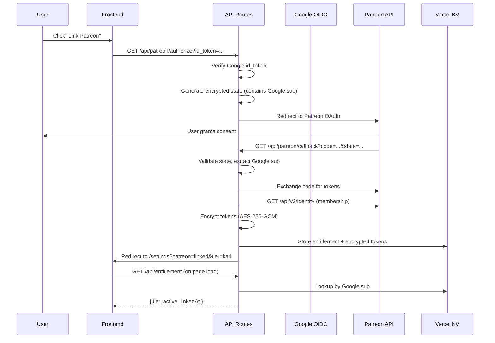
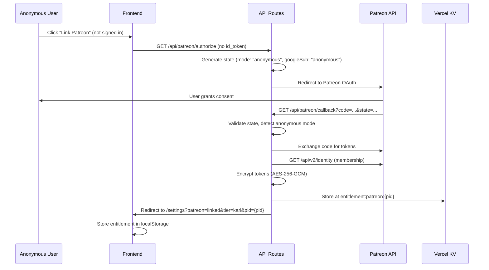

# ADR-009 — Patreon-Based Entitlement System with Vercel KV Storage

**Status:** Accepted
**Date:** 2026-03-03
**Author:** FiremanDecko (Principal Engineer)
**Related:** ADR-008 (API route auth), ADR-005 (Google OIDC / PKCE)

---

## Context

Fenrir Ledger needs a subscription/entitlement layer to gate premium features. The application already uses Google OIDC for identity (ADR-005, ADR-008). We need a payment/membership platform to determine what tier of access each user has.

Key requirements:
- Separate identity from entitlement (different concerns, different providers)
- Support a free tier and at least one paid tier
- Real-time membership updates (not just at login)
- Server-side token storage (tokens never touch the browser)
- Platform-agnostic frontend hook (swap providers without UI changes)

## Options Considered

### 1. Stripe Subscriptions
**Pros:** Industry standard, rich API, webhooks, customer portal.
**Cons:** Requires custom subscription management UI. No built-in community/creator relationship. Higher integration complexity for a small project.

### 2. Patreon OAuth + Membership API
**Pros:** Built-in creator page, community features, existing creator-subscriber model. OAuth gives us membership data directly. Webhook support for real-time updates.
**Cons:** HMAC-MD5 webhook signatures (weaker than SHA-256). Tied to Patreon platform.

### 3. Custom entitlement with manual payments
**Pros:** Full control.
**Cons:** Massive build effort, payment compliance burden, no community features.

## Decision

**Use Patreon as the entitlement provider, with a two-token architecture.**

- **Google OIDC** provides identity (`sub` claim = user ID)
- **Patreon OAuth** provides entitlement (membership tier, active status)
- Tokens are linked server-side via Google `sub` as the key in Vercel KV

### Two-Tier Model

| Tier | Norse Name | Price | Access |
|------|-----------|-------|--------|
| Free | Thrall | $0 | Core card tracking, basic import |
| Paid | Karl | $5/month | Premium features (LLM import, advanced analytics) |

### Architecture Overview



### Dual-Environment OAuth Client Strategy

Two separate Patreon OAuth clients are used:

| Environment | Redirect URI | Patreon Client |
|-------------|-------------|----------------|
| Local dev / Preview | `http://localhost:9653/api/patreon/callback` | Dev client |
| Production | `https://fenrir-ledger.vercel.app/api/patreon/callback` | Prod client |

Environment variables (`PATREON_CLIENT_ID`, `PATREON_CLIENT_SECRET`) are set per Vercel environment (Preview vs Production).

Production uses `APP_BASE_URL` env var for deterministic redirect URIs (SEV-002 fix). Preview/local uses header-based fallback since URLs vary.

### Server-Side Token Storage

Patreon access and refresh tokens are encrypted with AES-256-GCM before storage in Vercel KV:

- **Key**: `entitlement:{google_sub}`
- **Value**: `StoredEntitlement` object with encrypted tokens, tier, timestamps
- **Encryption key**: `ENTITLEMENT_ENCRYPTION_KEY` env var (32 bytes / 64 hex chars)
- **Algorithm**: AES-256-GCM with random 12-byte IV per encryption

Tokens never leave the server. The frontend only receives `{ tier, active, linkedAt }`.

### Webhook-Driven Real-Time Updates

Patreon webhooks notify us of membership changes in real-time:

- **Endpoint**: `POST /api/patreon/webhook`
- **Events**: `members:pledge:create`, `members:pledge:update`, `members:pledge:delete`
- **Signature**: HMAC-MD5 (Patreon standard — see Accepted Risks below)
- **Action**: Update the stored entitlement in KV for the affected user

### Platform-Agnostic Frontend Hook

```typescript
// useEntitlement() — works regardless of backend provider
const { tier, isLinked, isLoading } = useEntitlement();

// Feature gating
if (tier === "karl") { /* show premium feature */ }
```

The hook fetches from `/api/entitlement` which reads from KV. If the provider changes (e.g., Stripe), only the API routes and KV storage change — the hook interface stays the same.

### Encryption Key Rotation

Rotating `ENTITLEMENT_ENCRYPTION_KEY` invalidates all stored encrypted tokens. Users must re-link their Patreon accounts after rotation. This is acceptable given:
- Rotation should be rare (only on suspected compromise)
- Re-linking is a simple OAuth flow
- No data loss — only token re-encryption is needed

## Accepted Risks

### SEV-001: HMAC-MD5 Webhook Signatures
Patreon uses HMAC-MD5 for webhook signatures. MD5 has known collision weaknesses, but HMAC-MD5 remains secure against forgery attacks (the HMAC construction prevents collision-based exploits). This is Patreon's standard and cannot be changed on our side. Mitigated by:
- Webhook endpoint validates signature on every request
- Rate limiting on the webhook endpoint
- Webhook only updates existing KV entries (cannot create arbitrary data)

### SEV-002: Header-Based Redirect URI Construction (Mitigated)
Originally, OAuth redirect URIs were built from `x-forwarded-proto` and `host` headers, which could be spoofed. **Mitigated** by introducing `APP_BASE_URL` env var for production, falling back to headers only for preview/local where URLs genuinely vary.

## Consequences

### Positive
- Clean separation of identity (Google) and entitlement (Patreon)
- No credit card processing — Patreon handles all payments
- Built-in creator community and subscriber management
- Real-time membership updates via webhooks
- Platform-agnostic frontend — provider can be swapped later
- Tokens encrypted at rest in KV

### Negative
- Dependency on Patreon platform availability
- HMAC-MD5 webhook signatures (accepted risk, cannot change)
- Key rotation requires all users to re-link
- Two OAuth clients to manage (dev + prod)

---

## Amendment: Anonymous Patreon Flow (2026-03-04)

**Author:** FiremanDecko (Principal Engineer)

### Context

The original design required Google sign-in before starting the Patreon OAuth flow. This created unnecessary friction for the monetization pathway: users had to authenticate with two separate providers (Google for identity, then Patreon for subscription) just to become a paying subscriber.

### Changes

#### Dual-Path Entitlement

The entitlement system now supports two identity anchors:

| User State | KV Primary Key | KV Reverse Index Value |
|---|---|---|
| Authenticated | `entitlement:{googleSub}` | `{googleSub}` |
| Anonymous | `entitlement:patreon:{patreonUserId}` | `patreon:{patreonUserId}` |

The reverse index key (`patreon-user:{patreonUserId}`) is unchanged. Its **value** format now distinguishes between the two states: if it starts with `patreon:`, the user is anonymous; otherwise, it is a Google sub.

#### State Token Extension

`PatreonOAuthState` gains a `mode` field:
```typescript
interface PatreonOAuthState {
  googleSub: string;     // Google sub OR "anonymous"
  nonce: string;
  createdAt: number;
  mode: "authenticated" | "anonymous";
}
```

Backwards compatible: tokens without `mode` are treated as `"authenticated"`.

#### Anonymous OAuth Flow



#### Migration on Google Sign-In

When an anonymous Karl user later signs in with Google:

1. Client detects `fenrir:patreon-user-id` in localStorage
2. Client calls `POST /api/patreon/migrate` with `{ patreonUserId }` (behind requireAuth)
3. Server copies entitlement from `entitlement:patreon:{pid}` to `entitlement:{googleSub}`
4. Server updates reverse index to point to `{googleSub}` instead of `patreon:{pid}`
5. Server deletes the anonymous KV entry
6. Client clears `fenrir:patreon-user-id` and refreshes entitlement from server

Migration is idempotent: if the Google-keyed entry already exists, it succeeds without modification.

#### Route Auth Exceptions

`/api/patreon/authorize` is now exempt from `requireAuth` for anonymous users:
- Authenticated requests (with `id_token`) still verify the token
- Anonymous requests (without `id_token`) proceed with `mode: "anonymous"`
- CSRF protection is provided by the encrypted state parameter
- Rate limiting (5/min/IP) applies to both paths

This follows the same exemption pattern as `/api/auth/token` and `/api/patreon/callback`.

#### Webhook Dual-Key Handling

Webhook handler now checks the reverse index value format to determine the correct entitlement key:
- Value starts with `patreon:` -> anonymous user -> update `entitlement:patreon:{pid}`
- Otherwise -> authenticated user -> update `entitlement:{googleSub}` (existing behavior)

### Accepted Risks

#### SEV-003: localStorage-Only Entitlement for Anonymous Users
Anonymous users' entitlement is device-bound via localStorage. They cannot verify their tier from another device without signing in with Google. This is an acceptable trade-off:
- Reduces friction for the primary monetization pathway
- Server-side entitlement still exists in KV (webhooks update it)
- Signing in with Google at any point migrates the entitlement
- A persistent nudge banner encourages migration

#### SEV-004: Authorize Route Without Auth (Anonymous Mode)
`/api/patreon/authorize` no longer requires Google auth for anonymous users. Mitigated by:
- Encrypted state parameter provides CSRF protection
- Rate limiting (5/min/IP) prevents abuse
- The route only redirects to Patreon — no data is exposed
- Patreon itself handles user authentication during the OAuth flow
