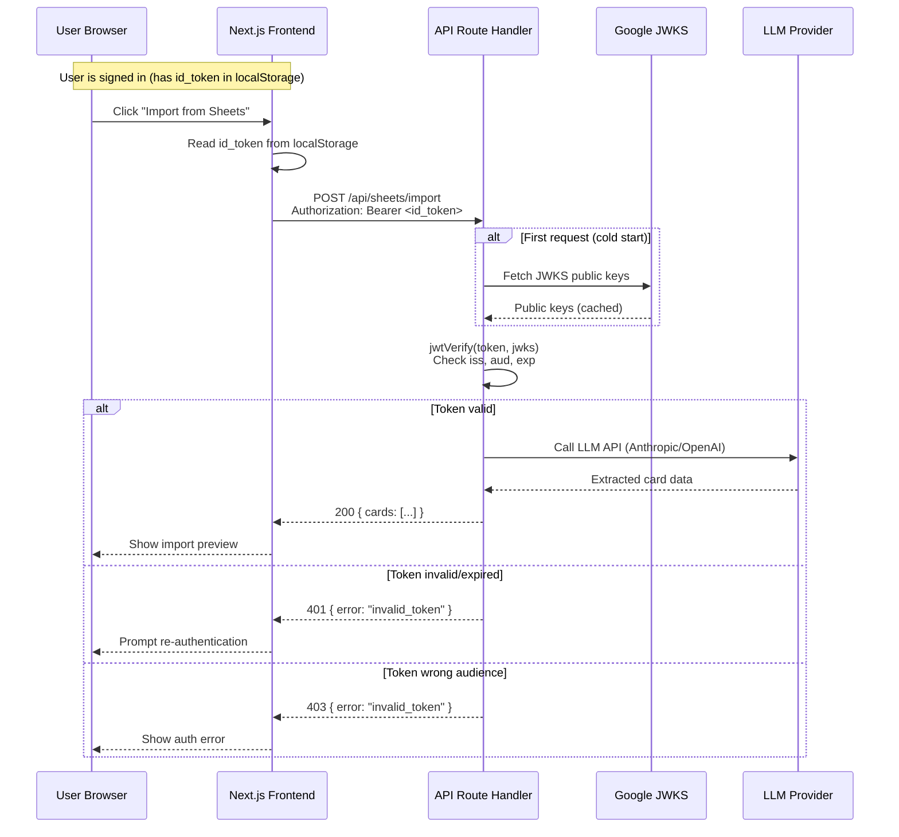

# ADR-008 -- Server-Side API Route Authentication via Google id_token Verification

**Status:** Accepted
**Date:** 2026-03-01
**Author:** FiremanDecko (Principal Engineer)
**Related:** ADR-005 (auth/PKCE), ADR-006 (anonymous-first), ADR-007 (Clerk deferred)

---

## Context

Fenrir Ledger's Vercel-hosted API routes are currently unprotected. The Next.js middleware at `src/middleware.ts` is a no-op pass-through. Any network client can call `POST /api/sheets/import` and consume LLM API credits (Anthropic or OpenAI) without authentication.

The client already possesses a Google `id_token` as part of the `FenrirSession` (see `src/lib/types.ts`). This token is a signed JWT issued by Google during the PKCE OAuth flow (ADR-005). It contains:

- **`aud`** (audience) -- the Google Client ID this token was issued for
- **`exp`** (expiry) -- when the token expires
- **`sub`** (subject) -- the user's immutable Google account ID
- **`iss`** (issuer) -- `https://accounts.google.com`

The question is: what is the most appropriate mechanism to verify the caller's identity on the server before processing API requests?

### Constraints

- The anonymous-first model (ADR-006) must be preserved. Pages remain accessible without auth. Only API routes that consume server resources (LLM credits, external API calls) need protection.
- ADR-007 proposes Clerk for GA, but Clerk is not yet integrated. We need protection now with the existing Google OIDC tokens.
- The `/api/auth/token` route must remain unprotected -- it is the OAuth token exchange endpoint. The client does not have a token when calling it.

---

## Options Considered

### Option A -- `access_token` + Google tokeninfo round-trip

**Description:** Send the Google `access_token` in the Authorization header. The server calls Google's `https://oauth2.googleapis.com/tokeninfo?access_token=<token>` endpoint on every request to verify it.

**Pros:**
- Simple to implement -- single HTTP call to Google
- Google validates everything (signature, expiry, revocation)

**Cons:**
- Adds a network round-trip (~100-300ms) to Google on every API request
- `access_token` is opaque -- cannot be verified locally
- Creates a hard dependency on Google's tokeninfo endpoint availability
- Latency compounds on import requests that already take 5-30s

**Verdict:** Rejected. Per-request network calls to Google are unacceptable latency overhead.

---

### Option B -- `id_token` + local JWKS verification (chosen)

**Description:** Send the Google `id_token` in the Authorization header as a Bearer token. The server verifies the JWT signature locally against Google's JWKS (JSON Web Key Set) public keys, checks the `aud` claim matches `GOOGLE_CLIENT_ID`, and checks `exp` for expiry.

**Pros:**
- No per-request network call after initial JWKS fetch (keys are cached)
- `id_token` is a standard JWT -- verifiable with any JOSE library
- `aud` claim prevents tokens from other Google apps from being accepted
- `exp` check prevents replay of expired tokens
- Google's JWKS keys rotate roughly every 6 hours; the `jose` library handles rotation transparently
- The `jose` library is ~15KB with zero native dependencies, Edge Runtime compatible

**Cons:**
- Cannot detect token revocation in real-time (Google's revocation is not reflected in the JWT itself). Acceptable trade-off: tokens are short-lived (~1 hour).
- Requires the `jose` dependency

**Verdict:** Recommended. Local verification is fast, reliable, and sufficient for our use case.

---

### Option C -- Clerk middleware (deferred)

**Description:** Wait for the Clerk integration (ADR-007) and use `clerkMiddleware()` + `auth.protect()` to protect API routes.

**Pros:**
- Single auth platform for pages and API routes
- Testing Tokens API for E2E (from ADR-007)

**Cons:**
- Clerk is not yet integrated -- the API routes are unprotected until GA planning
- Leaves a security gap in the interim
- Blocks on a larger integration effort

**Verdict:** Rejected for now. When Clerk is integrated, the `requireAuth()` guard can be replaced with Clerk's `auth()` helper. The per-route guard pattern is preserved.

---

### Option D -- Custom session token (HMAC-signed)

**Description:** Issue a custom HMAC-signed token from the server after the OAuth flow completes. Store it in an httpOnly cookie. Verify the HMAC on each API request.

**Pros:**
- Full control over token format and lifetime
- httpOnly cookie prevents XSS token theft

**Cons:**
- Adds server-side token issuance complexity
- We already have a signed JWT from Google -- issuing another token is redundant
- Cookie-based auth introduces CSRF concerns
- Conflicts with the anonymous-first model (no cookies today)

**Verdict:** Rejected. Unnecessary complexity when a signed JWT already exists.

---

## Decision

**Use Option B: Verify the Google `id_token` locally against Google's JWKS using the `jose` library.**

### Implementation

A per-route auth guard pattern (not middleware) is used:

1. **`src/lib/auth/verify-id-token.ts`** -- Server-side utility that calls `jwtVerify()` from `jose` with Google's JWKS, checking issuer, audience, and expiry.

2. **`src/lib/auth/require-auth.ts`** -- Extracts the Bearer token from the `Authorization` header, calls `verifyIdToken()`, and returns either `{ ok: true, user }` or `{ ok: false, response }` (a pre-built NextResponse with the appropriate 401/403 status).

3. **Each protected route** calls `requireAuth(request)` at the top of its handler:
   ```typescript
   const auth = await requireAuth(request);
   if (!auth.ok) return auth.response;
   ```

4. **The client** sends `Authorization: Bearer <id_token>` on all API calls that require auth. The `useSheetImport` hook reads the id_token from the session in localStorage.

### Why per-route guards instead of middleware

- `/api/auth/token` must remain unprotected
- Per-route guards are explicit and auditable in each handler
- Route-specific error response formats are preserved
- Avoids Edge Runtime constraints in Next.js middleware

### Protected routes

| Route | Protected | Reason |
|-------|-----------|--------|
| `POST /api/sheets/import` | Yes | Consumes LLM API credits |
| `POST /api/auth/token` | No | Token exchange endpoint -- no token exists yet |

All future API routes must use `requireAuth()` (see CLAUDE.md unbreakable rule).

---

## Consequences

### Positive

- **API routes are protected.** Unauthenticated callers receive 401/403 and cannot consume LLM credits.
- **No per-request latency.** JWKS keys are cached; verification is a local cryptographic operation (~1ms).
- **Minimal dependency.** `jose` is ~15KB with zero native deps. No bloat.
- **Forward-compatible.** When Clerk is integrated (ADR-007), `requireAuth()` can be replaced with Clerk's `auth()` without changing the per-route guard pattern.
- **Anonymous-first preserved.** Pages remain accessible. Only API routes that consume server resources are gated.

### Negative / Trade-offs

- **Cannot detect real-time revocation.** If a user revokes their Google consent, the `id_token` remains valid until `exp` (typically 1 hour). Acceptable for our use case.
- **Anonymous users cannot use import.** The Google Sheets import feature now requires sign-in. This is an intentional consequence -- import consumes LLM credits and should be gated.
- **New dependency.** `jose` is added to `package.json`. It is well-maintained (by the author of `node-jose` and OAuth libraries), has no native deps, and is used by Auth.js, Clerk, and other major auth frameworks.

### Non-Consequences (Constraints Preserved)

- `FenrirSession` type is unchanged.
- `AuthContext` is unchanged -- it already exposes `session.id_token`.
- localStorage remains the data store.
- The anonymous-first model (ADR-006) is preserved for all page routes.
- `.env.example` needs no new variables -- verification uses the existing `NEXT_PUBLIC_GOOGLE_CLIENT_ID`.

---

## Architecture Diagram



---

## Files Changed

| File | Action | Description |
|------|--------|-------------|
| `src/lib/auth/verify-id-token.ts` | Created | Google id_token JWT verification using jose + JWKS |
| `src/lib/auth/require-auth.ts` | Created | Reusable per-route auth guard |
| `src/app/api/sheets/import/route.ts` | Modified | Added `requireAuth()` at top of POST handler |
| `src/hooks/useSheetImport.ts` | Modified | Sends `Authorization: Bearer <id_token>` header |
| `src/middleware.ts` | Modified | Updated comments referencing ADR-008 |
| `package.json` | Modified | Added `jose` dependency |
| `CLAUDE.md` | Modified | Added unbreakable rule for API route auth |

---

## References

- [jose library](https://github.com/panva/jose) -- JOSE/JWT implementation for Node.js, browsers, Edge Runtime
- [Google OIDC discovery](https://accounts.google.com/.well-known/openid-configuration) -- JWKS URI and issuer
- [ADR-005](../../architecture/adrs/ADR-005-auth-pkce-public-client.md) -- PKCE auth implementation
- [ADR-006](../../architecture/adrs/ADR-006-anonymous-first-auth.md) -- Anonymous-first auth model
- [ADR-007](adr-clerk-auth.md) -- Clerk integration (deferred to GA)
