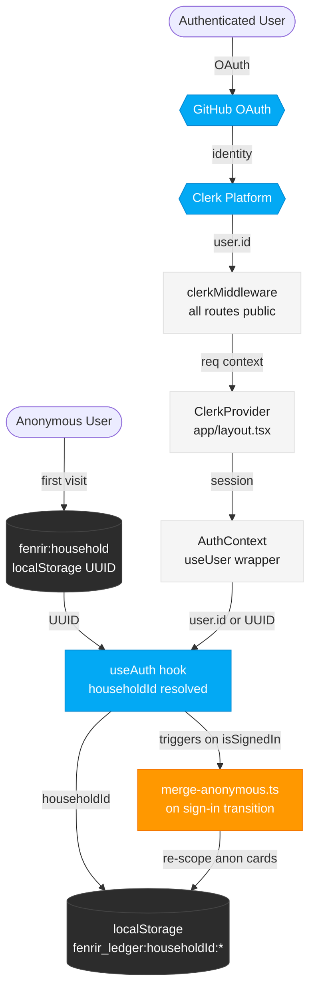

# ADR-007 — Clerk as Auth Platform with GitHub as Initial Identity Provider

**Status:** Proposed
**Date:** 2026-03-01
**Authors:** FiremanDecko (Principal Engineer)
**Supersedes:** None (extends ADR-005, ADR-006)
**Implements:** `designs/product/backlog/idp-testing-alternative.md`

---

## Context

Fenrir Ledger uses an anonymous-first model (ADR-006): users work forever without a sign-in. Auth is an upsell, not a gate. When GA ships, auth unlocks cloud sync and multi-device access.

The original product brief specified Google OIDC. A separate backlog spike (`idp-testing-alternative.md`) evaluated alternatives and recommended **Clerk** for the following reasons:

1. **Testing is hard with raw Google OAuth.** Google's consent screen, real-account requirements, and rate limits make CI/E2E testing painful. Clerk has a built-in Testing Tokens API that lets Playwright bypass the entire OAuth flow without real credentials.

2. **Multi-provider roadmap is free.** Clerk decouples the auth platform from provider selection. Adding Google, Apple, or magic link later is a Clerk Dashboard toggle — no code changes required. GitHub ships first because every team member has an account.

3. **`@clerk/nextjs` is first-class for App Router.** Clerk's SDK provides `clerkMiddleware()`, `ClerkProvider`, `useUser()`, `useAuth()`, server-side `auth()`, and drop-in `<SignIn />` components — all with TypeScript types and RSC/SSR awareness.

4. **10,000 MAU free** is more than sufficient through Early Access validation.

The current state of the codebase (post Sprint 5):
- Authentication is fully anonymous: a UUID `householdId` is generated in localStorage on first use.
- `AuthContext` manages auth state; `useAuth()` exposes `householdId` to all pages.
- `merge-anonymous.ts` silently re-scopes anonymous cards to a signed-in household.
- `middleware.ts` is a no-op pass-through (no server-side session to inspect).
- `FenrirSession` in `types.ts` is shaped for Google access/id/refresh tokens — this becomes dead code when Clerk takes over session management.

---

## Decision

**Use Clerk as the auth platform. Enable GitHub as the initial identity provider.**

This ADR documents the integration design, not the implementation schedule. Implementation is deferred until GA planning is triggered (per product brief constraints). This ADR is written now so the team has a clear technical path when that sprint is declared.

### What Clerk owns

| Concern | Before Clerk | After Clerk |
|---------|-------------|-------------|
| Session storage | `fenrir:auth` in localStorage | Clerk cookie/session (server-managed) |
| Provider OAuth app | DIY (Google OAuth client) | Clerk Dashboard toggle |
| User identity | `session.user.sub` (Google) | `userId` from `useAuth()` or `auth()` |
| Sign-in UI | Custom `/sign-in/page.tsx` | `<SignIn />` component or Clerk Account Portal |
| Middleware | No-op pass-through | `clerkMiddleware()` — public by default |
| E2E testing auth | Manual token management | `@clerk/testing` + Playwright fixtures |

### What does NOT change

- `Card`, `Household`, `CardStatus`, `SignUpBonus` types — **unchanged**.
- `storage.ts` functions — **unchanged**. They accept `householdId: string` and are agnostic about its source.
- Anonymous-first model — **unchanged**. Anonymous users continue to use a UUID from `fenrir:household` in localStorage forever.
- `merge-anonymous.ts` — the merge logic is **unchanged**. Only the trigger point changes: merge is called when Clerk's `useUser()` transitions from `isSignedIn === false` to `true`, passing `user.id` as `clerkUserId`.
- The `householdId` contract — Clerk's `user.id` (`user_2abc...`) becomes the `householdId` for signed-in users. The data model remains stable.

### Middleware strategy

`clerkMiddleware()` replaces the current no-op middleware. All routes remain public by default — there are no protected routes. The middleware exists only so Clerk can attach session information to the request context for server components.

```typescript
// development/src/src/middleware.ts (after Clerk integration)
import { clerkMiddleware } from "@clerk/nextjs/server";

export default clerkMiddleware();

export const config = {
  matcher: [
    "/((?!_next/static|_next/image|favicon.ico|icon.svg|.*\\.(?:svg|png|jpg|jpeg|gif|webp)$).*)",
    "/(api|trpc)(.*)",
  ],
};
```

No `auth.protect()` calls. No protected route matchers. All routes are public. This is intentional — auth is an upsell.

### householdId resolution order (unchanged contract)

```
1. Clerk user signed in  → user.id from useAuth() / auth()
2. Anonymous            → UUID from localStorage("fenrir:household")
```

The `AuthContext` that currently reads `fenrir:auth` from localStorage is replaced by a thin wrapper around Clerk's `useUser()` and `useAuth()` hooks. The `householdId` value flowing to all pages is unchanged in type and semantics.

### FenrirSession type

`FenrirSession` (currently in `types.ts`) is removed. Clerk manages session state internally. The `fenrir:auth` localStorage key is no longer written. Existing keys in browsers will be ignored.

### Sign-in surface

The current `/sign-in/page.tsx` (anonymous upsell opt-in) is retained as a shell. The Google sign-in button is replaced with Clerk's `<SignInButton />` (or a full `<SignIn />` component embedded). "Continue without signing in" CTA is preserved — Clerk does not own this UX.

### Provider rollout

| Phase | Provider | How |
|-------|----------|-----|
| GA Phase 1 | GitHub | Clerk Dashboard — SSO connections → GitHub |
| GA Phase 2+ | Google, Apple, email magic link | Clerk Dashboard toggle — zero code changes |

---

## Options Considered

### Option A — Auth.js v5 (NextAuth) with GitHub provider
**Pros:** Open source, no vendor lock-in, existing Auth.js session in codebase (Sprint 3.1 ADR-004 work).
**Cons:** No built-in Testing Tokens for E2E. Each provider needs separate OAuth app. DIY test user management. Sprint 3.1 already pivoted away from Auth.js once (to the PKCE model). Maintaining OAuth app credentials per-provider in CI adds ops burden.

### Option B — Supabase Auth
**Pros:** Bundled with Supabase DB (future GA storage option).
**Cons:** Product brief explicitly defers Supabase until GA DB decision. Coupling auth to storage prematurely violates the constraint that storage decisions happen after product-market fit validation.

### Option C — Clerk (chosen)
**Pros:** First-class Next.js App Router SDK, Testing Tokens API for Playwright, dashboard-driven provider rollout, SOC 2, 10k MAU free.
**Cons:** Vendor dependency. If Clerk pricing becomes untenable at scale (>10k MAU), migration to Auth.js is the fallback path — the `householdId` contract and `storage.ts` are unchanged, so only the session source swaps.

---

## Consequences

### Positive
- **Playwright testing becomes trivial.** `@clerk/testing` + `clerkSetup()` + `setupClerkTestingToken()` removes all CI OAuth complexity.
- **Provider expansion is free.** Adding Google/Apple/magic link when the user base grows requires zero code changes.
- **Server-side auth available.** When GA ships remote storage, `auth()` in Server Components/Route Handlers gives us `userId` without client round-trips.
- **No data model changes.** `householdId` contract is preserved end to end.
- **Existing anonymous-first UX is preserved.** Anonymous users are unaffected.

### Negative / Trade-offs
- **Vendor dependency.** Clerk is a paid service. The fallback is Auth.js (documented in Option A above).
- **`FenrirSession` type removed.** This is dead code post-Clerk, but its removal is a small breaking change in types.
- **Clerk `user.id` format differs from Google `sub`.** Clerk user IDs are prefixed strings (`user_2abc...`), not bare UUIDs or Google sub claims. Any existing signed-in user data (no production users yet — Early Access only) would need a migration step. Since we have no production users with cloud data, this is a non-issue at integration time.
- **New environment variables.** `NEXT_PUBLIC_CLERK_PUBLISHABLE_KEY`, `CLERK_SECRET_KEY` must be added to Vercel and `.env.example`. The `.env` file is never committed.

### Migration path from current state

1. `FenrirSession` type and `fenrir:auth` localStorage writes are removed.
2. `AuthContext` is refactored to use `useUser()` from `@clerk/nextjs`.
3. `useAuth()` hook (Fenrir's custom hook) is updated to source `householdId` from Clerk's `user.id` when signed in, falling back to `getOrCreateAnonHouseholdId()`.
4. `middleware.ts` is replaced with `clerkMiddleware()` (public-by-default).
5. `app/layout.tsx` wraps the app in `<ClerkProvider>`.
6. `merge-anonymous.ts` trigger point is updated: merge runs when `isSignedIn` transitions to `true` in the `useUser()` response.
7. `/sign-in/page.tsx` replaces the Google OAuth button with `<SignInButton />`.
8. `/api/auth/[...nextauth]/route.ts` (Sprint 3.1 remnant) is deleted.
9. `auth.ts` (Auth.js config) is deleted.

No changes to: `storage.ts`, `types.ts` (except removing `FenrirSession`), `card-utils.ts`, `constants.ts`, `realm-utils.ts`, or any component that consumes `householdId`.

---

## Architecture Diagram



---

## Security Notes

- `CLERK_SECRET_KEY` is a server-only secret. It must never be exposed to the browser. Only `NEXT_PUBLIC_CLERK_PUBLISHABLE_KEY` is browser-visible.
- Clerk Testing Tokens (`CLERK_SECRET_KEY`) travel only via GitHub Actions secrets in CI — never logged, never in PR comments.
- The `.env.example` file documents variable names with placeholder values. The real `.env` is gitignored.
- Anonymous users' `householdId` (UUID in `fenrir:household`) is never sent to Clerk or any server.

---

## References

- [Backlog item: idp-testing-alternative.md](../product/backlog/idp-testing-alternative.md)
- [ADR-006: Anonymous-First Auth](../../architecture/adrs/ADR-006-anonymous-first-auth.md)
- [Clerk Next.js Quickstart](https://clerk.com/docs/quickstarts/nextjs)
- [Clerk clerkMiddleware docs](https://clerk.com/docs/references/nextjs/clerk-middleware)
- [Clerk Playwright testing](https://clerk.com/docs/testing/playwright/overview)
- [Implementation Plan: clerk-implementation-plan.md](clerk-implementation-plan.md)
