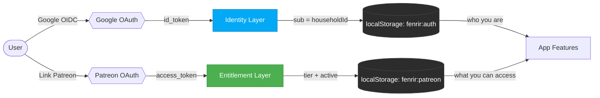
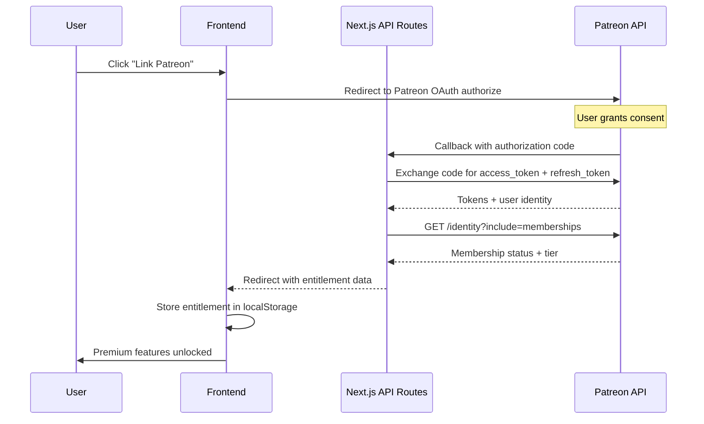
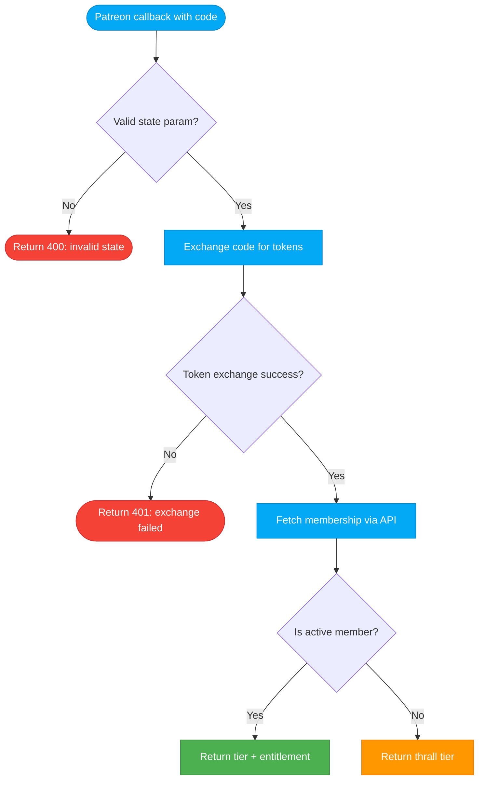

# ADR-009 — Patreon Integration as Entitlement Layer

**Status:** Proposed
**Date:** 2026-03-02
**Author:** FiremanDecko (Principal Engineer)
**Related:** ADR-005 (auth/PKCE), ADR-006 (anonymous-first), ADR-008 (requireAuth pattern)

---

## Context

Fenrir Ledger is approaching General Availability and needs a monetization path. The app currently uses Google OIDC with PKCE for identity (ADR-005), preserves an anonymous-first model where all features work without sign-in (ADR-006), and stores all data in localStorage with no backend database (ADR-003). API routes are protected by Google id_token verification (ADR-008).

The product direction (Freya/Odin) calls for a two-tier subscription model: a free tier (Thrall) preserving all current functionality, and a paid supporter tier (Karl, $3-5/mo) unlocking future premium features. Patreon was chosen as the subscription platform because it aligns with the project's indie/creator ethos and offloads all billing, subscription management, and cancellation handling to Patreon's infrastructure.

The core architectural challenge: integrate Patreon OAuth and its membership API into the existing auth model without breaking the anonymous-first experience, without replacing Google OIDC as the identity provider, and without introducing a backend database.

---

## Decision

**Patreon acts as an entitlement layer, NOT an identity provider.**

The application uses a two-token architecture where identity and entitlement are cleanly separated:

1. **Google OIDC token** (existing, ADR-005) -- who you are (identity)
2. **Patreon access token** (new) -- what you can access (entitlement)

### Two-Token Architecture



### Tier Definitions

| Tier | Norse Name | Price | Description |
|------|-----------|-------|-------------|
| Free | **Thrall** | $0 | All current features. Anonymous-first model preserved (ADR-006). No Patreon account required. |
| Supporter | **Karl** | $3-5/mo | Premium features (defined by product brief). Requires Google sign-in + Patreon link. |

### Linking Flow

The Patreon linking flow is an opt-in action that only applies to users who are already signed in with Google. Anonymous users never see Patreon-related UI.



### Entitlement Storage

Entitlement data is stored in localStorage under the key `fenrir:patreon`:

```typescript
interface PatreonEntitlement {
  tier: "thrall" | "karl";       // Current tier
  active: boolean;                // Is the membership active
  patreonUserId: string;          // Patreon user ID (for re-verification)
  linkedAt: number;               // Timestamp when Patreon was linked
  checkedAt: number;              // Timestamp of last membership verification
}
```

**Staleness policy:** If `checkedAt` is older than 1 hour, the entitlement is considered stale and re-verified via the Patreon membership API on next app load. This balances freshness against API rate limits.

### Feature Gating Pattern

Feature gates use a **hard gate** pattern -- premium content is fully hidden, not partially rendered:

```tsx
<PatreonGate tier="karl" fallback={<PatreonUpsell />}>
  <PremiumFeature />
</PatreonGate>
```

Gate evaluation order:
1. If user is anonymous -- gate does not render (no Patreon UI for anonymous users)
2. If user is signed in but Patreon not linked -- render fallback (upsell)
3. If user is signed in and Patreon linked with sufficient tier -- render children
4. If user is signed in and Patreon linked but membership lapsed -- render fallback (upsell)

### API Routes

| Route | Method | Auth | Purpose |
|-------|--------|------|---------|
| `/api/patreon/callback` | GET | **No** (exempt from requireAuth) | OAuth callback -- exchanges authorization code for tokens, checks membership, redirects to frontend with entitlement |
| `/api/patreon/membership` | GET | **Yes** (requireAuth, ADR-008) | Re-verifies current membership status using stored Patreon access token |

### Auth Exception: `/api/patreon/callback`

The Patreon OAuth callback route **must be exempt from requireAuth** (ADR-008) because the user is mid-OAuth flow -- they have been redirected from Patreon back to our application. The Google id_token is not available in the callback URL. This follows the same pattern as `/api/auth/token` (the Google OIDC token exchange proxy), which is also exempt.

The callback route validates the OAuth `state` parameter (CSRF protection) and only exchanges the authorization code for tokens -- it does not perform any privileged operations on user data.

The membership check route (`/api/patreon/membership`) **is behind requireAuth** -- the user must be authenticated with Google before checking their Patreon membership status.

### Patreon OAuth Callback Flow



### Environment Variables

| Variable | Server-side | Purpose |
|----------|-------------|---------|
| `PATREON_CLIENT_ID` | Yes | OAuth client identifier (also safe for NEXT_PUBLIC_ but not needed client-side) |
| `PATREON_CLIENT_SECRET` | Yes (never in browser) | OAuth client secret for token exchange |
| `PATREON_CAMPAIGN_ID` | Yes | Campaign ID for membership verification |

These must be added to `.env.example` as placeholders and to `.env.local` with real values. The `PATREON_CLIENT_SECRET` must **never** appear in the client bundle -- it is used exclusively in server-side API route handlers.

### Graceful Degradation

If Patreon's API is unreachable:
1. **Cached entitlement exists** -- trust the last-known state in localStorage (stale is better than blocked)
2. **No cache exists** -- treat as Thrall (free tier). Never block features due to an API failure.
3. **Log the error** and show a subtle "Couldn't verify subscription" note

This ensures that a Patreon outage never degrades the experience for any user.

---

## Alternatives Considered

### Alternative 1: Patreon as Primary Identity Provider

Replace Google OIDC with Patreon OAuth for all authentication.

**Rejected because:**
- Breaks the anonymous-first model (ADR-006) -- all users would need a Patreon account
- Forces identity change for all existing signed-in users
- Patreon's OAuth is designed for creator/patron relationships, not general identity
- Loses Google profile data (avatar, email) that the app currently uses

### Alternative 2: Stripe Integration

Use Stripe for direct payment processing.

**Rejected because:**
- Significantly more complex: payment processing, PCI compliance awareness, subscription management, webhook handling, refund flows
- Requires a persistent data store (database) to track customers -- violates the localStorage-only constraint
- Higher operational overhead for an indie project
- Less aligned with the creator/supporter ethos of the project

### Alternative 3: Ko-fi Integration

Use Ko-fi for one-time or recurring support.

**Rejected because:**
- No robust API for programmatic membership tier checking
- Manual verification only -- no automated entitlement gating
- Limited tier differentiation capabilities
- Insufficient for building a feature-gated product experience

### Alternative 4: Webhooks for Real-Time Membership Updates

Use Patreon webhooks (`members:pledge:create`, `members:pledge:update`, `members:pledge:delete`) to update entitlements in real-time.

**Deferred to v2 because:**
- Webhooks require a persistent data store to process events when the user is offline
- Fenrir Ledger uses localStorage exclusively -- there is no server-side user record to update
- The 1-hour TTL + on-load re-check pattern provides acceptable freshness for v1
- When a backend database is eventually added, webhooks become the natural upgrade path

### Alternative 5: Client-Side Patreon API Calls

Call the Patreon API directly from the browser using the user's access token.

**Rejected because:**
- Exposes Patreon access tokens in client-side network requests
- Cannot safely use `PATREON_CLIENT_SECRET` for token refresh
- CORS restrictions on Patreon's API endpoints
- Server-side proxy is the established pattern in this codebase (see `/api/auth/token`, `/api/sheets/import`)

---

## Implementation Notes

### Patreon API v2 Endpoints

| Endpoint | Purpose |
|----------|---------|
| `https://www.patreon.com/oauth2/authorize` | OAuth authorization (redirect user here) |
| `https://www.patreon.com/api/oauth2/token` | Token exchange (authorization_code -> access_token) |
| `GET /api/oauth2/v2/identity?include=memberships&fields[member]=patron_status,currently_entitled_tiers` | Fetch user identity + membership status |

### OAuth Scopes

- `identity` -- read the user's Patreon profile (required)
- `identity[email]` -- read the user's email (optional, useful for support matching)
- `campaigns.members` -- read campaign membership status (required for entitlement check)

### OAuth Redirect URIs

| Environment | Redirect URI |
|-------------|-------------|
| Development | `http://localhost:9653/api/patreon/callback` |
| Production | `https://fenrir-ledger.vercel.app/api/patreon/callback` |

Both must be registered in the Patreon OAuth client configuration.

### Cancellation Handling

Patreon handles all billing cycle logic natively. The app trusts the `patron_status` field returned by the membership API:
- `active_patron` -- access granted (Karl tier)
- `declined_patron` or `former_patron` -- access revoked (fall back to Thrall)
- No grace period logic in the app -- Patreon's own grace period applies

### No New Dependencies

Patreon API v2 uses standard REST + OAuth2. All API calls use the native `fetch()` function. No Patreon SDK is needed. This is consistent with the project's minimal-dependency philosophy.

### Patreon Setup (Manual, One-Time)

1. Create a Patreon campaign
2. Register an OAuth client at `https://www.patreon.com/portal/registration/register-clients`
3. Configure redirect URIs (development + production)
4. Copy Client ID, Client Secret, and Campaign ID to `.env.local`
5. Define tiers on the Patreon campaign page

---

## Consequences

### Positive

- **Preserves anonymous-first model (ADR-006)** -- Thrall users are completely unaffected. Anonymous users see no Patreon-related UI.
- **No changes to Google OIDC auth flow (ADR-005)** -- identity and entitlement are cleanly separated.
- **Clean separation of concerns** -- Google answers "who are you?", Patreon answers "what can you access?". Each system does one thing well.
- **No database required** -- entitlement is cached in localStorage with a TTL, consistent with the existing storage architecture (ADR-003).
- **Patreon handles billing complexity** -- subscriptions, cancellations, payment failures, and upgrades are all managed by Patreon's platform. Less code for us.
- **Minimal implementation surface** -- two API routes, one client-side hook, one gate component. No new npm dependencies.
- **Follows established patterns** -- the OAuth callback exempt from requireAuth matches `/api/auth/token`. The server-side proxy pattern matches `/api/sheets/import`.

### Negative

- **Two separate OAuth flows to link** -- users must first sign in with Google, then separately link Patreon. This is additional friction, but acceptable because Patreon linking is an opt-in action, not a requirement.
- **Entitlement cache can go stale** -- a user who cancels their Patreon subscription retains Karl access until the 1-hour TTL expires. Mitigated by re-checking on app load and on gated feature access.
- **No real-time membership updates** -- webhooks are deferred to v2. A user who upgrades on Patreon must reload the app (or wait for staleness check) to see premium features. Acceptable for v1.
- **Requires Google sign-in to link Patreon** -- anonymous users cannot link Patreon. This is intentional: the entitlement layer sits on top of the identity layer, not beside it.

### Neutral

- Patreon API v2 REST calls via `fetch()` -- no SDK, no additional dependencies
- OAuth scopes: `identity`, `identity[email]`, `campaigns.members`
- CSRF protection via `state` parameter on OAuth redirect (standard OAuth2 practice)
- `PATREON_CLIENT_SECRET` lives server-side only, following the same pattern as `GOOGLE_CLIENT_SECRET`

### CLAUDE.md Updates Required

The `requireAuth` exemption list in `CLAUDE.md` must be updated to include `/api/patreon/callback` alongside `/api/auth/token` as an authorized exception to the API route auth rule.

---

## References

- [ADR-003: localStorage for Persistence](../../architecture/adrs/ADR-003-local-storage.md)
- [ADR-005: Auth PKCE + Public Client](../../architecture/adrs/ADR-005-auth-pkce-public-client.md)
- [ADR-006: Anonymous-First Auth](../../architecture/adrs/ADR-006-anonymous-first-auth.md)
- [ADR-008: API Route Auth via Google id_token](adr-api-auth.md)
- [Patreon API v2 Documentation](https://docs.patreon.com/)
- [Backlog Item: Patreon Subscription Integration](../product/backlog/patreon-subscription-integration.md)
- [Spec: Patreon Subscription Integration](../../specs/patreon-subscription-integration.md)
