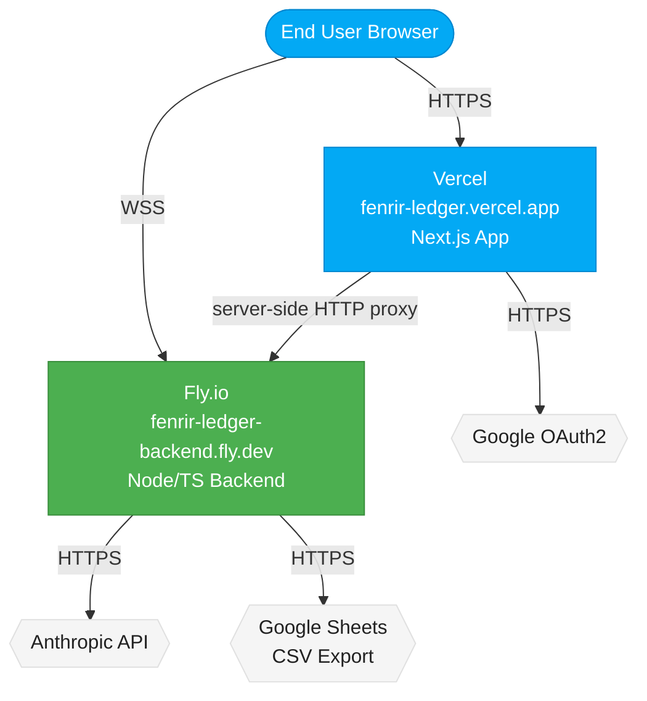

# Backend Implementation Plan: Node/TS Backend Server

> **ARCHIVED (2026-03-01):** This plan is superseded. The dedicated backend
> server has been removed. All import functionality now runs as a Vercel
> serverless function via the Next.js API route `/api/sheets/import`.
> See the addendum in `adr-backend-server.md`. This file is kept for
> historical reference only.

**Date:** 2026-03-01
**Author:** FiremanDecko (Principal Engineer)
**ADR:** `designs/architecture/adr-backend-server.md`
**Status:** Archived (backend removed)

---

## API Route Audit

### Existing Routes (as of Sprint 5)

#### `POST /api/auth/token`
**File:** `development/frontend/src/app/api/auth/token/route.ts`
**Purpose:** Google OAuth2 PKCE token exchange proxy. Keeps `GOOGLE_CLIENT_SECRET` server-side; the browser retains full PKCE ownership (code_verifier, code_challenge, state).
**Execution Profile:** Fast — one outbound HTTP call to `https://oauth2.googleapis.com/token`. Typical completion in 100–300ms. No long-running operations.
**Timeout Risk:** None. Well within Vercel Hobby 10s limit.
**WebSocket/SSE Benefit:** None. This is a pure request-response pattern; duplex communication adds no value.
**Migration Recommendation:** Keep in Next.js. This route's only job is secret proxying within a single HTTP round-trip. Moving it to the backend would add a network hop with no benefit.

---

#### `POST /api/sheets/import`
**File:** `development/frontend/src/app/api/sheets/import/route.ts`
**Purpose:** Full import pipeline — fetch Google Sheet as CSV, call Anthropic Claude Haiku to extract card data, validate with Zod, return card objects.
**Execution Profile:** Long-running. Three sequential async operations:
1. CSV fetch from Google Sheets public export URL (~200–800ms depending on sheet size and network)
2. Anthropic API call with up to 4096 max tokens (~3–25s depending on model load and prompt length)
3. Zod validation and ID assignment (fast, ~1ms)

Total wall time: typically 4–30 seconds; `maxDuration = 60` is set to handle worst cases.
**Timeout Risk:** High on Vercel Hobby (10s hard limit). Currently requires Vercel Pro (`maxDuration = 60`). A 200+ row sheet with a slow Anthropic response can approach or exceed 60 seconds.
**WebSocket/SSE Benefit:** High.
- The client currently sees a spinner for the entire import duration with no progress signal.
- Streaming allows the server to emit phase-by-phase progress: "Fetching sheet...", "Extracted N rows...", "Validating...", "Done."
- Full duplex (WebSocket) allows the client to send a cancel signal mid-import.
- Row-by-row streaming (emit each validated card as it comes) would let the client show cards as they arrive rather than all-at-once.
**Migration Recommendation:** Migrate to the backend in Phase 2. The Next.js route becomes a thin HTTP proxy during the transition period.

---

### Routes Not Yet Implemented (Planned)

The following are not implemented yet but are anticipated based on the product brief and ADR-006:

| Anticipated Route | Profile | WebSocket Benefit |
|-------------------|---------|-------------------|
| `GET /api/cards` (server-side, GA) | Fast | None |
| `POST /api/cards` (server-side, GA) | Fast | None |
| `PUT /api/cards/:id` (server-side, GA) | Fast | Low (optimistic UI handles this) |
| `DELETE /api/cards/:id` (server-side, GA) | Fast | None |
| `POST /api/household/migrate` (post-GA, anonymous→cloud) | Medium | Low (SSE sufficient) |
| Real-time sync channel (GA) | Persistent | High — canonical use case for WebSocket |
| Household sharing (post-GA) | Persistent | High — canonical use case for WebSocket |

---

## Tech Stack Recommendation

### Backend Framework: Hono

**Chosen:** [Hono](https://hono.dev) v4+

**Rationale:**
- TypeScript-native from day one. No `@types/hono` overhead.
- Runs on Node.js (via `@hono/node-server`), Deno, Bun, and Cloudflare Workers — maximum future portability.
- Extremely lightweight: no magic, no DI container, no decorator metadata. Import what you need.
- Compatible with the Web Fetch API standard (`Request`/`Response`) — same mental model as Next.js App Router.
- Active maintenance, growing community, strong TypeScript idioms.
- `hono/streaming` helper provides SSE out of the box.

**Alternative considered:** Fastify — excellent but has more configuration overhead for TypeScript (schemas, plugin registration). Appropriate if the backend grows to many routes with complex validation; overkill for Phase 1.

**Alternative considered:** Express — familiar but `@types/express` is bolted on. Express 5 has promise support but the ecosystem lags TypeScript conventions. Ruled out in favour of Hono's native TypeScript design.

### WebSocket Library: `ws`

**Chosen:** `ws` v8+

**Rationale:**
- Battle-tested, minimal, used by virtually every WebSocket implementation in the Node.js ecosystem.
- Hono does not ship a built-in WebSocket server for Node.js (it does for Bun/Deno). We add `ws` directly and wire it alongside Hono's HTTP server.
- `@types/ws` is included.
- Avoids the opinionated event-name and namespace system of Socket.io, which would be premature abstraction for our current use case.

**Alternative considered:** Socket.io — excellent for rooms, namespaces, fallback transports. Appropriate if the household sharing feature requires broadcast groups. Revisit at GA.

### Runtime: Node.js + tsx (dev) / tsc (prod)

**Development:** `npx tsx watch src/index.ts` — the existing `backend-server.sh` already uses this exact command.
**Production:** Compile to `dist/` with `tsc` and run `node dist/index.js`.

### Port Scheme

| Context | Frontend Port | Backend Port |
|---------|--------------|--------------|
| Main worktree / production dev | 9653 | 9753 |
| Worktree offset +1 | 9654 | 9754 |
| Worktree offset +N | 9653+N | 9753+N |

The offset is always 100 (backend = frontend + 100). The `backend-server.sh` script reads `FENRIR_BACKEND_PORT` (default 9753). Worktrees set both `FENRIR_FRONTEND_PORT` and `FENRIR_BACKEND_PORT` via their environment.

---

## Project Structure

```
development/
├── frontend/                     # Next.js frontend (renamed from src/ in PR #44)
│   ├── package.json              # Frontend deps
│   ├── next.config.ts
│   └── src/
│       └── app/
│           └── api/
│               ├── auth/token/route.ts    # Stays here (fast, stateless)
│               └── sheets/import/route.ts # Phase 2: becomes thin proxy
└── backend/                      # Node/TS backend server
    ├── package.json              # Backend deps (separate from frontend)
    ├── tsconfig.json             # Backend TypeScript config
    ├── .env.example              # Template — committed to repo
    ├── .gitignore                # Ensures .env is never committed
    ├── fly.toml                  # Fly.io deploy config
    ├── logs/                     # Local dev logs (gitignored)
    └── src/
        ├── index.ts              # Entry point: Hono server + ws upgrade handler
        ├── config.ts             # Port, env var resolution, constants
        ├── routes/
        │   ├── health.ts         # GET /health — liveness probe
        │   └── import.ts         # POST /import — Sheets import (Phase 2)
        ├── ws/
        │   ├── server.ts         # WebSocket server setup and connection lifecycle
        │   └── handlers/
        │       └── import.ts     # WebSocket import handler: streams progress events
        ├── lib/
        │   ├── sheets/
        │   │   ├── fetch-csv.ts  # Fetch CSV from Google Sheets export URL
        │   │   ├── parse-url.ts  # Extract sheet ID from URL (port from frontend lib)
        │   │   └── prompt.ts     # Anthropic prompt builder (port from frontend lib)
        │   └── anthropic/
        │       └── extract.ts    # Anthropic streaming call wrapper
        └── types/
            └── messages.ts       # TypeScript types for all WS message shapes
```

The frontend and backend are intentionally separate Node.js projects (`package.json` siblings). This keeps dependency graphs isolated — the backend does not inherit React, Tailwind, or Next.js. A future monorepo tool (`pnpm workspaces`, `turborepo`) can be layered on top if the repo grows.

---

## Implementation Phases

### Phase 1: Scaffold Backend with Health Endpoint

**Goal:** Get `development/backend/` into a state where `backend-server.sh start` produces a running server that responds to `GET /health`. Nothing migrated yet.

**Prerequisites:**
- Node.js 20+ installed
- `backend-server.sh` already exists at `.claude/scripts/backend-server.sh` and expects `development/backend/src/index.ts`

**Tasks:**

#### Task 1.1: Create `development/backend/package.json`
**File:** `development/backend/package.json`
**Implementation Notes:**
```json
{
  "name": "fenrir-ledger-backend",
  "version": "0.1.0",
  "private": true,
  "type": "module",
  "scripts": {
    "dev": "tsx watch src/index.ts",
    "build": "tsc",
    "start": "node dist/index.js",
    "typecheck": "tsc --noEmit"
  },
  "dependencies": {
    "@anthropic-ai/sdk": "^0.78.0",
    "@hono/node-server": "^1.13.0",
    "hono": "^4.7.0",
    "ws": "^8.18.0",
    "zod": "^3.24.1"
  },
  "devDependencies": {
    "@types/node": "^20",
    "@types/ws": "^8.5.14",
    "tsx": "^4.19.0",
    "typescript": "^5"
  }
}
```
**Definition of Done:** `npm install` in `development/backend/` completes without errors.

#### Task 1.2: Create `development/backend/tsconfig.json`
**File:** `development/backend/tsconfig.json`
**Implementation Notes:** Target ES2022, `NodeNext` module resolution. `outDir: "dist"`, `rootDir: "src"`. Strict mode enabled.
**Definition of Done:** `npm run typecheck` passes with no errors.

#### Task 1.3: Create `development/backend/src/config.ts`
**File:** `development/backend/src/config.ts`
**Implementation Notes:**
```typescript
/** Central configuration resolved from environment variables at startup. */
export const config = {
  port: parseInt(process.env.FENRIR_BACKEND_PORT ?? "9753", 10),
  anthropicApiKey: process.env.ANTHROPIC_API_KEY ?? "",
  nodeEnv: process.env.NODE_ENV ?? "development",
} as const;

/** Throw early if required secrets are missing. */
export function assertConfig(): void {
  if (!config.anthropicApiKey) {
    throw new Error("ANTHROPIC_API_KEY is required but not set.");
  }
}
```
Note: `assertConfig()` is only called when the Anthropic import route is registered. Phase 1 (health only) does not call it — the server can run without the API key.

#### Task 1.4: Create `development/backend/src/routes/health.ts`
**File:** `development/backend/src/routes/health.ts`
**Implementation Notes:**
```typescript
import { Hono } from "hono";

const health = new Hono();

health.get("/health", (c) => {
  return c.json({ status: "ok", service: "fenrir-ledger-backend", ts: new Date().toISOString() });
});

export default health;
```
**Definition of Done:** `curl http://localhost:9753/health` returns `{"status":"ok",...}`.

#### Task 1.5: Create `development/backend/src/index.ts`
**File:** `development/backend/src/index.ts`
**Implementation Notes:** This is the entry point `backend-server.sh` expects.
```typescript
import { serve } from "@hono/node-server";
import { Hono } from "hono";
import { logger } from "hono/logger";
import { config } from "./config.js";
import health from "./routes/health.js";

const app = new Hono();

app.use("*", logger());
app.route("/", health);

serve({ fetch: app.fetch, port: config.port }, (info) => {
  console.log(`[fenrir-backend] Listening on http://localhost:${info.port}`);
});
```
**Definition of Done:** `backend-server.sh start` exits 0, `backend-server.sh status` reports "Running", `GET /health` returns 200.

#### Task 1.6: Create `development/backend/.env.example`
**File:** `development/backend/.env.example`
**Implementation Notes:**
```
# Fenrir Ledger Backend — Environment Variables
# Copy this file to .env and fill in real values.
# Never commit .env to the repository.

# Required for the Sheets import route (Phase 2)
ANTHROPIC_API_KEY=your-anthropic-api-key-here

# Optional — override the port the backend listens on
# Defaults to 9753. Worktrees use 9753 + offset.
# FENRIR_BACKEND_PORT=9753

# Set to "production" in production environments
NODE_ENV=development
```

#### Task 1.7: Create `development/backend/.gitignore`
**File:** `development/backend/.gitignore`
**Content:**
```
.env
node_modules/
dist/
logs/
```

#### Task 1.8: Create `development/backend/fly.toml`
**File:** `development/backend/fly.toml`
**Implementation Notes:**
```toml
app = "fenrir-ledger-backend"
primary_region = "iad"

[build]
  # Build with Node.js builder; Fly auto-detects package.json
  builder = "heroku/buildpacks:22"

[env]
  NODE_ENV = "production"
  FENRIR_BACKEND_PORT = "8080"

[http_service]
  internal_port = 8080
  force_https = true
  auto_stop_machines = true
  auto_start_machines = true
  min_machines_running = 0

  [http_service.concurrency]
    type = "connections"
    hard_limit = 100
    soft_limit = 80

[[vm]]
  size = "shared-cpu-1x"
  memory = "256mb"
```
Note: Fly.io uses port 8080 internally; `FENRIR_BACKEND_PORT=8080` overrides the default 9753.

---

### Phase 2: Migrate Sheets Import to Backend with WebSocket Streaming

**Goal:** Move the long-running import logic from Next.js to the backend. The backend emits progress events over WebSocket. Next.js `/api/sheets/import` becomes a thin proxy for clients that cannot or do not use WebSocket.

**Prerequisites:** Phase 1 complete. Backend running and confirmed healthy.

**Tasks:**

#### Task 2.1: Define WebSocket message types
**File:** `development/backend/src/types/messages.ts`
**Implementation Notes:**
```typescript
/** Messages sent from the client to the backend over WebSocket. */
export type ClientMessage =
  | { type: "import_start"; payload: { url: string } }
  | { type: "import_cancel" };

/** Messages sent from the backend to the client over WebSocket. */
export type ServerMessage =
  | { type: "import_phase"; phase: "fetching_sheet" | "extracting" | "validating" | "done" }
  | { type: "import_progress"; rowsExtracted: number; totalRows: number }
  | { type: "import_complete"; cards: ImportedCard[] }
  | { type: "import_error"; code: ImportErrorCode; message: string };

export type ImportErrorCode =
  | "INVALID_URL"
  | "SHEET_NOT_PUBLIC"
  | "FETCH_ERROR"
  | "ANTHROPIC_ERROR"
  | "PARSE_ERROR"
  | "NO_CARDS_FOUND";

export interface ImportedCard {
  id: string;
  issuerId: string;
  cardName: string;
  openDate: string;
  creditLimit: number;
  annualFee: number;
  annualFeeDate: string;
  promoPeriodMonths: number;
  signUpBonus: {
    type: "points" | "miles" | "cashback";
    amount: number;
    spendRequirement: number;
    deadline: string;
    met: boolean;
  } | null;
  notes: string;
  status: "active";
  createdAt: string;
  updatedAt: string;
}
```
**Definition of Done:** File compiles with no TypeScript errors.

#### Task 2.2: Port CSV fetch and prompt utilities to backend
**Files:**
- `development/backend/src/lib/sheets/parse-url.ts` — port from `development/frontend/src/lib/sheets/parse-url.ts`
- `development/backend/src/lib/sheets/prompt.ts` — port from `development/frontend/src/lib/sheets/prompt.ts`
- `development/backend/src/lib/sheets/fetch-csv.ts` — new; wraps `fetch()` with error handling

**Implementation Notes:** These files are pure utility functions with no Next.js dependencies. Copy and adapt to ESM syntax with `.js` extensions on imports (required for Node.js ESM).

#### Task 2.3: Create Anthropic streaming extractor
**File:** `development/backend/src/lib/anthropic/extract.ts`
**Implementation Notes:**
```typescript
import Anthropic from "@anthropic-ai/sdk";

/**
 * Call Claude Haiku to extract card data from CSV.
 * Returns the raw response text. Caller is responsible for JSON parsing.
 *
 * @param apiKey - Anthropic API key
 * @param prompt - Assembled extraction prompt (from prompt.ts)
 * @returns Raw text response from the model
 */
export async function extractCardsFromCsv(apiKey: string, prompt: string): Promise<string> {
  const client = new Anthropic({ apiKey });
  // Single retry on transient failure (matches behaviour of the existing Next.js route)
  for (let attempt = 0; attempt < 2; attempt++) {
    try {
      const message = await client.messages.create({
        model: "claude-haiku-4-5-20251001",
        max_tokens: 4096,
        messages: [{ role: "user", content: prompt }],
      });
      const textBlock = message.content.find((b) => b.type === "text");
      return textBlock?.text ?? "";
    } catch (err) {
      if (attempt === 1) throw err;
    }
  }
  // Unreachable — loop always throws or returns
  throw new Error("Extraction failed after retries.");
}
```
**Definition of Done:** Function compiles. Unit test (mock Anthropic SDK) verifies retry logic.

#### Task 2.4: Create WebSocket server and connection handler
**File:** `development/backend/src/ws/server.ts`
**Implementation Notes:**
```typescript
import { WebSocketServer, WebSocket } from "ws";
import type { IncomingMessage } from "http";
import type { Server } from "http";
import { handleImportMessage } from "./handlers/import.js";
import type { ClientMessage } from "../types/messages.js";

/**
 * Attach a WebSocketServer to an existing Node.js HTTP server.
 * The Hono Node adapter exposes the underlying http.Server via the
 * callback return value; we wire the WebSocket upgrade handler there.
 */
export function attachWebSocketServer(httpServer: Server): void {
  const wss = new WebSocketServer({ server: httpServer });

  wss.on("connection", (ws: WebSocket, _req: IncomingMessage) => {
    console.log("[ws] Client connected");

    ws.on("message", (data) => {
      let msg: ClientMessage;
      try {
        msg = JSON.parse(data.toString()) as ClientMessage;
      } catch {
        ws.send(JSON.stringify({ type: "import_error", code: "INVALID_URL", message: "Invalid JSON message." }));
        return;
      }
      handleImportMessage(ws, msg);
    });

    ws.on("close", () => {
      console.log("[ws] Client disconnected");
    });

    ws.on("error", (err) => {
      console.error("[ws] Error:", err.message);
    });
  });

  console.log("[fenrir-backend] WebSocket server attached");
}
```

#### Task 2.5: Create WebSocket import handler
**File:** `development/backend/src/ws/handlers/import.ts`
**Implementation Notes:** This is the core of Phase 2. The handler:
1. Sends `import_phase: fetching_sheet`
2. Fetches CSV; sends `import_phase: extracting`
3. Calls Anthropic; sends `import_phase: validating`
4. Validates and assigns IDs; sends `import_complete` with cards
5. On any error, sends `import_error` with structured code and message

Cancellation: the handler checks a `cancelled` flag before each await. When the client sends `import_cancel`, the flag is set. The next checkpoint exits cleanly.

#### Task 2.6: Update `src/index.ts` to attach WebSocket server
**File:** `development/backend/src/index.ts`
**Implementation Notes:** The `@hono/node-server` `serve()` function returns the underlying `http.Server`. Pass it to `attachWebSocketServer()`:
```typescript
const server = serve({ fetch: app.fetch, port: config.port }, (info) => {
  console.log(`[fenrir-backend] Listening on http://localhost:${info.port}`);
});
attachWebSocketServer(server);
```

#### Task 2.7: Update Next.js import route to proxy to backend
**File:** `development/frontend/src/app/api/sheets/import/route.ts`
**Implementation Notes:** Replace the existing implementation with a thin HTTP proxy:
```typescript
// Phase 2: proxy to the backend server.
// The long-running Anthropic call now runs on the backend (no Vercel timeout concern).
// WebSocket-capable clients bypass this route entirely and connect to ws://backend directly.
const backendUrl = process.env.BACKEND_URL ?? "http://localhost:9753";
const upstream = await fetch(`${backendUrl}/import`, {
  method: "POST",
  headers: { "Content-Type": "application/json" },
  body: JSON.stringify({ url }),
});
```
**Edge Cases:** If the backend is not running (anonymous-only deployments), return a 503 with a clear message. The frontend must handle this gracefully and fall back to a "connect Google Sheets manually" UX.

#### Task 2.8: Update frontend to use WebSocket for import progress
**File:** `development/frontend/src/components/sheets/ImportWizard.tsx` (or equivalent)
**Implementation Notes:** On import start:
1. Open WebSocket to `ws://localhost:9753` (dev) or `wss://<backend-host>` (prod)
2. Send `{ type: "import_start", payload: { url } }`
3. Handle incoming `ServerMessage` events:
   - `import_phase` — update progress indicator label
   - `import_complete` — receive cards, close WebSocket, proceed to review step
   - `import_error` — show error state, close WebSocket
4. "Cancel" button sends `{ type: "import_cancel" }` then closes the socket

**Backend URL resolution for frontend:**
```typescript
const WS_BACKEND_URL =
  process.env.NEXT_PUBLIC_BACKEND_WS_URL ?? "ws://localhost:9753";
```
Add `NEXT_PUBLIC_BACKEND_WS_URL` to `.env.example` and the Vercel environment variable configuration.

---

### Phase 3: Stabilise — Fast Routes in Next.js, Long-Running in Backend

**Goal:** Clean up the dual-route architecture. Document which routes live where and why. Ensure the backend gracefully degrades (frontend still works if backend is unavailable for anonymous users).

**Tasks:**

#### Task 3.1: Add `BACKEND_URL` env var to Next.js
**Files:** `development/frontend/.env.example`, Vercel project settings
**Implementation Notes:**
```
# URL of the Fenrir Ledger backend server (for server-side proxy use)
BACKEND_URL=http://localhost:9753

# WebSocket URL for client-side import progress (exposed to browser)
NEXT_PUBLIC_BACKEND_WS_URL=ws://localhost:9753
```

#### Task 3.2: Add backend availability check to import wizard
**File:** `development/frontend/src/components/sheets/ImportWizard.tsx`
**Implementation Notes:** Before opening a WebSocket, probe the backend health endpoint via a fast HTTP request. If unavailable, show a non-blocking warning: "Live progress unavailable — import will run in the background." Fall back to the `/api/sheets/import` HTTP proxy (which returns when the import completes, no streaming).

#### Task 3.3: Document the route split
**File:** `designs/architecture/route-ownership.md`
**Content:** A simple table documenting which routes live in Next.js vs. the backend, and the rationale for each placement.

---

### Phase 4: GA — Real-Time Sync and Household Sharing (Future)

This phase is intentionally left at a sketch level. It must not be planned in detail until the product team triggers GA planning.

**When triggered, this phase adds:**
- A persistent WebSocket channel per user session (keyed to `householdId`)
- Backend emits card-change events when a card is created/updated/deleted on any connected device
- Frontend subscribes on mount and applies incoming diffs to the React state
- Household sharing: a second user can join the same household's WebSocket channel
- Requires: user authentication (ADR-005/ADR-006 OAuth flow extended to the backend)
- Requires: a persistent data store on the backend (Supabase Postgres, or equivalent)
- The localStorage abstraction stays as the client-side cache layer; the backend becomes the source of truth

---

## File-by-File Change List

### New Files (Phase 1)

| File | Description |
|------|-------------|
| `development/backend/package.json` | Backend Node.js project manifest |
| `development/backend/tsconfig.json` | TypeScript config for backend |
| `development/backend/.env.example` | Environment variable template (committed) |
| `development/backend/.gitignore` | Ensures .env and node_modules are excluded |
| `development/backend/fly.toml` | Fly.io deployment config |
| `development/backend/src/index.ts` | Server entry point (Hono + ws) |
| `development/backend/src/config.ts` | Environment variable resolution and validation |
| `development/backend/src/routes/health.ts` | `GET /health` — liveness probe |

### New Files (Phase 2)

| File | Description |
|------|-------------|
| `development/backend/src/types/messages.ts` | TypeScript types for all WS messages |
| `development/backend/src/lib/sheets/parse-url.ts` | Port of frontend parse-url utility |
| `development/backend/src/lib/sheets/prompt.ts` | Port of frontend prompt builder |
| `development/backend/src/lib/sheets/fetch-csv.ts` | CSV fetch with error handling |
| `development/backend/src/lib/anthropic/extract.ts` | Anthropic call wrapper with retry |
| `development/backend/src/ws/server.ts` | WebSocketServer setup |
| `development/backend/src/ws/handlers/import.ts` | Import WebSocket message handler |
| `development/backend/src/routes/import.ts` | `POST /import` HTTP endpoint (non-WS clients) |

### Modified Files (Phase 2)

| File | Change |
|------|--------|
| `development/backend/src/index.ts` | Add WebSocket server attachment |
| `development/frontend/src/app/api/sheets/import/route.ts` | Replace implementation with thin HTTP proxy to backend |
| `development/frontend/src/components/sheets/ImportWizard.tsx` | Add WebSocket progress handling |
| `development/frontend/.env.example` | Add `BACKEND_URL` and `NEXT_PUBLIC_BACKEND_WS_URL` |

### New Files (Phase 3)

| File | Description |
|------|-------------|
| `designs/architecture/route-ownership.md` | Documents route placement decisions |

---

## Dev Scripts

All scripts live in `.claude/scripts/`:

| Script | Purpose |
|--------|---------|
| `services.sh` | Orchestrates both frontend and backend together (start/stop/restart/status) |
| `frontend-server.sh` | Individual frontend dev server control (renamed from `dev-server.sh` in PR #45) |
| `backend-server.sh` | Individual backend dev server control |

### `services.sh` (recommended for local dev)

```bash
# Start both frontend and backend
.claude/scripts/services.sh start

# Stop both
.claude/scripts/services.sh stop

# Restart both
.claude/scripts/services.sh restart

# Check status of both
.claude/scripts/services.sh status
```

### `backend-server.sh` (individual backend control)

```bash
# Start the backend (dev mode with hot reload)
.claude/scripts/backend-server.sh start

# Stop the backend
.claude/scripts/backend-server.sh stop

# Restart
.claude/scripts/backend-server.sh restart

# Check if running
.claude/scripts/backend-server.sh status

# Tail logs
.claude/scripts/backend-server.sh logs
```

**Key behaviours:**
- Port: reads `FENRIR_BACKEND_PORT` env var (default 9753)
- Backend dir: reads `FENRIR_BACKEND_DIR` env var (default: auto-detected as `../../development/backend` relative to the script)
- Runs `npx tsx watch src/index.ts` in the background with `nohup`
- Logs to `development/backend/logs/backend-server.log`
- `start` is idempotent — if already running, exits 0

**Worktree usage:**
```bash
FENRIR_BACKEND_PORT=9754 FENRIR_BACKEND_DIR=/path/to/worktree/development/backend \
  .claude/scripts/backend-server.sh start
```

---

## Secrets Management

### Environment Variables Required

#### Backend (`development/backend/.env`)

| Variable | Required | Description |
|----------|----------|-------------|
| `ANTHROPIC_API_KEY` | Phase 2+ | Key for the Anthropic API (Claude Haiku calls during import) |
| `FENRIR_BACKEND_PORT` | No | Override backend port (default: 9753) |
| `NODE_ENV` | No | Set to `production` in prod deployments |

#### Frontend (`development/frontend/.env.local`)

| Variable | Required | Description |
|----------|----------|-------------|
| `BACKEND_URL` | Phase 2+ | HTTP URL of backend for server-side proxy use (e.g., `http://localhost:9753` or `https://fenrir-ledger-backend.fly.dev`) |
| `NEXT_PUBLIC_BACKEND_WS_URL` | Phase 2+ | WebSocket URL for client-side connection (e.g., `ws://localhost:9753` or `wss://fenrir-ledger-backend.fly.dev`) |
| `GOOGLE_CLIENT_SECRET` | Existing | Stays in Next.js (used by auth token proxy) |
| `NEXT_PUBLIC_GOOGLE_CLIENT_ID` | Existing | Stays in Next.js |

### `.gitignore` Rules
Both `development/backend/.gitignore` and `development/frontend/.gitignore` must exclude:
```
.env
.env.local
```

The `.env.example` files are the committed templates. CI/QA environments provide the actual `.env` via environment injection (Fly.io secrets, Vercel project env vars).

---

## Hosting Architecture



**Deployment Steps (Phase 1 target — Fly.io):**

1. Install Fly CLI: `brew install flyctl`
2. Login: `fly auth login`
3. From `development/backend/`: `fly launch` (creates the app, links to `fly.toml`)
4. Set secrets: `fly secrets set ANTHROPIC_API_KEY=<your-key>`
5. Deploy: `fly deploy`
6. Verify: `curl https://fenrir-ledger-backend.fly.dev/health`

This is idempotent: `fly deploy` on subsequent runs updates the running machine in-place.

---

## Definition of Done per Phase

### Phase 1 Done When:
- [ ] `development/backend/` directory exists with all scaffold files
- [ ] `npm install` in `development/backend/` installs without errors
- [ ] `npm run typecheck` passes
- [ ] `.claude/scripts/backend-server.sh start` starts the backend on port 9753
- [ ] `curl http://localhost:9753/health` returns `{"status":"ok",...}`
- [ ] `.claude/scripts/backend-server.sh stop` stops cleanly
- [ ] `backend-server.sh start` is idempotent (running again reports "Already running")
- [ ] `development/backend/.env.example` is committed; `development/backend/.env` is gitignored

### Phase 2 Done When:
- [ ] All Phase 1 criteria met
- [ ] WebSocket connection to `ws://localhost:9753` succeeds
- [ ] Sending `{ type: "import_start", payload: { url: "<public-sheet-url>" } }` over WebSocket triggers the full import pipeline
- [ ] Client receives `import_phase` events for each stage
- [ ] Client receives `import_complete` with valid card objects matching the Zod schema
- [ ] Sending `{ type: "import_cancel" }` mid-import causes a clean shutdown of the in-progress operation
- [ ] Next.js `/api/sheets/import` proxy returns correct results for HTTP (non-WS) clients
- [ ] Frontend import wizard shows phase labels updating in real time during import
- [ ] If backend is unavailable, frontend falls back gracefully (no crash; shows degraded warning)

### Phase 3 Done When:
- [ ] `designs/architecture/route-ownership.md` documents all route placements
- [ ] `BACKEND_URL` and `NEXT_PUBLIC_BACKEND_WS_URL` are in all `.env.example` files
- [ ] Deployed to Fly.io; `GET https://fenrir-ledger-backend.fly.dev/health` returns 200
- [ ] Vercel deployment configured with `BACKEND_URL` pointing to Fly.io backend
