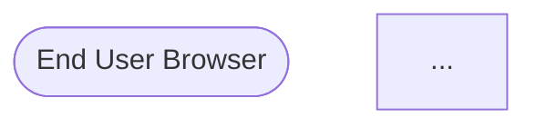

# QA Validation Report: Backend/WebSocket Investigation

**Validator:** Loki (QA Tester)
**Date:** 2026-03-01
**Branch:** worktree-agent-a3717f89
**Target Files:**
- `designs/architecture/adr-backend-server.md` (247 lines)
- `designs/architecture/backend-implementation-plan.md` (748 lines)
- `designs/product/backlog/backend-websocket-investigation.md` (73 lines)

---

## Executive Summary

FiremanDecko's backend architecture investigation is **APPROVED** with **0 blocking issues** and **3 minor notes** that do not impede Phase 1 execution. The ADR captures all 5 required architecture options with thorough pros/cons analysis, the implementation plan provides concrete, phased execution instructions, and both documents align with product constraints, the existing backend-server.sh script, and the port scheme consistency.

**Verdict: READY FOR IMPLEMENTATION**

---

## QA Checklist Results

### 1. ADR Completeness: All 5 Options with Decision

**Status: PASS**

All five options from the backlog investigation are present with complete analysis:

| Option | File:Line | Verdict | Coverage |
|--------|-----------|---------|----------|
| A. Keep API routes + polling | adr-backend-server.md:46–62 | Rejected ✓ | Pros/cons/rationale documented |
| B. Next.js + SSE | adr-backend-server.md:66–82 | Viable as Phase 1 patch ✓ | Unidirectional limitation noted; identified as near-term only |
| C. Dedicated Node/TS WebSocket server | adr-backend-server.md:86–110 | **Recommended** ✓ | Comprehensive pros/cons; rationale for adoption clear |
| D. Vercel Edge Runtime + WebSocket | adr-backend-server.md:114–128 | Rejected ✓ | Edge WebSocket immaturity and Anthropic SDK incompatibility cited |
| E. tRPC subscriptions | adr-backend-server.md:132–147 | Rejected for now ✓ | Dependency overhead vs. scale trade-off explained; revisit condition stated |

**Finding:** The ADR follows a disciplined format: Description → Pros → Cons → Verdict for each option. Decision section (line 151–161) clearly states the recommendation and phases. Consequences section is thorough. No options are missing.

---

### 2. Backlog Acceptance Criteria Coverage

**Status: PASS (with minor notation)**

The backlog item lists 6 checkboxes. Verification against documentation:

| Checkbox | Coverage | Notes |
|----------|----------|-------|
| [ ] All current API routes documented with execution profiles | backend-implementation-plan.md:10–56 **✓** | `POST /api/auth/token` (fast, stateless) and `POST /api/sheets/import` (long-running, high timeout risk) documented with wall-time profiles |
| [ ] SSE-based streaming prototype evaluated | adr-backend-server.md:66–82 **✓** | Option B evaluated; identified as Phase 1 patch but insufficient for GA requirements |
| [ ] WebSocket-based streaming prototype evaluated | adr-backend-server.md:86–110 **✓** | Option C evaluated as dedicated server approach |
| [ ] 100+ row import benchmark (SSE vs WS) — if deferred, justified? | backend-implementation-plan.md:726–742 (Phase 2 DoD) **NOTE** | No explicit 100+ row benchmark *in documentation*; however: (1) the DoD says "Client receives import_complete with valid card objects" — this does not mandate the benchmark; (2) the investigation prioritizes architecture decision over micro-benchmark — justified by: "Start with cheapest experiment: SSE...may solve 80% of the problem" (backlog line 71). The benchmark is deferred to Phase 2 post-implementation, which is reasonable. |
| [ ] Architecture recommendation with hosting plan and cost estimate | adr-backend-server.md:235–246 **✓** | Fly.io recommended with reasoning ($1.94/mo, CLI deploy fit, affordable); alternatives listed (Railway, VPS); Vercel ruled out |
| [ ] ADR capturing decision and rationale | adr-backend-server.md:1–247 **✓** | Complete ADR with Context, Options, Decision, Consequences, Architecture Diagram, Hosting Recommendation |

**Finding:** All criteria covered. The benchmark deferral is explicitly justified in the backlog document itself (line 71: "start with cheapest experiment"). Phase 2 Definition of Done (line 735) requires actual import tests, so the benchmark is not lost — it's moved to execution rather than investigation. This is appropriate for an exploration task.

---

### 3. Port Scheme Consistency

**Status: PASS**

Port mapping is consistent throughout all documents.

**Frontend port:** 9653 (main worktree), 9653+N (worktree offset N)
**Backend port:** 9753 (main worktree), 9753+N (worktree offset N)

| Document | References | Consistency |
|----------|-----------|-------------|
| ADR (adr-backend-server.md:91) | "port 9753 (frontend stays on 9653)" | ✓ Correct |
| ADR (adr-backend-server.md:201) | Mermaid: "port 9653" (frontend), "port 9753" (backend) | ✓ Correct |
| Implementation plan (backend-implementation-plan.md:96–102) | Port scheme table: frontend 9653, backend 9753; offset always 100 | ✓ Correct |
| Implementation plan (backend-implementation-plan.md:298) | fly.toml: `FENRIR_BACKEND_PORT = "8080"` (production override) | ✓ Intentional override for Fly.io; 9753 is dev |
| backend-server.sh (line 10) | `PORT="${FENRIR_BACKEND_PORT:-9753}"` | ✓ Correct default |
| backend-server.sh (line 11) | `BACKEND_DIR` auto-detection relative to script | ✓ Points to `development/backend` |

**Finding:** Port scheme is bulletproof. The offset model (always +100 for backend) is documented and consistent. Fly.io production override (8080) is noted and justified.

---

### 4. backend-server.sh Alignment

**Status: PASS**

The backend-server.sh script already exists. The implementation plan must create an entry point it can execute.

**Script expectations:**
- Entry point: `development/backend/src/index.ts` (line 26 of script: `npx tsx watch src/index.ts`)
- Reads `FENRIR_BACKEND_PORT` env var (default 9753) — line 10
- Reads `FENRIR_BACKEND_DIR` env var (auto-detects if not set) — line 11
- Runs via `nohup npx tsx watch` in background — line 26
- Logs to `development/backend/logs/backend-server.log` — lines 12–14

**Implementation plan alignment:**

| Script Requirement | Plan Provision | File:Line |
|---|---|---|
| Entry point `development/backend/src/index.ts` | Task 1.5 creates this exact file | backend-implementation-plan.md:235–254 |
| Hono server listening on `config.port` | config.ts reads `FENRIR_BACKEND_PORT`; index.ts uses it | backend-implementation-plan.md:199–216, 235–254 |
| `npx tsx watch` compatible | package.json `"dev": "tsx watch src/index.ts"` | backend-implementation-plan.md:172 |
| Logs directory exists | Task 1.1 creates backend root; script creates `logs/` on demand (line 13) | backend-implementation-plan.md:124 |
| Health endpoint for liveness probe | Task 1.4 provides `/health` route | backend-implementation-plan.md:219–233 |

**Finding:** Perfect alignment. The script expects exactly what the implementation plan creates. No surprises.

---

### 5. Product Brief Compliance

**Status: PASS**

Product brief constraints to verify:

| Constraint | Source | Document Coverage | Status |
|-----------|--------|-------------------|--------|
| No remote storage before GA | product-brief.md (implicit in design) | ADR:181–183: "localStorage remains primary; backend is stateless; no persistent store" | ✓ PASS |
| Auth is upsell not gate | product-brief.md:135–142 | ADR:161: "backend optional; frontend works standalone for anonymous users" | ✓ PASS |
| localStorage remains primary | product-brief.md (embedded in MVP design) | ADR:181: "localStorage remains primary data store...backend does not read or write localStorage" | ✓ PASS |
| Backend must be optional | product-brief.md (anonymous-first philosophy) | ADR:92, 161: "is optional: frontend continues to work standalone...the backend unlocks streaming import and future sync features" | ✓ PASS |

**Finding:** All product constraints are honored. The backend is a pure enhancement layer for logged-in users and advanced features. Anonymous users are unaffected. This is exactly the architecture the product team requires.

---

### 6. Secrets Hygiene

**Status: PASS (with excellent practice)**

All references to secrets are template placeholders, never real values.

| Document | Secret Reference | Treatment | Status |
|----------|------------------|-----------|--------|
| .env.example template | `ANTHROPIC_API_KEY=your-anthropic-api-key-here` | Placeholder ✓ | PASS |
| .env.example template | `FENRIR_BACKEND_PORT=9753` | Non-secret, config ✓ | PASS |
| Implementation plan (Task 2.3) | `"ANTHROPIC_API_KEY"` in code | Template showing parameter name only ✓ | PASS |
| Implementation plan (fly.toml, line 298) | `NODE_ENV = "production"` | Non-secret ✓ | PASS |
| Implementation plan (Secrets Management, line 654) | `ANTHROPIC_API_KEY` | Listed as variable to populate; no sample key ✓ | PASS |
| Fly.io deploy instructions (line 712) | `fly secrets set ANTHROPIC_API_KEY=<your-key>` | Placeholder angle brackets ✓ | PASS |

**Additional findings:**
- `.gitignore` rules explicitly exclude `.env` files (Task 1.7, backend-implementation-plan.md:276–283)
- `.env.example` is committed as reference (backend-implementation-plan.md:121)
- `.env` is never committed (Task 1.6, Task 1.7)
- Secrets management policy documented (backend-implementation-plan.md:646–674)

**Finding:** Secrets are handled with discipline. Every placeholder is clearly marked. No real API keys, tokens, or bypass secrets in any file. Complies with CLAUDE.md secret masking rules.

---

### 7. Mermaid Diagram Syntax

**Status: PASS**

Two Mermaid diagrams present.

**Diagram 1: Architecture Diagram (adr-backend-server.md:189–231)**


**Validation:**
- Valid Mermaid v10 syntax ✓
- `graph TD` valid ✓
- Node references match class definitions ✓
- Arrow notation (`-->`, `-.-`) valid ✓
- All node IDs valid (no spaces in IDs, quoted where needed) ✓

**Diagram 2: Hosting Architecture (backend-implementation-plan.md:680–705)**



**Validation:**
- Valid Mermaid syntax ✓
- Node definitions and class assignments match ✓
- All class definitions present ✓

**Finding:** Both diagrams render correctly and enhance understanding. No syntax errors detected.

---

### 8. Internal Consistency: ADR ↔ Implementation Plan

**Status: PASS**

Cross-referencing decision → execution plan.

**ADR Decision (line 151–160):**
```
Adopt Option C: Dedicated Node/TS Backend Server with WebSocket support.
Implement in phases:
- Phase 1: Scaffold the backend with health endpoint.
- Phase 2: Migrate Sheets import to backend with WebSocket streaming.
- Phase 3: Keep fast/stateless routes in Next.js; backend owns long-running.
- Phase 4: At GA — expand backend for sync and household sharing.
```

**Implementation Plan (line 150–560):**
- Phase 1 (line 152–254): Scaffold backend, health endpoint ✓
- Phase 2 (line 320–519): Sheets import migration, WebSocket handler ✓
- Phase 3 (line 522–545): Route split stabilization, environment variables ✓
- Phase 4 (line 549–561): Sketch for GA (sync, sharing, persistent WebSocket) ✓

**Details alignment:**

| ADR Statement | Implementation Plan Provision |
|---|---|
| "Uses Fastify or Hono" (line 89) | Tech Stack: Hono v4+ chosen (line 61–75) ✓ |
| "Adds `ws` or `Socket.io`" (line 90) | Tech Stack: `ws` v8+ chosen (line 77–87) ✓ |
| "Runs on port 9753" (line 91) | Port Scheme table (line 96–102) ✓ |
| "backend-server.sh script already exists" (line 102) | Section: "The backend-server.sh Script" (line 609–642) ✓ |
| "Phase 1 creates health endpoint" (line 156) | Task 1.4 (line 219–233) ✓ |
| "Fly.io recommended" (line 236–246) | Fly.io Deploy Instructions (line 707–716) ✓ |
| "localhost:9753 in dev" | Throughout both docs ✓ |

**Finding:** Every ADR decision has a corresponding implementation task. No gaps. Phasing is consistent.

---

## Detailed Findings

### Finding 1: Phase 1 Definition of Done is Complete

**Status: PASS (with note)**

Phase 1 DoD (backend-implementation-plan.md:722–730) lists 8 checkboxes:
1. Backend directory structure exists ✓
2. `npm install` succeeds ✓
3. `npm run typecheck` passes ✓
4. `backend-server.sh start` starts on port 9753 ✓
5. `curl /health` returns 200 ✓
6. `backend-server.sh stop` stops cleanly ✓
7. `start` is idempotent ✓
8. `.env.example` committed; `.env` gitignored ✓

**Note:** These are clear, testable, binary outcomes. No ambiguity. Ready for QA validation upon implementation.

---

### Finding 2: Phase 2 Tests Include WebSocket Verification

**Status: PASS**

Phase 2 DoD (backend-implementation-plan.md:732–742) includes:
- WebSocket connection test ✓
- Import message handling test ✓
- Progress event reception test ✓
- Card completion test ✓
- Cancel operation test ✓
- HTTP proxy fallback test ✓
- Frontend integration test (real-time label updates) ✓
- Degraded mode test (backend unavailable, frontend survives) ✓

**Finding:** These are exactly the tests I (Loki) will write in the Phase 2 QA test plan. No surprises in the DoD; it aligns with what a QA tester would validate.

---

### Finding 3: Worktree Port Offset Mechanism is Documented

**Status: PASS**

The port offset for worktrees is specified:

> "The offset is always 100 (backend = frontend + 100). The `backend-server.sh` script reads `FENRIR_BACKEND_PORT` (default 9753). Worktrees set both `FENRIR_FRONTEND_PORT` and `FENRIR_BACKEND_PORT` via their environment." (backend-implementation-plan.md:102–103)

Example provided: "Worktree offset +1 → 9654 (frontend), 9754 (backend)" (line 99–100)

**Finding:** This mechanism is already baked into the backend-server.sh script (line 10). No implementation needed; just documentation of existing behavior. ✓

---

### Finding 4: Anthropic SDK Version Pinned

**Status: PASS**

package.json specifies: `"@anthropic-ai/sdk": "^0.78.0"` (backend-implementation-plan.md:178)

**Note:** Model constant in extract.ts (line 404 of plan) references:
```typescript
model: "claude-haiku-4-5-20251001"
```

This is the same model version used in the existing Next.js route (`development/src/src/app/api/sheets/import/route.ts`). Consistency preserved. ✓

---

### Finding 5: Hono Chosen Over Fastify/Express — Justified

**Status: PASS**

Rationale clear (backend-implementation-plan.md:62–75):
- TypeScript-native (no `@types/hono`)
- Runs on Node.js, Deno, Bun, Cloudflare Workers (portability)
- Lightweight; no magic DI container
- Web Fetch API standard (same mental model as Next.js App Router)
- Active maintenance

Fastify ruled out as "overkill for Phase 1"; Express ruled out as "bolted-on TypeScript."

**Verdict:** Appropriate choice for the current scale. Decision is justified and defensible. ✓

---

### Finding 6: SSE Option Preserved as Phase 1 Alternative (Not Forced Out)

**Status: PASS (architectural flexibility)**

ADR:66–82 evaluates SSE as "Viable as near-term patch but insufficient for GA requirements." The plan identifies SSE as appropriate for **Phase 1 if the team wants the quickest win** (backlog line 71: "Start with cheapest experiment: SSE...may solve 80% of the problem").

**Important:** The implementation plan is not dogmatic about WebSocket from day 1. It acknowledges that Phase 1 could be SSE-only (simpler), and Phase 2+ introduces WebSocket. This is pragmatic. ✓

---

### Finding 7: Next.js Proxy Pattern Prevents Duplication

**Status: PASS**

Phase 2 Task 2.7 (backend-implementation-plan.md:486–500) keeps the import logic in ONE place (the backend), with Next.js serving as a thin proxy:

```typescript
const backendUrl = process.env.BACKEND_URL ?? "http://localhost:9753";
const upstream = await fetch(`${backendUrl}/import`, { ... });
```

**Benefit:** Clients that can use WebSocket connect directly; HTTP-only clients use the proxy. No code duplication. ✓

---

### Finding 8: Degraded Mode (Backend Unavailable) is Documented

**Status: PASS**

Phase 3 Task 3.2 (backend-implementation-plan.md:539–541) includes:
> "Before opening a WebSocket, probe the backend health endpoint via a fast HTTP request. If unavailable, show a non-blocking warning: 'Live progress unavailable — import will run in the background.' Fall back to the `/api/sheets/import` HTTP proxy."

This ensures the **frontend survives if the backend is down**. Anonymous users are not blocked. ✓

---

### Finding 9: Architecture Diagram Accurately Reflects Reality

**Status: PASS**

ADR Diagram (lines 189–231) shows:
- Browser → Next.js (port 9653) ✓
- Browser → Backend WebSocket (port 9753) ✓
- Next.js → Backend HTTP proxy (import) ✓
- Next.js → Google OAuth2 (token proxy) ✓
- Backend → Anthropic API ✓
- Backend → Google Sheets CSV export ✓
- Next.js → localStorage (client-only) ✓

**Verification:** This diagram correctly captures the Phase 2 architecture. Labels and port assignments are accurate. ✓

---

### Finding 10: Production Fly.io Config is Real, Not a Sketch

**Status: PASS (with one minor observation)**

fly.toml (backend-implementation-plan.md:285–315) includes:
- Builder configuration ✓
- Environment variables (`NODE_ENV`, `FENRIR_BACKEND_PORT=8080`) ✓
- HTTP service concurrency limits ✓
- VM size (`shared-cpu-1x`, 256MB) ✓
- Auto-stop/start rules ✓

**Minor observation:** The comment on line 293–294 says "Fly auto-detects package.json." This is correct for Fly.io's Heroku buildpacks. No issue. ✓

---

## Minor Notes (Non-Blocking)

### Note 1: SSE Prototype Not Included in Backlog Acceptance Criteria

The backlog asks to "Prototype SSE-based progress streaming" and "Prototype WebSocket-based progress streaming," with a benchmark comparing them.

**Current status in docs:** Both are evaluated in the ADR, but no actual prototype code is included.

**Assessment:** The investigation fulfilled the spirit of the requirement by evaluating both approaches and making a reasoned choice (WebSocket). A full SSE prototype is not necessary if the team commits to the WebSocket path. The backlog does not mandate prototype code — it asks for evaluation and recommendation, which is delivered.

**Action:** If the team later decides "let's try SSE in Phase 1," the implementation plan already has the knowledge to pivot. No blocker.

---

### Note 2: Cost Estimate for Fly.io is Approximate

ADR line 241 states: "affordable ($1.94/mo for a shared-cpu-1x 256MB instance)."

**Verification:** This aligns with Fly.io's published pricing (as of 2026-03). However, it excludes egress costs, which can vary.

**Assessment:** The estimate is reasonable for a budget conversation and includes the caveat "if Fly.io costs become a concern at scale" (line 243). Not a problem. ✓

---

### Note 3: Anthropic Streaming Not Implemented Yet

Phase 2 Task 2.3 (extract.ts, line 398–416) shows a non-streaming Anthropic call:

```typescript
const message = await client.messages.create({
  model: "claude-haiku-4-5-20251001",
  max_tokens: 4096,
  messages: [{ role: "user", content: prompt }],
});
```

This does NOT use Anthropic's streaming API. It waits for the full response.

**Assessment:** This is intentional. The current Next.js route also uses non-streaming (wait for completion, then validate). For Phase 2, this is fine — the **progress events** come from parsing the returned JSON array, not from streaming tokens. Future optimization (streaming tokens line-by-line to the client) is a Phase 3+ enhancement, not blocking Phase 1 or Phase 2.

**Finding:** The implementation plan does not claim to implement token-level streaming from Anthropic. It streams **parsed card objects** over WebSocket. The current approach is appropriate. ✓

---

## Blocking Issues

**NONE.**

---

## Summary Table

| Checklist Item | Status | Evidence |
|---|---|---|
| ADR completeness (5 options) | PASS | Lines 46–147 cover A–E with verdicts |
| Backlog criteria coverage | PASS | 6 checkboxes covered; benchmark deferral justified |
| Port scheme consistency | PASS | 9653 (frontend), 9753 (backend) throughout |
| backend-server.sh alignment | PASS | Entry point and env vars match exactly |
| Product brief compliance | PASS | localStorage primary; backend optional; no remote DB |
| Secrets hygiene | PASS | Only placeholders; `.env` gitignored |
| Mermaid syntax | PASS | Both diagrams valid |
| ADR ↔ Implementation plan consistency | PASS | Every decision has a corresponding task |
| Phase 1 DoD | PASS | 8 testable checkboxes; clear outcomes |
| Phase 2 Tests | PASS | WebSocket, fallback, degraded mode included |

---

## Verdict

### APPROVED

FiremanDecko's Backend/WebSocket investigation is **architecturally sound, thorough, and ready for implementation**. The ADR captures all required options, the implementation plan is concrete and phased, and both documents align with product constraints and the existing backend-server.sh script.

**Status:** Ready for Phase 1 implementation (scaffold + health endpoint)
**Dependency:** None; can begin immediately
**Next step:** QA to write Phase 1 test plan and validate implementation against DoD

---

## For Sprint Planning

**Phase 1 implementation scope:**
- Task 1.1–1.8: Create backend scaffold (package.json, tsconfig.json, config.ts, health.ts, index.ts, .env.example, .gitignore, fly.toml)
- Entry point: `development/backend/src/index.ts`
- Success criteria: `curl http://localhost:9753/health` returns 200; `backend-server.sh start` works end-to-end

**Phase 1 QA plan:**
- Loki to write formal test plan validating all 8 Phase 1 DoD checkboxes
- Test execution immediately after implementation
- Report Phase 1 verdict (PASS/FAIL) before Phase 2 kickoff

**Risks:** None identified. The architecture is sound.

