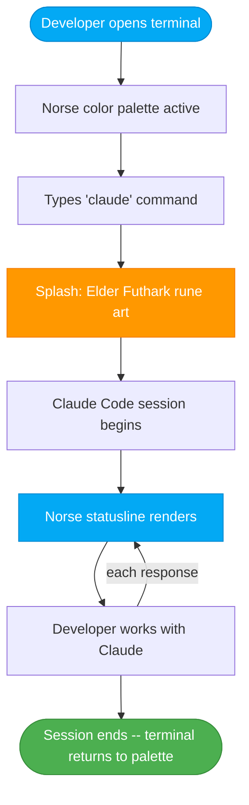

# Product Design Brief: Claude Code Terminal Skin -- The War Room Console

## Problem Statement

Developers on Fenrir Ledger spend the majority of their working hours inside a terminal running Claude Code. The terminal is a plain, generic environment that offers no connection to the product they are building. Every other surface of Fenrir Ledger -- the dashboard, the modals, the easter eggs, the console signature -- carries the Dark Nordic War Room identity. The terminal, where the team actually lives, does not.

This is a missed opportunity. A developer who launches Claude Code and sees Fenrir's runes, gold accents, and Norse-flavored status information is immediately grounded in the world of the product. It reinforces brand identity, builds craft pride, and makes the daily tool feel like it belongs to this project.

Why now: The existing statusline script at `~/.claude/statusline-command.sh` is functional but visually generic. The infrastructure for customization already exists -- statusline, splash wrapper, theme selection. The effort to transform these from generic to Norse-branded is low (shell scripting and config), and the payoff is high (every session, every developer, every day).

## Target User

Developers on the Fenrir Ledger team who use Claude Code as their primary AI coding assistant. These developers work in terminal emulators (iTerm2, Ghostty, WezTerm, Kitty, or the default macOS Terminal) on macOS. They value a polished, cohesive development environment and appreciate craft details that make their tools feel intentional rather than default.

Secondary audience: Any developer who clones the Fenrir Ledger repo and wants the full experience. The skin configuration should be documented and easy to adopt.

## Desired Outcome

After this ships, a developer working on Fenrir Ledger will experience:

1. **A Norse-themed splash screen** when they launch Claude Code, featuring Elder Futhark rune art and a forge-flavored greeting -- establishing context before the first prompt.
2. **A branded statusline** at the bottom of every Claude Code session, displaying session metadata with Norse labels, gold/teal/amber coloring, and rune decorators -- replacing the generic statusline.
3. **A terminal color palette** that aligns with the Dark Nordic War Room aesthetic -- void-black background, gold accents, realm-mapped status colors -- so the entire terminal surface reinforces the brand.

## Interactions and Developer Flow

### Moment 1: Terminal Launch (Color Palette)

The developer opens their terminal emulator. The background is void-black (#07070d). Text is warm parchment. The cursor blinks gold. Every `ls`, `git status`, and `npm run` command renders in the project's palette. This is the ambient layer -- it is always on, independent of Claude Code.

**Configuration surface**: Terminal emulator color profile (iTerm2 `.itermcolors`, Ghostty config, etc.)

### Moment 2: Claude Code Launch (Splash Screen)

The developer types `claude` (or an alias). Before Claude Code's UI takes over, a splash screen renders:

```
   |      | |    |   |   |--       |      |--
   |\     |/|    |\  |   |  \      |      |  \
   | \    | |    | \ |   |--       |      |--
   |\     |\|    |  \|   |  \      |      |  \
   | \    | |    |   |   |   \     |      |   \
   |      | |    |   |   |         |      |
   |      | |    |   |   |         |      |

   F E H U   E H W A Z   N A U D I Z   R A I D H O   I S A   R A I D H O

   The Forge awaits. Fenrir sees all chains.
```

The rune art is rendered in gold ANSI color. The subtitle line is dimmed. This reuses the Elder Futhark glyph art from `ConsoleSignature.tsx` (easter egg #4), adapted for terminal rendering.

**Configuration surface**: Shell function wrapper in `.zshrc` that prints the splash, then exec's `claude`.

### Moment 3: Working Session (Statusline)

While the developer works with Claude Code, a persistent statusline bar sits at the bottom of the terminal. It updates after each assistant message.

**Layout -- Main Session (single line)**:

```
 [Rune] Branch  Model              Context Bar  Cost  Session Time
```

Concrete example:

```
 Fehu feat/google-picker  Opus 4.6          [===========----] 73%  $2.41  12m 38s
```

**Layout -- Subagent Session (simplified)**:

```
 [Rune] Branch  Agent Name                              Context Bar
```

Concrete example:

```
 Fehu feat/google-picker  Freya                                [========] 45%
```

**Configuration surface**: Shell script at `~/.claude/statusline-command.sh`, receives session JSON on stdin.

### Moment 4: Session End

No special handling needed. The splash is a pre-launch wrapper; the statusline is managed by Claude Code's lifecycle. When the session ends, the terminal returns to its normal state (still styled by the color palette).

## Statusline Specification

### Data Fields and Norse Labels

The statusline receives a JSON object on stdin with the following fields. Each field maps to a Norse-flavored display element:

| JSON Field | Norse Label | Display | Color |
|---|---|---|---|
| `context_window.used_percentage` | (progress bar) | Block-fill bar `[===----]` with percentage | Teal (#0a8c6e) when < 60%, amber (#f59e0b) when 60-85%, red (#ef4444) when > 85% |
| `cost.total_cost_usd` | (gold coin) | Dollar amount, two decimal places | Gold (#c9920a) |
| `cost.total_duration_ms` | (hourglass) | `Nm Ns` format | Dim/muted |
| `model.display_name` | (none -- raw) | Model name | Cyan |
| `workspace.current_dir` | (none) | Not displayed directly; used for git detection | -- |
| Git branch | (rune prefix) | Branch name with dirty/untracked markers | Teal (#0a8c6e) |
| `agent.name` | (none -- raw) | Agent display name (subagent mode only) | Gold (#c9920a) |

### Rune Prefix

Replace the generic branch display with a leading Elder Futhark rune that serves as the Fenrir brand mark. The rune is **Fehu** (meaning "wealth, cattle" -- fitting for a financial ledger). Rendered as:

- Unicode: U+16A0 = display character (dependent on terminal font support)
- Fallback: The ASCII text `[F]` if the terminal cannot render runes

The rune appears in gold (#c9920a) at the left edge of the statusline, acting as a visual anchor.

### Context Window Progress Bar

The progress bar is the most critical information in the statusline. It uses block-fill characters with color thresholds that map to Norse realm states:

| Threshold | Color | Realm Analogy |
|---|---|---|
| 0-59% | Teal (#0a8c6e) | Asgard -- all is well |
| 60-85% | Amber (#f59e0b) | Hati approaches -- caution |
| 86-100% | Red (#ef4444) | Ragnarok -- context is nearly exhausted |

Bar rendering: `[` + filled blocks + empty blocks + `]` + space + percentage. Width: 15 characters for main session, 8 characters for subagent.

### ANSI Color Mapping

The statusline uses ANSI 256-color escapes for consistency across terminal emulators:

| Element | ANSI Code | Hex Equivalent | Notes |
|---|---|---|---|
| Gold accent | `\033[38;5;178m` | ~#c9920a | Rune prefix, cost, agent name |
| Teal/healthy | `\033[38;5;36m` | ~#0a8c6e | Branch, healthy context bar |
| Amber/warning | `\033[38;5;214m` | ~#f59e0b | Context bar 60-85% |
| Red/critical | `\033[38;5;196m` | ~#ef4444 | Context bar > 85% |
| Cyan | `\033[0;36m` | -- | Model name |
| Dim | `\033[2m` | -- | Separators, timestamps, empty bar segments |
| Reset | `\033[0m` | -- | After every colored segment |

### Width Responsiveness

The statusline must adapt to terminal width (obtained via `tput cols`). Behavior:

- **>= 100 columns**: Full layout with all fields
- **80-99 columns**: Drop session duration
- **60-79 columns**: Drop model name, show only rune + branch + context bar + cost
- **< 60 columns**: Rune + context bar + percentage only

### Subagent Mode

When `agent.name` is present in the JSON input, render the simplified subagent layout. The agent name replaces the model name and cost fields. The context bar is narrower (8 characters). This keeps the subagent line compact since subagents run alongside the main session.

## Splash Screen Specification

### Content

The splash screen displays three elements in order:

1. **Elder Futhark rune art** -- The same FENRIR glyph art used in `ConsoleSignature.tsx`, rendered in gold ANSI. This art spells out F-E-N-R-I-R using stylized rune-like letterforms, 7 lines tall.

2. **Rune label line** -- The Elder Futhark rune names beneath the art:
   ```
   F E H U   E H W A Z   N A U D I Z   R A I D H O   I S A   R A I D H O
   ```
   Rendered in dim gold.

3. **Tagline** -- A single line, dimmed:
   ```
   The Forge awaits. Fenrir sees all chains.
   ```

### Implementation

The splash is implemented as a shell function wrapper in `.zshrc`:

```
fenrir-claude() {
    # Print splash art in gold ANSI
    # ... (art lines)
    # Brief pause (200ms) so the user can see it
    # Then exec into claude with all arguments forwarded
    command claude "$@"
}
alias claude="fenrir-claude"
```

The splash prints to stdout, then immediately launches Claude Code. There is no interactive pause -- the art appears and Claude takes over. A 200ms sleep between the art and the launch is acceptable to ensure the art renders before Claude clears the screen.

### Color

- Rune art: Gold (`\033[38;5;178m`)
- Rune label line: Dim gold (`\033[2;38;5;178m`)
- Tagline: Dim stone grey (`\033[2;38;5;245m`)
- "Built by" credit line: Very dim (`\033[2;38;5;240m`)

### Sizing

The rune art is approximately 56 characters wide and 7 lines tall. It renders well in terminals 80 columns or wider. For narrow terminals (< 60 columns), the splash should degrade gracefully -- either center-crop or skip the art and show only the tagline.

## Terminal Color Palette Specification

### ANSI 16-Color Mapping

Terminal emulators use a base palette of 16 colors (8 normal + 8 bright). The Norse War Room palette maps as follows:

| ANSI Slot | Standard Name | Norse Assignment | Hex | Purpose |
|---|---|---|---|---|
| 0 (Black) | Background | Void Black | #07070d | Terminal background |
| 1 (Red) | Red | Muspel Flame | #ef4444 | Errors, critical |
| 2 (Green) | Green | Asgard Teal | #0a8c6e | Success, healthy |
| 3 (Yellow) | Yellow | Hati Amber | #f59e0b | Warnings, caution |
| 4 (Blue) | Blue | Niflheim Blue | #3b82f6 | Info, links |
| 5 (Magenta) | Magenta | Seidr Purple | #8b5cf6 | Highlights, special |
| 6 (Cyan) | Cyan | Bifrost Teal | #06b6d4 | Commands, paths |
| 7 (White) | White | Parchment | #e8e0d0 | Primary text |
| 8 (Bright Black) | Bright Black | Iron Grey | #4a4a5a | Comments, dim text |
| 9 (Bright Red) | Bright Red | Ragnarok Red | #f87171 | Bright errors |
| 10 (Bright Green) | Bright Green | Yggdrasil Green | #34d399 | Bright success |
| 11 (Bright Yellow) | Bright Yellow | Forge Gold | #fbbf24 | Bright warnings, gold accent |
| 12 (Bright Blue) | Bright Blue | Jotunheim Blue | #60a5fa | Bright info |
| 13 (Bright Magenta) | Bright Magenta | Vanaheim Violet | #a78bfa | Bright highlights |
| 14 (Bright Cyan) | Bright Cyan | Midgard Cyan | #22d3ee | Bright paths |
| 15 (Bright White) | Bright White | Starlight | #f5f5f5 | Bright primary text |

### Additional Settings

| Setting | Value | Notes |
|---|---|---|
| Background | #07070d | Void Black -- matches the app |
| Foreground | #e8e0d0 | Parchment -- warm white, not harsh blue-white |
| Cursor | #c9920a | Gold -- the brand accent |
| Selection background | #c9920a33 | Gold at 20% opacity |
| Selection foreground | #f5f5f5 | Bright white for contrast |

### Terminal Emulator Profiles

The palette should be distributed as configuration files for common terminal emulators:

- **iTerm2**: `.itermcolors` XML file (importable via Preferences > Profiles > Colors)
- **Ghostty**: Key-value pairs in `~/.config/ghostty/config`
- **WezTerm**: Lua color scheme in `~/.config/wezterm/colors/`
- **Kitty**: `~/.config/kitty/themes/fenrir.conf`
- **macOS Terminal.app**: `.terminal` profile file

Priority: iTerm2 and Ghostty first (most common on the team). Others as nice-to-have.

### Claude Code Theme Selection

Claude Code's `/theme` command should be set to **"ANSI dark"**. This theme defers all color decisions to the terminal emulator's palette, which means the Norse palette defined above will flow through to Claude Code's syntax highlighting, diff rendering, and UI elements automatically.

No custom Claude Code theme file is needed -- the terminal palette does the work.

## Flow Diagram: Developer Session Lifecycle



## Look and Feel Direction

- **Ambient, not intrusive**: The skin is environmental. It sets the mood but never interferes with the developer's workflow. The statusline is glanceable. The splash is momentary. The palette is just... there.
- **Consistent with the app**: Someone who has the Fenrir Ledger web app open in one tab and Claude Code in another tab should feel visual continuity. Same gold. Same void-black. Same Norse tone.
- **Craft pride**: The details matter. A rune prefix instead of a generic icon. Norse realm names for color thresholds. A forging metaphor in the splash tagline. These small touches signal that the team cares about every surface, not just the user-facing ones.
- **Monospace-native**: Everything in the terminal skin is designed for monospace rendering. No proportional font assumptions. Unicode runes are used where terminal font support is reliable; ASCII fallbacks exist where it is not.

## Market Fit and Differentiation

This is an internal developer experience feature, not a user-facing product differentiator. Its value is:

- **Team cohesion**: A shared visual identity across every developer's terminal reinforces the project's personality and makes onboarding feel intentional.
- **Open-source showcase**: When the repo is public, the terminal skin configuration in the repo demonstrates attention to developer experience and craft -- a signal to contributors and reviewers that this project takes tooling seriously.
- **Reusable pattern**: The statusline script, splash wrapper, and palette files are generic enough to be adapted by other projects. Fenrir Ledger can be a reference implementation for Claude Code terminal customization.

## Acceptance Criteria

### Statusline

- [ ] The statusline renders a single line with: rune prefix, git branch (with dirty/untracked markers), model name, context window progress bar with percentage, cost in USD, and session duration
- [ ] The rune prefix is the Fehu rune character rendered in gold ANSI color
- [ ] The context window progress bar changes color based on usage: teal at 0-59%, amber at 60-85%, red at 86-100%
- [ ] The statusline adapts to terminal width: full layout at >= 100 columns, progressively dropping fields at narrower widths
- [ ] In subagent mode (when `agent.name` is present), the statusline shows the simplified layout: rune + branch + agent name + narrow context bar
- [ ] The statusline script processes JSON from stdin and outputs valid ANSI-colored text
- [ ] No raw ANSI escape codes are visible to the user -- all sequences are properly terminated with reset codes

### Splash Screen

- [ ] Typing `claude` (via the alias) displays the Elder Futhark FENRIR rune art in gold before Claude Code launches
- [ ] The rune label line appears below the art showing the rune names
- [ ] A tagline appears below the label line in dimmed text
- [ ] Claude Code launches normally after the splash with all arguments forwarded
- [ ] The splash does not interfere with Claude Code's own UI initialization
- [ ] The splash degrades gracefully in terminals narrower than 60 columns

### Terminal Color Palette

- [ ] An iTerm2 `.itermcolors` color profile file is provided with the 16 ANSI colors mapped to the Norse palette
- [ ] A Ghostty configuration snippet is provided with equivalent color mappings
- [ ] The background color is void-black (#07070d) and the foreground is parchment (#e8e0d0)
- [ ] The cursor color is gold (#c9920a)
- [ ] When the "ANSI dark" theme is selected in Claude Code, the Norse palette colors flow through to Claude Code's rendering

### Integration

- [ ] All configuration files are stored in the repository (under a `terminal/` or `.claude/` directory) so they can be version-controlled and shared
- [ ] A setup guide documents how to install the splash wrapper, statusline script, and color palette
- [ ] The setup is non-destructive: it does not overwrite existing terminal configuration without the developer's explicit action

## Priority and Constraints

- **Priority**: P3-Medium -- this is a developer experience enhancement, not a user-facing feature. It ships when there is bandwidth between product sprints.
- **Sprint target**: Unscheduled (available as a pick-up task)
- **Dependencies**: None. This is pure shell scripting and terminal configuration. No app code changes required.
- **Max stories this sprint**: N/A (this is a single deliverable, not a sprint-scoped feature)
- **Estimated effort**: 1-2 days of shell scripting and testing across terminal emulators

## User Stories

### Story: Norse Statusline for Claude Code

- **As a**: Developer working on Fenrir Ledger in Claude Code
- **I want**: A branded statusline that displays session metadata with Norse-themed colors and a rune prefix
- **So that**: My terminal reflects the project's identity and gives me at-a-glance session information in the War Room aesthetic
- **Priority**: P3-Medium
- **Acceptance Criteria**:
  - [ ] Statusline shows rune prefix, branch, model, context bar, cost, and duration
  - [ ] Context bar color shifts at 60% and 85% thresholds (teal/amber/red)
  - [ ] Subagent mode shows simplified layout with agent name
  - [ ] Adapts to terminal width (graceful degradation at narrow widths)
- **UX Notes**: See statusline specification above. Colors use ANSI 256 codes for cross-terminal compatibility.
- **Status**: Backlog

### Story: Fenrir Splash Screen on Claude Code Launch

- **As a**: Developer launching Claude Code for a Fenrir Ledger session
- **I want**: To see the Elder Futhark FENRIR rune art and a forge-themed greeting before the session starts
- **So that**: Every session begins with a moment of brand immersion that grounds me in the project
- **Priority**: P3-Medium
- **Acceptance Criteria**:
  - [ ] Shell function wrapper prints rune art in gold ANSI before launching Claude Code
  - [ ] Rune label line and tagline appear below the art
  - [ ] All arguments are forwarded to the `claude` command
  - [ ] Graceful degradation for narrow terminals
- **UX Notes**: Reuses the Elder Futhark letterforms from ConsoleSignature.tsx. Adapted for terminal monospace rendering.
- **Status**: Backlog

### Story: Norse Terminal Color Palette

- **As a**: Developer who wants my entire terminal environment to match the Fenrir Ledger aesthetic
- **I want**: Importable color palette profiles for my terminal emulator
- **So that**: Every command I run, not just Claude Code, renders in the Dark Nordic War Room color scheme
- **Priority**: P4-Nice-to-have
- **Acceptance Criteria**:
  - [ ] iTerm2 `.itermcolors` file provided and importable
  - [ ] Ghostty config snippet provided
  - [ ] Background, foreground, and cursor colors match the spec
  - [ ] "ANSI dark" theme in Claude Code inherits the palette correctly
- **UX Notes**: See terminal color palette specification. Norse realm names for each ANSI slot are documentation-only; the actual rendering is standard ANSI 16-color.
- **Status**: Backlog

## Open Questions for Principal Engineer

1. **Statusline script location**: The existing script lives at `~/.claude/statusline-command.sh` (user home). Should the repo-versioned script live in the repo (e.g., `.claude/statusline-command.sh`) with a symlink or install script to place it in `~/.claude/`? The repo copy is the source of truth; the home directory copy is the runtime target.

2. **Font support for runes**: The Fehu rune character (U+16A0) requires a font with Elder Futhark support. JetBrains Mono (our code font) does not include this block. Should we recommend a fallback font (e.g., Noto Sans Runic) in the terminal config, or default to the ASCII `[F]` fallback and treat Unicode runes as an optional enhancement?

3. **Splash timing**: Claude Code may clear the screen on startup, which could erase the splash art before the developer sees it. Is a `sleep 0.2` sufficient, or should the wrapper use a `read -t 1` (press-any-key with timeout) to ensure the splash is visible? Need to test the actual behavior.

4. **Multi-line statusline**: Claude Code's statusline supports multi-line output. Is a two-line statusline worth considering (line 1: branch + model + context; line 2: cost + duration + rune decorators), or does the vertical space cost outweigh the information density gain?

5. **Color profile distribution**: Should the `.itermcolors` and Ghostty config files live in the repo root (e.g., `terminal/` directory) or in a separate dotfiles-style location? Keeping them in-repo makes them versionable; keeping them separate avoids cluttering the project tree.

---

## Handoff Notes for Principal Engineer

### Key product decisions made and their rationale

1. **Rune prefix, not emoji**: The statusline uses the Fehu rune (or ASCII fallback) instead of generic emoji. This is a deliberate brand choice -- every visual element should feel Norse, even at the single-character level.

2. **Three-threshold context bar**: The context window bar uses Asgard/Hati/Ragnarok color thresholds (teal/amber/red) to match the realm-based status system used throughout the app. A developer who sees amber in the statusline should have the same "caution" instinct as seeing Hati amber on the dashboard.

3. **Splash is momentary, not blocking**: The splash art is fire-and-forget. No keypress required. This respects developer flow -- the art is a greeting, not a gate.

4. **P3 priority**: This is a craft-and-pride feature. It ships when there is breathing room, not at the expense of user-facing work.

### UX constraints the technical solution must respect

- The statusline must be a single line by default (multi-line is an open question)
- All ANSI escape sequences must be properly reset to avoid color bleed into Claude Code's own rendering
- The splash must forward all arguments to `claude` unchanged
- Color palette profiles must be importable without overwriting existing terminal configuration

### Open questions that need technical feasibility assessment

- See "Open Questions for Principal Engineer" above (5 questions)
- Most critical: splash timing and whether Claude Code's screen clear erases it

### Non-negotiable requirements

- Gold (#c9920a equivalent in ANSI 256) is the primary accent color across all surfaces
- Void-black (#07070d) is the background color in the terminal palette
- The context bar must use the three-tier realm color thresholds -- no generic green/yellow/red

### Areas where technical trade-offs are acceptable

- The Fehu rune character can fall back to ASCII `[F]` if font support is unreliable
- The splash screen can be skipped entirely in narrow terminals rather than attempting a degraded layout
- Only iTerm2 and Ghostty palette files are required initially; other terminal emulators are nice-to-have
- The statusline width responsiveness breakpoints (100/80/60) are suggestions -- adjust based on what looks right in practice
