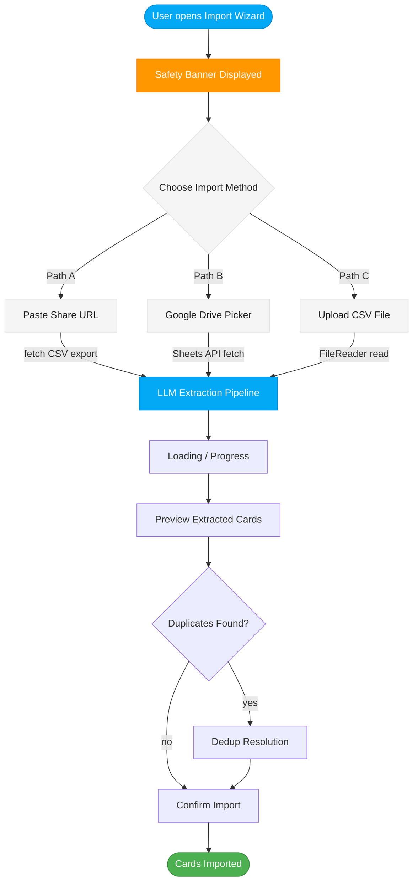

# Product Design Brief: Import Workflow v2 — Three Paths to the Forge

## Problem Statement

Today, Fenrir Ledger supports one import method: paste a publicly shared Google Sheets URL. This works, but it has friction points that prevent many users from getting their data in:

1. **Public share requirement** -- Users must change their spreadsheet's sharing settings to "Anyone with the link can view" before importing. Many users are uncomfortable making their financial tracking data publicly accessible, even briefly.
2. **Google-only** -- Users who track cards in Excel, Numbers, or any non-Google tool have no import path at all. They must manually re-enter every card.
3. **No safety guardrails** -- The UI does not warn users about what should or should not be in their spreadsheet. A user who includes full credit card numbers in their tracking sheet will unknowingly send that data through our pipeline.

These three gaps block adoption for the exact users we want: power churners with 10-20+ cards who already have a tracking system and need a painless migration.

## Target User

Credit card churners and rewards optimizers who currently track their portfolio in a spreadsheet (Google Sheets, Excel, Numbers, CSV exports from other tools). They have 5-20+ cards, and manually re-entering each one is the primary reason they bounce off the app before getting value.

Context: These users are methodical, data-aware, and privacy-conscious about their financial information. They want a fast, trustworthy import -- not a "share your data with the world" requirement.

## Desired Outcome

After this ships, a user can get their existing card portfolio into Fenrir Ledger through whichever path fits their setup:

- **Path A**: Paste a Google Sheets share URL (current flow, improved)
- **Path B**: Browse and select a sheet from their Google Drive without making it public (new)
- **Path C**: Drag-and-drop or upload a local CSV file (new)

All three paths converge on the same backend LLM extraction pipeline and the same preview/dedup/confirm flow. The user's experience after choosing their import method is identical regardless of which path they took.

## Safety and Privacy Requirements

### CRITICAL: No Sensitive Financial Data in Spreadsheets

The import feature processes spreadsheet data containing card tracking information. Under no circumstances should users include actual credit card numbers, CVV codes, PINs, security questions, or account passwords in their spreadsheets.

**Required UI elements:**

1. **Pre-import safety banner** -- Before the user selects any import method, display a prominent warning:

   > "Your spreadsheet should contain card names, issuers, fees, and dates -- never full card numbers, CVVs, PINs, or passwords. Fenrir Ledger does not need or store sensitive payment credentials."

2. **Helper text on what to include** -- Show a concise checklist of expected fields:
   - Card name / product (e.g., "Sapphire Preferred")
   - Issuer (e.g., "Chase", "Amex")
   - Annual fee amount
   - Open date
   - Bonus details (spend requirement, deadline, status)
   - Notes

3. **Helper text on what to exclude** -- Explicit warning list:
   - Full credit card numbers (16 digits)
   - CVV / security codes
   - PINs
   - Account passwords
   - Social Security numbers
   - Bank account numbers

4. **LLM extraction prompt hardening** -- The extraction prompt must instruct the LLM to **ignore and never return** any field that looks like a full card number (13-19 consecutive digits), CVV (3-4 digits in a CVV-labeled column), or SSN (9 digits in XXX-XX-XXXX format). If the LLM detects such data, the response should include a warning field that the UI surfaces to the user.

5. **Post-import warning** -- If the LLM flags potential sensitive data in the source, display a warning in the preview step before the user confirms import.

### Data Flow Privacy

- **Path A (Share URL)**: The spreadsheet must be publicly accessible. The UI must clearly explain this requirement and recommend the user remove the public share after import completes.
- **Path B (Google Picker)**: The spreadsheet remains private. Access is granted through the user's own Google OAuth token. This is the most privacy-friendly path for Google Sheets users.
- **Path C (CSV Upload)**: The file never leaves the browser until the user explicitly submits. The CSV content is read client-side using the File API and sent to our backend for LLM extraction. No file is stored server-side.

## Interactions and User Flow

### Entry Point

The Import Wizard is triggered from the dashboard (existing button). The wizard opens as a modal dialog.

### Step 1: Method Selection

The user sees three import options presented as selectable cards or tabs:

```
+------------------------------------------+
|  How would you like to import?           |
|                                          |
|  [safety banner -- see above]            |
|                                          |
|  +----------+  +----------+  +--------+  |
|  | Paste    |  | Browse   |  | Upload |  |
|  | Share    |  | Google   |  | CSV    |  |
|  | URL      |  | Drive    |  | File   |  |
|  +----------+  +----------+  +--------+  |
|                                          |
|  Each option includes a 1-line           |
|  description of what it does.            |
+------------------------------------------+
```

Norse-themed option labels (for Luna to finalize):
- **Path A**: "Share a Scroll" -- Paste a Google Sheets URL
- **Path B**: "Browse the Archives" -- Pick a sheet from Google Drive
- **Path C**: "Deliver a Rune-Stone" -- Upload a CSV file

### Step 2A: Share URL (existing flow, enhanced)

1. User pastes a Google Sheets share URL
2. URL validation (must contain `docs.google.com/spreadsheets`)
3. Tip text: "Make sure the spreadsheet is shared as 'Anyone with the link can view'"
4. Tip text after import: "You can remove the public share now -- Fenrir has the data"
5. Submit triggers the existing pipeline: fetch CSV export -> LLM extraction -> preview

**Enhancement over current**: Add the safety banner, helper text, and post-share reminder.

### Step 2B: Google Sheets Picker (new)

1. User clicks "Browse Google Drive"
2. The Google Picker API opens an embedded file-selection dialog
3. User browses their Google Drive, filters by Sheets, and selects a spreadsheet
4. The Picker returns the file ID (and optionally a specific sheet/tab)
5. We use the Google Sheets API (with the user's access token) to fetch the sheet content as CSV
6. The CSV text is sent to the same LLM extraction pipeline
7. The user never needs to make the spreadsheet public

**Key UX**: This should feel like a native "Open File" dialog. The user does not leave Fenrir Ledger. The Picker renders inside an overlay/iframe.

### Step 2C: CSV File Upload (new)

1. User drags a CSV file onto a drop zone, or clicks to open a native file picker
2. Client-side: the file is read using `FileReader` API (no server upload of the raw file)
3. Basic client-side validation:
   - File must be `.csv` (reject `.xlsx`, `.numbers`, etc. with a helpful message)
   - File size limit: 1 MB (matches existing CSV_TRUNCATION_LIMIT of 100K chars with margin)
   - UTF-8 encoding expected
4. The CSV text content is sent to the same LLM extraction endpoint
5. No Google integration needed

**Drop zone UX**: A dashed-border rectangle with "Drag your CSV here or click to browse" text. Norse-flavored: "Drop your rune-stone here, or click to summon it from the realm of files."

### Step 3: Loading (shared across all methods)

All three paths converge here. The existing loading step works as-is:
- Spinner with Norse phase labels ("Fetching the sacred scrolls...", "The runes are being deciphered...")
- WebSocket progress when backend is available, HTTP fallback otherwise
- Cancel button

### Step 4: Preview (shared)

Existing preview step -- shows extracted cards with issuer, name, date, fee. No changes needed except:
- If the LLM flagged potential sensitive data, show a warning banner at the top of the preview
- The "Import N cards" confirmation button

### Step 5: Dedup (shared)

Existing dedup step -- detects duplicates against existing cards, offers skip-duplicates or import-all.

### Step 6: Success (shared)

Existing success step with the Fehu rune and "The runes have been inscribed in the ledger."

### Flow Diagram



## Technical Feasibility: Google Picker API (Path B)

### What is the Google Picker API?

The Google Picker API provides a file-selection dialog for Google Drive content. It renders as an iframe overlay and lets users browse, search, and select files from their Drive without the app needing broad Drive access.

Reference: https://developers.google.com/drive/picker

### Current Auth State

Fenrir Ledger currently uses Google OIDC with PKCE (public client). The OAuth scope is `openid email profile`. The user receives an `id_token` (identity) and an `access_token` (limited to profile scopes).

### Required Additional Scopes

To use the Google Picker and then read the selected spreadsheet's content, we need:

| Scope | Purpose |
|-------|---------|
| `https://www.googleapis.com/auth/drive.file` | Access files the user explicitly selects via the Picker. This is the narrowest Drive scope -- it only grants access to files the user interacts with through our app, not their entire Drive. |
| (alternative) `https://www.googleapis.com/auth/drive.readonly` | Read-only access to all Drive files. Broader than needed -- prefer `drive.file`. |
| `https://www.googleapis.com/auth/spreadsheets.readonly` | Read spreadsheet content. Needed to fetch cell data after the user selects a sheet. |

**Recommended approach**: Request `drive.file` + `spreadsheets.readonly` in addition to the existing `openid email profile`. The `drive.file` scope is consent-friendly because Google's consent screen explains it as "See and download files you've opened with this app."

### Implementation Approach

1. **Google API Client Library**: Load `https://apis.google.com/js/api.js` and `https://accounts.google.com/gsi/client` for the Picker.
2. **Picker Configuration**:
   - View: `google.picker.ViewId.SPREADSHEETS` (filters to Sheets only)
   - Feature: `google.picker.Feature.NAV_HIDDEN` (simplifies the UI)
   - OAuth token: Pass the user's `access_token` from the existing session
   - Developer key: Requires a Google API key (not a secret -- this is a public browser API key restricted by domain)
3. **After Selection**: The Picker returns a `doc.id` (the spreadsheet file ID). Use the Google Sheets API v4 to fetch the sheet content:
   ```
   GET https://sheets.googleapis.com/v4/spreadsheets/{spreadsheetId}/values/{range}?alt=json
   Authorization: Bearer {access_token}
   ```
   Then convert the response to CSV text and feed it to the existing LLM pipeline.

### Feasibility Assessment

| Aspect | Assessment |
|--------|------------|
| **Works with existing OIDC?** | Partially. The Picker needs an `access_token` with Drive scopes. Our current auth only requests `openid email profile`. We need to add scopes to the OAuth consent flow. |
| **Incremental consent?** | Google supports incremental authorization -- we can request the basic scopes on sign-in and the Drive scopes only when the user first opens the Picker. This avoids scaring users with Drive permissions at sign-up. |
| **API key requirement** | The Picker requires a Google API key (public, domain-restricted). This is a new infrastructure requirement but not sensitive. |
| **Google Cloud Console** | Need to enable the Google Picker API and Google Sheets API v4 in the project's GCP console. |
| **Verification / consent screen** | Adding `drive.file` scope requires the app to go through Google's OAuth consent screen verification if we want to remove the "unverified app" warning for non-test users. This is a process that takes days-to-weeks. |
| **Complexity** | Medium. The Picker API is well-documented but has quirks with token management and iframe rendering. Estimated 2-3 days of engineering for a solid implementation. |
| **UX quality** | High. The Picker is a polished, Google-maintained component. Users will recognize it from other apps. |

### Risks and Trade-offs

1. **Scope escalation at consent**: Users who signed up with `openid email profile` will see a new consent screen asking for Drive access the first time they use the Picker. Some users may decline. Mitigation: Only request these scopes when the user explicitly chooses Path B. Use incremental consent.

2. **Google verification process**: Adding Drive scopes moves us from "basic" to "sensitive" verification tier. This requires a privacy policy URL, a demo video, and a review by Google. Timeline: 1-3 weeks.

3. **Token refresh**: The `access_token` from OIDC has a short lifetime (~1 hour). If the user's token expires while they are browsing the Picker, it will fail. Mitigation: Check token expiry before opening the Picker and refresh if needed.

4. **No access_token for anonymous users**: The Picker only works for signed-in users. Anonymous users must use Path A or Path C.

### Recommendation

Build Path B as P2 (second priority). It is technically feasible and provides the best UX for Google Sheets users, but the Google verification process and scope escalation create timeline risk. Path A improvements and Path C are faster to ship and serve more users.

## Look and Feel Direction

- The method selection step should feel like choosing your weapon before entering the forge
- Card-style selectable options (not tabs, not radio buttons) -- each method gets a visual card with an icon, title, and 1-line description
- The safety banner should be prominent but not alarming -- amber/gold warning tone, not red/critical
- The drop zone for CSV upload should have a dashed border that animates on drag-over (glows gold)
- All text follows the Saga Ledger voice: Norse metaphors, no emojis, authoritative but not intimidating
- Mobile: The three method cards stack vertically on narrow screens

## Market Fit and Differentiation

Most credit card tracking tools either require manual entry or offer CSV import only. Fenrir Ledger's three-path approach meets users where they are:

- **Versus manual entry apps**: We offer three automated import paths, reducing a 30-minute data entry session to 30 seconds
- **Versus tools that require Google Sheets**: We support CSV upload for users outside the Google ecosystem
- **Versus tools that require public sharing**: The Google Picker path keeps spreadsheets private
- **LLM-powered extraction**: Users do not need to format their spreadsheet in a specific way. The LLM reads whatever column structure they have and extracts card data. This is a genuine differentiator -- no template required.

## Acceptance Criteria

### Safety
- [ ] A safety banner is visible before the user selects any import method, explaining what data to include and exclude
- [ ] The LLM extraction prompt explicitly instructs the model to ignore and flag potential card numbers (13-19 digits), CVVs, and SSNs
- [ ] If the LLM flags potential sensitive data, a warning is displayed in the preview step
- [ ] No full card numbers, CVVs, PINs, or SSNs are ever stored or returned in the extracted card data

### Path A: Share URL (enhanced)
- [ ] Existing share URL flow continues to work as before
- [ ] Safety banner is shown before URL entry
- [ ] Post-import reminder tells the user they can remove the public share
- [ ] URL validation rejects non-Google-Sheets URLs with a clear message

### Path B: Google Picker (new)
- [ ] Clicking "Browse Google Drive" opens the Google Picker overlay
- [ ] The Picker filters to show only Google Sheets files
- [ ] Selecting a sheet fetches its content via the Sheets API using the user's access token
- [ ] The fetched content is sent to the LLM extraction pipeline
- [ ] The user never needs to make the spreadsheet public
- [ ] If the user is not signed in, Path B is disabled with a message: "Sign in to browse your Google Drive"
- [ ] Incremental consent: Drive scopes are requested only when the user first uses Path B, not at initial sign-in
- [ ] Token expiry is handled gracefully -- refresh before opening the Picker if needed

### Path C: CSV Upload (new)
- [ ] A drag-and-drop zone accepts `.csv` files
- [ ] A file picker button allows selecting a `.csv` file from the local filesystem
- [ ] Non-CSV files are rejected with a clear message (e.g., "Please upload a .csv file. For Excel files, export as CSV first.")
- [ ] Files over 1 MB are rejected with a size limit message
- [ ] The CSV content is read client-side (File API) and sent to the LLM extraction endpoint
- [ ] The file is never uploaded to the server as a raw file -- only the text content is transmitted
- [ ] Works for both signed-in and anonymous users

### Shared (all paths)
- [ ] All three paths converge on the same loading -> preview -> dedup -> success flow
- [ ] The method selection step is the first thing the user sees when opening the Import Wizard
- [ ] Mobile responsive: method cards stack vertically on screens < 768px
- [ ] Accessible: keyboard navigation works across all method cards, ARIA labels on all interactive elements
- [ ] The Import Wizard modal follows the existing sizing convention: `w-[92vw] max-w-[680px] max-h-[90vh]`

## Priority and Constraints

- **Priority**: P1 overall; individual methods prioritized below
- **Sprint target**: Sprint 6
- **Max stories this sprint**: 5
- **Dependencies**:
  - Path B depends on Google Cloud Console configuration (API key, enabled APIs, OAuth verification)
  - Path B depends on incremental consent support in the auth flow
  - Paths A and C have no new infrastructure dependencies

### Priority Order (within the feature)

| Priority | Method | Rationale |
|----------|--------|-----------|
| P1 | Path C (CSV Upload) | Zero dependencies, works for all users (signed-in and anonymous), broadens import beyond Google ecosystem. Fastest to ship. |
| P1 | Path A enhancement (Safety + UX) | Improves existing flow with safety guardrails. Minimal code change. |
| P2 | Method selection step | The UI scaffold that presents all three options. Required before Path B but can ship with A + C functional. |
| P2 | Path B (Google Picker) | Best UX for Google Sheets users but requires GCP configuration, scope changes, and Google verification. Ship after A + C are solid. |
| P2 | LLM prompt hardening | Safety improvement to the extraction prompt. Can ship alongside any path. |

## Open Questions for Principal Engineer

1. **LLM provider abstraction**: The `getLlmProvider()` factory was recently refactored. Does the current abstraction support receiving CSV text directly (not from a URL)? Path C sends raw CSV text without a Google Sheets URL -- the pipeline needs a way to skip the URL-parse and CSV-fetch steps and go straight to prompt + LLM.

2. **Backend vs. serverless for CSV upload**: Should the CSV text from Path C go through the WebSocket backend (like Path A), or through the serverless HTTP route? The WebSocket path gives progress streaming; the HTTP path is simpler. Recommendation: support both, same as Path A.

3. **Google Picker API key**: Where should the browser API key be stored? It is not a secret (it is domain-restricted), but it is a credential. Suggest `NEXT_PUBLIC_GOOGLE_PICKER_API_KEY` in `.env`.

4. **Incremental consent implementation**: The current sign-in page requests `openid email profile`. For Path B, we need to trigger a new OAuth flow requesting Drive scopes, merge the new tokens into the existing session, and handle the case where the user declines. What is the best pattern for this in our PKCE flow?

5. **File size and row limits**: The current `CSV_TRUNCATION_LIMIT` is 100,000 characters. Is this appropriate for uploaded CSVs too? Should we have a separate, more generous limit for local files since there is no Google Sheets fetch overhead?

6. **Backend endpoint shape**: For CSV upload, should we create a new endpoint (e.g., `POST /import/csv` with body `{ csv: string }`) or extend the existing `POST /import` to accept either `{ url: string }` or `{ csv: string }`? Extending the existing endpoint is cleaner.

---

## User Stories

### Story 6.1: Import Method Selection Step

- **As a**: Credit card churner with cards tracked in a spreadsheet
- **I want**: To choose how I import my card data (URL, Google Drive, or CSV file)
- **So that**: I can use whichever method fits my setup without being forced into a single workflow
- **Priority**: P1-Critical
- **Acceptance Criteria**:
  - [ ] The Import Wizard opens to a method selection step with three options
  - [ ] Each option has an icon, title, and 1-line description
  - [ ] A safety banner is displayed above the options explaining what data to include/exclude
  - [ ] Selecting an option navigates to the corresponding import step
  - [ ] Method cards stack vertically on mobile (< 768px)
  - [ ] Keyboard navigation: Tab between options, Enter to select
  - [ ] ARIA labels on all interactive elements
- **UX Notes**: See "Step 1: Method Selection" in the interactions section. Luna to finalize Norse-themed labels and card styling.
- **Status**: Backlog

### Story 6.2: CSV File Upload (Path C)

- **As a**: Credit card churner who tracks cards in Excel, Numbers, or another non-Google tool
- **I want**: To upload a CSV export of my card spreadsheet
- **So that**: I can import my cards without needing a Google Sheets account or making anything public
- **Priority**: P1-Critical
- **Acceptance Criteria**:
  - [ ] A drag-and-drop zone accepts `.csv` files with visual feedback on drag-over
  - [ ] A "Choose file" button opens the native file picker filtered to `.csv`
  - [ ] Non-CSV files are rejected with: "Please upload a .csv file. For Excel files, export as CSV first."
  - [ ] Files over 1 MB are rejected with a size limit message
  - [ ] CSV content is read client-side via FileReader API
  - [ ] The content is sent to the LLM extraction pipeline (same as URL import)
  - [ ] Preview, dedup, and success steps are identical to URL import
  - [ ] Works for both signed-in and anonymous users
  - [ ] No raw file is uploaded to the server -- only text content
- **UX Notes**: Drop zone with dashed gold border, drag-over glow animation. See flow description above.
- **Status**: Backlog

### Story 6.3: Share URL Enhancement (Path A Safety)

- **As a**: User importing via Google Sheets share URL
- **I want**: Clear guidance on what data my spreadsheet should contain and a reminder to remove public access after import
- **So that**: I do not accidentally expose sensitive financial data
- **Priority**: P1-Critical
- **Acceptance Criteria**:
  - [ ] Safety banner is visible before URL entry with include/exclude guidance
  - [ ] After successful import, a reminder is shown: "You can now remove the public share from your spreadsheet"
  - [ ] Existing URL validation and import flow continue to work as before
  - [ ] The safety banner is consistent with the method selection step banner
- **UX Notes**: Amber/gold warning tone, not red/critical. Norse voice.
- **Status**: Backlog

### Story 6.4: LLM Extraction Prompt Hardening

- **As a**: User who may have inadvertently included card numbers in my spreadsheet
- **I want**: The system to detect and discard sensitive financial data during extraction
- **So that**: Full card numbers, CVVs, and SSNs are never stored in Fenrir Ledger
- **Priority**: P2-High
- **Acceptance Criteria**:
  - [ ] The extraction prompt instructs the LLM to ignore columns/fields containing 13-19 consecutive digits (card numbers)
  - [ ] The extraction prompt instructs the LLM to ignore CVV fields (3-4 digit codes)
  - [ ] The extraction prompt instructs the LLM to ignore SSN patterns (XXX-XX-XXXX)
  - [ ] If sensitive data is detected, the LLM response includes a `sensitiveDataWarning: true` flag
  - [ ] If `sensitiveDataWarning` is present, the preview step displays a warning banner
  - [ ] The warning text advises the user to remove sensitive data from their spreadsheet
  - [ ] No card numbers, CVVs, or SSNs appear in the extracted card data under any circumstances
- **UX Notes**: Warning banner in preview step uses amber/gold styling.
- **Status**: Backlog

### Story 6.5: Google Drive Picker (Path B)

- **As a**: Google Sheets user who does not want to make my spreadsheet public
- **I want**: To browse and select a spreadsheet from my Google Drive directly within Fenrir Ledger
- **So that**: I can import card data without changing sharing settings
- **Priority**: P2-High
- **Acceptance Criteria**:
  - [ ] "Browse Google Drive" opens the Google Picker overlay within the modal
  - [ ] Picker shows only Google Sheets files (filtered view)
  - [ ] Selecting a sheet fetches its content via Google Sheets API v4 using the user's access token
  - [ ] Incremental consent: Drive scopes (`drive.file`, `spreadsheets.readonly`) are requested only when Path B is first used
  - [ ] If the user declines scope consent, a message explains why access is needed and offers Path A or C as alternatives
  - [ ] Token expiry check before opening Picker; auto-refresh if needed
  - [ ] Path B is disabled for anonymous users with: "Sign in to browse your Google Drive"
  - [ ] The fetched CSV text enters the same LLM extraction pipeline as Paths A and C
  - [ ] Preview, dedup, and success steps are identical to other paths
- **UX Notes**: The Picker should render as a clean overlay. Luna to define the loading/transition states around the Picker iframe.
- **Status**: Backlog

---

## Handoff Notes for Principal Engineer

### Key product decisions made and their rationale

1. **Three methods, one pipeline**: All import paths must converge on the same LLM extraction -> preview -> dedup -> confirm flow. No method gets its own special post-processing. This keeps the codebase simple and the user experience consistent.

2. **CSV Upload is highest priority**: Path C (CSV upload) ships before Path B (Google Picker) because it has zero infrastructure dependencies, works for all users, and broadens the import surface beyond Google. It is also the simplest to implement.

3. **Safety first, always**: The safety banner and LLM prompt hardening are non-negotiable. They ship with the first import method that reaches users.

4. **Incremental consent for Picker**: Do not add Drive scopes to the initial sign-in flow. Users who never use Path B should never see a Drive permissions prompt.

### UX constraints the technical solution must respect

- The Import Wizard modal sizing must remain `w-[92vw] max-w-[680px] max-h-[90vh]` per team norm
- Touch targets minimum 44x44px
- The method selection step must work on 375px-wide screens (cards stack vertically)
- The Google Picker iframe must render inside the modal area, not as a separate window
- The drag-and-drop zone must have clear visual states: default, drag-over (gold glow), file-accepted, error

### Open questions that need technical feasibility assessment

- See "Open Questions for Principal Engineer" section above (6 questions)
- Most critical: How to extend the import pipeline to accept raw CSV text without a URL

### Non-negotiable user experience requirements

- All three methods are presented as equal options -- no method is hidden or secondary
- The safety banner is always visible before import begins
- Anonymous users can use Path A and Path C without signing in
- Path B gracefully handles the case where the user is not signed in or declines scope consent

### Areas where technical trade-offs are acceptable

- Path B (Google Picker) can ship in a later sprint if GCP verification takes longer than expected
- The method selection step can use simple radio-style cards if the full card-with-icon design proves complex to implement within the sprint
- WebSocket progress for CSV upload is nice-to-have -- HTTP fallback is acceptable for Path C in the first iteration
- The CSV file size limit (1 MB) is a starting point; can be adjusted based on real-world usage data
