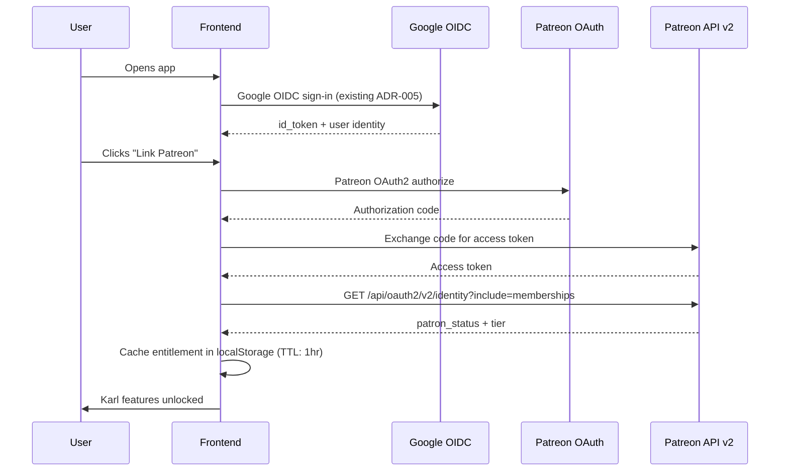
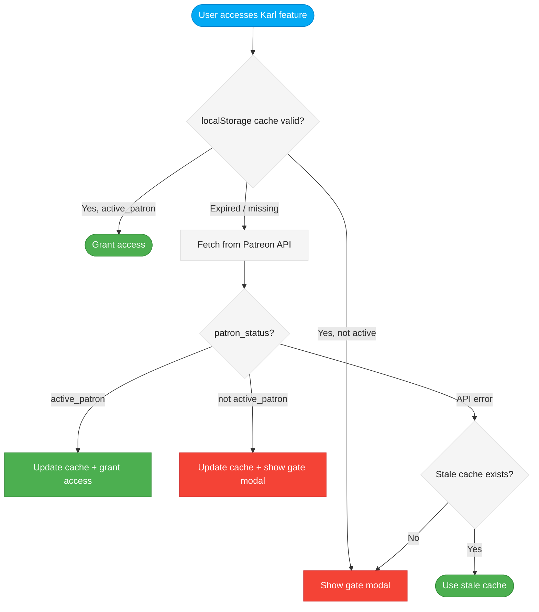

# Product Design Brief: Patreon Subscription Integration

## Problem Statement

Fenrir Ledger is a fully functional credit card churn tracker with no monetization. The product has shipped 5 sprints of features, including Google Sheets import, Easter eggs, accessibility, and a rich Norse-themed experience -- but there is no revenue model. As the product approaches GA, we need a sustainable funding mechanism that rewards supporters without compromising the anonymous-first, zero-friction experience that defines the product.

Patreon is the chosen platform because it separates payment/subscription management from identity. Google OIDC remains the sole identity provider. Patreon is an entitlement layer only.

## Target User

**Karl-tier subscribers** are credit card churners who:
- Already use Fenrir Ledger and find it valuable
- Manage 10+ cards and want deeper portfolio tools (analytics, export, multi-household)
- Are willing to pay $3-5/month for an indie tool they rely on
- Value the Norse aesthetic and want cosmetic perks (themes, badges, palettes)

**Thrall-tier users** (free) are everyone else -- new users, casual trackers, evaluators. They get the full current feature set with zero friction. Nothing they have today is taken away.

## Desired Outcome

After this ships, users can:
1. Link their Patreon account to Fenrir Ledger (via Patreon OAuth)
2. See their Karl subscription status reflected in the app UI
3. Access premium features (all 8 categories below) when subscribed
4. See clear, Norse-themed upsell modals on locked features when on the Thrall tier
5. Retain access through the end of their billing cycle if they cancel

## Tier Structure

### Thrall (Free)

*"The unchained wolf. No oath required."*

Everything that exists in Fenrir Ledger today. Full card management, dashboard, Howl Panel, Valhalla archive, Google Sheets import, all Easter eggs, all animations. No account required. Anonymous-first model (ADR-006) fully preserved.

- Price: $0 / forever
- Identity: None required (anonymous localStorage)
- Features: All current features as of Sprint 5

### Karl (Supporter)

*"The wolf who pledges to the forge. New runes are revealed."*

All Thrall features plus 8 categories of premium functionality (detailed below). Requires Google OIDC sign-in (existing ADR-005 flow) plus Patreon account linkage.

- Price: $3-5/month (via Patreon)
- Identity: Google OIDC (for app identity) + Patreon OAuth (for entitlement check)
- Features: Everything in Thrall + all premium features below

There is no third tier. Two tiers only: Thrall and Karl. This keeps the product simple and the value proposition clear.

## Premium Features (Karl-Only)

All 8 features below are net-new functionality. None exist in the current product. No existing user loses access to anything.

### (a) Cloud Sync / Multi-Device Access
Sync card portfolio across devices via cloud storage. Users can access their ledger from desktop and mobile with data kept in sync.
- **v1 scope**: This is a GA-level feature requiring backend infrastructure. For the Patreon integration sprint, this is gated but not implemented -- the lock modal explains it is "coming soon for Karl patrons." Implementation ships when cloud storage ships.
- **Entitlement**: Hard-gated. Modal on attempt.

### (b) Multi-Household Support
Track cards for multiple households (e.g., personal + partner + family member). Each household has its own card portfolio, isolated by householdId.
- **v1 scope**: The data model already supports householdId. This feature adds UI to create/switch between multiple households.
- **Entitlement**: Hard-gated. Household switcher only visible to Karl.

### (c) Advanced Analytics
Net ROI over time, reward optimization suggestions, annual fee vs. rewards breakeven analysis, portfolio health score.
- **v1 scope**: Read-only analytics dashboard derived from existing card data in localStorage.
- **Entitlement**: Hard-gated. Analytics route/tab locked for Thrall.

### (d) Priority Import
Higher rate limits on LLM-powered Google Sheets import. Thrall users get standard limits; Karl users get increased throughput.
- **v1 scope**: Rate limit differentiation on the `/api/sheets/import` route based on entitlement.
- **Entitlement**: Soft differentiation (higher limits, not a binary lock). Thrall still has import access.

### (e) Data Export
Export card portfolio as CSV or JSON for backup, spreadsheet analysis, or migration to other tools.
- **v1 scope**: Client-side export from localStorage. No server required.
- **Entitlement**: Hard-gated. Export button locked for Thrall.

### (f) Extended Card History / Archive View
Enhanced Valhalla with timeline view of all historical cards, including cards that were closed years ago, with trend data.
- **v1 scope**: Extended UI on the existing Valhalla route with richer historical display.
- **Entitlement**: Hard-gated. Extended view locked; basic Valhalla remains free.

### (g) Custom Notification Schedules
More granular reminder timing beyond the default 30/60/90 day thresholds. Users can set per-card custom reminder windows.
- **v1 scope**: UI for custom per-card notification timing, stored in localStorage.
- **Entitlement**: Hard-gated. Custom schedule UI locked for Thrall (defaults still work).

### (h) Cosmetic Perks
Exclusive Norse themes (alternate color palettes), badge flair on card tiles, and visual customization options.
- **v1 scope**: Theme switcher with 2-3 alternate palettes. Badge flair system for card tiles.
- **Entitlement**: Hard-gated. Theme switcher and badge options locked for Thrall.

## Feature Gating Approach: Hard Gate

All premium features use hard gating. When a Thrall user attempts to access a Karl feature:

1. The UI element (button, tab, route) is visible but visually marked as locked (dimmed with a lock icon)
2. Clicking triggers a Norse-themed modal explaining the feature and linking to Patreon
3. The user never sees partial functionality -- the feature is fully locked

### Gate Modal Pattern

```
+----------------------------------------------------+
|                                                      |
|   This Rune Is Sealed                                |
|                                                      |
|   {Feature description in Norse voice}               |
|                                                      |
|   Karl-tier patrons unlock this power.               |
|   Pledge to the forge and the rune reveals itself.   |
|                                                      |
|   [Pledge on Patreon]              [Maybe Later]     |
|                                                      |
+----------------------------------------------------+
```

The modal must:
- Use the Saga Ledger dark theme (void-black background, gold accent)
- Include the feature name and a one-line Norse-flavored description
- Link directly to the Fenrir Ledger Patreon campaign page
- Have a dismissible "Maybe Later" option that does not nag repeatedly
- Be accessible (keyboard navigable, screen reader friendly, focus trapped)

## Cancellation Handling

Patreon manages billing cycles natively. Our approach:

- **Active patron**: `patron_status === "active_patron"` in the Patreon API response grants Karl access
- **Cancelled patron**: Benefits continue through the end of the current billing cycle (Patreon handles this -- the status remains `active_patron` until the period ends)
- **Lapsed patron**: Once `patron_status` is no longer `active_patron`, features lock immediately via the hard gate
- **Data preservation**: Any data created with premium features (multi-household data, custom schedules, etc.) remains in localStorage. The user can see it exists but cannot edit or expand it until they re-subscribe
- **Re-subscribe**: Linking Patreon again immediately restores Karl access. No data loss.

No grace period logic is needed in our code. We trust Patreon's `patron_status` field as the single source of truth.

## Patreon Integration: Technical Scope (v1)

### Minimal API Approach

v1 uses the lightest possible Patreon integration:

1. **Patreon OAuth2 flow**: User links their Patreon account via OAuth. We receive an access token.
2. **Membership check**: On login (and periodically), call Patreon API v2 to check `patron_status` and tier for the Fenrir Ledger campaign.
3. **localStorage cache**: Store entitlement status in localStorage with a TTL (e.g., 1 hour). Re-check when TTL expires.
4. **No webhooks**: No real-time pledge event handling. Polling on TTL expiry is sufficient for v1.
5. **No database**: All entitlement data lives in localStorage alongside existing card data.
6. **No server-side persistence**: The Patreon access token is used for API calls only; it is not stored server-side.

### Patreon API Scopes Required

- `identity` -- Read the user's Patreon identity (needed to match accounts)
- `identity[email]` -- Read the user's email (for matching with Google OIDC identity if needed)
- `campaigns.members` -- Read membership status for the Fenrir Ledger campaign

### New Environment Variables

- `PATREON_CLIENT_ID` -- Patreon OAuth app client ID
- `PATREON_CLIENT_SECRET` -- Patreon OAuth app client secret (server-side only)
- `PATREON_CAMPAIGN_ID` -- The Fenrir Ledger campaign ID on Patreon

### Auth Flow Diagram



### Entitlement Check Flow



## Migration Path

No migration is needed. The product is not yet GA. There are no existing users to grandfather. All premium features are net-new functionality that does not exist today. When Patreon integration ships:

- All current features remain free as Thrall
- New premium features appear with lock icons for Thrall users
- Users who want premium features link their Patreon account

## Interactions and User Flow

### Linking Patreon (First Time)

1. User is signed in via Google OIDC (existing flow)
2. User clicks a Karl-locked feature or navigates to Settings > Subscription
3. Norse-themed modal explains Karl tier benefits
4. User clicks "Pledge on Patreon" -- opens Patreon campaign page
5. User subscribes on Patreon (external flow)
6. User returns to Fenrir Ledger, clicks "Link Patreon Account"
7. Patreon OAuth flow completes
8. Entitlement cached in localStorage
9. Karl features unlock immediately

### Encountering a Locked Feature

1. User sees a feature with a lock icon (e.g., "Export" button with lock overlay)
2. User clicks the locked element
3. Hard gate modal appears with Norse copy and Patreon link
4. User either pledges (flow above) or dismisses with "Maybe Later"

### Checking Entitlement (Ongoing)

1. On app load, check localStorage for cached entitlement
2. If cache is valid (within TTL), use cached status
3. If cache is expired, re-check Patreon API in background
4. Update UI reactively based on current entitlement status

## Look and Feel Direction

- **Visual tone**: The gate modals and subscription UI must match the Saga Ledger dark theme (void-black #07070d, gold accent #c9920a)
- **Energy level**: Reverent, not pushy. The upsell is an invitation to the forge, not a sales pitch
- **Lock iconography**: Use a Norse-appropriate lock metaphor -- a sealed rune, a bound chain, a closed gate rather than a generic padlock
- **Fonts**: Follow existing system (Cinzel Decorative for display, Cinzel for headings, Source Serif 4 for body, JetBrains Mono for data)
- **Animation**: Gate modal entrance should use the existing saga-enter pattern. Respect prefers-reduced-motion.

## Market Fit and Differentiation

- **vs. generic finance apps**: Fenrir Ledger is purpose-built for credit card churners. No other tool combines churn tracking with a rich thematic experience.
- **vs. spreadsheets**: The import pipeline (3 paths) eliminates spreadsheet management. Premium features (analytics, export, multi-household) add value that spreadsheets cannot match.
- **Patreon vs. Stripe/in-app billing**: Patreon is appropriate for an indie tool with a community angle. It provides built-in campaign management, patron communication, and subscription lifecycle without requiring us to build billing infrastructure. It also signals "indie creator" rather than "SaaS product," which aligns with the product's identity.

## Acceptance Criteria

- [ ] Thrall users can use all existing features (Sprint 1-5) with zero changes
- [ ] Thrall users see lock icons on all 8 premium feature entry points
- [ ] Clicking a locked feature shows the Norse-themed hard gate modal
- [ ] Gate modal contains Patreon link, feature description, and "Maybe Later" dismiss
- [ ] Gate modal is keyboard accessible and screen reader friendly
- [ ] Signed-in users can initiate Patreon OAuth to link their account
- [ ] After linking, entitlement is checked via Patreon API v2 (identity + campaigns.members scopes)
- [ ] Entitlement is cached in localStorage with a 1-hour TTL
- [ ] Karl users (active_patron) can access all 8 premium feature categories
- [ ] Cancelled patrons retain access until their billing cycle ends (Patreon native behavior)
- [ ] Lapsed patrons (patron_status != active_patron) see hard gates on premium features
- [ ] Data created with premium features persists in localStorage after downgrade
- [ ] Patreon OAuth does not replace or interfere with Google OIDC (ADR-005)
- [ ] Anonymous users (not signed in via Google) are not prompted for Patreon -- they see no premium feature UI at all
- [ ] No new backend database or persistent server-side storage is introduced
- [ ] New env vars (PATREON_CLIENT_ID, PATREON_CLIENT_SECRET, PATREON_CAMPAIGN_ID) follow existing secret management patterns
- [ ] All secrets are masked per CLAUDE.md rules in any logs or outputs

## Answers to the Six Open Questions

| # | Question | Answer |
|---|----------|--------|
| 1 | What premium features justify a subscription? | 8 categories: cloud sync, multi-household, advanced analytics, priority import, data export, extended card history, custom notifications, cosmetic perks |
| 2 | How many tiers? | 2 tiers: Thrall (Free) and Karl (Supporter, $3-5/mo) |
| 3 | Does Patreon replace or complement the anonymous-first model? | Complements. Patreon is entitlement-only. Google OIDC stays for identity. Anonymous-first (ADR-006) is fully preserved for Thrall |
| 4 | Do we gate features hard or soft? | Hard gate. All premium features are fully locked behind a Norse-themed modal |
| 5 | What Patreon API scopes are needed? | `identity`, `identity[email]`, `campaigns.members` |
| 6 | How do we handle cancelled subscriptions? | Trust Patreon's billing cycle. `active_patron` = access. Anything else = locked. No custom grace period logic |

## Priority and Constraints

- **Priority**: P1-Critical (monetization foundation)
- **Sprint target**: Next sprint (post-Sprint 5)
- **Dependencies**: Google OIDC must be functional (ADR-005 -- already shipped)
- **Max stories this sprint**: 5

### Constraints (v1)

- localStorage only -- no database, no server-side persistence
- No Patreon webhooks (polling on TTL expiry)
- Cloud sync (feature a) is gated but not implemented (requires backend infrastructure)
- Patreon is entitlement only, not identity -- Google OIDC is the sole identity provider
- All current features remain free -- no feature removal, no regression

### Non-Goals (v1)

- Real-time webhook processing for pledge changes
- Server-side entitlement database
- Multiple paid tiers (Jarl, etc.)
- Patreon as identity provider
- Implementation of cloud sync backend
- Automatic Patreon-to-Google account matching (user explicitly links)

## Open Questions for Principal Engineer

- How should the Patreon OAuth token exchange be proxied? A new `/api/auth/patreon/token` route (following the pattern of `/api/auth/token` for Google)?
- What is the recommended localStorage schema for entitlement caching? Suggestion: `fenrir:patreon:entitlement` with `{ status, tier, checkedAt, ttl }`.
- Should the `useAuth` hook be extended to include Patreon entitlement, or should a separate `usePatreon` / `useEntitlement` hook be created?
- How do we handle the race condition where a user subscribes on Patreon but has not yet linked their account in Fenrir Ledger?
- What is the fallback behavior when the Patreon API is unreachable? (Proposed: use stale cache if available, otherwise default to Thrall.)

## Handoff Notes for Principal Engineer

- **Key product decisions**: Two tiers only (Thrall/Karl). Hard gate everywhere. Patreon is entitlement, not identity. No database.
- **UX constraints**: Gate modals must match Saga Ledger theme. Lock iconography must be Norse-appropriate (sealed runes, not padlocks). All modals must be accessible (WCAG AA, keyboard nav, focus trap, reduced motion).
- **Non-negotiable UX requirements**: Anonymous users must never see premium feature UI or Patreon prompts. The free experience must feel complete, not crippled. Gate modals must be dismissible and not nag.
- **Areas where technical trade-offs are acceptable**: The 1-hour TTL for entitlement cache can be adjusted based on API rate limits. The exact Patreon API call pattern can be optimized. Feature (a) cloud sync can ship as "coming soon" behind the gate.
- **Open questions needing technical feasibility**: Whether Patreon API v2 rate limits are sufficient for per-login checks. Whether the OAuth token can be refreshed client-side or needs a server proxy.
