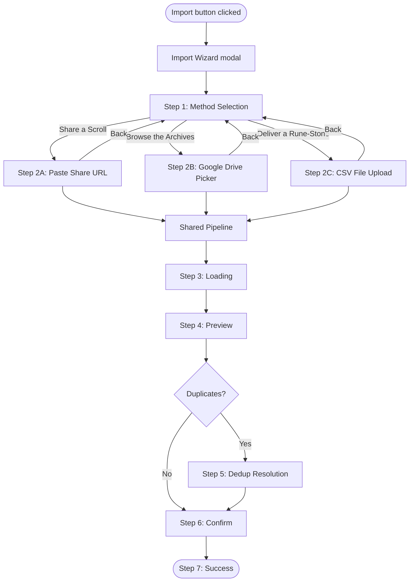

# Interaction Spec: Import Workflow v2 — Three Paths to the Forge

**Product brief**: [`designs/product/backlog/import-workflow-v2.md`](../../product/backlog/import-workflow-v2.md)

---

## Overview

Multi-step modal wizard for importing card portfolio from external spreadsheets. Three import methods converge on a shared extraction, preview, dedup, and confirmation pipeline.

### Wireframes

| View | Wireframe |
|------|-----------|
| Method Selection (Step 1) | [`import-method-selection.html`](../wireframes/import/import-method-selection.html) |
| CSV Upload (Step 2C) | [`csv-upload.html`](../wireframes/import/csv-upload.html) |
| Safety Banner (all variants) | [`safety-banner.html`](../wireframes/import/safety-banner.html) |

---

## User Flow

---

## Step 1: Method Selection

User clicks Import on dashboard. Modal opens with safety banner (Variant 1, non-dismissible) above three method cards. Clicking a card immediately advances to its Step 2 — no "Next" button.

| Card | Title | Subtitle | Auth Required |
|------|-------|----------|---------------|
| Path A | Share a Scroll | Paste a Google Sheets URL | No |
| Path B | Browse the Archives | Pick from Google Drive | Yes (Google sign-in) |
| Path C | Deliver a Rune-Stone | Upload a CSV file | No |

**States**: Idle (all cards visible) → CardFocused (keyboard nav) → MethodSelected → Step 2.
Path B disabled when not signed in: `aria-disabled="true"`, reduced opacity, helper message.

**Mobile** (< 768px): Cards stack vertically, full-width. Modal at 92vw. Touch targets ≥ 44×44px.

**Accessibility**: Modal with `role="dialog"`, `aria-modal="true"`. Cards in `role="listbox"` with `role="option"`. Arrow keys between options, Enter to select. Focus trapped in modal.

---

## Step 2A: Share URL (Path A)

URL entry form with compact safety banner (Variant 2). Input validates on blur/submit — must contain `docs.google.com/spreadsheets`. "Begin Import" disabled until valid. Back link returns to Step 1.

**Post-import**: Success step shows post-share reminder banner (Variant 4).

---

## Step 2B: Google Drive Picker (Path B)

1. Check Drive scopes → prompt incremental consent if needed (decline returns to Step 1).
2. Open Google Picker filtered to Sheets files.
3. On selection, fetch content via Sheets API → send to shared pipeline.

**Token handling**: Check expiry before Picker. Silently refresh; on failure redirect to consent prompt.

---

## Step 2C: CSV File Upload (Path C)

Drag-and-drop zone with "Choose file" button and compact safety banner (Variant 2). Back link returns to Step 1.

**Drop zone states**: Idle → DragOver → Processing → Accepted/Error.

| State | Visual |
|-------|--------|
| Idle | Dashed border, upload icon, "Drop your CSV here" |
| Drag-over | Gold border, "Release to deliver the rune-stone" |
| Processing | Spinner, "Reading the runes..." |
| Accepted | File summary row (name + size + remove). "Begin Import" enables. |
| Error | Red border, warning icon, error message in `role="alert"` |

**Validation**: `.csv` only. Max 1 MB. Must be UTF-8. Specific error messages for `.xlsx`, `.xls`, `.numbers`.

**Accessibility**: Drop zone has `role="button"`, `tabindex="0"`. Processing: `aria-live="polite"`. Errors: `role="alert"`.

---

## Safety Banner Rules

| Variant | Where | Dismissible? |
|---------|-------|-------------|
| 1. Full | Step 1 (Method Selection) | No |
| 2. Compact | Steps 2A/2B/2C | No |
| 3. Sensitive Data Warning | Step 4 (Preview), only if flagged | No |
| 4. Post-Share Reminder | Step 7 (Success), Path A only | Yes |

**Non-negotiable**: Variants 1–3 cannot be dismissed. No banner state persisted in localStorage.

---

## Step Transitions

Cross-fade 200ms (instant if `prefers-reduced-motion`). Step indicator: dots showing **Method > Import > Preview > Confirm**. Close button (X) always available — closing during Steps 3–6 shows confirmation dialog.

---

## Pipeline Convergence

| Path | Data source | Payload |
|------|-------------|---------|
| A (URL) | Backend fetches CSV export | `{ url: string }` |
| B (Picker) | Frontend Sheets API → CSV | `{ csv: string }` |
| C (Upload) | FileReader → CSV text | `{ csv: string }` |

Steps 3–7 are identical: Loading → Preview → Dedup (if needed) → Confirm → Success.

---

## Accessibility Summary (WCAG 2.1 AA)

| Requirement | Implementation |
|-------------|----------------|
| Focus management | Trapped in modal. On step change, focus moves to first interactive element. |
| Keyboard | Tab navigates all elements. Cards use Arrow keys in listbox. Enter/Space activates. |
| Screen readers | Safety banners: `role="alert"`. Step changes: `aria-live`. Errors: `role="alert"`. |
| Touch targets | All interactive elements ≥ 44×44px. |
| Contrast | 4.5:1 minimum (deferred to theme). |
| Reduced motion | All animations respect `prefers-reduced-motion: reduce`. |
| Focus indicators | 2px solid outline, 2px offset. |

---

## Non-Negotiable UX Requirements

1. Safety banner (Variant 1) visible before any import action.
2. Method card selection immediately advances — no "Next" button.
3. Drop zone must have distinct states: idle, drag-over, processing, accepted, error.
4. All interactive elements ≥ 44×44px.
5. All animations respect `prefers-reduced-motion`.
6. Path B uses incremental consent, not upfront scope requests.

## Implementation Flexibility

- Animation timing adjustable. Step indicator style flexible.
- Copy adjustable within Norse voice. File size limit adjustable.
- WebSocket vs HTTP fallback for Path C is an implementation decision.
