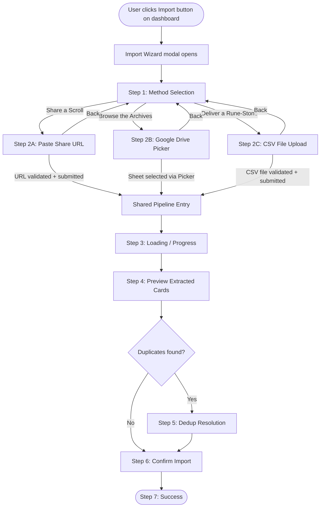
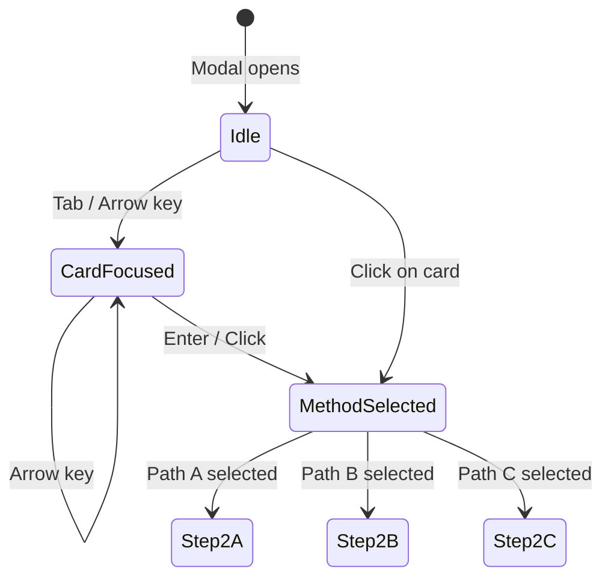
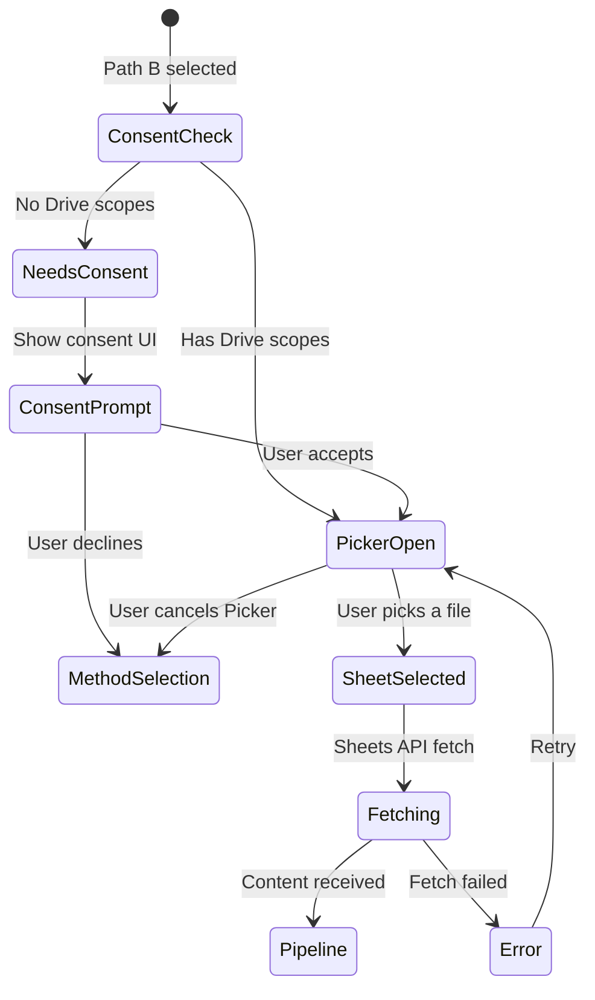
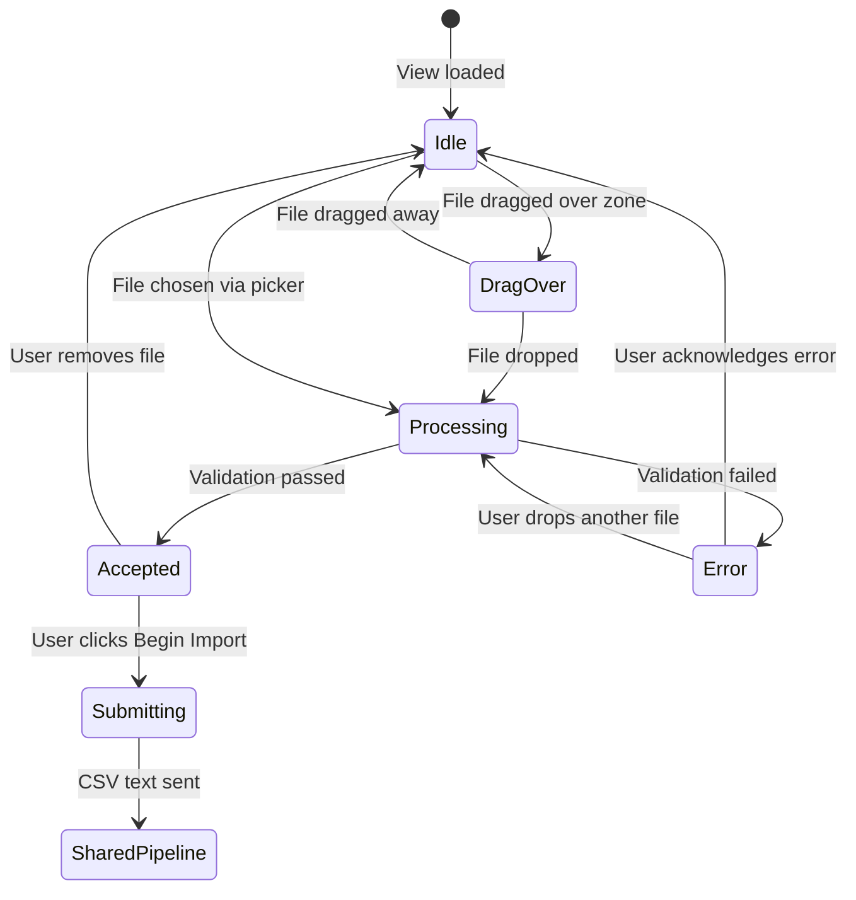
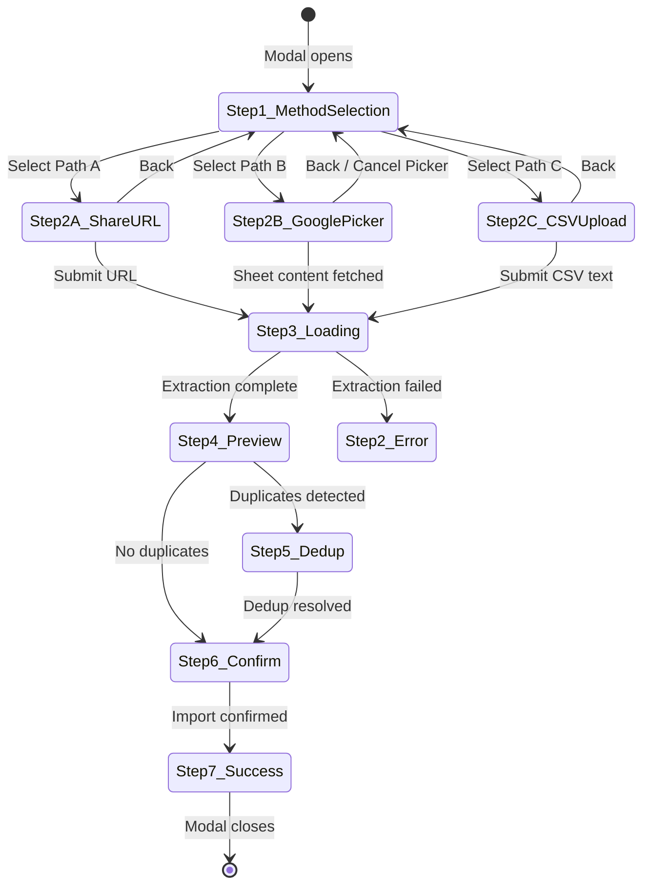

# Interaction Spec: Import Workflow v2 -- Three Paths to the Forge

**Product brief**: [`designs/product/backlog/import-workflow-v2.md`](../../product/backlog/import-workflow-v2.md)

---

## Overview

The Import Wizard is a multi-step modal dialog that guides the user through importing their card portfolio from an external spreadsheet. Three import methods converge on a shared extraction, preview, dedup, and confirmation pipeline.

### Wireframes

| View | Wireframe |
|------|-----------|
| Method Selection (Step 1) | [`wireframes/import/import-method-selection.html`](../wireframes/import/import-method-selection.html) |
| CSV Upload (Step 2C) | [`wireframes/import/csv-upload.html`](../wireframes/import/csv-upload.html) |
| Safety Banner (all variants) | [`wireframes/import/safety-banner.html`](../wireframes/import/safety-banner.html) |

---

## User Flow

All three import paths converge on the same shared pipeline after Step 2.

---

## Step 1: Method Selection

### Trigger
User clicks the "Import" button on the dashboard.

### Behavior
1. The Import Wizard modal opens centered on the viewport.
2. The safety banner (Variant 1, full) is displayed immediately above the method cards.
3. Three method cards are presented in a horizontal row (desktop) or vertical stack (mobile).
4. No "Next" button exists at this step. Clicking or pressing Enter on a method card immediately advances to the corresponding Step 2.

### Method Cards

| Card | Title | Subtitle | Description | Auth Required |
|------|-------|----------|-------------|---------------|
| Path A | Share a Scroll | Paste a Google Sheets URL | Share your spreadsheet link and we will fetch the data. Requires the sheet to be publicly viewable. | No |
| Path B | Browse the Archives | Pick from Google Drive | Select a spreadsheet from your Drive. No public sharing needed. | Yes (Google sign-in) |
| Path C | Deliver a Rune-Stone | Upload a CSV file | Drag and drop or choose a CSV export from any spreadsheet tool. No Google account needed. | No |

### States

- **Idle**: All three cards visible, none selected.
- **Card Focused**: Keyboard focus ring visible on the active card.
- **Card Hovered**: Border thickens (theme: gold border) on mouse hover.
- **Path B Disabled**: When user is not signed in, Path B card has `aria-disabled="true"`, reduced opacity, and a helper message: "Sign in to browse your Google Drive." Click on disabled card does nothing but could show a sign-in prompt.

### Mobile Behavior (< 768px)
- Method cards stack vertically, each full-width.
- Safety banner's include/exclude columns stack below 480px.
- Touch targets remain at least 44x44px.
- The modal itself occupies 92vw width.

### Accessibility
- Modal: `role="dialog"`, `aria-modal="true"`, `aria-labelledby="modal-title"`.
- Method card group: `role="listbox"`, `aria-label="Import method"`.
- Each card: `role="option"`, `tabindex="0"`, `aria-label` with full description.
- Keyboard: Tab into the listbox, Arrow keys between options, Enter to select.
- Path B when disabled: `aria-disabled="true"`, cannot receive selection.
- Close button: `aria-label="Close import wizard"`, 44x44px.
- Safety banner: `role="alert"` so screen readers announce it on render.
- Focus trap: focus stays within the modal while it is open.

### Animations/Transitions
- Modal enters with a fade-in (150ms ease-out). If `prefers-reduced-motion` is set, modal appears instantly.
- Card hover: border transitions from 2px to 3px (100ms).
- Card selection: brief scale pulse (98% -> 100%, 100ms) before transitioning to Step 2.
- Step transition: content cross-fades (200ms).

---

## Step 2A: Share URL (Path A)

### Trigger
User selects "Share a Scroll" on the method selection step.

### Behavior
1. The view transitions to the URL entry form.
2. A compact safety banner (Variant 2) appears at the top.
3. A text input field accepts the Google Sheets share URL.
4. A "Back" link allows returning to the method selection step.
5. Tip text explains the public share requirement.
6. The "Begin Import" button is disabled until a valid URL is entered.

### Validation
- URL must contain `docs.google.com/spreadsheets`.
- Validation runs on blur and on submit.
- Invalid URL: inline error message below the input field.

### Post-Import Enhancement
- After a successful import via Path A, the success step (Step 7) includes the post-share reminder banner (Variant 4): "You can now remove the public share from your spreadsheet."

### States
- **Empty**: Input field is empty. "Begin Import" disabled.
- **Typing**: User is entering a URL. No validation yet.
- **Valid**: URL matches the expected pattern. "Begin Import" enabled.
- **Invalid**: URL does not match. Inline error shown: "Please enter a valid Google Sheets URL."
- **Submitting**: "Begin Import" shows a loading indicator. Input becomes read-only.

---

## Step 2B: Google Drive Picker (Path B)

### Trigger
User selects "Browse the Archives" on the method selection step. User must be signed in.

### Behavior
1. If the user does not yet have Drive scopes, an incremental consent prompt appears explaining why Drive access is needed. The user can accept or decline.
2. If consent is granted (or was previously granted), the Google Picker overlay opens within the modal area.
3. The Picker filters to Google Sheets files only (`ViewId.SPREADSHEETS`).
4. User browses, searches, and selects a spreadsheet.
5. On selection, the Picker returns the file ID.
6. The system fetches the sheet content via the Sheets API using the user's access token.
7. Content is sent to the LLM extraction pipeline (same as Path A and C).

### States

- **Consent Prompt**: Explains why Drive access is needed. Offers "Allow" and "No thanks" buttons. "No thanks" returns to method selection with a message suggesting Path A or C.
- **Picker Open**: Google Picker iframe is visible. The rest of the modal is dimmed.
- **Sheet Selected**: Brief loading state while the Sheets API fetches content.
- **Error**: If the API call fails (token expired, network error), show an error with a retry option.

### Token Handling
- Before opening the Picker, check if the access token is expired. If so, silently refresh.
- If refresh fails, redirect to the consent prompt.

### Accessibility
- The Google Picker is a third-party iframe with its own accessibility features.
- The consent prompt dialog is fully keyboard-navigable with a focus trap.
- "Allow" and "No thanks" buttons meet 44x44px touch targets.
- On Picker close (cancel or selection), focus returns to the modal.

---

## Step 2C: CSV File Upload (Path C)

### Trigger
User selects "Deliver a Rune-Stone" on the method selection step.

### Behavior
1. The view transitions to the CSV upload interface.
2. A compact safety banner (Variant 2) appears at the top.
3. A drag-and-drop zone occupies the main content area.
4. A "Choose file" button within the drop zone opens the native file picker (filtered to `.csv`).
5. A "Back" link allows returning to the method selection step.

### Drop Zone States

| State | Visual | Behavior |
|-------|--------|----------|
| **Idle** | Dashed border, upload icon, "Drop your CSV here" text, "Choose file" button | Accepts drag-over or click/Enter to open file picker |
| **Drag-over** | Thicker dashed border (gold in theme), subtle highlight background, text changes to "Release to deliver the rune-stone" | Visual feedback that a file is hovering. If the file type is detectably wrong, the zone could show a warning icon, but browser APIs limit drag-over type detection. |
| **Processing** | Solid border, reduced opacity, spinner icon, "Reading the runes..." text | File is being read via FileReader API and validated. Typically < 1 second. |
| **Accepted** | Drop zone collapses. A file summary row appears showing file name + size + remove button. "Begin Import" button enables. | User can remove the file to return to Idle. |
| **Error** | Solid border (red/danger in theme), warning icon, error message below the zone in a `role="alert"` container | Drop zone remains interactive for retry. Error message describes the specific failure. |

### Validation Rules (client-side)
| Rule | Error Message |
|------|---------------|
| File extension is not `.csv` | "Please upload a .csv file. For Excel files, export as CSV first." |
| File is `.xlsx` or `.xls` | "Excel files are not supported directly. Please export as CSV from Excel first (File > Save As > CSV UTF-8)." |
| File is `.numbers` | "Numbers files are not supported directly. Please export as CSV from Numbers first (File > Export To > CSV)." |
| File size exceeds 1 MB | "This file is too large (X MB). The maximum size is 1 MB. Try removing unused rows or columns." |
| File cannot be read as UTF-8 | "This file could not be read. Please ensure it is saved as UTF-8 encoded CSV." |

### Interaction Details
- **Drag and drop**: The entire drop zone area is the target. `ondragover`, `ondragenter`, `ondragleave`, `ondrop` events control state transitions.
- **File picker button**: Triggers a hidden `<input type="file" accept=".csv">`. The visible button is styled as a regular button, not a file input.
- **Keyboard access**: The drop zone has `role="button"` and `tabindex="0"`. Press Enter or Space to open the file picker. Arrow keys are not applicable.
- **File reading**: `FileReader.readAsText(file, 'UTF-8')`. On success, the text content is stored in component state. On error, transition to the Error state.

### Mobile Behavior (< 768px)
- Drop zone stretches full width within the modal.
- "Choose file" button is the primary affordance on touch devices (drag-and-drop is less discoverable on mobile).
- The button text could change to "Choose file" only (removing "or drag and drop" subtext) on touch devices if `'ontouchstart' in window` is detected.
- File summary row remains a single horizontal row (name + size left, remove button right).

### Accessibility
- Drop zone: `role="button"`, `tabindex="0"`, `aria-label="Drop a CSV file here or click to browse"`.
- Processing state: `role="status"`, `aria-live="polite"` for the "Reading the runes..." text.
- Error state: `role="alert"` on the error message container for immediate screen reader announcement.
- File accepted: The "Remove file" button has `aria-label="Remove selected file"`. Focus moves to the "Begin Import" button after file acceptance.
- The hidden file input is associated with the visible button via the button's click handler (not via `<label for>`).

---

## Safety Banner Placement and Dismissibility

The safety banner appears in four variants across the import flow. See the [safety banner wireframe](../wireframes/import/safety-banner.html) for all visual variants.

| Variant | Where | When | Dismissible? |
|---------|-------|------|-------------|
| 1. Full | Step 1 (Method Selection) | Always, above method cards | No |
| 2. Compact | Steps 2A, 2B, 2C | Always, below back link | No |
| 3. Sensitive Data Warning | Step 4 (Preview) | Only if `sensitiveDataWarning` is true | No |
| 4. Post-Share Reminder | Step 7 (Success), Path A only | After successful Path A import | Yes (closes with modal) |

### Non-Negotiable Rules
- Variants 1 and 2 are **always visible** before import begins. They cannot be dismissed, hidden, or collapsed by the user.
- Variant 3 is **always visible** when the LLM flags sensitive data. It cannot be dismissed.
- No safety banner state is persisted in localStorage. The banners appear fresh on every import attempt.

---

## Transitions Between Steps

All step transitions use a content cross-fade animation (200ms ease) unless `prefers-reduced-motion` is active, in which case transitions are instant.

### Step Indicator
A linear progress indicator (dots + labels) appears at the top of every step. It shows: **Method** > **Import** > **Preview** > **Confirm**. Steps 5 (Dedup) and 7 (Success) are sub-steps that do not get their own dot.

### Back Navigation
- Steps 2A, 2B, 2C each have a "Back" link that returns to Step 1.
- Steps 3+ do not have a Back option (the pipeline is in progress or complete).
- The modal close button (X) is always available and cancels the entire wizard.
- Closing the modal during Steps 3-6 should show a confirmation dialog: "Are you sure? Import progress will be lost."

---

## Convergence: How All 3 Paths Enter the Shared Pipeline

After the user completes their method-specific step, the data enters the shared pipeline as CSV text:

| Path | How CSV text is obtained | Entry point |
|------|--------------------------|-------------|
| A (Share URL) | Backend fetches the Google Sheets CSV export via the share URL | WebSocket `POST /import` with `{ url: string }` |
| B (Google Picker) | Frontend fetches sheet content via Sheets API, converts to CSV text | WebSocket `POST /import` with `{ csv: string }` or same endpoint |
| C (CSV Upload) | Frontend reads the file via FileReader, obtains CSV text | WebSocket `POST /import` with `{ csv: string }` |

From Step 3 (Loading) onward, all three paths are identical:
1. **Loading**: Spinner with Norse phase labels. WebSocket progress events when backend is available; HTTP fallback otherwise.
2. **Preview**: Extracted cards displayed in a list. If `sensitiveDataWarning` is set, Variant 3 safety banner appears.
3. **Dedup**: If duplicates are found against existing cards, the user resolves them.
4. **Confirm**: "Import N cards" button.
5. **Success**: Fehu rune and completion message. Path A includes Variant 4 post-share reminder.

---

## Accessibility Summary

### WCAG 2.1 AA Requirements

| Requirement | Implementation |
|-------------|----------------|
| Focus management | Focus trapped within modal. On step transition, focus moves to the first interactive element of the new step. |
| Keyboard navigation | All interactive elements reachable via Tab. Method cards use Arrow keys within listbox. All buttons respond to Enter/Space. |
| Screen reader announcements | Safety banners use `role="alert"` or `role="note"`. Step transitions announced via `aria-live` region. Error states use `role="alert"`. |
| Touch targets | All buttons, cards, and interactive elements are at least 44x44px. |
| Contrast | Deferred to theme implementation. All text must meet 4.5:1 contrast ratio against its background. |
| Reduced motion | All animations respect `prefers-reduced-motion: reduce`. Transitions become instant. |
| Focus indicators | 2px solid outline with 2px offset on all focusable elements. |
| Error identification | All error messages are associated with their trigger element and announced via `role="alert"`. |

### Focus Order (Step 1)
1. Close button
2. Safety banner (read by screen reader via `role="alert"`)
3. Method card: Share a Scroll (Path A)
4. Method card: Browse the Archives (Path B)
5. Method card: Deliver a Rune-Stone (Path C)
6. Cancel button

### Focus Order (Step 2C)
1. Close button
2. Back link
3. Safety banner compact (read via `role="note"`)
4. Drop zone / Choose file button
5. Cancel button
6. Begin Import button (when enabled)

---

## Edge Cases

| Scenario | Handling |
|----------|----------|
| User opens wizard while offline | Show all three method options. Path A and B will fail at submission with a network error. Path C file reading works offline, but submission will fail. Show a clear "No network connection" error. |
| User drops multiple files | Accept only the first file. Ignore additional files. |
| User drops a folder | Reject with: "Please select a single CSV file, not a folder." |
| CSV file is empty | Reject at validation: "This file appears to be empty." |
| CSV file has no recognizable card data | The LLM extraction returns zero cards. The Preview step shows an empty state: "No card data could be extracted. Check that your spreadsheet contains card names, issuers, and dates." |
| Browser does not support drag-and-drop | The "Choose file" button is always available as a fallback. The drop zone text omits "drag and drop" wording. |
| Google Picker fails to load | Show an error within the Step 2B view: "Unable to load Google Drive. Try using Share a Scroll or Upload CSV instead." |
| User declines Google Drive consent | Return to Step 1 with a message: "Google Drive access was not granted. You can still import using a share URL or CSV file." |
| Token expires during Picker browse | Silently attempt to refresh. If refresh fails, close the Picker and show a re-authentication prompt. |
| File picker is cancelled (user clicks Cancel in the OS dialog) | No state change. Drop zone remains in Idle state. |
| LLM extraction times out | Loading step shows a timeout message after 60 seconds: "The extraction is taking longer than expected. You can wait or cancel and try again." |

---

## Component Recommendations

| Component | Pattern | Rationale |
|-----------|---------|-----------|
| Method cards | Selectable card group (listbox + option) | Cards are more visually scannable than radio buttons or tabs. They convey "choose one" without the form-field connotation. |
| Drop zone | Custom drag-and-drop area with hidden file input | Standard `<input type="file">` is not styleable. The custom zone provides consistent visual states. |
| Safety banner | Alert/note banner (not a toast) | Safety information must persist -- a toast would auto-dismiss. The banner stays visible for the duration of the relevant step. |
| Step indicator | Linear dot stepper | Simpler than a numbered stepper. Dots are compact and work well in the constrained modal width. |
| File summary | Inline row (icon + name + size + remove) | After file acceptance, the drop zone is no longer needed. The compact row saves vertical space. |
| Consent prompt | Inline card within the modal | Opening a new window for consent would be jarring. An inline explanation with Allow/Decline buttons keeps the user in context. |

---

## Handoff Notes for FiremanDecko

### Non-Negotiable UX Requirements
1. The safety banner (Variant 1) must be visible before any import action can be taken.
2. Method card selection immediately advances to Step 2 -- no intermediate "Next" button.
3. The drop zone must have distinct visual states for idle, drag-over, processing, accepted, and error.
4. All interactive elements must be at least 44x44px.
5. All animations must respect `prefers-reduced-motion`.
6. Path B (Google Picker) must use incremental consent, not upfront scope requests.

### Areas of Flexibility
- The exact animation timing (150ms, 200ms) can be adjusted based on what feels right in implementation.
- The step indicator design (dots vs. numbers vs. progress bar) is flexible as long as it communicates progress.
- The "Choose file" button text and drop zone copy can be adjusted within the Norse voice.
- The file size limit (1 MB) can be adjusted based on backend testing.
- WebSocket vs. HTTP fallback for Path C is an implementation decision (both are acceptable).

### Key Technical Decisions Needed
- How to extend the `POST /import` endpoint to accept `{ csv: string }` alongside `{ url: string }`.
- Whether the Google Picker iframe renders inside the existing modal or opens a new overlay.
- Token refresh strategy before opening the Picker.
- Whether to use `react-dropzone` or a custom implementation for the drop zone.
