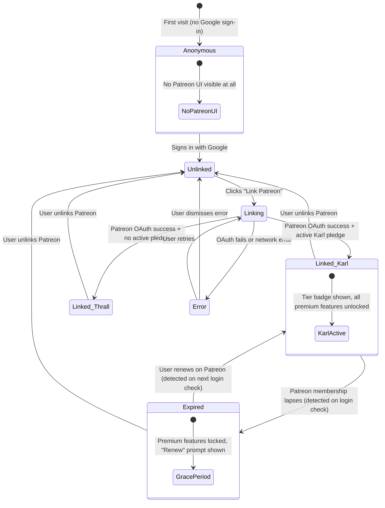
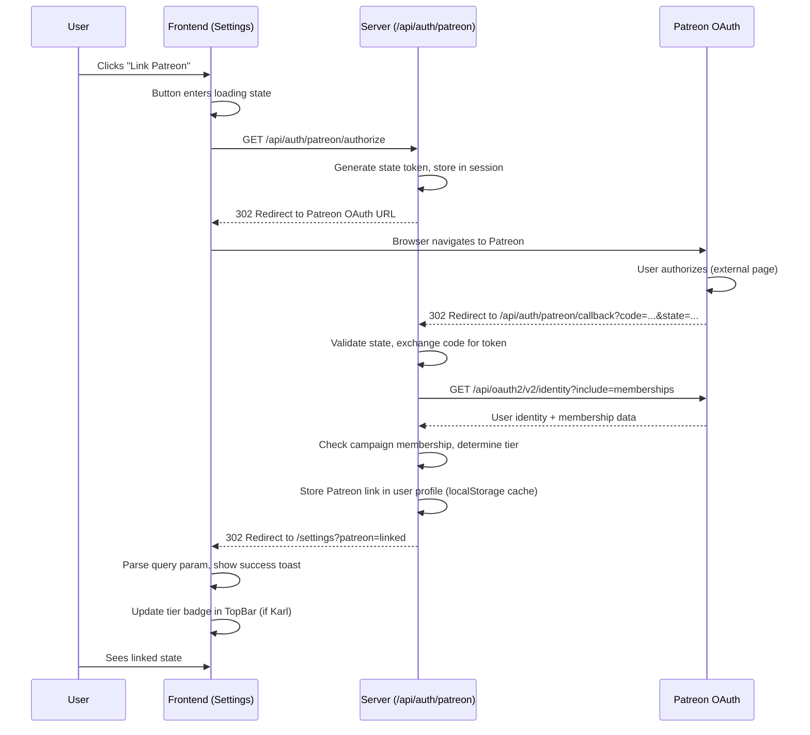

# Interaction Spec: Patreon Subscription Integration

> *"Not all wolves hunt alone. Some pledges open halls that others cannot enter."*

---

## Overview

This spec defines every user-facing interaction for the Patreon subscription feature. The model is **two-tier** -- Thrall (Free) and Karl (Supporter, $3-5/mo) -- with a **hard gate** pattern: premium features are fully locked behind a Norse-themed modal until the user links a qualifying Patreon membership.

**Key constraint**: The anonymous-first model (ADR-006) is preserved. Thrall users see zero Patreon UI unless they are signed in with Google first. Patreon linking is layered on top of Google auth, never replacing it.

---

## Tier Model

| Tier | Norse Name | Price | Access |
|------|-----------|-------|--------|
| Free | **Thrall** | $0 | All current features: card tracking, Valhalla, Howl Panel, easter eggs |
| Supporter | **Karl** | $3-5/mo via Patreon | 8 premium features (see below) |

### Premium Features (Karl Tier)

| # | Feature | Gate Location | Upsell Banner Context |
|---|---------|--------------|----------------------|
| 1 | Cloud Sync | Settings / Dashboard | "Your saga follows you across all devices." |
| 2 | Multi-Household | Settings | "Track the chains of your entire clan." |
| 3 | Advanced Analytics | Dashboard (future analytics panel) | "See the patterns the Norns weave in your portfolio." |
| 4 | Priority Import | Import Wizard | "The ravens fly faster for those who pledge." |
| 5 | Data Export | Settings / Card list | "Carry your ledger beyond these halls." |
| 6 | Extended History | Valhalla | "The dead remember longer in Karl's Hall." |
| 7 | Custom Notifications | Settings / Howl Panel | "Command the ravens. Set your own watch." |
| 8 | Cosmetic Perks | Settings | "Wear the marks of a true supporter." |

---

## State Machine

The subscription system has 5 primary states. The user transitions between them through explicit actions.



### State Visibility Rules

| State | Patreon UI Visible? | Premium Features | Tier Badge |
|-------|-------------------|-----------------|------------|
| Anonymous | No | Locked (no gate shown -- user must sign in first) | None |
| Unlinked (signed in) | "Link Patreon" in Settings | Locked (hard gate modal on attempt) | None |
| Linking | Loading spinner in Settings | Locked | None |
| Linked (Karl) | "Linked" badge + "Unlink" in Settings | Unlocked | Karl badge in TopBar |
| Linked (Thrall -- no active pledge) | "Linked" status + "Pledge on Patreon" CTA | Locked (hard gate modal) | None |
| Expired | "Membership expired" warning in Settings | Locked (hard gate modal with "Renew" CTA) | Expired indicator |
| Error | Error message in Settings | Locked | None |

---

## Interaction 1: Link Patreon Button

### Trigger
User clicks "Link Patreon" button on the Settings page.

### Placement
- **Settings page** (`/settings`): Primary placement. A dedicated "Patreon" section appears below the existing settings content, visible only to signed-in users.
- **Profile dropdown** (TopBar): Secondary affordance. A "Link Patreon" menu item appears below the email and above "Sign out" -- only when state is `Unlinked`.

### Behavior

1. User clicks "Link Patreon" button.
2. Button enters loading state: text changes to "Connecting...", spinner replaces icon, button is disabled.
3. Browser redirects to Patreon OAuth authorization URL (`https://www.patreon.com/oauth2/authorize`).
4. User authorizes on Patreon (external page -- out of our control).
5. Patreon redirects back to `/api/auth/patreon/callback`.
6. Server validates the OAuth code, fetches membership data.
7. **On success**: redirect to Settings with `?patreon=linked` query param. Settings page shows success toast: "Patreon linked successfully." If the user has an active Karl pledge, the tier badge appears in the TopBar immediately.
8. **On error**: redirect to Settings with `?patreon=error&reason={code}` query param. Settings page shows error toast: "Could not link Patreon. Please try again." The "Link Patreon" button returns to its default state.

### States

- **Default**: Button with Patreon brand icon (white "P" on coral background, or monochrome variant for dark theme). Label: "Link Patreon" (Voice 1). `min-height: 44px; min-width: 44px`.
- **Loading**: Spinner icon replaces Patreon logo. Label: "Connecting..." (Voice 1). Button disabled, reduced opacity.
- **Success**: Button replaced by linked status indicator (checkmark + "Linked to Patreon"). "Unlink" text button appears below.
- **Error**: Error message below button. Button returns to default state. Error text: "Connection failed. Try again." (Voice 1).

### Accessibility
- `aria-label="Link your Patreon account"` on the button.
- Loading state: `aria-busy="true"`, `aria-label="Connecting to Patreon"`.
- Success state: `aria-live="polite"` on the status region.
- Keyboard: fully focusable, activated by Enter or Space.

---

## Interaction 2: Patreon OAuth Flow Experience

### Trigger
Initiated by the "Link Patreon" button click (Interaction 1).

### Flow Diagram



### Loading State (During Redirect)
While the user is on the Patreon site, the Fenrir Ledger tab/window shows the Settings page with the loading button state. No full-page loading screen -- the user is on Patreon's site.

### Callback States

| Callback Result | Query Param | UI Response |
|----------------|-------------|-------------|
| Success + Karl pledge active | `?patreon=linked&tier=karl` | Success toast + tier badge appears |
| Success + no active pledge | `?patreon=linked&tier=thrall` | Info toast: "Patreon linked. Pledge to unlock premium features." |
| OAuth denied by user | `?patreon=denied` | Info toast: "Patreon linking cancelled." |
| OAuth error | `?patreon=error&reason=oauth_failed` | Error toast: "Could not link Patreon. Please try again." |
| State mismatch | `?patreon=error&reason=state_mismatch` | Error toast: "Something went wrong. Please try again." |
| Network error | `?patreon=error&reason=network` | Error toast: "Network error. Please try again." |

### Edge Cases

- **User closes Patreon tab during auth**: No callback fires. Next time user returns to Settings, button is in default state.
- **User is already linked**: "Link Patreon" button is not shown; linked status is displayed instead.
- **Patreon account already linked to another Fenrir user**: Error toast: "This Patreon account is already linked to another user." (Voice 1).

---

## Interaction 3: Hard Gate Modal ("This Rune Is Sealed")

### Trigger
A signed-in Thrall user (or an unlinked user, or an expired Karl) attempts to access any of the 8 premium features.

### Behavior

1. User clicks on a premium feature trigger (e.g., "Export Data" button, "Advanced Analytics" tab, "Multi-Household" toggle).
2. Instead of the feature activating, a modal dialog appears.
3. The modal is the hard gate -- it communicates what the feature is, why it is locked, and how to unlock it.
4. The user can dismiss the modal (close button, Escape, backdrop click) or click the Patreon CTA.
5. Clicking "Pledge on Patreon" opens the Patreon campaign page in a new tab.
6. The modal remains open so the user can return to it after pledging.

### Modal Structure

```
+---------------------------------------------------------------+
| (x)                                                            |
|                                                                |
|                    [Rune glyph: Algiz]                         |
|                                                                |
|                 THIS RUNE IS SEALED                            |
|            (Cinzel Decorative, centered)                       |
|                                                                |
|   +---------------------------------------------------------+ |
|   |                                                         | |
|   |  [Feature name]                                         | |
|   |                                                         | |
|   |  [Feature description -- what this feature does         | |
|   |   and why you would want it. 1-2 sentences, Voice 1.]   | |
|   |                                                         | |
|   |  ---                                                    | |
|   |                                                         | |
|   |  [Atmospheric copy -- Norse-themed encouragement         | |
|   |   to pledge. Voice 2, italic.]                          | |
|   |                                                         | |
|   +---------------------------------------------------------+ |
|                                                                |
|   +-------------------------------+  +----------------------+ |
|   |  [Karl badge]  KARL SUPPORTER |  |  $3-5/mo via Patreon | |
|   +-------------------------------+  +----------------------+ |
|                                                                |
|   +----------------------------------------------------------+|
|   |           Pledge on Patreon                               ||
|   +----------------------------------------------------------+|
|                                                                |
|   [Not now -- I will continue as Thrall]                       |
|        (secondary dismiss, centered, text link)                |
|                                                                |
+---------------------------------------------------------------+
```

### Copy Per Feature

| Feature | Modal Body (Voice 1) | Atmospheric Line (Voice 2, italic) |
|---------|---------------------|-----------------------------------|
| Cloud Sync | "Sync your card data across all your devices. Never lose your ledger." | *"The wolf who roams far keeps his saga close."* |
| Multi-Household | "Track cards for multiple households -- yours, your partner's, your family's." | *"A single wolf guards many dens."* |
| Advanced Analytics | "See spending trends, reward optimization, and portfolio insights." | *"The Norns see deeper for those who pledge."* |
| Priority Import | "Import cards faster with priority processing." | *"The ravens fly swifter for Karl's hall."* |
| Data Export | "Export your card data as CSV or JSON for use anywhere." | *"Carry the runes beyond these walls."* |
| Extended History | "Keep closed card records for 5 years instead of 1." | *"In Karl's Hall, the honored dead remember longer."* |
| Custom Notifications | "Set custom reminder schedules and notification preferences." | *"Command the ravens. Name the hour."* |
| Cosmetic Perks | "Unlock exclusive visual themes and profile badges." | *"The wolf wears the marks of a true supporter."* |

### Animation
- Backdrop: `backdrop-in` 280ms ease (same as Easter Egg Modal).
- Modal: `modal-rise` translateY(16px) + scale(0.97) to translateY(0) + scale(1), 320ms `cubic-bezier(0.16, 1, 0.3, 1)`.
- Rune glyph: subtle pulse animation on entry (600ms, once).

### Accessibility
- `role="dialog"`, `aria-modal="true"`.
- `aria-labelledby` bound to the "THIS RUNE IS SEALED" heading.
- `aria-describedby` bound to the feature description paragraph.
- Close button: `aria-label="Dismiss"`.
- "Pledge on Patreon" button: `aria-label="Open Patreon campaign page in new tab"`.
- "Not now" link: `aria-label="Dismiss and continue as free user"`.
- Focus trap: Tab cycles through close button, Patreon CTA, and "Not now" link.
- Escape key dismisses the modal.
- On dismiss, focus returns to the element that triggered the modal.

### Z-Index
- Modal overlay: 200 (standard modal layer).
- Modal dialog: 210.

---

## Interaction 4: Upsell Banners (Non-Aggressive)

### Trigger
A signed-in Thrall user navigates to a page where a premium feature would be relevant. The upsell banner appears inline with the page content -- not as a popup, not as a blocking overlay.

### Placement Rules

Upsell banners appear **contextually** near the feature they promote. They are not global banners -- each one appears in a specific location.

| Feature | Banner Location | Visibility Condition |
|---------|----------------|---------------------|
| Cloud Sync | Settings page, "Data" section | Signed in, not Karl |
| Multi-Household | Settings page, "Household" section | Signed in, not Karl |
| Advanced Analytics | Dashboard, below card grid (future) | Signed in, not Karl |
| Priority Import | Import Wizard, method selection step | Signed in, not Karl |
| Data Export | Settings page, "Data" section | Signed in, not Karl |
| Extended History | Valhalla page, above card list | Signed in, not Karl |
| Custom Notifications | Settings page, "Notifications" section | Signed in, not Karl |
| Cosmetic Perks | Settings page, "Appearance" section | Signed in, not Karl |

### Banner Structure

```
+---------------------------------------------------------------+
|  [Rune icon]  [Feature headline -- Voice 1]                    |
|               [1-line description -- Voice 1]                  |
|               [Atmospheric teaser -- Voice 2, italic, muted]   |
|                                            [Learn more ->]     |
+---------------------------------------------------------------+
```

### Behavior
- **"Learn more"** opens the hard gate modal (Interaction 3) for that specific feature.
- Banners are **not dismissible individually**. They disappear when the user becomes a Karl.
- Banners are **not shown to anonymous users** (they must sign in first to see any Patreon UI).
- Banners are **informational, not aggressive**. No animation, no pulsing, no countdown timers.
- Maximum 1 upsell banner per page view. If a page has multiple premium features, show the most relevant one.

### Accessibility
- `role="complementary"` on the banner container.
- `aria-label="Premium feature: [Feature Name]"` on each banner.
- "Learn more" link: keyboard focusable, `aria-label="Learn more about [Feature Name]"`.

---

## Interaction 5: Tier Badge Display

### Trigger
User has an active Karl membership linked to their Patreon account.

### Placement
- **TopBar**: Next to the user's avatar/name, a small badge reading "KARL" appears. This is the primary visual indicator of supporter status.
- **Profile dropdown**: Below the user's name and email, "Karl Supporter" label with a tier icon.
- **Settings page**: In the Patreon section, full tier details with membership since date.

### Badge Design (Component Spec)

```
Component: TierBadge

Purpose: Displays the user's subscription tier status inline.

Props:
  tier: "thrall" | "karl"
  variant: "compact" | "full"
  expired: boolean

States:
  - compact/karl: Small pill badge, "KARL" text, positioned next to avatar
  - compact/thrall: Not rendered (Thrall users get no badge)
  - compact/expired: Small pill badge, "EXPIRED" text, muted styling
  - full/karl: Full badge with tier icon + "Karl Supporter" + member since date
  - full/expired: Full badge with warning icon + "Membership Expired" + renewal CTA

Accessibility:
  - aria-label="Karl Supporter tier" (compact variant)
  - Screen reader text includes membership status
```

### TopBar Integration

The tier badge sits in the TopBar between the user's name and the dropdown caret:

```
Desktop (signed in + Karl):
[FENRIR LEDGER]              [Avatar] Declan [KARL] [v]

Desktop (signed in + no Patreon):
[FENRIR LEDGER]              [Avatar] Declan [v]

Mobile (signed in + Karl):
[FENRIR LEDGER]              [Avatar] [KARL]
```

### Animation
- On first appearance after linking: badge fades in with a brief gold shimmer (400ms, once).
- Subsequent page loads: no animation.

---

## Interaction 6: Unlink Patreon Flow

### Trigger
User clicks "Unlink Patreon" in Settings.

### Behavior

1. User clicks "Unlink Patreon" text button in Settings.
2. Confirmation modal appears:

```
+---------------------------------------------------------------+
|  Unlink Patreon?                                         (x)   |
|                                                                |
|  Your Patreon account will be disconnected from Fenrir         |
|  Ledger. You will lose access to premium features, but         |
|  your card data will not be affected.                          |
|                                                                |
|  If you have an active Patreon membership, it will continue    |
|  on Patreon until you cancel it there.                         |
|                                                                |
|                              [Cancel]  [Unlink Patreon]        |
+---------------------------------------------------------------+
```

3. **On confirm**: Patreon link is removed from user profile. Tier badge disappears from TopBar. Premium features become locked again. Toast: "Patreon unlinked." Settings section returns to "Link Patreon" button state.
4. **On cancel**: Modal closes. No changes.

### Copy
- Heading: "Unlink Patreon?" (Voice 1)
- Body: Plain English explanation of consequences (Voice 1). No Norse copy here -- this is a destructive action confirmation.
- Primary action: "Unlink Patreon" (Voice 1, destructive styling)
- Secondary action: "Cancel" (Voice 1)

### Button Layout
Follows the standard form action button layout:
- **Cancel** + **Unlink Patreon** right-aligned.
- No destructive action isolated on the left (since there is no tertiary action).

### Accessibility
- `role="alertdialog"`, `aria-modal="true"`.
- `aria-labelledby` bound to heading.
- `aria-describedby` bound to body text.
- Focus trap: Tab cycles through Cancel and Unlink buttons.
- Escape dismisses (same as Cancel).

---

## Interaction 7: Settings Page -- Patreon Section

### Trigger
User navigates to `/settings` while signed in.

### Layout

The Patreon section appears as a new section on the Settings page, below existing settings content. It has 4 visual variants based on state:

#### Variant A: Unlinked

```
PATREON
Link your Patreon account to unlock premium features.

[Patreon icon]  Link Patreon
```

#### Variant B: Linked (Karl -- Active)

```
PATREON                                       [KARL]
Linked to Patreon as [patreon_username]
Member since [date]

Premium features: All unlocked

                                        [Unlink Patreon]
```

#### Variant C: Linked (Thrall -- No Active Pledge)

```
PATREON
Linked to Patreon as [patreon_username]
No active pledge found.

Pledge to unlock 8 premium features:
  Cloud Sync, Multi-Household, Advanced Analytics,
  Priority Import, Data Export, Extended History,
  Custom Notifications, Cosmetic Perks

[Pledge on Patreon]                     [Unlink Patreon]
```

#### Variant D: Expired Membership

```
PATREON                                    [EXPIRED]
Linked to Patreon as [patreon_username]
Your Karl membership has expired.
Premium features are locked until you renew.

[Renew on Patreon]                      [Unlink Patreon]
```

#### Variant E: Error State

```
PATREON
Could not verify your Patreon membership.
This may be a temporary issue.

[Retry]  [Unlink Patreon]
```

---

## Interaction 8: Expired Membership Handling

### Trigger
The server detects that a previously-Karl user no longer has an active Patreon pledge. This is checked on login (Google sign-in) and optionally on a periodic interval (e.g., every 24 hours via API call).

### Behavior

1. User signs in. Server checks Patreon membership status.
2. If membership has lapsed, the cached tier is updated to "expired".
3. On next page load, the tier badge changes from "KARL" to "EXPIRED" (muted styling).
4. Premium features are locked. Attempting to use them shows the hard gate modal with a "Renew on Patreon" CTA instead of "Pledge on Patreon".
5. An info toast appears once per session: "Your Karl membership has expired. Premium features are locked." (Voice 1).
6. No dramatic animation. No aggressive nag. The transition is quiet and respectful.

### Trust Patreon Billing
Fenrir Ledger does not manage billing. If the user cancels on Patreon:
- Patreon handles the billing cycle (user keeps access until the end of the paid period).
- Fenrir Ledger checks membership status on login. When Patreon reports the membership as inactive, Fenrir Ledger locks premium features.
- There is no in-app cancellation flow. Users manage their membership on Patreon directly.

---

## Mobile Responsive Behavior (375px)

### Hard Gate Modal
- Full-width: `w-[92vw]`, `max-h-[90vh]`, centered vertically.
- Rune glyph: 48px (reduced from 64px desktop).
- Heading: font-size reduced to 20px.
- "Pledge on Patreon" button: full-width, `min-height: 48px` (touch target).
- "Not now" link: full-width, `min-height: 44px` (touch target).
- Content scrolls if it exceeds viewport.

### Upsell Banner
- Single column. Rune icon + headline on first row, description on second.
- "Learn more" link: `min-height: 44px`.

### Settings Page Patreon Section
- Full-width. Buttons stack vertically.
- "Link Patreon" button: full-width, `min-height: 48px`.
- "Unlink Patreon" text button: full-width, `min-height: 44px`.

### Tier Badge (TopBar)
- Compact: "KARL" pill, 24px height, positioned next to avatar.
- Touch target for avatar+badge area: minimum 44x44px.

---

## Accessibility Requirements

### WCAG 2.1 AA Compliance

| Requirement | Implementation |
|-------------|---------------|
| Keyboard navigation | All Patreon interactions are fully keyboard accessible. Tab order is logical. |
| Focus management | Hard gate modal traps focus. On dismiss, focus returns to trigger element. |
| Screen reader | All states have appropriate aria-labels and aria-live regions. |
| Color contrast | All text meets 4.5:1 ratio on dark backgrounds. Badge text meets 3:1 minimum. |
| Touch targets | All interactive elements are minimum 44x44px on mobile. |
| Reduced motion | `prefers-reduced-motion` disables modal entry animation and badge shimmer. |
| Error identification | Error states use both color and text to communicate (not color alone). |

### Aria Attributes Summary

| Element | Role/Attribute | Value |
|---------|---------------|-------|
| Hard gate modal | `role="dialog"`, `aria-modal="true"` | -- |
| Hard gate heading | `aria-labelledby` target | "This Rune Is Sealed" |
| Unlink confirmation | `role="alertdialog"`, `aria-modal="true"` | -- |
| Tier badge | `aria-label` | "Karl Supporter tier" / "Membership expired" |
| Upsell banner | `role="complementary"`, `aria-label` | "Premium feature: [Name]" |
| Link Patreon button | `aria-label` | "Link your Patreon account" |
| Loading state | `aria-busy="true"` | On button during OAuth redirect |
| Success notification | `aria-live="polite"` | Toast region |
| Error notification | `aria-live="assertive"` | Toast region |

---

## Non-Negotiable UX Requirements

These aspects of the design cannot be compromised during implementation:

1. **Anonymous users see zero Patreon UI.** No badges, no banners, no gate modals. Sign in first.
2. **Hard gate only.** No soft gates, no partial functionality, no "try for free" teasers.
3. **External billing.** All "Pledge" and "Renew" CTAs link to the Patreon campaign page. No in-app checkout.
4. **Norse-themed gate modal.** The sealed rune metaphor is the brand moment. The "THIS RUNE IS SEALED" heading and atmospheric copy are non-negotiable.
5. **Non-aggressive upsell.** Banners are informational and contextual. No popups, no countdown timers, no "X days left" pressure tactics.
6. **Touch targets.** 44px minimum on all interactive elements at 375px.
7. **Focus management.** Modal focus trap and focus restoration are accessibility requirements, not optional enhancements.
8. **Cancellation is Patreon's domain.** No in-app cancel flow. No retention modals. Trust the billing cycle.

---

## Flexible Implementation Details

These aspects can be adjusted by FiremanDecko based on technical constraints:

- **Membership check frequency**: On login only vs. periodic polling. Defer to engineering on caching strategy.
- **localStorage cache structure**: How the tier data is stored locally. Engineering decides the key naming.
- **OAuth state management**: Server-side session vs. encrypted cookie vs. database. Engineering decides.
- **Patreon API version**: v2 is recommended but engineering can adjust.
- **Badge animation timing**: The gold shimmer on first appearance can be adjusted or removed if it causes performance issues.
- **Upsell banner selection algorithm**: When multiple features apply to one page, the selection logic is an engineering decision.

---

## Wireframe References

| Wireframe | Path | Description |
|-----------|------|-------------|
| Settings (Unlinked) | [settings-patreon-unlinked.html](../wireframes/patreon-subscription/settings-patreon-unlinked.html) | Settings page with "Link Patreon" button |
| Hard Gate Modal | [hard-gate-modal.html](../wireframes/patreon-subscription/hard-gate-modal.html) | "This Rune Is Sealed" modal for all 8 premium features |
| Linked State + Badge | [settings-patreon-linked.html](../wireframes/patreon-subscription/settings-patreon-linked.html) | Settings page showing linked Karl state + TopBar badge |
| Upsell Banner | [upsell-banner-premium.html](../wireframes/patreon-subscription/upsell-banner-premium.html) | Contextual upsell banner example |
| Unlink Confirmation | [unlink-confirmation.html](../wireframes/patreon-subscription/unlink-confirmation.html) | Unlink Patreon confirmation dialog |
| Expired State | [settings-patreon-expired.html](../wireframes/patreon-subscription/settings-patreon-expired.html) | Settings page showing expired membership |
