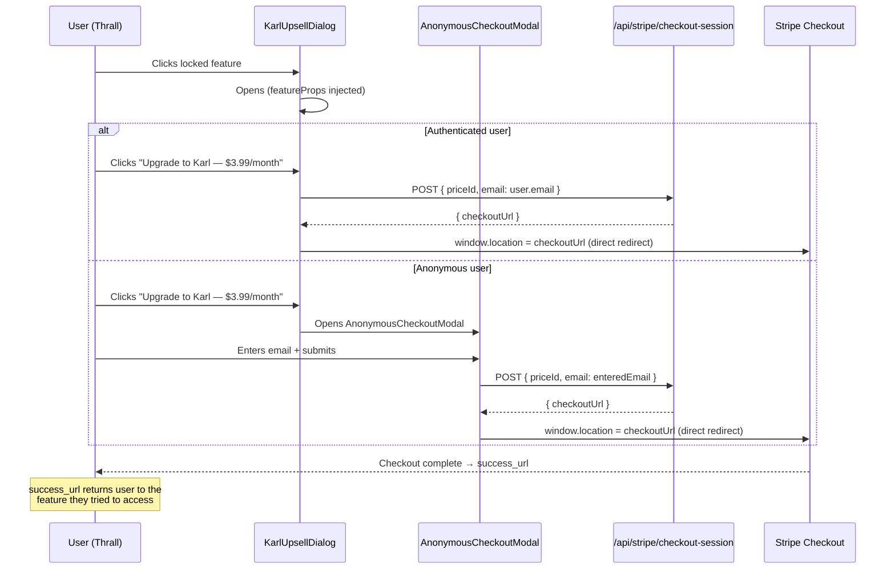

# Karl Upsell — Interaction Spec

**Issues:** #377 (Valhalla), #378 (Velocity), #398 (Howl)
**Wireframes:**
- `ux/wireframes/stripe-direct/karl-upsell-dialog.html` — Common KarlUpsellDialog component
- `ux/wireframes/app/valhalla-karl-gated.html` — Valhalla tab gating + tab bar states

---

## 1. KarlUpsellDialog Component

### 1.1 Trigger

Any Karl-gated feature fires `openKarlUpsell(featureProps)` when a Thrall user interacts with it.

```
openKarlUpsell({
  featureIcon: "ᛏ",
  featureName: "Valhalla",
  featureTagline: "Hall of the Honored Dead",      // Voice 2 — atmospheric
  featureTeaser: "See every card you've closed…",  // Voice 1 — functional
})
```

### 1.2 Dialog open behavior

1. Dialog renders at z-index 210 (standard modal layer).
2. Semi-transparent backdrop fills full viewport behind dialog.
3. Focus is trapped inside the dialog (`focus-trap`).
4. `aria-modal="true"` set on dialog shell.
5. Body scroll locked while dialog is open.
6. On desktop: dialog is centered in the viewport.
7. On mobile (≤ 640px): dialog anchors to bottom of screen (full-width bottom sheet).

### 1.3 Subscribe flow



**success_url:** Should include the target feature in the return path.
Example: `success_url = /ledger?tab=valhalla&session_id={CHECKOUT_SESSION_ID}`

### 1.4 Dismiss behavior

| Action | Result |
|--------|--------|
| Click "Not now" | Closes dialog. Returns focus to the element that triggered it. No flag set. |
| Click ✕ button | Same as "Not now". |
| Click backdrop | Same as "Not now". |
| Press Escape | Same as "Not now". |
| No permanent flag | Dialog reappears next time user clicks the locked feature. |

### 1.5 Props contract

| Prop | Type | Required | Notes |
|------|------|----------|-------|
| `featureIcon` | string (rune glyph or SVG) | Yes | Displayed in hero area with lock overlay |
| `featureName` | string | Yes | H1 of the dialog |
| `featureTagline` | string | No | Voice 2 atmospheric copy; `aria-hidden="true"` — hidden on mobile |
| `featureTeaser` | string | Yes | 1-2 sentences, Voice 1, shown in "What you're missing" box |
| `onSubscribe` | function | Yes | Callback that initiates Stripe Checkout flow |
| `onDismiss` | function | Yes | Callback that closes the dialog |

### 1.6 Static content (never varies by feature)

- Header eyebrow: `"Karl Tier Feature"`
- Header sub-eyebrow: `"KARL · $3.99/month"`
- Karl tier row: `[Karl badge] Unlock all premium features $3.99/mo`
- CTA button text: `"Upgrade to Karl — $3.99/month"`
- CTA caption: `"Billed monthly. Cancel anytime."`
- Dismiss text: `"Not now"`

---

## 2. Valhalla Tab Gating

### 2.1 Tab visibility rule

The Valhalla tab is **always visible** to all users (Thrall + Karl).
It is **never hidden** — discoverability is intentional.
Thrall users see a lock indicator; Karl users see no indicator.

### 2.2 Tab locations

| Location | Desktop | Mobile |
|----------|---------|--------|
| Dashboard content tab bar | Valhalla tab inside main content area | Same tab bar (horizontal scroll) |
| Sidebar nav | Valhalla nav item | N/A (sidebar hidden on mobile) |
| Bottom tab bar | N/A | Valhalla tab in 4-tab bottom nav |

### 2.3 Thrall tab behavior

1. Tab renders with 🔒 lock icon appended to label.
2. Tab `aria-label` explicitly states: `"Valhalla — Karl tier required. Click to upgrade."`.
3. On mobile nav badge: small "K" indicator at top-right of icon.
4. Clicking/tapping the tab calls `openKarlUpsell(valhallaProps)`.
5. Tab does NOT navigate to `/ledger/valhalla`.
6. Tab element uses `<button>` (not `<a>`) in Thrall state — no `href` to trigger.
7. While KarlUpsellDialog is open, the Valhalla tab shows as "active" (selected state).

### 2.4 Karl tab behavior

1. Tab renders normally — NO lock indicator.
2. Tab is `<a>` or controlled tab element that switches content panel.
3. Clicking switches dashboard to Valhalla content panel (tombstone cards).
4. No dialog is shown.

### 2.5 /ledger/valhalla route

Per issue spec: **route is removed**.
- Both Thrall and Karl users access Valhalla exclusively via the dashboard tab.
- Any direct URL access to `/ledger/valhalla` should redirect to `/ledger`.
- Implementation: remove the route file, add a redirect in `next.config.js`.

### 2.6 "All" tab behavior

The "All" tab is **not gated** for either tier.
Archived (closed) cards remain visible in the "All" tab for Thrall users — this is intentional:
- It provides a safety net so Thrall users aren't completely blocked from seeing their own data.
- Valhalla (the dedicated closed-cards view with analytics) is the Karl-gated premium experience.

---

## 3. Feature-specific Props Reference

| Issue | featureIcon | featureName | featureTagline | featureTeaser |
|-------|-------------|-------------|----------------|---------------|
| #377 Valhalla | `ᛏ` (Tiwaz) | Valhalla | Hall of the Honored Dead | See every card you've closed — anniversary dates, total rewards extracted, annual fees avoided, and how long each chain held you. |
| #398 Howl | `ᚲ` (Kenaz) | The Howl | The Wolf Cries Before the Chain Breaks | Get notified before fees strike. Howl surfaces your most urgent deadlines and lets you act in one tap — before it costs you. |
| #378 Velocity | `ᛊ` (Sowilo) | Velocity | How Fast Does Your Plunder Flow? | Track your spend rate against welcome bonus targets to make sure you hit every threshold before the deadline. |

---

## 4. Accessibility Requirements

- `role="dialog"` + `aria-modal="true"` + `aria-labelledby` pointing to the H1.
- Focus trap active while dialog is open.
- Focus returns to the triggering element on dismiss.
- Atmospheric copy (`featureTagline`) marked `aria-hidden="true"`.
- Lock icons marked `aria-hidden="true"` — meaning conveyed via `aria-label` on the tab element.
- Tab items with Karl lock must have `aria-label` that includes `"— Karl tier required"`.
- All interactive elements: minimum 44×44px touch target.
- Backdrop click dismisses dialog (mouse users).
- Escape key dismisses dialog (keyboard users).

---

## 5. Animation / Transition Notes (for implementation)

- Desktop dialog: fade-in + subtle scale-up (200ms, `cubic-bezier(0.16, 1, 0.3, 1)`).
- Mobile bottom sheet: slide-up from bottom (250ms, same easing).
- Backdrop: fade-in to semi-transparent (200ms ease).
- Dismiss: reverse of open animation.
- Tab lock icon: no animation — purely decorative static indicator.

---

*Interaction spec — Karl upsell dialog + Valhalla tab gating — Ref #377, #378, #398*
