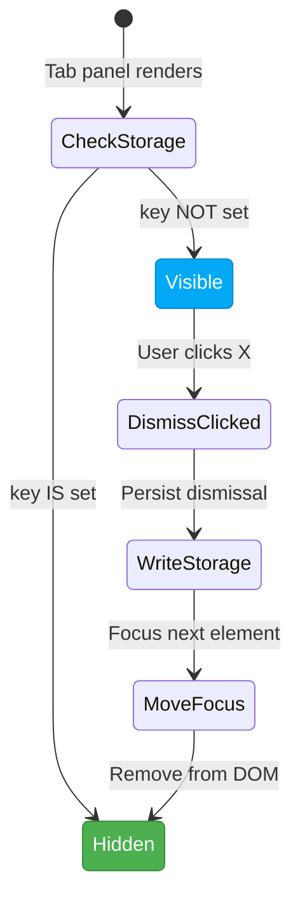
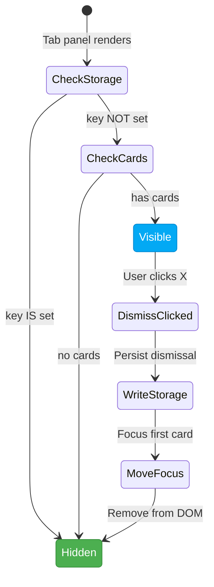
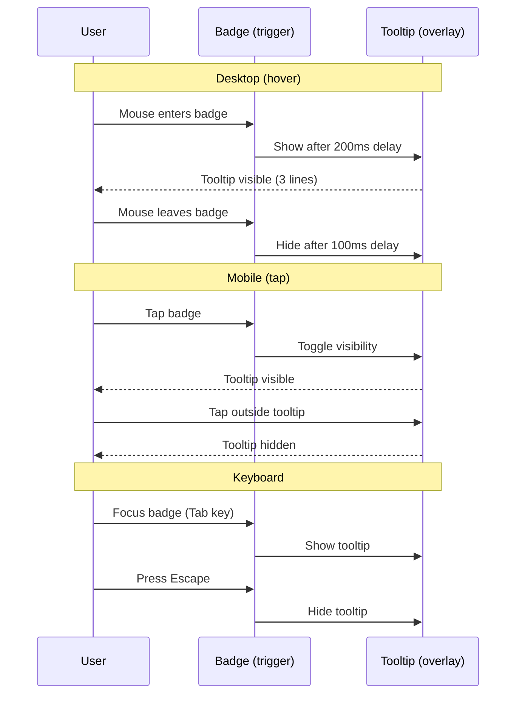
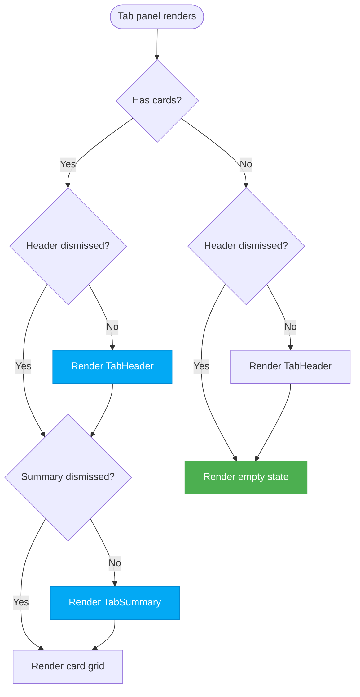
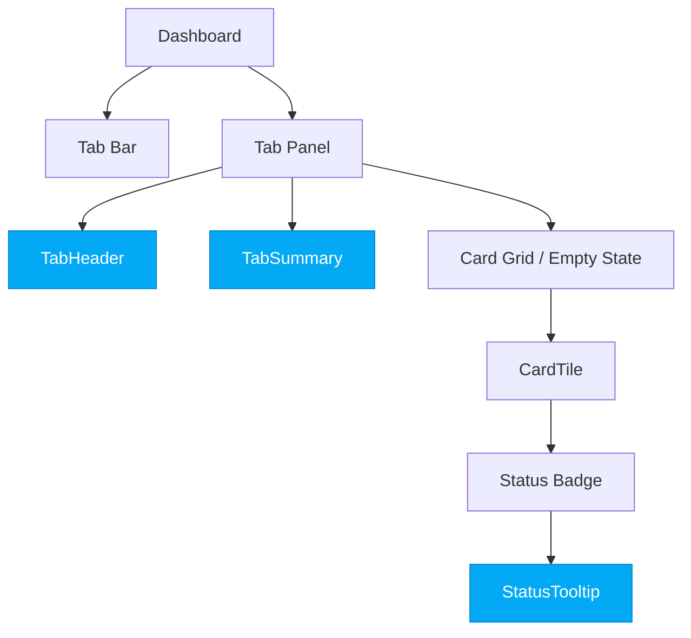

# Interaction Spec: Dashboard Tab Headers, Tooltips, and Empty States

Companion to [dashboard-tab-headers.html](dashboard-tab-headers.html).

---

## 1. Tab Header Dismiss Flow



**localStorage key pattern:** `fenrir:tab-header-dismissed:{tabId}`

**Focus after dismiss:** If the summary sub-header is still visible, focus its dismiss
button. Otherwise, focus the first card in the grid. If the tab is empty, focus the
empty state container.

---

## 2. Tab Summary Dismiss Flow



**localStorage key pattern:** `fenrir:tab-summary-dismissed:{tabId}`

**Not rendered when empty:** The summary is only meaningful when cards exist.
When a tab has zero cards, the summary is not shown regardless of dismissed state.

---

## 3. Status Label Tooltip Interaction



**Tooltip content structure:**
1. **Label** (bold) -- the status name (e.g. "Fee Due Soon")
2. **Meaning** (normal) -- plain English explanation (Voice 1)
3. **Norse flavor** (italic) -- atmospheric line (Voice 2)

**Positioning:** Below the badge by default. Flips above if within 120px of
viewport bottom. Centered horizontally relative to the badge.

---

## 4. Empty State Rendering Logic



**Key rule:** The summary sub-header is NEVER shown when a tab is empty. The header
CAN be shown alongside the empty state (it explains what cards would appear here).

---

## 5. Tab-Specific Summary Text Generation

Each tab computes its summary text from the filtered card array:

### ALL tab
```
{total} cards total: {active} active, {hunt} hunting, {howl} howling, {valhalla} in Valhalla
```
Segments with zero count are omitted.

### VALHALLA tab
```
{closed} closed, {graduated} graduated -- chains broken, plunder secured
```

### ACTIVE tab
```
{count} active cards in good standing
```

### THE HUNT tab
```
{count} cards with open bonus windows, {approaching} approaching deadline
```
Where "approaching" = cards whose `signUpBonus.deadline` is within 30 days.
If `approaching === 0`, omit that segment.

### THE HOWL tab
```
{fee} with fee due, {promo} promo expiring, {overdue} overdue
```
Segments with zero count are omitted. At least one segment will be non-zero
(otherwise the tab would be empty and summary not rendered).

---

## 6. Component Hierarchy



New components (highlighted): `TabHeader`, `TabSummary`, `StatusTooltip`.

---

## 7. Implementation Notes for FiremanDecko

1. **TabHeader and TabSummary** are new components, but they live inside the existing
   `Dashboard.tsx` render. They should be extracted to `components/dashboard/TabHeader.tsx`
   and `components/dashboard/TabSummary.tsx`.

2. **StatusTooltip** wraps the existing status badge in CardTile. Use shadcn/ui `Tooltip`
   (which wraps Radix UI Tooltip). The tooltip content map is a static record keyed
   by `CardStatus` -- define it alongside `STATUS_LABELS` in `constants.ts`.

3. **Empty states** replace the existing `HowlEmptyState`, `HuntEmptyState`,
   `ActiveEmptyState`, `ValhallaEmptyState`, and `AllEmptyState` functions in
   `Dashboard.tsx`. The new pattern is simpler -- a single `TabEmptyState` component
   that takes `tabId` and looks up the text + rune from a static config.

4. **localStorage reads** should be wrapped in try/catch (consistent with existing
   pattern in Dashboard.tsx for `TAB_STORAGE_KEY`).

5. **No animation on dismiss.** Keep it simple -- the header/summary disappears
   immediately. If animation is desired later, a 200ms height collapse would be
   appropriate, but it is not part of this spec.

6. **Mobile:** The statuses line in TabHeader is hidden on mobile
   (`className="hidden sm:block"`). The description provides enough context on small screens.

7. **Flexibility:** FiremanDecko has flexibility on:
   - Exact padding/margin values (the wireframe shows approximate spacing)
   - Whether to use `border-border` or `border-b border-border` for the bottom separator
   - CSS transition on dismiss (not required, but acceptable if tasteful)
   - The exact wording of summary text can be adjusted as long as the pattern
     (count + category) is preserved
