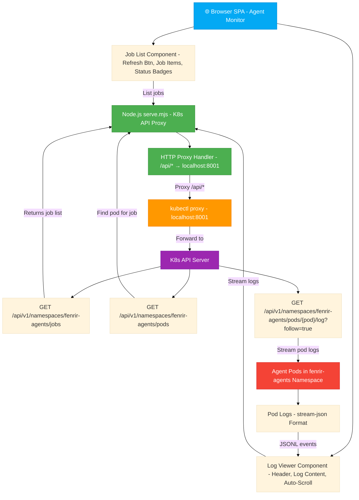
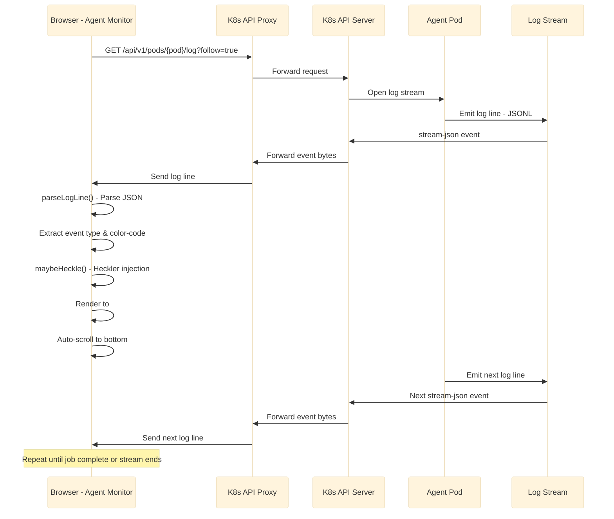

# Agent Monitor — Real-time GKE Agent Log Viewer

A standalone single-file SPA for real-time visibility into Fenrir Ledger GKE agent jobs. No build step required — just open in a browser.

## Features

- **Job List** — Active and recent agent jobs in `fenrir-agents` namespace with status badges
- **Live Log Streaming** — Real-time log stream from selected job via K8s API proxy
- **Structured Display** — Color-coded event types:
  - System messages (gray)
  - Agent text output (white)
  - Tool calls (green)
  - Tool results (muted green)
  - Errors (red)
  - Results summary (gold)
- **Job Metadata** — Session ID, status, duration, model, branch
- **Dark Theme** — Void-black (`#07070d`) with gold accents (`#c9920a`), matching Fenrir Ledger design
- **Responsive** — Adapts to mobile (list above, logs below)
- **Auto-refresh** — Jobs list updates every 10 seconds if no job selected

## Requirements

1. **kubectl proxy running** — Forward K8s API to localhost
2. **GKE cluster access** — Must have kubectl configured
3. **Modern browser** — Chrome, Firefox, Safari, Edge (ES2020+)
4. **Python 3+** or any HTTP server (optional — can open directly via `file://`)

## Quick Start

### Option A: Run via Python HTTP Server (Recommended)

```bash
cd development/agent-monitor
python3 -m http.server 9000

# In another terminal:
kubectl proxy
# Runs on http://localhost:8001

# Open browser:
open http://localhost:9000
```

### Option B: Open Directly in Browser

```bash
# First, start kubectl proxy in one terminal
kubectl proxy

# In browser address bar:
file:///path/to/repo/development/agent-monitor/index.html
```

Then navigate to the file URL in your browser.

### Option C: Use Any HTTP Server

```bash
cd development/agent-monitor
npx http-server -p 9000
# or: ruby -run -ehttpd . -p9000
# or: php -S localhost:9000
```

## Usage

1. **Start kubectl proxy** in a dedicated terminal:
   ```bash
   kubectl proxy
   # Should print: Starting to serve on 127.0.0.1:8001
   ```

2. **Open Agent Monitor** in browser at `http://localhost:9000` (or `file://` URL)

3. **Select a Job**:
   - Jobs list appears on the left (sorted by status: Running first, then by creation time)
   - Click any job to select it
   - Logs stream in real-time on the right

4. **View Logs**:
   - Color-coded events
   - Job metadata in header (status, duration, session ID, model)
   - Auto-scrolls to bottom (disable by scrolling up)

5. **Refresh Jobs** — Click "Refresh" button to manually re-fetch job list

## Architecture

### System Architecture Diagram



## How It Works

### Fetching Jobs

1. Connects to K8s API via `kubectl proxy` (localhost:8001)
2. Queries `/api/v1/namespaces/fenrir-agents/jobs`
3. Filters by label: `app.kubernetes.io/component=agent-sandbox`
4. Extracts metadata:
   - Job name → session ID (format: `agent-issue-NNN-stepM-agentname-hash`)
   - Labels: `branch`, `model`
   - Status from conditions (Running/Succeeded/Failed/Pending)
   - Duration from creation/completion timestamps

### Streaming Logs

1. User selects a job
2. SPA finds pod for that job via label selector `job-name=<jobname>`
3. Opens streaming connection to `/api/v1/namespaces/fenrir-agents/pods/<podname>/log?follow=true`
4. Reads log stream line-by-line
5. Parses each line as JSON (Claude Code `stream-json` format) or plain text
6. Color-codes events by type
7. Renders in scrollable log container

### Log Parsing

Handles multiple formats:

- **Plain text** — Displayed as-is (white)
- **JSON (stream-json)** — Parses event type:
  - `{ type: "text", text: "..." }` → white
  - `{ type: "tool_use", name: "...", input: {...} }` → green
  - `{ type: "tool_result", content: "...", isError: false }` → muted green
  - `{ type: "error", message: "..." }` → red
  - `{ type: "result", usage: {...}, duration: ... }` → gold
  - `{ type: "system", text: "..." }` → gray

### Log Streaming Flow Diagram



## File Structure

```
development/agent-monitor/
├── index.html          ← Main SPA (this file)
└── README.md           ← This file
```

Single HTML file — no build step, no dependencies, no node_modules.

## Keyboard Shortcuts

- (None currently — PRs welcome!)

## Limitations

1. **No GKE-specific auth** — Relies on kubectl auth (kubeconfig). For prod, auth would be GKE OIDC or Bearer token
2. **No RBAC enforcement in SPA** — Browser-side tool. K8s RBAC is enforced server-side
3. **Log memory cap** — Stores max 5000 events (older events dropped)
4. **Completed jobs** — Streams full log without `follow=true`, so stream ends when job log is exhausted
5. **TTL cleanup** — Jobs auto-delete after 30min in cluster; SPA naturally only shows recent jobs
6. **No job metadata editor** — Read-only view

## Development Notes

### Adding Mayo Hecklers

The original `agent-logs.mjs` includes Mayo GAA hecklers. The Agent Monitor SPA intentionally omits them to keep the SPA lightweight and production-focused. If you want hecklers:

1. Uncomment the Mayo logic in this file (search for `// Mayo hecklers`)
2. Inject heckle messages into log events periodically
3. Color them green like agent-logs.mjs

### Heckler Escalation State Machine

The heckler engine maintains a finite state machine that escalates based on agent behavior. Each state represents the heckler's emotional intensity level, with transitions triggered by agent responses.

```mermaid
%%{init: {'theme': 'base', 'themeVariables': {'fontSize': '18px'}}}%%
stateDiagram-v2
    [*] --> Normal: Heckler spawns
    Normal --> Retort: Agent responds to heckle - escalationLevel++
    Retort --> Apoplectic: Agent responds again - escalationLevel++
    Apoplectic --> Explosion: Agent responds yet again - escalationLevel++
    Explosion --> NewHeckler: Heckler explodes - escalationLevel reset to 0
    NewHeckler --> Normal: New heckler entrance with opening line - escalationLevel = 0
    Normal --> Normal: Agent ignores heckle - Stay cool, no escalation
    Retort --> Retort: 60% chance: Escalate with retort from ESCALATION_RETORTS[0]
    Apoplectic --> Apoplectic: 75% chance: Escalate with retort from ESCALATION_RETORTS[1]
    Explosion --> Explosion: 90% chance: Explode with retort from ESCALATION_RETORTS[2]

    Note over Normal: "Oh is THAT so??"
    Note over Retort: "RIGHT THAT'S IT!!"
    Note over Apoplectic: "💥 *spontaneously combusts* 💥"
    Note over Explosion: "New heckler materialises"
    Note over NewHeckler: "Alright, what'd I miss??"
```

### Testing Without Cluster

If you don't have active jobs:

1. Mock K8s API responses by patching the fetch calls
2. Or simulate a local pod log file and stream it

See code comments for extension points.

## Error Handling

- **Connection error** — Shows error box if kubectl proxy unavailable
- **Pod not found** — Shows helpful error when job has no pod yet
- **Stream interrupted** — Displays error and allows retry (refresh job list)
- **K8s API error** — Logged to browser console + error box in UI

## Browser Support

- Chrome/Edge 90+
- Firefox 88+
- Safari 14+
- (Requires ES2020: async/await, Promise, fetch, TextDecoder)

## Future Enhancements

- [ ] WebSocket streaming for real-time updates without polling
- [ ] Filter/search jobs by issue, agent, status
- [ ] Copy logs to clipboard
- [ ] Export logs to file
- [ ] Dark/light theme toggle
- [ ] Mayo hecklers (optional feature flag)
- [ ] Job timeline visualization
- [ ] Agent metrics (tokens, cost, duration histograms)
- [ ] Multi-pod tail (tail multiple jobs at once)

## Troubleshooting

### "Connection error: Failed to fetch"

**Cause:** `kubectl proxy` not running or wrong URL

**Fix:**
```bash
kubectl proxy --port=8001
# Should output: Starting to serve on 127.0.0.1:8001
```

### "Pod not found"

**Cause:** Job created but pod not scheduled yet (Pending)

**Fix:** Wait a moment, then refresh. K8s may need time to schedule the pod.

### Logs not streaming

**Cause:** Job is Succeeded/Failed (completed) and stream ended naturally

**Fix:** This is normal. Open a Running job to see live logs.

### "Namespace not found" / "Jobs not found"

**Cause:** RBAC permissions or cluster access issue

**Fix:** Verify kubectl access:
```bash
kubectl get jobs -n fenrir-agents
# Should list agent jobs
```

## License

Part of Fenrir Ledger. See LICENSE at repo root.

---

**Questions?** Check `.claude/agents/fireman-decko.md` for architectural decisions. Issues go to GitHub #743.
