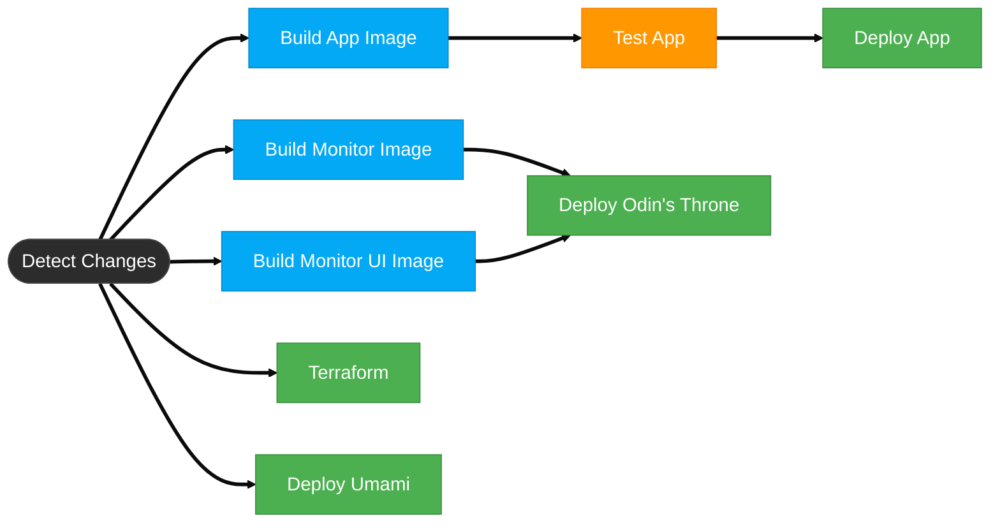
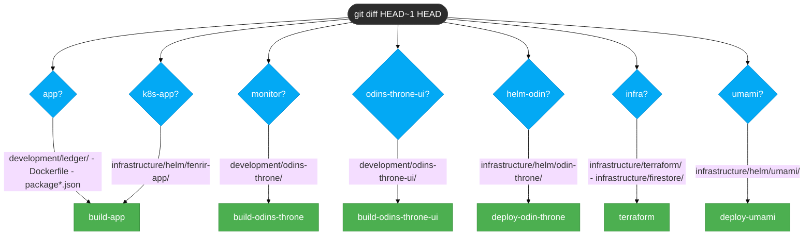
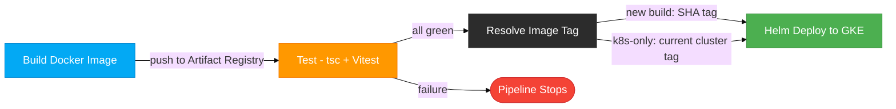
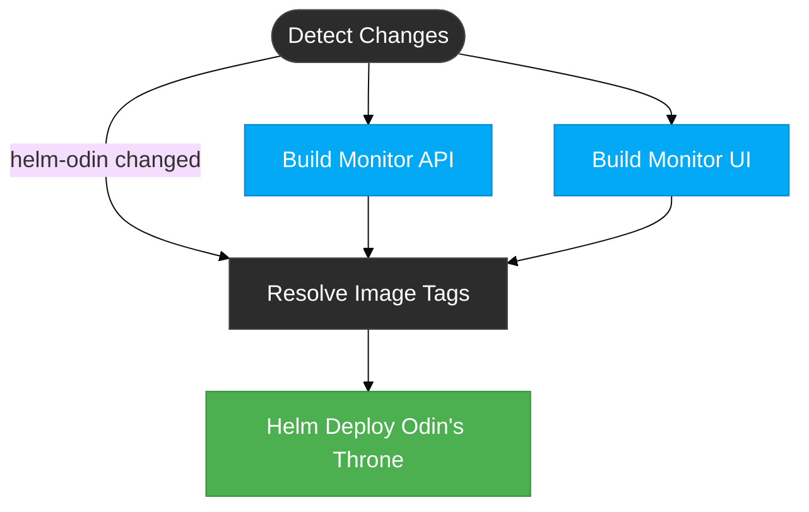
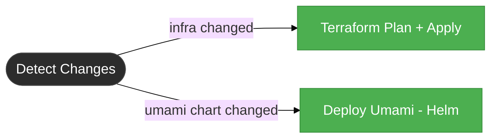
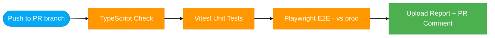

# GitHub Actions Workflows

## Deploy Pipeline (`deploy.yml`)

Runs on every push to `main` and `workflow_dispatch`. Builds, tests, and deploys services to GKE Autopilot.

### Pipeline Overview



### Change Detection

The `detect-changes` job inspects `git diff HEAD~1 HEAD` and produces boolean outputs that gate all downstream jobs. On `workflow_dispatch`, all outputs are forced `true`.



| Output | Paths | Consumer |
|--------|-------|----------|
| `app` | `development/ledger/`, `Dockerfile`, `package*.json` | build-app |
| `k8s-app` | `infrastructure/k8s/app/` | build-app, deploy-app |
| `monitor` | `development/odins-throne/` | build-odins-throne |
| `monitor-ui` | `development/odins-throne-ui/` | build-odins-throne-ui |
| `helm-odin` | `infrastructure/helm/odin-throne/` | deploy-odin-throne |
| `infra` | `infrastructure/terraform/`, `infrastructure/monitoring/` | terraform |
| `umami` | `infrastructure/helm/umami/` | deploy-umami |

### App Pipeline — Build, Test, Deploy

The main application follows a strict build-test-deploy chain. No deployment without passing tests.



**Image tag resolution:** When a new image was built, the deploy uses `$IMAGE_TAG` (commit SHA). When only K8s manifests or Helm values changed (no new build), the deploy queries the cluster for the currently running image tag.

```bash
# Resolve tag from cluster when no new image was built
kubectl get deployment fenrir-app -n fenrir-app \
  -o jsonpath='{.spec.template.spec.containers[?(@.name=="fenrir-app")].image}' \
  | rev | cut -d: -f1 | rev
```

### Monitor Pipeline — Odin's Throne

Two images (API + UI) with independent builds but a single combined deploy.



**Deploy triggers when:**
- Either monitor image was built successfully, OR
- Only Helm chart files changed (no build needed — resolve tags from cluster)

**Deploy blocks when:**
- Either build job failed (not skipped — failed)

### Infrastructure Jobs

Terraform and Umami run independently — no cross-dependencies with app or monitor pipelines.



### Job Dependency Summary

| Job | Depends On | Runs When |
|-----|-----------|-----------|
| `detect-changes` | -- | Always |
| `terraform` | detect-changes | `infra == true` |
| `build-app` | detect-changes | `app == true` OR `k8s-app == true` |
| `test-app` | build-app | build-app succeeded |
| `deploy-app` | test-app, build-app, detect-changes | test-app succeeded |
| `build-odins-throne` | detect-changes | `monitor == true` |
| `build-odins-throne-ui` | detect-changes | `monitor-ui == true` |
| `deploy-odin-throne` | build-odins-throne, build-odins-throne-ui, detect-changes | Any build succeeded OR `helm-odin == true` (no failures) |
| `deploy-umami` | detect-changes | `umami == true` |

### Concurrency

```yaml
concurrency:
  group: deploy-main
  cancel-in-progress: false
```

Deploy runs are serialized — queued, never cancelled. This prevents mid-deploy interruptions.

---

## CI Tests Pipeline (`ci-tests.yml`)

Runs on every push to non-main branches when frontend or test files change.



**Path filters:** Only triggers on changes to `development/ledger/**`, `quality/test-suites/**`, or `.github/workflows/ci-tests.yml`.

**Target:** Tests run against live production (`https://fenrirledger.com`), not a staging environment.

**PR comment:** Upserts a single results table per PR (updates on each push, doesn't spam).
