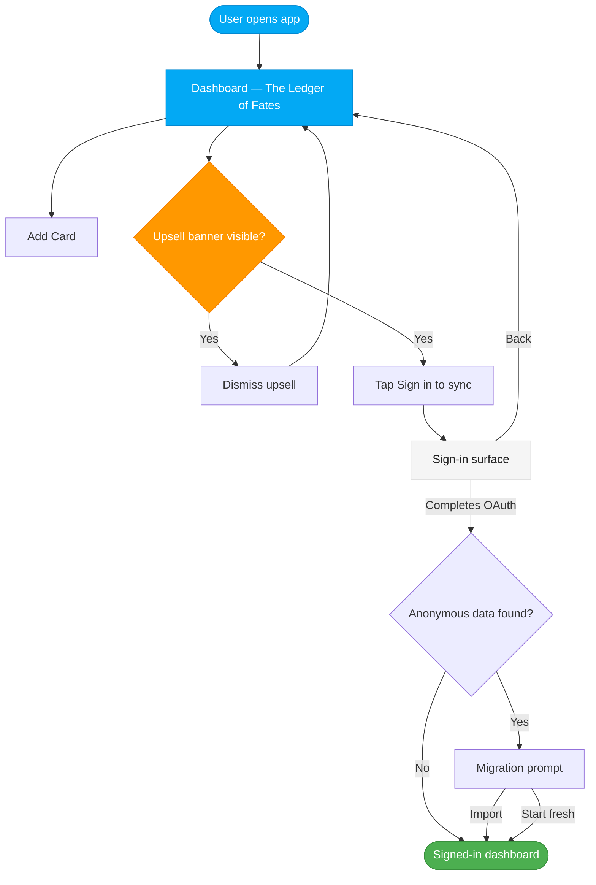
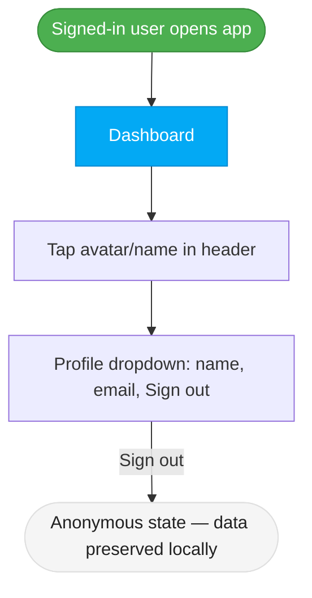

# Handoff to Luna: Anonymous-First Auth + Cloud Sync Upsell

**From**: Freya (Product Owner)
**To**: Luna (UX Designer)
**Date**: 2026-02-27
**Priority**: P2-High — this touches every page the user sees

---

## What Changed and Why

The product direction has shifted from authentication-required to **anonymous-first**.

Previously, the plan was to gate the entire app behind a Google sign-in page. Users who
were not authenticated would be redirected to a sign-in page before they could see
anything.

That model is gone. The new model is:

- **Users open the app and use it immediately.** No login page. No redirect. No OAuth
  flow on first load.
- **localStorage is the data store for all users.** An anonymous user's data is scoped
  to a locally-generated UUID (`householdId`) stored in their browser. This is
  functionally identical to the signed-in model — the UUID just comes from the browser
  instead of Google.
- **Login is an optional upgrade.** When cloud sync ships at GA, users can sign in to
  back up their data and access it from other devices. Login is surfaced as an upsell,
  not a gate.

---

## What This Means for UX

### 1. The Sign-In Page Flow — Remove the Gate

The existing sign-in page (currently the first thing users see) must be removed as a
mandatory entry point. The app should open directly to the dashboard.

The sign-in page itself does not disappear — it becomes a destination the user
navigates to voluntarily (via the "Sign in to sync" upsell), not a wall they must pass
through.

**What Luna needs to decide:**
- Does the sign-in page get a new route (e.g. `/sign-in`) that is only reachable from
  the upsell, or is it embedded in a modal/sheet?
- What does the sign-in page communicate differently now that it is opt-in? It should
  feel like an upgrade, not a requirement. The copy direction is in the story.

### 2. The Anonymous Header State — The Unnamed Wolf

The TopBar currently shows a signed-in user's Google avatar and name. In the
anonymous state, there is no avatar and no name to show.

The product decision: show the rune **ᛟ** (Othalan) in a circular SVG placeholder where
the avatar would appear. This is not a broken state — it is the wolf unnamed. It must
feel intentional, not like a missing image.

**What Luna needs to decide:**
- Exactly how the ᛟ rune avatar looks in the TopBar: size, color treatment, border
  treatment (faint gold ring — same Gleipnir echo as the signed-in avatar, or
  intentionally different to signal the anonymous state?).
- Whether the anonymous avatar is interactive (does clicking it open a "Sign in to sync"
  prompt, or is it purely decorative in the anonymous state?). Product preference: make
  it interactive — clicking the rune opens a light prompt/sheet with the upsell.
- How the transition looks when the user signs in and the ᛟ rune becomes their Google
  avatar. This is a moments-worth-designing transition.

### 3. The Cloud Sync Upsell Pattern — New Design Problem

This is the most significant new UX surface. The upsell must:

- **Never block anything.** The user can dismiss it and never see it again until they go
  to settings.
- **Communicate genuine value.** "Sign in to sync your data across all your devices" is
  a real benefit. The design should make it feel worth doing, not like consent farming.
- **Respect the saga voice.** The atmospheric copy direction is in the story:
  *"Your chains are stored here alone."* — the upsell is a raven dispatch, not a
  marketing popup.

**What Luna needs to decide:**
- Where does the upsell live? Options:
  a. A dismissible banner at the top of the dashboard (below the TopBar)
  b. A subtle persistent indicator in the TopBar (next to the ᛟ avatar)
  c. A first-visit modal that appears once and is dismissed — low preference, feels like a gate
  d. Settings only — purely opt-in, no proactive surface
  Product preference is (a) or (b), with (a) being the most visible and dismissible.
- What does "dismissed" look like? Does the banner collapse gracefully, or does it slide
  out? What animation pattern?
- Does the upsell appear on all pages (dashboard, card form, Valhalla) or only the
  dashboard?

### 4. The Sign-In Surface Itself

When a user taps "Sign in to sync," they need somewhere to go. This is likely:

- A dedicated `/sign-in` page (cleanest; bookmarkable), or
- A sheet/drawer that slides up from the bottom (mobile-forward; no navigation cost)

**What Luna needs to decide:**
- Modal/sheet vs. dedicated page — each has a different feel. A dedicated page signals
  commitment and importance. A sheet signals optional and lightweight.
- The sign-in page/sheet must have a clear back path: "Continue without signing in"
  (functional label per copywriting guide). The back path must be visually prominent —
  not hidden or de-emphasized.
- What happens to the upsell banner after the user visits the sign-in page but does not
  complete sign-in? Is it shown again?

### 5. Post-Sign-In Migration Prompt

If a user has anonymous data in localStorage and then signs in, they will be offered a
migration: "We found N cards from your anonymous session — add them to your cloud
account?"

This is a new dialog that does not currently exist. It must be:
- An explicit choice with clear consequences ("Yes, import N cards" / "Start fresh")
- Not alarming — the user's data is safe either way
- Norse saga voice for the atmospheric frame: *"Your ledger was already written before
  you named yourself."*

**What Luna needs to decide:**
- Modal or dedicated page for the migration prompt?
- What happens if the user chooses "Start fresh" — do they understand their anonymous
  data is not deleted (it stays in the browser, just under a different namespace)?

---

## User Flow Diagrams

### Anonymous User Flow (current state after this change)

### Signed-In User Flow (future — GA)

---

## Header States Side-by-Side

| Element | Anonymous State | Signed-In State |
|---------|-----------------|-----------------|
| Avatar | ᛟ rune in SVG circle (gold on void-black) | Google profile picture (`rounded-full`, faint gold ring) |
| Name | Not shown | Shown on desktop (≥ 768 px); hidden in header on mobile |
| Avatar interaction | Opens upsell prompt (TBD by Luna) | Opens profile dropdown |
| Dropdown contents | — | Full name, email, "Sign out" |
| Atmospheric copy | *"The wolf runs unnamed."* | *"The wolf is named."* |

---

## Wireframes Needed

Luna, here is a complete list of the wireframes this change requires:

### Must Have (blocks implementation)

1. **Anonymous TopBar state** — ᛟ rune avatar placement, sizing, interaction affordance
2. **Cloud sync upsell banner** — desktop and mobile variants, dismissed state
3. **Sign-in surface (opt-in)** — dedicated page or sheet; includes "Continue without
   signing in" back path; Saga Ledger aesthetic; feels like an upgrade not a gate
4. **Anonymous-to-signed-in avatar transition** — the visual moment of naming the wolf

### Should Have (needed before GA sprint)

5. **Profile dropdown (signed-in)** — updates to existing dropdown spec; confirm no
   standalone "Log out" button remains; atmospheric copy placement
6. **Migration prompt** — dialog shown on first sign-in when anonymous data exists;
   import vs. start fresh choice

### Nice to Have (polish)

7. **Upsell in settings** — persistent "Sync to cloud" option in the settings page for
   users who dismissed the banner
8. **Sign-in page — no anonymous data** — the clean "first sign-in ever" variant
   (simpler; no migration prompt)

---

## Key Design Decisions for Luna

These are open questions that I'm handing to you to resolve through design:

1. **Anonymous avatar interactivity**: Should the ᛟ rune avatar be tappable in the
   anonymous state? If yes, what does tapping it do? Product preference: yes, opens a
   light upsell prompt. But if Luna finds a better pattern, bring it back for review.

2. **Upsell placement**: Banner vs. TopBar indicator vs. settings-only. Product has a
   preference for the banner — but you should consider whether a subtle TopBar indicator
   (a small cloud icon or text next to the avatar) is more respectful of the user's
   attention. Bring a recommendation with rationale.

3. **Sign-in surface: page vs. sheet**: A dedicated `/sign-in` page feels considered and
   permanent. A bottom sheet feels lightweight and optional. The product wants the user
   to feel empowered (optional), not pressured. Let the design make that call.

4. **Upsell dismissal animation**: How does the banner leave? The product personality is
   "the wolf is patient" — a graceful fade/collapse is right. Nothing aggressive.

5. **Migration prompt tone**: This prompt needs to walk a fine line — it should
   communicate that the user's data is safe (not lost), while making the "import"
   path feel natural and the "start fresh" path feel valid, not like a mistake.

---

## Non-Negotiables from Product

These are constraints Luna does not have discretion on:

- The app must open to the dashboard for all users — no sign-in page as the entry point
- The upsell must be dismissible with a single tap/click
- "Continue without signing in" must be a clearly visible escape path on any sign-in
  surface (not an afterthought link in small text)
- All sign-in/upsell surfaces must work at 375 px minimum width (mobile-first)
- Atmospheric copy (banners, headings, empty states) uses the Norse saga voice per
  `copywriting.md`; CTAs and buttons are plain English (Voice 1)
- The ᛟ rune avatar is the canonical anonymous identity — do not use a generic user
  icon, a question mark, or a silhouette

---

## Related Files

- `product/product-design-brief.md` — Updated header profile section + key design decisions
- `product/copywriting.md` — Two-voice rule, upsell copy direction

**Note:** Auth stories are tracked as GitHub Issues (backlog markdown files have been removed).
