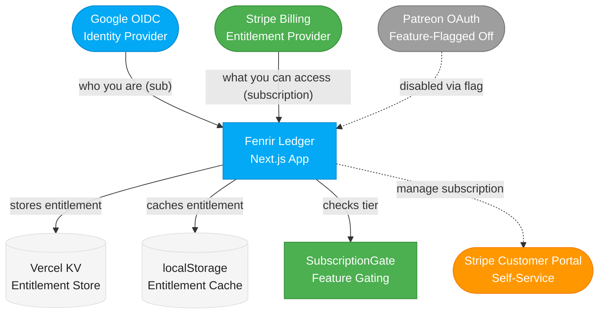

# Platform Recommendation for Fenrir Ledger

## Current Decision: Stripe Direct (Pivot from Patreon)

**Status:** Strategic pivot in progress. Patreon integration is being feature-flagged off. Stripe Direct is the new subscription platform.

**Decision date:** 2026-03-04

**Rationale:** Stripe Direct provides significantly better revenue retention ($9.34 vs $8.41 per $10 subscription), full control over the billing experience, and eliminates platform dependency. The Patreon integration was well-architected for provider portability (documented in ADR-009), making this pivot feasible with moderate engineering effort.

---

## Why Stripe Direct Wins Over Patreon

### 1. Fee Advantage Is Significant

At $10/month per subscriber:

| Platform | Platform Fee | Processing Fee | You Keep |
|----------|-------------|----------------|----------|
| Stripe Direct | $0.07 (0.7% Billing) | $0.59 (2.9% + $0.30) | **$9.34** |
| Patreon | $1.00 (10%) | $0.59 (2.9% + $0.30) | **$8.41** |

That is $0.93 more per subscriber per month with Stripe. At 100 subscribers, that is $93/month. At 500 subscribers, $465/month. The fee delta grows linearly and never stops compounding.

### 2. Full Control Over Billing Experience

Stripe provides:
- **Stripe Checkout** -- hosted, PCI-compliant payment pages, customizable to match the Norse theme
- **Stripe Billing** -- subscription lifecycle management (trials, upgrades, downgrades, proration)
- **Customer Portal** -- subscriber self-service (update payment method, cancel, view invoices)
- **Stripe Webhooks** -- SHA-256 signed events (vs Patreon's HMAC-MD5, SEV-001)
- **All payment methods** -- credit cards, Apple Pay, Google Pay, ACH, SEPA, and more

### 3. Churner-Friendly Payment Methods

Credit card churners want to pay with credit cards to maximize their own rewards. Stripe supports all major cards plus Apple Pay and Google Pay. Patreon's payment method support is more limited (cards + PayPal only).

### 4. No Platform Dependency Risk

Patreon is a third party that can change pricing (they already raised to 10% in Aug 2025), change APIs, or experience outages. Stripe is pure payment infrastructure -- the relationship is direct between Fenrir Ledger and the subscriber.

### 5. iOS Apple Tax Elimination

Patreon charges an additional 30% on iOS subscriptions (Apple tax). With Stripe Direct via web-only, this tax does not apply. If a native app is ever built, the web-based Stripe checkout can still be used to avoid in-app purchase requirements.

### 6. Architecture Was Designed for This

The existing entitlement layer was explicitly designed for provider portability (see ADR-009):
- `useEntitlement` hook is platform-agnostic -- the frontend checks `tier` and `hasFeature()`, not `platform`
- `PatreonGate` checks tier, not platform
- `EntitlementPlatform` type already has a comment: `// Future: | "buymeacoffee" | "stripe" | ...`
- Vercel KV entitlement store can be re-keyed from Patreon records to Stripe subscription records
- The only Patreon-specific UI is in `PatreonSettings.tsx` and the campaign URL in `SealedRuneModal.tsx`

---

## Patreon Integration: Feature-Flagged, Not Deleted

The existing Patreon integration will be preserved behind a feature flag, not deleted. This ensures:

1. **Rollback safety** -- If the Stripe migration hits blockers, Patreon can be re-enabled immediately
2. **Existing subscribers** -- Any active Patreon subscribers can be migrated gracefully
3. **Code reference** -- The Patreon implementation serves as a working reference for the Stripe integration's structure
4. **Test coverage preservation** -- Existing test suites remain valid for regression testing

### Feature Flag Plan

See `specs/feature-flagging-system.md` for the full feature flagging spec.

A single environment variable controls the active subscription platform:

```
SUBSCRIPTION_PLATFORM=stripe   # or "patreon" to revert
```

The `EntitlementContext` reads this flag and routes to the appropriate provider (Stripe routes or Patreon routes). The feature gating layer (`PatreonGate`, `useEntitlement`, `hasFeature()`) does not change.

### What Gets Flagged Off

**API Routes** (6 routes behind flag):
- `/api/patreon/authorize`
- `/api/patreon/callback`
- `/api/patreon/membership`
- `/api/patreon/webhook`
- `/api/patreon/unlink`
- `/api/patreon/migrate`

**Client Components** (behind flag):
- `PatreonSettings.tsx` -- replaced by `StripeSettings.tsx`
- `SealedRuneModal.tsx` -- campaign URL updated to Stripe checkout link
- `UpsellBanner.tsx` -- CTA updated to Stripe checkout
- `UnlinkConfirmDialog.tsx` -- adapted for Stripe subscription cancellation

**Server Libraries** (behind flag):
- `lib/patreon/api.ts`
- `lib/patreon/types.ts`
- `lib/patreon/state.ts`

**Environment Variables** (Patreon vars become optional):
- `PATREON_CLIENT_ID`
- `PATREON_CLIENT_SECRET`
- `PATREON_CAMPAIGN_ID`
- `PATREON_WEBHOOK_SECRET`

---

## Stripe Direct Implementation Strategy

### Phase 1: Feature Flag + Stripe Checkout (MVP)

Build the minimum Stripe integration to replace Patreon's subscription capability:

1. **Stripe Product + Price** -- Create a "Karl" product in Stripe Dashboard with $5/month price
2. **Stripe Checkout Session** -- API route creates a Checkout Session, redirects user to Stripe-hosted payment page
3. **Stripe Webhooks** -- Handle `checkout.session.completed`, `customer.subscription.updated`, `customer.subscription.deleted`
4. **Entitlement Store Update** -- Store Stripe `customer_id` and `subscription_id` in Vercel KV (same pattern as Patreon)
5. **Customer Portal** -- Link to Stripe Customer Portal for subscription management (cancel, update payment)
6. **Feature Flag** -- `SUBSCRIPTION_PLATFORM=stripe` activates Stripe routes, deactivates Patreon routes

### Phase 2: Enhanced Billing (Post-MVP)

- Annual billing option (discounted)
- Trial periods
- Promotional pricing / coupon codes
- Usage-based pricing for future features
- Invoice history in-app

### Architecture



### New API Routes (Stripe)

| Route | Method | Purpose |
|-------|--------|---------|
| `/api/stripe/checkout` | POST | Creates Stripe Checkout Session, returns URL |
| `/api/stripe/webhook` | POST | Handles Stripe webhook events (SHA-256 verified) |
| `/api/stripe/membership` | GET | Returns current subscription status from KV |
| `/api/stripe/portal` | POST | Creates Stripe Customer Portal session |
| `/api/stripe/unlink` | POST | Cancels subscription and clears entitlement |

### New Environment Variables

| Variable | Purpose |
|----------|---------|
| `STRIPE_SECRET_KEY` | Stripe API secret key |
| `STRIPE_PUBLISHABLE_KEY` | Stripe publishable key (client-side, `NEXT_PUBLIC_`) |
| `STRIPE_WEBHOOK_SECRET` | Webhook endpoint signing secret |
| `STRIPE_PRICE_ID` | Price ID for the Karl tier |
| `SUBSCRIPTION_PLATFORM` | Feature flag: `stripe` or `patreon` |

---

## What "Done" Looks Like

The Stripe Direct migration is complete when:

- [ ] Feature flag `SUBSCRIPTION_PLATFORM` controls which provider is active
- [ ] Patreon routes return 404 or redirect when flag is set to `stripe`
- [ ] Stripe Checkout flow works end-to-end: click subscribe -> pay -> entitlement granted
- [ ] Stripe webhooks update entitlement in real-time on subscription changes
- [ ] Customer Portal link works for self-service subscription management
- [ ] `useEntitlement` hook works identically regardless of provider
- [ ] `PatreonGate` (renamed to `SubscriptionGate`) works with both providers
- [ ] Settings page shows Stripe subscription status (replaces PatreonSettings)
- [ ] SealedRuneModal links to Stripe Checkout (not Patreon campaign page)
- [ ] Existing Patreon tests still pass when flag is set to `patreon`
- [ ] New Stripe test suites pass
- [ ] Security review by Heimdall (Stripe webhook signature verification, key management)

---

## Substack Content/Marketing Recommendation

**Status: Still recommended, not yet executed.**

The original recommendation to use Substack for audience building and content marketing remains valid and complementary to Stripe Direct. Stripe handles subscription/entitlement. Substack would handle discovery and content.

### Why Substack Still Makes Sense

- Churners are already active and paying on Substack (Raymond La, The Daily Churn, Datastream, Exclusive Access)
- Built-in discovery and network effects bring new users to the product
- A "Fenrir Ledger Weekly" newsletter with deal alerts, card strategy, and points analysis would drive traffic to the app
- Substack is free to start; the 10% fee only applies if the newsletter itself has paid subscribers
- Content marketing and tool subscription are complementary, not competing

### Proposed Substack Strategy (Deferred)

When the team is ready to invest in content marketing:

1. Launch a free Substack newsletter: "Fenrir Ledger -- The Churner's Forge"
2. Content: weekly deal alerts, card strategy breakdowns, points optimization, tool tips
3. Include CTAs linking to the Fenrir Ledger app and Stripe checkout
4. Consider a paid Substack tier only if the newsletter itself generates enough unique content to justify it
5. Cross-promote: Stripe subscribers get early access to newsletter content; Substack readers discover the app

This is a P3 initiative. The current focus is shipping the Stripe Direct integration and premium features for Karl-tier subscribers.

---

## Prior Art: Patreon Integration (Preserved for Reference)

The Patreon integration shipped in March 2026 and is fully operational. It is preserved behind a feature flag as a reference implementation and fallback option.

### Patreon Integration Components

**API Routes** (6 routes):
- `/api/patreon/authorize` -- Initiates Patreon OAuth flow
- `/api/patreon/callback` -- Handles OAuth callback, stores entitlement in Vercel KV
- `/api/patreon/membership` -- Returns current entitlement status
- `/api/patreon/webhook` -- Processes membership change events
- `/api/patreon/unlink` -- Removes Patreon linkage
- `/api/patreon/migrate` -- Migrates anonymous entitlement to Google-keyed on sign-in

**Client Components**:
- `EntitlementContext` -- React context (platform-agnostic, reusable)
- `useEntitlement` hook -- Platform-agnostic interface (reusable)
- `PatreonGate` -- Feature gating component (reusable with rename)
- `SealedRuneModal` -- Norse-themed upsell modal (reusable with URL swap)
- `UpsellBanner` -- Upsell banner (reusable with CTA swap)
- `PatreonSettings` -- Settings page component (replaced by StripeSettings)
- `UnlinkConfirmDialog` -- Confirmation dialog (reusable)

**Infrastructure**:
- Vercel KV for server-side entitlement storage (AES-256-GCM encrypted tokens)
- Dual-environment OAuth clients (dev + production)
- Anonymous Patreon flow with migration on Google sign-in

**Architecture References**:
- ADR-009: `designs/architecture/adr-009-patreon-entitlement.md`
- Product Design Brief: `designs/product/backlog/patreon-subscription-brief.md`
- Security Review: `security/reports/2026-03-02-patreon-integration.md`

---

## Original Research Tiers (Preserved for Context)

### Tier 1: Originally Recommended

**Stripe Direct** -- Best fit for a pure SaaS tool. Lowest fees, full control. Requires significant billing infrastructure development.

**Substack** -- Best complement for audience building. Only platform where churners are already active and paying.

### Tier 2: Viable Alternatives

| Platform | Best If... |
|---|---|
| **Buy Me a Coffee** | Simplest setup, low fees (5%), casual brand acceptable |
| **Ghost** | Self-hosted publication, 0% platform fees, full audience ownership |
| **Patreon** | Robust tier management, multiple feature tiers, indie creator positioning |

### Tier 3: Not Recommended

| Platform | Why Not |
|---|---|
| **Gumroad** | Highest effective fees; weak community; better for one-off digital products |
| **Ko-fi** | Art/creative brand mismatch; no churning audience |
| **Memberful** | $49/mo base cost is prohibitive for a solo project starting out |

---

## Where Churners Are Active

Understanding the existing churning community helps inform content and marketing strategy:

- **Reddit** (r/churning) -- Primary hub, free
- **Discord** -- The Daily Churn, The Credit Community, The Points Party (paid/free communities)
- **Substack** -- Growing number of churning newsletters
- **FlyerTalk** -- Long-established forum community

---

## Sources

- [Substack churning newsletters](https://raymondla.substack.com/p/my-2025-credit-card-strategy)
- [Patreon pricing changes August 2025](https://support.patreon.com/hc/en-us/articles/36426991446797)
- [Patreon pricing overview](https://www.schoolmaker.com/blog/patreon-pricing)
- [Ko-fi pricing](https://ko-fi.com/pricing)
- [Ko-fi vs Buy Me a Coffee](https://talks.co/p/kofi-vs-buy-me-a-coffee/)
- [Ghost Pro pricing](https://forum.ghost.org/t/updated-ghost-pro-pricing-july-2025-15-mo-starter-29-mo-publisher-199-mo-business/59090)
- [Gumroad pricing](https://gumroad.com/pricing)
- [Memberful pricing](https://memberful.com/pricing/)
- [Stripe Billing pricing](https://stripe.com/billing/pricing)
- [Stripe fees guide](https://www.swipesum.com/insights/guide-to-stripe-fees-rates-for-2025)
- [Buy Me a Coffee pricing](https://www.schoolmaker.com/blog/buy-me-a-coffee-pricing)
- [The Daily Churn Discord](https://thedailychurnpodcast.com/discord/)
- [The Points Party](https://thepointsparty.com/community)
- [The Credit Community Discord](https://discord.com/servers/the-credit-community-931760921825665034)
