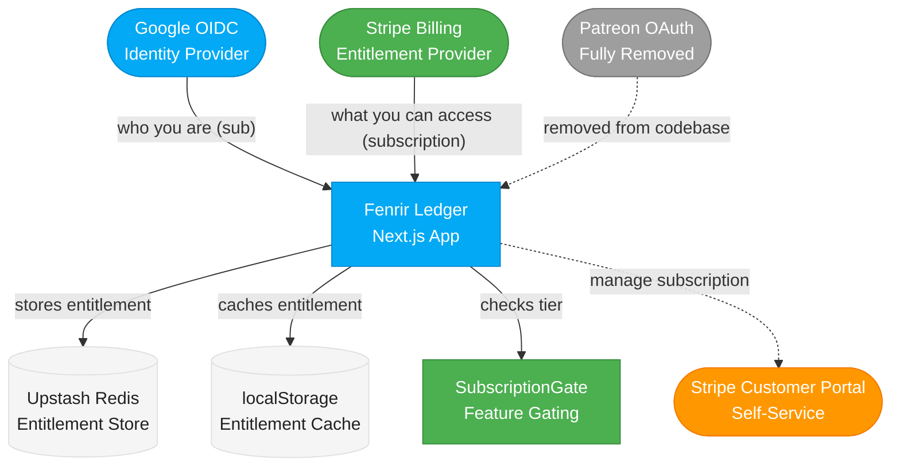

# Platform Recommendation for Fenrir Ledger

## Current Decision: Stripe Direct

**Status:** Stripe Direct is the subscription platform. Patreon has been fully removed (not just feature-flagged).

**Decision date:** 2026-03-04

**Rationale:** Stripe Direct provides significantly better revenue retention ($9.34 vs $8.41 per $10 subscription), full control over the billing experience, and eliminates platform dependency. Patreon was fully removed (all routes, components, and environment variables deleted) after Stripe Direct shipped.

---

## Why Stripe Direct Wins Over Patreon

### 1. Fee Advantage Is Significant

At $10/month per subscriber:

| Platform | Platform Fee | Processing Fee | You Keep |
|----------|-------------|----------------|----------|
| Stripe Direct | $0.07 (0.7% Billing) | $0.59 (2.9% + $0.30) | **$9.34** |
| Patreon | $1.00 (10%) | $0.59 (2.9% + $0.30) | **$8.41** |

That is $0.93 more per subscriber per month with Stripe. At 100 subscribers, that is $93/month. At 500 subscribers, $465/month. The fee delta grows linearly and never stops compounding.

### 2. Full Control Over Billing Experience

Stripe provides:
- **Stripe Checkout** -- hosted, PCI-compliant payment pages, customizable to match the Norse theme
- **Stripe Billing** -- subscription lifecycle management (trials, upgrades, downgrades, proration)
- **Customer Portal** -- subscriber self-service (update payment method, cancel, view invoices)
- **Stripe Webhooks** -- SHA-256 signed events (vs Patreon's HMAC-MD5, SEV-001)
- **All payment methods** -- credit cards, Apple Pay, Google Pay, ACH, SEPA, and more

### 3. Churner-Friendly Payment Methods

Credit card churners want to pay with credit cards to maximize their own rewards. Stripe supports all major cards plus Apple Pay and Google Pay. Patreon's payment method support is more limited (cards + PayPal only).

### 4. No Platform Dependency Risk

Patreon is a third party that can change pricing (they already raised to 10% in Aug 2025), change APIs, or experience outages. Stripe is pure payment infrastructure -- the relationship is direct between Fenrir Ledger and the subscriber.

### 5. iOS Apple Tax Elimination

Patreon charges an additional 30% on iOS subscriptions (Apple tax). With Stripe Direct via web-only, this tax does not apply. If a native app is ever built, the web-based Stripe checkout can still be used to avoid in-app purchase requirements.

### 6. Architecture Was Designed for This

The existing entitlement layer was explicitly designed for provider portability (see ADR-009):
- `useEntitlement` hook is platform-agnostic -- the frontend checks `tier` and `hasFeature()`, not `platform`
- `PatreonGate` checks tier, not platform
- `EntitlementPlatform` type already has a comment: `// Future: | "buymeacoffee" | "stripe" | ...`
- Upstash Redis (KV store) entitlement store can be re-keyed from Patreon records to Stripe subscription records
- The only Patreon-specific UI is in `PatreonSettings.tsx` and the campaign URL in `SealedRuneModal.tsx`

---

## Patreon Integration: Fully Removed

The Patreon integration was fully removed from the codebase. All Patreon API routes, client components, server libraries, and environment variables have been deleted. The `SUBSCRIPTION_PLATFORM` feature flag is no longer needed -- Stripe Direct is the only provider.

**Removed (no longer in codebase):**
- All `/api/patreon/*` routes (authorize, callback, membership, webhook, unlink, migrate)
- `PatreonSettings.tsx`, `lib/patreon/api.ts`, `lib/patreon/types.ts`, `lib/patreon/state.ts`
- `PATREON_CLIENT_ID`, `PATREON_CLIENT_SECRET`, `PATREON_CAMPAIGN_ID`, `PATREON_WEBHOOK_SECRET` environment variables
- `SUBSCRIPTION_PLATFORM` feature flag

Loki validated the removal with a 36-test Playwright suite (`patreon-removal.spec.ts`) confirming all 14 Patreon routes return 404, zero Patreon text remains in the UI, and Stripe-only entitlement works correctly.

---

## Stripe Direct Implementation Strategy

### Phase 1: Feature Flag + Stripe Checkout (MVP)

Build the minimum Stripe integration to replace Patreon's subscription capability:

1. **Stripe Product + Price** -- Create a "Karl" product in Stripe Dashboard with $5/month price
2. **Stripe Checkout Session** -- API route creates a Checkout Session, redirects user to Stripe-hosted payment page
3. **Stripe Webhooks** -- Handle `checkout.session.completed`, `customer.subscription.updated`, `customer.subscription.deleted`
4. **Entitlement Store Update** -- Store Stripe `customer_id` and `subscription_id` in the KV store (Upstash Redis via `KV_REST_API_URL`/`KV_REST_API_TOKEN`) — same pattern as Patreon
5. **Customer Portal** -- Link to Stripe Customer Portal for subscription management (cancel, update payment)

### Phase 2: Enhanced Billing (Post-MVP)

- Annual billing option (discounted)
- Trial periods
- Promotional pricing / coupon codes
- Usage-based pricing for future features
- Invoice history in-app

### Architecture

### New API Routes (Stripe)

| Route | Method | Purpose |
|-------|--------|---------|
| `/api/stripe/checkout` | POST | Creates Stripe Checkout Session, returns URL |
| `/api/stripe/webhook` | POST | Handles Stripe webhook events (SHA-256 verified) |
| `/api/stripe/membership` | GET | Returns current subscription status from KV |
| `/api/stripe/portal` | POST | Creates Stripe Customer Portal session |
| `/api/stripe/unlink` | POST | Cancels subscription and clears entitlement |

### New Environment Variables

| Variable | Purpose |
|----------|---------|
| `STRIPE_SECRET_KEY` | Stripe API secret key |
| `STRIPE_PUBLISHABLE_KEY` | Stripe publishable key (client-side, `NEXT_PUBLIC_`) |
| `STRIPE_WEBHOOK_SECRET` | Webhook endpoint signing secret |
| `STRIPE_PRICE_ID` | Price ID for the Karl tier |

---

## What "Done" Looks Like

**Status (2026-03-20):** Stripe Direct integration is complete. All five API routes are confirmed present in the codebase. `PatreonGate` has been renamed to `SubscriptionGate` (Stripe-only). `SealedRuneModal`, `KarlUpsellDialog`, and `SubscriptionGate` all route through Stripe Checkout. Entitlement is stored in Vercel KV (Upstash REST API) and kept fresh by Stripe webhooks.

- [x] Stripe Checkout flow works end-to-end: click subscribe -> pay -> entitlement granted
- [x] Stripe webhooks update entitlement in real-time on subscription changes
- [x] Customer Portal link works for self-service subscription management
- [x] `useEntitlement` hook works identically (Stripe-only provider)
- [x] `SubscriptionGate` (renamed from `PatreonGate`) works with Stripe
- [ ] Settings page shows Stripe subscription status (verify in next QA pass)
- [x] SealedRuneModal links to Stripe Checkout (not Patreon campaign page)
- [ ] New Stripe test suites pass (verify with Loki)
- [ ] Security review by Heimdall (Stripe webhook signature verification, key management)

---

## Substack Content/Marketing Recommendation

**Status: Still recommended, not yet executed.**

The original recommendation to use Substack for audience building and content marketing remains valid and complementary to Stripe Direct. Stripe handles subscription/entitlement. Substack would handle discovery and content.

### Why Substack Still Makes Sense

- Churners are already active and paying on Substack (Raymond La, The Daily Churn, Datastream, Exclusive Access)
- Built-in discovery and network effects bring new users to the product
- A "Fenrir Ledger Weekly" newsletter with deal alerts, card strategy, and points analysis would drive traffic to the app
- Substack is free to start; the 10% fee only applies if the newsletter itself has paid subscribers
- Content marketing and tool subscription are complementary, not competing

### Proposed Substack Strategy (Deferred)

When the team is ready to invest in content marketing:

1. Launch a free Substack newsletter: "Fenrir Ledger -- The Churner's Forge"
2. Content: weekly deal alerts, card strategy breakdowns, points optimization, tool tips
3. Include CTAs linking to the Fenrir Ledger app and Stripe checkout
4. Consider a paid Substack tier only if the newsletter itself generates enough unique content to justify it
5. Cross-promote: Stripe subscribers get early access to newsletter content; Substack readers discover the app

This is a P3 initiative. The current focus is shipping the Stripe Direct integration and premium features for Karl-tier subscribers.

---

## Prior Art: Patreon Integration (Removed)

The Patreon integration shipped in March 2026 and was subsequently fully removed from the codebase in favor of Stripe Direct. The git history preserves the implementation for reference.

**Reusable components that survived the Patreon removal:**
- `EntitlementContext` -- React context (now Stripe-only)
- `useEntitlement` hook -- Platform-agnostic interface
- `SealedRuneModal` -- Norse-themed upsell modal (now links to Stripe Checkout)
- `UpsellBanner` -- Upsell banner (now CTA links to Stripe Checkout)

**Infrastructure retained:**
- Upstash Redis (KV store) for server-side entitlement storage
- Entitlement migration on Google sign-in

---

## Original Research Tiers (Preserved for Context)

### Tier 1: Originally Recommended

**Stripe Direct** -- Best fit for a pure SaaS tool. Lowest fees, full control. Requires significant billing infrastructure development.

**Substack** -- Best complement for audience building. Only platform where churners are already active and paying.

### Tier 2: Viable Alternatives

| Platform | Best If... |
|---|---|
| **Buy Me a Coffee** | Simplest setup, low fees (5%), casual brand acceptable |
| **Ghost** | Self-hosted publication, 0% platform fees, full audience ownership |
| **Patreon** | Robust tier management, multiple feature tiers, indie creator positioning |

### Tier 3: Not Recommended

| Platform | Why Not |
|---|---|
| **Gumroad** | Highest effective fees; weak community; better for one-off digital products |
| **Ko-fi** | Art/creative brand mismatch; no churning audience |
| **Memberful** | $49/mo base cost is prohibitive for a solo project starting out |

---

## Where Churners Are Active

Understanding the existing churning community helps inform content and marketing strategy:

- **Reddit** (r/churning) -- Primary hub, free
- **Discord** -- The Daily Churn, The Credit Community, The Points Party (paid/free communities)
- **Substack** -- Growing number of churning newsletters
- **FlyerTalk** -- Long-established forum community

---

## Sources

- [Substack churning newsletters](https://raymondla.substack.com/p/my-2025-credit-card-strategy)
- [Patreon pricing changes August 2025](https://support.patreon.com/hc/en-us/articles/36426991446797)
- [Patreon pricing overview](https://www.schoolmaker.com/blog/patreon-pricing)
- [Ko-fi pricing](https://ko-fi.com/pricing)
- [Ko-fi vs Buy Me a Coffee](https://talks.co/p/kofi-vs-buy-me-a-coffee/)
- [Ghost Pro pricing](https://forum.ghost.org/t/updated-ghost-pro-pricing-july-2025-15-mo-starter-29-mo-publisher-199-mo-business/59090)
- [Gumroad pricing](https://gumroad.com/pricing)
- [Memberful pricing](https://memberful.com/pricing/)
- [Stripe Billing pricing](https://stripe.com/billing/pricing)
- [Stripe fees guide](https://www.swipesum.com/insights/guide-to-stripe-fees-rates-for-2025)
- [Buy Me a Coffee pricing](https://www.schoolmaker.com/blog/buy-me-a-coffee-pricing)
- [The Daily Churn Discord](https://thedailychurnpodcast.com/discord/)
- [The Points Party](https://thepointsparty.com/community)
- [The Credit Community Discord](https://discord.com/servers/the-credit-community-931760921825665034)
