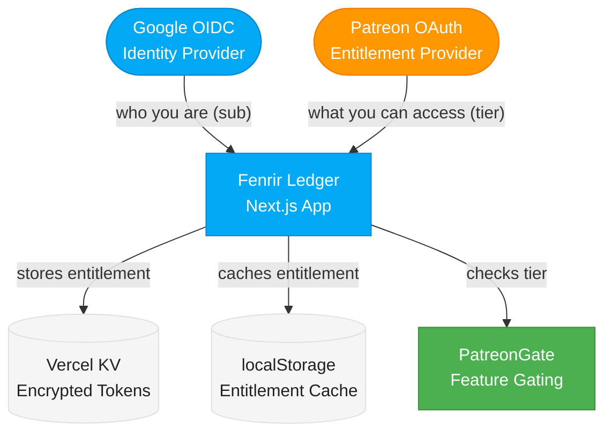

# Platform Recommendation for Fenrir Ledger

## Current Decision: Patreon (Implemented)

**Status:** Patreon is the active subscription platform. Integration shipped and operational.

The initial research recommended **Stripe Direct** for payment processing and **Substack** for content marketing. After further evaluation during implementation, **Patreon** was chosen as the subscription platform. This document preserves the original research tiers for context, then explains the decision evolution.

---

## Why Patreon Won Over Stripe Direct

The original recommendation favored Stripe Direct for its low fees and full control. In practice, Patreon proved to be the better fit for Fenrir Ledger's current stage and identity. The key factors that tipped the decision:

### 1. Indie Creator Identity Alignment

Fenrir Ledger is a solo indie project, not a SaaS product. Patreon's creator-subscriber model signals "support an indie tool you love" rather than "pay for software." This framing matches the Norse forge aesthetic and the community-first ethos of the credit card churning world. Stripe Direct would have positioned the product as a transactional SaaS, which is not what it is yet.

### 2. Zero Billing Infrastructure

Stripe Direct requires building: subscription management UI, billing portal, payment failure handling, invoice generation, refund workflows, webhook processing for payment events, and customer support tooling. Patreon provides all of this out of the box. For a solo developer, this saved weeks of engineering effort that went instead into premium features.

### 3. Built-In Campaign Management

Patreon provides a campaign page, patron communication tools, subscriber analytics, and tier management without any code. The Fenrir Ledger Patreon campaign page serves as both a marketing surface and a subscription management portal that the team did not have to build.

### 4. Separation of Concerns: Identity vs. Entitlement

The architectural insight that made Patreon work cleanly was treating it as an **entitlement layer only**, not an identity provider. Google OIDC remains the sole identity system (ADR-005). Patreon OAuth provides one piece of data: "Is this person an active patron of the Fenrir Ledger campaign?" This clean separation (documented in ADR-009) meant the integration was minimal: four API routes, one KV store, and one React context.

### 5. Fee Trade-Off Was Acceptable

Patreon takes 10% vs. Stripe's ~3.6%. At the current scale ($5/month subscribers), this means Patreon takes $0.50 more per subscriber per month. That premium buys: no billing UI to build, no payment failure handling, no invoice system, no refund workflow, built-in campaign page, and patron communication tools. The break-even point where Stripe Direct becomes cheaper on total cost of ownership is well beyond the current subscriber count.

### 6. Anonymous-First Compatibility

A critical requirement was preserving the anonymous-first model (ADR-006). Patreon as an entitlement-only layer achieved this cleanly: anonymous users never see Patreon UI, and the free tier (Thrall) is the full current product with zero friction. The anonymous Patreon flow (shipped in PR #109) even allows users to subscribe without Google sign-in first, further reducing friction.

---

## What Patreon Does Not Solve

Patreon is not a permanent solution for all monetization needs. Known limitations:

| Limitation | Impact | Mitigation |
|---|---|---|
| 10% platform fee | Higher per-subscriber cost than Stripe | Acceptable at current scale; revisit at 500+ subscribers |
| 30% Apple tax on iOS | Brutal for mobile subscribers | No native iOS app planned; web-only avoids this |
| No in-app payment UI | Users must visit Patreon to subscribe | The hard gate modal links directly to the Patreon campaign page |
| Platform dependency | Patreon outage = entitlement check failure | Graceful degradation: stale localStorage cache used as fallback |
| HMAC-MD5 webhooks | Weaker cryptographic signature than SHA-256 | Accepted risk (SEV-001); Patreon platform constraint |

---

## Current Integration Status

### Shipped (as of March 2026)

The Patreon integration is fully operational with the following components:

**API Routes** (5 routes):
- `/api/patreon/authorize` -- Initiates Patreon OAuth flow (supports both authenticated and anonymous users)
- `/api/patreon/callback` -- Handles OAuth callback, exchanges code for tokens, stores entitlement in Vercel KV
- `/api/patreon/membership` -- Returns current entitlement status (auth-gated)
- `/api/patreon/webhook` -- Processes real-time membership change events from Patreon
- `/api/patreon/unlink` -- Removes Patreon linkage from user account
- `/api/patreon/migrate` -- Migrates anonymous Patreon entitlement to Google-keyed on sign-in

**Client-Side Components**:
- `EntitlementContext` -- React context managing subscription state, OAuth flow, and feature gating
- `useEntitlement` hook -- Platform-agnostic interface for checking tier and feature access
- `PatreonGate` -- Conditional renderer that gates premium features by tier
- `SealedRuneModal` -- Norse-themed modal shown when Thrall users attempt to access Karl features
- `UpsellBanner` -- Non-aggressive banner promoting Karl tier benefits
- `PatreonSettings` -- Settings page component for linking/unlinking Patreon
- `UnlinkConfirmDialog` -- Confirmation dialog for Patreon unlinking

**Infrastructure**:
- Vercel KV for server-side entitlement storage (encrypted tokens, AES-256-GCM)
- Dual-environment OAuth clients (dev + production)
- `APP_BASE_URL` env var for deterministic redirect URIs (SEV-002 fix)
- Anonymous Patreon flow with migration on Google sign-in

**Security** (reviewed by Heimdall, 2026-03-02):
- 0 critical, 2 high (both mitigated), 3 medium, 3 low, 3 informational findings
- Full report: `security/reports/2026-03-02-patreon-integration.md`

**QA** (validated by Loki):
- 6 test suites in `quality/test-suites/patreon/`
- 20 additional tests for anonymous flow in `quality/test-suites/anon-patreon/`

### Tier Structure

| Tier | Norse Name | Price | Access |
|------|-----------|-------|--------|
| Free | Thrall | $0 | All current features (Sprint 1-5). Full card management, import, Valhalla, Easter eggs. |
| Paid | Karl | $5/month | 8 premium feature categories: cloud sync, multi-household, analytics, priority import, export, extended history, custom notifications, cosmetics |

### Architecture

---

## Substack Content/Marketing Recommendation

**Status: Still recommended, not yet executed.**

The original recommendation to use Substack for audience building and content marketing remains valid and complementary to Patreon. Patreon handles subscription/entitlement. Substack would handle discovery and content.

### Why Substack Still Makes Sense

- Churners are already active and paying on Substack (Raymond La, The Daily Churn, Datastream, Exclusive Access)
- Built-in discovery and network effects bring new users to the product
- A "Fenrir Ledger Weekly" newsletter with deal alerts, card strategy, and points analysis would drive traffic to the app
- Substack is free to start; the 10% fee only applies if the newsletter itself has paid subscribers
- Content marketing and tool subscription are complementary, not competing

### Proposed Substack Strategy (Deferred)

When the team is ready to invest in content marketing:

1. Launch a free Substack newsletter: "Fenrir Ledger -- The Churner's Forge"
2. Content: weekly deal alerts, card strategy breakdowns, points optimization, tool tips
3. Include CTAs linking to the Fenrir Ledger app and Patreon campaign
4. Consider a paid Substack tier only if the newsletter itself generates enough unique content to justify it
5. Cross-promote: Patreon patrons get early access to newsletter content; Substack readers discover the app

This is a P3 initiative. The current focus is shipping premium features for Karl-tier patrons.

---

## Original Research Tiers (Preserved for Context)

### Tier 1: Originally Recommended

**Stripe Direct** -- Best fit for a pure SaaS tool. Lowest fees, full control. Requires significant billing infrastructure development.

**Substack** -- Best complement for audience building. Only platform where churners are already active and paying.

### Tier 2: Viable Alternatives

| Platform | Best If... |
|---|---|
| **Buy Me a Coffee** | Simplest setup, low fees (5%), casual brand acceptable |
| **Ghost** | Self-hosted publication, 0% platform fees, full audience ownership |
| **Patreon** | Robust tier management, multiple feature tiers, indie creator positioning |

### Tier 3: Not Recommended

| Platform | Why Not |
|---|---|
| **Gumroad** | Highest effective fees; weak community; better for one-off digital products |
| **Ko-fi** | Art/creative brand mismatch; no churning audience |
| **Memberful** | $49/mo base cost is prohibitive for a solo project starting out |

---

## Future Platform Strategy Decisions

### When to Revisit Patreon vs. Stripe Direct

The team should revisit the Stripe Direct option if any of the following triggers occur:

- **Scale threshold**: 500+ active Karl subscribers (the 10% fee delta becomes meaningful)
- **Mobile app**: If a native iOS/Android app is planned, Apple/Google require in-app purchases, making Patreon's additional 30% iOS tax untenable
- **Enterprise tier**: If a higher-priced tier ($20+/month) is introduced, the absolute fee difference makes Stripe more attractive
- **Custom billing**: If the product needs annual plans, family plans, or usage-based pricing that Patreon does not support

### Migration Path to Stripe (If Needed)

The architecture was designed for provider portability:

1. The `useEntitlement` hook is platform-agnostic -- the frontend does not know it is backed by Patreon
2. The `PatreonGate` component checks `tier`, not `platform`
3. The Vercel KV store can be re-keyed from Patreon entitlements to Stripe subscription statuses
4. The only Patreon-specific UI is the "Link Patreon" button in settings and the Patreon campaign URL in the sealed rune modal

A Stripe migration would require: new API routes for Stripe webhooks and checkout, a new entitlement provider in `EntitlementContext`, and updated settings UI. The feature gating layer (`PatreonGate`, `useEntitlement`) would not change.

---

## Where Churners Are Active

Understanding the existing churning community helps inform content and marketing strategy:

- **Reddit** (r/churning) -- Primary hub, free
- **Discord** -- The Daily Churn, The Credit Community, The Points Party (paid/free communities)
- **Substack** -- Growing number of churning newsletters
- **FlyerTalk** -- Long-established forum community

---

## Sources

- [Substack churning newsletters](https://raymondla.substack.com/p/my-2025-credit-card-strategy)
- [Patreon pricing changes August 2025](https://support.patreon.com/hc/en-us/articles/36426991446797)
- [Patreon pricing overview](https://www.schoolmaker.com/blog/patreon-pricing)
- [Ko-fi pricing](https://ko-fi.com/pricing)
- [Ko-fi vs Buy Me a Coffee](https://talks.co/p/kofi-vs-buy-me-a-coffee/)
- [Ghost Pro pricing](https://forum.ghost.org/t/updated-ghost-pro-pricing-july-2025-15-mo-starter-29-mo-publisher-199-mo-business/59090)
- [Gumroad pricing](https://gumroad.com/pricing)
- [Memberful pricing](https://memberful.com/pricing/)
- [Stripe Billing pricing](https://stripe.com/billing/pricing)
- [Stripe fees guide](https://www.swipesum.com/insights/guide-to-stripe-fees-rates-for-2025)
- [Buy Me a Coffee pricing](https://www.schoolmaker.com/blog/buy-me-a-coffee-pricing)
- [The Daily Churn Discord](https://thedailychurnpodcast.com/discord/)
- [The Points Party](https://thepointsparty.com/community)
- [The Credit Community Discord](https://discord.com/servers/the-credit-community-931760921825665034)
