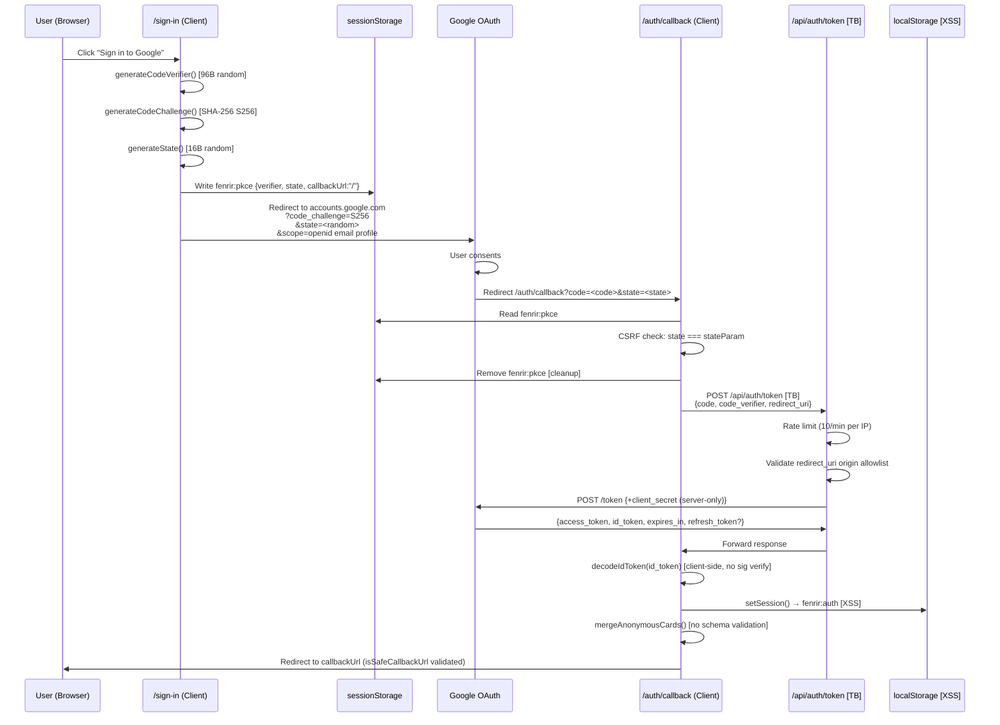

# Security Data Flow Diagrams — Fenrir Ledger

**Owner**: Heimdall
**Last reviewed**: 2026-03-14 (updated for GKE Autopilot — replaced Vercel references)

Trust boundary notation:
- `[TB]` — Trust boundary crossing (browser ↔ server)
- `[SSRF]` — Server-side request forgery surface
- `[INJ]` — Injection point (prompt injection / data injection)
- `[XSS]` — XSS-accessible storage

---

## 1. OAuth 2.0 PKCE Flow



### ASCII representation (for non-Mermaid environments)

```
User Browser
  │
  ├─ /sign-in/page.tsx
  │    generateCodeVerifier()   [96B, Web Crypto]
  │    generateCodeChallenge()  [S256]
  │    generateState()          [16B hex]
  │    sessionStorage["fenrir:pkce"] = {verifier, state, callbackUrl:"/"}
  │    window.location → accounts.google.com/o/oauth2/v2/auth
  │
  ├─ accounts.google.com  [Google consent screen]
  │    User grants → redirects to /auth/callback?code=...&state=...
  │
  ├─ /auth/callback/page.tsx
  │    Read sessionStorage["fenrir:pkce"]
  │    CSRF check: state matches  ← CRITICAL check
  │    sessionStorage.removeItem("fenrir:pkce")
  │    POST /api/auth/token {code, code_verifier, redirect_uri}
  │         ──────────────── [TRUST BOUNDARY] ──────────────
  │         rate limit by IP
  │         validate redirect_uri origin
  │         add GOOGLE_CLIENT_SECRET  (server-only)
  │         POST https://oauth2.googleapis.com/token
  │         forward response
  │         ──────────────────────────────────────────────
  │    decodeIdToken(id_token)  [client decode, no sig verify — safe here]
  │    setSession() → localStorage["fenrir:auth"]  [XSS-accessible]
  │    mergeAnonymousCards()
  │    redirect to callbackUrl (origin-validated)
```

---

## 2. URL Import Pipeline (Path A)

```
POST /api/sheets/import
  Authorization: Bearer <id_token>
  Body: { "url": "<user-supplied-google-sheets-url>" }

Server (/api/sheets/import/route.ts)
  │
  ├─ requireAuth(request)  ← [TB] id_token verified against Google JWKS
  │    verifyIdToken() → jose.jwtVerify()
  │    if !auth.ok → 401
  │
  ├─ Parse request.json() → url (user-controlled input)
  │
  ├─ extractSheetId(url)  [parse-url.ts]
  │    new URL(url)
  │    hostname.endsWith("google.com")  ← SSRF mitigation: restricts to google.com
  │    pathname.match(/\/spreadsheets\/d\/([a-zA-Z0-9_-]+)/)
  │    if no match → return INVALID_URL error
  │
  ├─ buildCsvExportUrl(sheetId)
  │    "https://docs.google.com/spreadsheets/d/{sheetId}/export?format=csv"
  │    ← hardcoded google.com domain, sheetId is alphanumeric only
  │    ← [SSRF surface: minimal — domain-locked, path-restricted]
  │
  ├─ fetchCsv(csvUrl)  [fetch-csv.ts]
  │    fetch(csvUrl, { redirect: "follow" })
  │    ← [SSRF: redirect:follow means Google could redirect to internal URLs]
  │    403/404 → SHEET_NOT_PUBLIC error
  │    200 → csv text
  │    Truncate at CSV_TRUNCATION_LIMIT (100,000 chars)
  │
  ├─ extractCardsFromCsv(csv)  [extract-cards.ts]
  │    buildExtractionPrompt(csv)  [prompt.ts]
  │    ← Returns { system, user } structure — system instructions separated from CSV
  │    ← [INJ: csv is in user message role only; system prompt ends with RAW DATA instruction]
  │    ← Prompt injection mitigated by system/user role separation (PR #171)
  │    LLM call (Anthropic/OpenAI) with system param + user message
  │    JSON.parse(response)
  │    Zod schema validation (CardsArraySchema / ImportResponseSchema)
  │    assign crypto.randomUUID() to each card
  │
  └─ return { cards } → browser
```

**Trust boundary crossings**: 1 (browser → API route)
**SSRF surface**: `fetchCsv()` with `redirect:"follow"` — mitigated by domain lock
**Injection point**: CSV content in user message role only; system instructions protected

---

## 3. CSV Upload Pipeline (Path C)

```
POST /api/sheets/import
  Authorization: Bearer <id_token>
  Body: { "csv": "<raw-csv-text>" }

Server (/api/sheets/import/route.ts)
  │
  ├─ requireAuth(request)  ← [TB] same as Path A
  │
  ├─ Parse request.json() → csv (user-controlled — up to request body size limit)
  │
  ├─ importFromCsv(csv)  [csv-import-pipeline.ts]
  │    typeof csv === "string"  ← type check only
  │    csv.trim().length >= MIN_CSV_LENGTH (10 chars)
  │    Truncate at CSV_TRUNCATION_LIMIT
  │    ← NO hostname restriction (csv is inline text, no network fetch)
  │
  ├─ extractCardsFromCsv(csv)  ← same LLM pipeline as Path A
  │    buildExtractionPrompt(csv)
  │    ← [INJ: same structural separation as Path A — user message role only]
  │    LLM call → Zod validation → UUID assignment
  │
  └─ return { cards } → browser
```

**Note**: Path C has no SSRF surface (no external fetch). The injection surface is
mitigated by system/user role separation — user-controlled CSV is placed in the user
message role only with explicit RAW DATA instruction.

---

## 4. Google Picker Flow (Path B)

```
Browser
  │
  ├─ useDriveToken.requestDriveAccess()  [useDriveToken.ts]
  │    loadGisScript()  → dynamic script: accounts.google.com/gsi/client
  │    google.accounts.oauth2.initTokenClient({scope: "drive.file spreadsheets.readonly"})
  │    client.requestAccessToken()  → GIS popup
  │    On grant: storeToken() → localStorage["fenrir:drive-token"]  [XSS]
  │
  ├─ GET /api/config/picker  [TB]
  │    Authorization: Bearer <id_token>
  │    requireAuth() → verified
  │    return { pickerApiKey: GOOGLE_PICKER_API_KEY }  [key sent to browser plaintext]
  │
  ├─ openPicker(driveToken, pickerApiKey)  [picker.ts]
  │    loadGapiScript()  → dynamic script: apis.google.com/js/api.js
  │    gapi.load("picker")
  │    new google.picker.PickerBuilder()
  │         .setOAuthToken(driveToken)
  │         .setDeveloperKey(pickerApiKey)
  │    → Google Picker UI (iframe: docs.google.com)
  │    User selects spreadsheet → { id, name }
  │
  ├─ fetchSheetAsCSV(sheetId, driveToken)  [sheets-api.ts]
  │    GET https://sheets.googleapis.com/v4/spreadsheets/{sheetId}/values/A:ZZ
  │    Authorization: Bearer <driveToken>
  │    ← sheetId comes from Picker response (Google-controlled, trusted)
  │    ← [SSRF surface: none — hardcoded googleapis.com domain]
  │    valuesToCsv(data.values)  → csv text
  │
  ├─ POST /api/sheets/import { csv }  [TB]
  │    Authorization: Bearer <id_token>
  │    ← same extraction pipeline as Path C
  │
  └─ return { cards } → browser
```

**Trust boundary crossings**: 2 (picker config + import)
**SSRF surface**: None — all URLs are hardcoded to googleapis.com
**XSS surface**: Drive token stored in localStorage

---

## 5. Stripe Checkout Flow

```
Browser (authenticated)
  │
  ├─ User clicks "Subscribe"
  │    Frontend redirects to /sign-in if not authenticated
  │
  ├─ POST /api/stripe/checkout  [TB]
  │    Authorization: Bearer <id_token>
  │    requireAuth() → verified Google user { sub, email }
  │    IP rate limit (10/min — in-memory only)
  │
  │    stripe.checkout.sessions.create({
  │      customer_email: auth.user.email,  ← from verified id_token
  │      metadata: { googleSub: auth.user.sub },
  │      success_url: APP_BASE_URL + "/settings?stripe=success",
  │      cancel_url:  APP_BASE_URL + "/settings?stripe=cancel",
  │    })
  │    returns { url: "https://checkout.stripe.com/..." }
  │
  ├─ Browser redirects to Stripe-hosted checkout
  │    User completes payment
  │
  ├─ Stripe delivers webhook: POST /api/stripe/webhook  [TB]
  │    No requireAuth — authenticated by SHA-256 HMAC
  │    request.text() — raw body preserved BEFORE JSON parse
  │    stripe.webhooks.constructEvent(rawBody, signature, STRIPE_WEBHOOK_SECRET)
  │    ← SHA-256 HMAC verification
  │    handle checkout.session.completed:
  │      session.metadata.googleSub → setStripeEntitlement(googleSub, entitlement) → KV
  │
  └─ Browser redirects to success_url: /settings?stripe=success
```

**Trust boundary crossings**: 2 (checkout + webhook)
**SSRF surface**: None — all Stripe API calls use the official Stripe SDK
**Redirect safety**: `APP_BASE_URL` only — no user-controlled headers

---

## 6. Summary of Attack Surfaces per Flow

| Flow | SSRF | Prompt Injection | XSS-accessible Storage | Auth Check |
|------|------|-----------------|------------------------|------------|
| Path A (URL) | Low (domain-locked + redirect:follow) | Low (system/user separation + RAW DATA) | fenrir:auth | requireAuth |
| Path B (Picker) | None | Low (system/user separation + RAW DATA) | fenrir:auth + fenrir:drive-token | requireAuth |
| Path C (CSV upload) | None | Low (system/user separation + RAW DATA) | fenrir:auth | requireAuth |
| OAuth callback | None | None | fenrir:auth | N/A (public) |
| Token proxy | None (fixed URL) | None | None | N/A (public, rate-limited) |
| Stripe checkout | None (Stripe SDK) | None | None | requireAuth |
| Stripe webhook | None | None | None | N/A (SHA-256 HMAC) |
| Stripe membership | None | None | None (KV only) | requireAuth |
