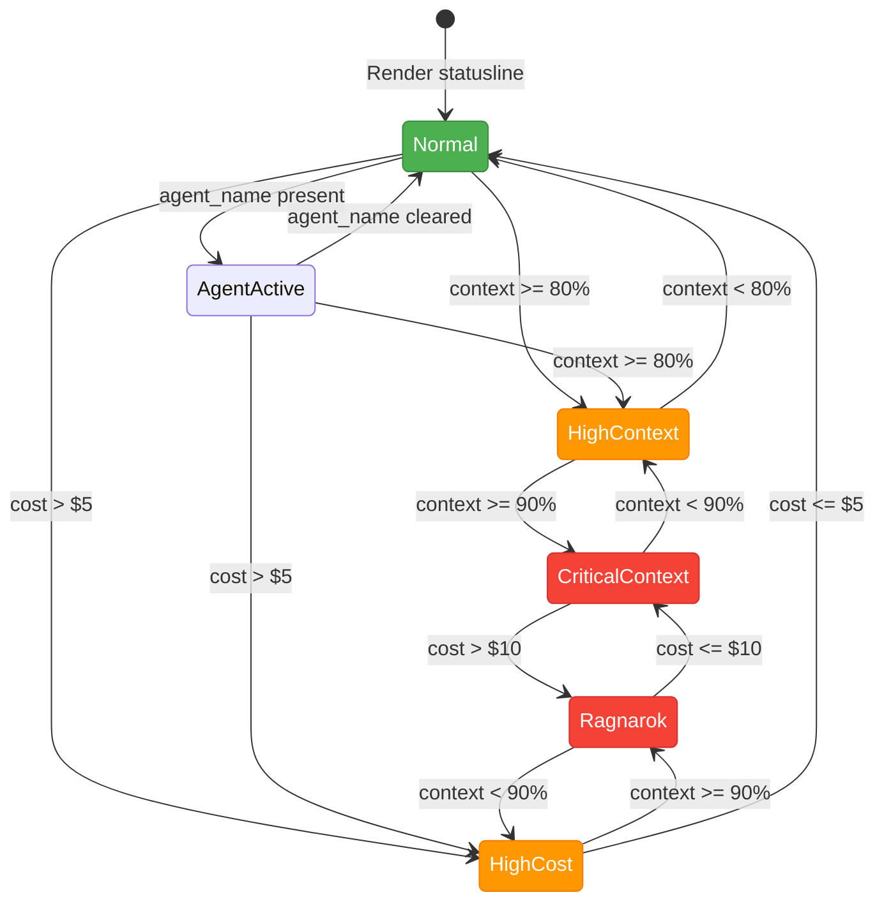
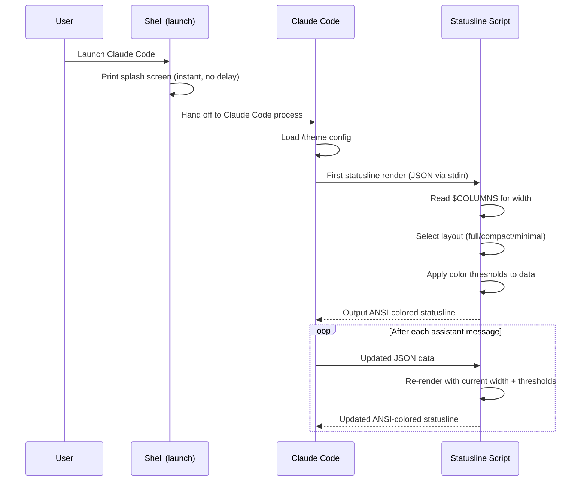

# Interaction Spec: Claude Code Terminal Skin -- The Wolf's Forge

**Owner**: Luna (UX Designer)
**Status**: Design Complete — Not Yet Implemented
**Product Brief**: GitHub Issues (historical backlog item)
**Target**: Claude Code CLI customization surfaces (statusline, splash, theme palette)

---

## Overview

This spec defines the visual language for a Claude Code terminal skin that brings the Fenrir Ledger Norse aesthetic into the developer's CLI. The skin operates within three customization surfaces: a persistent statusline, a one-time splash screen, and a terminal color palette. All output is monospace text rendered with ANSI escape codes and Unicode characters.

The design goal is **functional atmosphere** -- the Norse motifs should make the terminal feel like a living forge without sacrificing readability or information density.

---

## 1. Color Mapping -- ANSI Escape Sequences

### Primary Palette

| Role | Hex | ANSI 256 | ANSI 24-bit (RGB) | Where Used |
|------|-----|----------|-------------------|------------|
| Void Black (bg) | `#07070d` | `\033[48;5;232m` | `\033[48;2;7;7;13m` | Background fills |
| Forge Gold (accent) | `#c9920a` | `\033[38;5;178m` | `\033[38;2;201;146;10m` | Borders, rune separators, emphasis |
| Parchment (text) | `#f0ede4` | `\033[38;5;255m` | `\033[38;2;240;237;228m` | Primary text content |
| Stone Muted | `#8a8578` | `\033[38;5;245m` | `\033[38;2;138;133;120m` | Secondary labels, metadata |
| Warm Charcoal (card bg) | `#1c1917` | `\033[48;5;234m` | `\033[48;2;28;25;23m` | Statusline background |

### Status Realm Colors

| Realm | Meaning | Hex | ANSI 256 | ANSI 24-bit |
|-------|---------|-----|----------|-------------|
| Asgard | Healthy / OK | `#0a8c6e` | `\033[38;5;36m` | `\033[38;2;10;140;110m` |
| Hati | Warning / Approaching | `#f59e0b` | `\033[38;5;214m` | `\033[38;2;245;158;11m` |
| Muspel | Danger / High | `#c94a0a` | `\033[38;5;166m` | `\033[38;2;201;74;10m` |
| Ragnarok | Critical / Overflow | `#ef4444` | `\033[38;5;196m` | `\033[38;2;239;68;68m` |
| Hel | Inactive / Closed | `#8a8578` | `\033[38;5;245m` | `\033[38;2;138;133;120m` |

### ANSI Utility Codes

```
Reset:          \033[0m
Bold:           \033[1m
Dim:            \033[2m
Italic:         \033[3m
Underline:      \033[4m
Reverse:        \033[7m
```

### Fallback Strategy

If the terminal does not support 24-bit color, the skin falls back to 256-color codes. If 256-color is unavailable, it falls back to the standard 16-color palette:

| Role | 16-color fallback |
|------|-------------------|
| Forge Gold | `\033[33m` (yellow) |
| Parchment | `\033[37m` (white) |
| Stone Muted | `\033[90m` (bright black / dark gray) |
| Asgard | `\033[32m` (green) |
| Hati | `\033[33m` (yellow) |
| Muspel | `\033[31m` (red) |
| Ragnarok | `\033[91m` (bright red) |
| Hel | `\033[90m` (bright black) |

---

## 2. Unicode Character Palette

### Rune Glyphs (Elder Futhark)

Used as decorative separators and state indicators. These are the project's canonical runes.

| Glyph | Name | Unicode | Terminal Use |
|-------|------|---------|-------------|
| ᚠ | Fehu (wealth) | U+16A0 | Cost display prefix |
| ᛖ | Ehwaz (partnership) | U+16D6 | Agent/model indicator |
| ᚾ | Naudiz (necessity) | U+16BE | Context warning prefix |
| ᚱ | Raidho (journey) | U+16B1 | Git branch prefix |
| ᛁ | Isa (ice/stillness) | U+16C1 | Idle/waiting state |
| ᛟ | Othala (heritage) | U+16DF | Fenrir brand mark |
| ᛏ | Tiwaz (victory) | U+16CF | Session/time indicator |
| ᚲ | Kenaz (torch) | U+16B2 | Active/working state |

### Box-Drawing Characters

The statusline uses light box-drawing for structure and heavy variants for emphasis.

```
Light:    ─  │  ┌  ┐  └  ┘  ├  ┤  ┬  ┴  ┼
Heavy:    ━  ┃  ┏  ┓  ┗  ┛  ┣  ┫  ┳  ┻  ╋
Mixed:    ┍  ┑  ┕  ┙  (heavy horizontal, light vertical)
Rounded:  ╭  ╮  ╰  ╯  (for softer containers)
```

### Separator Characters

| Character | Name | Use |
|-----------|------|-----|
| `│` | Light vertical | Section divider in statusline |
| `┃` | Heavy vertical | Emphasis divider (Ragnarok mode) |
| `·` | Middle dot | Inline metadata separator |
| `▸` | Right-pointing triangle | Active indicator |
| `◆` | Black diamond | Bullet point |
| `░` | Light shade | Progress bar empty segment |
| `▓` | Dark shade | Progress bar filled segment |
| `█` | Full block | Progress bar cap / full segment |

---

## 3. Splash Screen Design

The splash screen prints once when Claude Code launches. It is immediate -- no delays, no animation. The design draws from the existing ConsoleSignature.tsx Elder Futhark rune art.

### Layout (80 columns wide)

```
\033[38;2;201;146;10m
                    ╭────────────────────────────────────────╮
                    │                                        │
                    │   |      | |    |   |   |--       |    │
                    │   |\     |/|    |\  |   |  \      |    │
                    │   | \    | |    | \ |   |--       |    │
                    │   |\     |\|    |  \|   |  \      |    │
                    │   | \    | |    |   |   |   \     |    │
                    │   |      | |    |   |   |         |    │
                    │                                        │
                    ╰────────────────────────────────────────╯
\033[38;2;138;133;120m
       ᚠ FEHU    ᛖ EHWAZ   ᚾ NAUDIZ   ᚱ RAIDHO    ᛁ ISA    ᚱ RAIDHO
\033[0m
\033[1;38;2;201;146;10m              The wolf does not wait. The forge is lit.\033[0m
\033[38;2;138;133;120m           Break free from fee traps. Harvest every reward.\033[0m

\033[2;38;2;138;133;120m    Built by FiremanDecko · Designed by Luna · Guarded by Freya · Tested by Loki\033[0m
\033[2;38;2;60;60;80m          Odin bound Fenrir. Fenrir built Ledger. The chain remembers.\033[0m
```

### Rendered Appearance (as the terminal would display it)

```
                    +------------------------------------------+
                    |                                          |
                    |   |      | |    |   |   |--       |     |
                    |   |\     |/|    |\  |   |  \      |     |
                    |   | \    | |    | \ |   |--       |     |
                    |   |\     |\|    |  \|   |  \      |     |
                    |   | \    | |    |   |   |   \     |     |
                    |   |      | |    |   |   |         |     |
                    |                                          |
                    +------------------------------------------+
        F FEHU    E EHWAZ   N NAUDIZ   R RAIDHO    I ISA    R RAIDHO

                  The wolf does not wait. The forge is lit.
               Break free from fee traps. Harvest every reward.

      Built by FiremanDecko - Designed by Luna - Guarded by Freya - Tested by Loki
            Odin bound Fenrir. Fenrir built Ledger. The chain remembers.
```

**Color breakdown:**
- Rune art and border: Forge Gold (`#c9920a`)
- Rune labels: Stone Muted (`#8a8578`)
- Tagline: Bold Forge Gold
- Subtitle: Stone Muted
- Team credits: Dim Stone Muted
- Final quote: Dim dark blue-gray (`#3c3c50`)

### Narrow Terminal Variant (< 60 columns)

When the terminal is narrower than 60 columns, the splash reduces to a compact form:

```
\033[1;38;2;201;146;10m  ᛟ Fenrir Ledger\033[0m
\033[38;2;138;133;120m  The forge is lit. Break free.\033[0m
\033[2;38;2;138;133;120m  ᚠ ᛖ ᚾ ᚱ ᛁ ᚱ\033[0m
```

This prints the Othala rune, the project name, a one-line tagline, and the six canonical runes. No ASCII art -- it would wrap and break.

---

## 4. Statusline Layout

The statusline is a persistent bar at the bottom of the terminal. It receives JSON data via stdin and outputs ANSI-colored text. It updates after each assistant message.

### Data Contract (JSON stdin)

```json
{
  "git_branch": "feat/google-picker-path-b",
  "model": "opus-4",
  "cost_usd": 1.42,
  "context_pct": 67,
  "lines_added": 142,
  "lines_removed": 38,
  "session_duration_sec": 1834,
  "vim_mode": "normal",
  "agent_name": "Luna"
}
```

### Full-Width Layout (>= 100 columns)

The statusline is a single line with sections separated by gold vertical bars.

```
ANATOMY (character positions are approximate):

  ᚱ branch-name │ ᛖ model │ ᚠ $cost │ ᚾ ctx% [▓▓▓▓▓░░░░░] │ +add/-del │ ᛏ duration │ agent
```

**Rendered example (normal state):**

```
  ᚱ feat/picker-b │ ᛖ opus-4 │ ᚠ $1.42 │ ᚾ 67% ▓▓▓▓▓▓░░░░ │ +142/-38 │ ᛏ 30m │ Luna
```

**ANSI color encoding for the above line:**

```
\033[48;2;28;25;23m                                    <- warm charcoal bg for entire line
\033[38;2;201;146;10m  ᚱ \033[38;2;240;237;228mfeat/picker-b    <- gold rune, parchment text
\033[38;2;201;146;10m │ ᛖ \033[38;2;240;237;228mopus-4           <- gold separator + rune
\033[38;2;201;146;10m │ ᚠ \033[38;2;240;237;228m$1.42            <- gold rune, parchment cost
\033[38;2;201;146;10m │ ᚾ \033[38;2;10;140;110m67% ▓▓▓▓▓▓░░░░   <- gold rune, Asgard green bar
\033[38;2;201;146;10m │ \033[38;2;10;140;110m+142\033[38;2;239;68;68m/-38  <- green adds, red dels
\033[38;2;201;146;10m │ ᛏ \033[38;2;138;133;120m30m              <- gold rune, stone muted time
\033[38;2;201;146;10m │ \033[38;2;240;237;228mLuna              <- gold separator, parchment name
\033[0m
```

### Section Definitions

#### 1. Git Branch (`ᚱ`)

- **Rune**: ᚱ Raidho (journey)
- **Color**: Branch name in Parchment
- **Truncation**: If branch name exceeds 20 characters, truncate with ellipsis: `feat/google-pick...`
- **Detached HEAD**: Show `ᚱ HEAD@abc1234` in Hati amber

#### 2. Model (`ᛖ`)

- **Rune**: ᛖ Ehwaz (partnership -- you and the model)
- **Color**: Model name in Parchment
- **Values**: `opus-4`, `sonnet`, `haiku` -- display the short name

#### 3. Cost (`ᚠ`)

- **Rune**: ᚠ Fehu (wealth -- fitting for a cost display)
- **Color**: Dollar amount in Parchment
- **Format**: `$X.XX` -- always two decimal places
- **Thresholds**:
  - `< $2.00`: Parchment (normal)
  - `$2.00 - $5.00`: Hati amber
  - `> $5.00`: Muspel orange
  - `> $10.00`: Ragnarok red + bold

#### 4. Context Window (`ᚾ`)

- **Rune**: ᚾ Naudiz (necessity -- context is a constrained resource)
- **Color**: Percentage and bar color shift with usage
- **Progress bar**: 10 characters wide using `▓` (filled) and `░` (empty)
- **Thresholds**:
  - `0-59%`: Asgard teal -- healthy
  - `60-79%`: Hati amber -- approaching limit
  - `80-89%`: Muspel orange -- high usage
  - `90-100%`: Ragnarok red + bold -- critical

**Progress bar examples:**

```
 23%  ▓▓░░░░░░░░   (Asgard teal)
 67%  ▓▓▓▓▓▓░░░░   (Hati amber)
 85%  ▓▓▓▓▓▓▓▓░░   (Muspel orange)
 97%  ▓▓▓▓▓▓▓▓▓░   (Ragnarok red, bold, pulsing if supported)
```

#### 5. Lines Changed

- **No rune prefix** (saves space)
- **Color**: Additions in Asgard teal (`+N`), deletions in Ragnarok red (`-N`)
- **Format**: `+142/-38`
- **Zero state**: `+0/-0` in Stone Muted

#### 6. Session Duration (`ᛏ`)

- **Rune**: ᛏ Tiwaz (victory -- time spent forging)
- **Color**: Stone Muted (low priority information)
- **Format**: `Xm` for minutes, `Xh Ym` for hours
- **Examples**: `30m`, `1h 12m`, `2h 45m`

#### 7. Agent Name

- **No rune prefix** (the name is self-identifying)
- **Color**: Parchment, bold when agent is active
- **Values**: `Luna`, `Freya`, `FiremanDecko`, `Loki`, or blank if no agent

---

## 5. Statusline State Variations

### Normal State

The default appearance as described above. All sections visible, Asgard teal context bar, standard separators.

```
  ᚱ feat/picker-b │ ᛖ opus-4 │ ᚠ $1.42 │ ᚾ 67% ▓▓▓▓▓▓░░░░ │ +142/-38 │ ᛏ 30m │ Luna
```

### High Context Usage (>= 80%)

The context section shifts to Muspel orange. The rune ᚾ pulses (alternating bold/dim if the terminal supports it, otherwise static bold).

```
  ᚱ feat/picker-b │ ᛖ opus-4 │ ᚠ $1.42 │ ᚾ 85% ▓▓▓▓▓▓▓▓░░ │ +142/-38 │ ᛏ 30m │ Luna
                                           ^^^^^^^^^^^^^^^^
                                           Muspel orange, bold
```

### Critical Context (>= 90%)

The entire context section turns Ragnarok red. The separator bars flanking the context section also turn red to draw the eye.

```
  ᚱ feat/picker-b │ ᛖ opus-4 │ ᚠ $1.42 ┃ ᚾ 97% ▓▓▓▓▓▓▓▓▓░ ┃ +142/-38 │ ᛏ 30m │ Luna
                                          ^                    ^
                                          Heavy red separators
```

### High Cost (> $5.00)

The cost section shifts color based on thresholds defined above. At $10+, the ᚠ rune and dollar amount are bold Ragnarok red.

```
  ᚱ feat/picker-b │ ᛖ opus-4 │ ᚠ $12.87 │ ᚾ 45% ▓▓▓▓░░░░░░ │ +342/-91 │ ᛏ 2h 10m │ Luna
                                ^^^^^^^^^
                                Ragnarok red, bold
```

### Agent Mode

When an agent name is present, the agent name section gains an active indicator prefix (ᚲ Kenaz, the torch rune).

```
  ᚱ feat/picker-b │ ᛖ opus-4 │ ᚠ $1.42 │ ᚾ 67% ▓▓▓▓▓▓░░░░ │ +142/-38 │ ᛏ 30m │ ᚲ Luna
                                                                                     ^^
                                                                                     Kenaz torch rune in gold
```

### No Agent (direct Claude Code usage)

The agent section is omitted. The statusline is shorter.

```
  ᚱ feat/picker-b │ ᛖ opus-4 │ ᚠ $1.42 │ ᚾ 67% ▓▓▓▓▓▓░░░░ │ +142/-38 │ ᛏ 30m
```

### Idle / Waiting State

When no activity is occurring (waiting for user input), the context bar dims and the ᛁ (Isa / ice) rune replaces the Kenaz torch in the agent section.

```
  ᚱ feat/picker-b │ ᛖ opus-4 │ ᚠ $1.42 │ ᚾ 67% ▓▓▓▓▓▓░░░░ │ +142/-38 │ ᛏ 30m │ ᛁ Luna
                                                                                     ^^
                                                                                     Isa rune in stone muted (dimmed)
```

### Ragnarok Mode (Critical Context + High Cost)

When both context >= 90% and cost > $10.00, the entire statusline border shifts to heavy box-drawing and the separators become Ragnarok red. This is the visual alarm state.

```
  ᚱ feat/picker-b ┃ ᛖ opus-4 ┃ ᚠ $14.20 ┃ ᚾ 95% ▓▓▓▓▓▓▓▓▓░ ┃ +342/-91 ┃ ᛏ 3h 10m ┃ ᚲ Luna
  ^^^^^^^^^^^^^^^^^^^^^^^^^^^^^^^^^^^^^^^^^^^^^^^^^^^^^^^^^^^^^^^^^^^^^^^^^^^^^^^^^^^^^^^^^^^^^^^
  All separators: heavy (┃), Ragnarok red
  Cost: Ragnarok red, bold
  Context: Ragnarok red, bold
```

---

## 6. Responsive Behavior

### Width Breakpoints

| Width | Behavior |
|-------|----------|
| >= 120 cols | Full layout, all sections, generous spacing |
| 100-119 cols | Full layout, tighter spacing |
| 80-99 cols | Compact: truncate branch to 15 chars, abbreviate model, drop session duration |
| 60-79 cols | Minimal: branch + context bar + cost only |
| < 60 cols | Ultra-compact: context bar + cost only |

### Compact Layout (80-99 cols)

Abbreviate the model name and drop the session duration section.

```
  ᚱ feat/picker.. │ ᛖ op4 │ ᚠ $1.42 │ ᚾ 67% ▓▓▓▓▓▓░░░░ │ +142/-38 │ Luna
```

Model abbreviations: `opus-4` -> `op4`, `sonnet` -> `son`, `haiku` -> `hai`

### Minimal Layout (60-79 cols)

Only the most critical information: branch, context, and cost.

```
  ᚱ feat/pick.. │ ᚠ $1.42 │ ᚾ 67% ▓▓▓▓▓▓░░░░
```

### Ultra-Compact Layout (< 60 cols)

Context percentage and cost only. No progress bar, no rune prefixes.

```
  ctx:67% │ $1.42
```

### Width Detection

The statusline script should read `$COLUMNS` (or `tput cols`) at each render cycle to determine the current width and select the appropriate layout.

---

## 7. Statusline State Machine



---

## 8. Theme Palette (Terminal Emulator Configuration)

For users who want to bring the Norse aesthetic to their entire terminal (not just the statusline), provide a palette for iTerm2 and WezTerm.

### iTerm2 Color Preset

| Slot | Standard Name | Fenrir Color | Hex |
|------|--------------|-------------|-----|
| 0 (Black) | Background | Void Black | `#07070d` |
| 1 (Red) | Error/Delete | Ragnarok Red | `#ef4444` |
| 2 (Green) | Success/Add | Asgard Teal | `#0a8c6e` |
| 3 (Yellow) | Warning | Hati Amber | `#f59e0b` |
| 4 (Blue) | Info | Deep Fjord | `#2563eb` |
| 5 (Magenta) | Accent | Muspel Orange | `#c94a0a` |
| 6 (Cyan) | Secondary | Forge Gold | `#c9920a` |
| 7 (White) | Foreground | Parchment | `#f0ede4` |
| 8 (Bright Black) | Muted | Stone | `#8a8578` |
| 9 (Bright Red) | Bright Error | Light Ragnarok | `#f87171` |
| 10 (Bright Green) | Bright Success | Light Asgard | `#34d399` |
| 11 (Bright Yellow) | Bright Warning | Light Hati | `#fbbf24` |
| 12 (Bright Blue) | Bright Info | Light Fjord | `#60a5fa` |
| 13 (Bright Magenta) | Bright Accent | Light Muspel | `#fb923c` |
| 14 (Bright Cyan) | Bright Gold | Light Gold | `#eab308` |
| 15 (Bright White) | Bright Foreground | Pure Parchment | `#faf9f6` |
| Background | -- | Void Black | `#07070d` |
| Foreground | -- | Parchment | `#f0ede4` |
| Cursor | -- | Forge Gold | `#c9920a` |
| Selection BG | -- | Warm Charcoal | `#1c1917` |

### Claude Code `/theme` Configuration

Claude Code's built-in `/theme` command supports ANSI dark. The Norse skin works best with:

- Theme: `ansi-dark`
- Terminal background: `#07070d`
- Terminal foreground: `#f0ede4`

The statusline and splash screen handle their own coloring via ANSI escape codes, so the `/theme` setting only affects Claude Code's internal UI rendering (prompts, code blocks, etc.).

---

## 9. Interaction Flow



---

## 10. Implementation Notes for FiremanDecko

### Splash Screen

- The splash is a shell script or inline function that runs before Claude Code takes over the terminal.
- It must detect terminal width (`tput cols` or `$COLUMNS`) and choose full vs. compact output.
- No `sleep` calls. No curses library. Just `printf` or `echo -e` statements.
- Use `$TERM` or `tput colors` to detect color support and fall back gracefully.

### Statusline Script

- Receives JSON on stdin, outputs one or more lines of ANSI-colored text to stdout.
- Must be fast -- keep it under 50ms per render. Shell script (bash/zsh) is fine; avoid heavy interpreters.
- Use `jq` for JSON parsing if available, otherwise `python3 -c` as fallback.
- Width detection: `tput cols` at render time.
- The script should be idempotent -- same JSON input always produces the same output.

### Non-Negotiable UX Requirements

1. **Readability first.** Every data value must be readable at a glance. The Norse aesthetic enhances but never obscures.
2. **Color thresholds must be consistent.** Context and cost thresholds use the same realm-color progression (Asgard -> Hati -> Muspel -> Ragnarok) across all surfaces.
3. **The splash screen must be instant.** Zero artificial delays. Print and done.
4. **Responsive degradation is mandatory.** The statusline must be useful at 60 columns. It must not wrap or produce garbled output at any width >= 40.
5. **The progress bar must use block characters** (`▓` and `░`), not ASCII substitutes. These are widely supported in modern terminals.
6. **Rune prefixes are semantic, not decorative.** Each rune was chosen for its meaning. Do not substitute different runes without updating this spec.

### Areas of Flexibility

- The exact spacing between sections can be adjusted based on what renders well.
- The progress bar width (10 chars) can be reduced to 8 or increased to 12 if it improves the layout.
- The model abbreviation scheme (compact layout) can be changed as long as it remains recognizable.
- The Ragnarok mode heavy-separator treatment is aspirational -- if it causes rendering issues, standard separators with red coloring are acceptable.
- The terminal theme palette (iTerm2/WezTerm) is a suggestion, not a requirement. Users configure their own terminals.

### File Locations

- Splash script: `.claude/hooks/splash.sh` or equivalent hook entry point
- Statusline script: `.claude/hooks/statusline.sh`
- Theme config: `.claude/settings.json` (Claude Code config) + exported `.itermcolors` / `.toml` for terminal emulators

---

## 11. Accessibility Considerations

Terminal skins operate in a constrained environment, but accessibility still matters.

### Color Independence

All critical information is conveyed by **text and position**, not color alone:
- Context percentage is always shown as a number (`67%`), not just as a colored bar
- Cost thresholds show the dollar amount, not just a color change
- Line changes show `+N/-N` with explicit signs

### Screen Reader Compatibility

Terminal screen readers (VoiceOver in Terminal.app, NVDA with terminal support) read the raw text content, ignoring ANSI escape codes. The statusline text is structured so that reading the plain text (stripping ANSI) produces coherent output:

```
  R feat/picker-b | E opus-4 | F $1.42 | N 67% ||||||||.. | +142/-38 | T 30m | Luna
```

The rune characters (U+16xx) may not be spoken by all screen readers. The semantic text (branch name, model, cost, percentage) carries the information regardless.

### High Contrast

The Forge Gold on Void Black combination exceeds WCAG AA contrast requirements (7.3:1 ratio). All text is Parchment on Warm Charcoal (the statusline background), which also exceeds AA requirements.

---

## Appendix A: Quick Reference -- All ANSI Sequences

```bash
# Backgrounds
BG_VOID="\033[48;2;7;7;13m"
BG_CHARCOAL="\033[48;2;28;25;23m"

# Foregrounds
FG_GOLD="\033[38;2;201;146;10m"
FG_PARCHMENT="\033[38;2;240;237;228m"
FG_STONE="\033[38;2;138;133;120m"
FG_ASGARD="\033[38;2;10;140;110m"
FG_HATI="\033[38;2;245;158;11m"
FG_MUSPEL="\033[38;2;201;74;10m"
FG_RAGNAROK="\033[38;2;239;68;68m"
FG_HEL="\033[38;2;138;133;120m"

# Formatting
BOLD="\033[1m"
DIM="\033[2m"
RESET="\033[0m"

# 256-color fallbacks
FG_GOLD_256="\033[38;5;178m"
FG_PARCHMENT_256="\033[38;5;255m"
FG_STONE_256="\033[38;5;245m"
FG_ASGARD_256="\033[38;5;36m"
FG_HATI_256="\033[38;5;214m"
FG_MUSPEL_256="\033[38;5;166m"
FG_RAGNAROK_256="\033[38;5;196m"
```

---

## Appendix B: Rune Semantics Reference

| Rune | Name | Old Norse Meaning | Terminal Use | Rationale |
|------|------|-------------------|-------------|-----------|
| ᚠ | Fehu | Wealth, cattle | Cost display | Tracks what you spend -- wealth flows |
| ᛖ | Ehwaz | Horse, partnership | Model name | The model is your partner in the forge |
| ᚾ | Naudiz | Need, constraint | Context usage | Context is a finite resource under pressure |
| ᚱ | Raidho | Journey, riding | Git branch | You travel a branch toward its destination |
| ᛁ | Isa | Ice, stillness | Idle state | Nothing moves; the forge cools |
| ᛟ | Othala | Heritage, home | Brand mark | The ancestral mark of Fenrir Ledger |
| ᛏ | Tiwaz | Victory, the god Tyr | Session time | Time spent forging toward victory |
| ᚲ | Kenaz | Torch, knowledge | Active agent | The torch is lit; someone works the forge |
