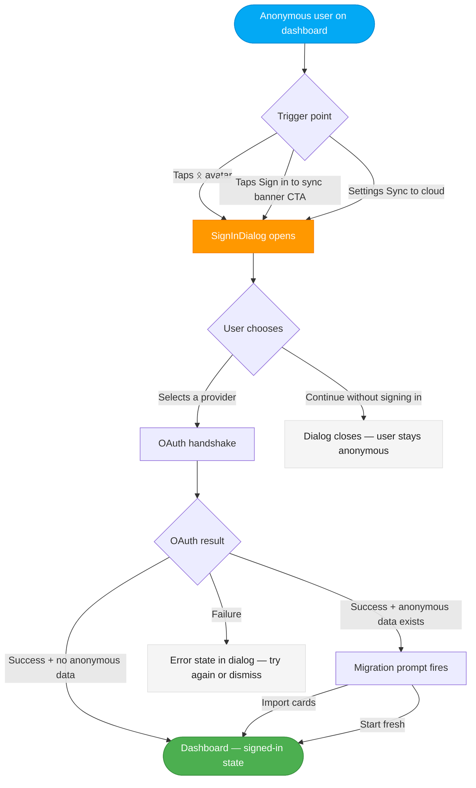
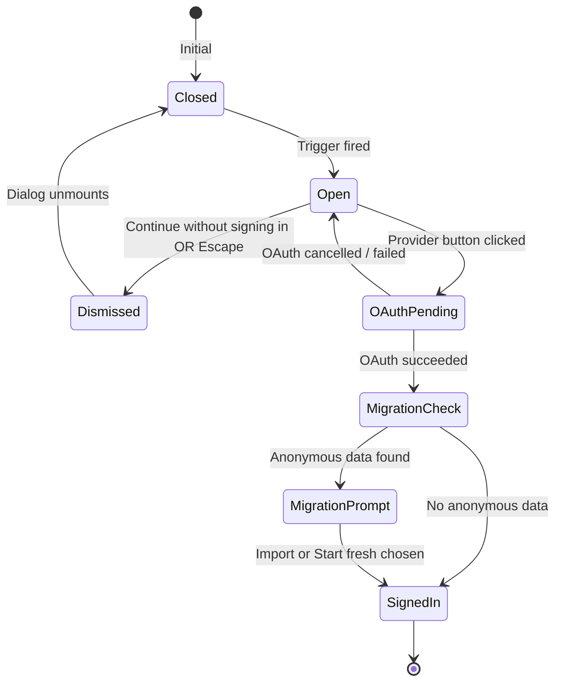

# Interaction Spec: Multi-IDP Sign-In Dialog

**Author**: Luna (UX Designer)
**Date**: 2026-03-01
**Status**: Planned — not yet implemented
**Wireframe**: [ux/wireframes/auth/multi-idp-sign-in.html](wireframes/auth/multi-idp-sign-in.html)
**Supersedes**: `wireframes/auth/sign-in.html` (dedicated page spec — Google PKCE only)

> **Implementation note (2026-03-01):** This spec describes a *planned* multi-provider auth integration. The current production implementation uses Google OAuth PKCE directly (see ADR-005, ADR-008). The interaction patterns and UX decisions here remain the target design for when multi-IDP support is adopted. Until then, the single-provider Google flow in `wireframes/auth/sign-in.html` is what is implemented.

---

## Context

Fenrir Ledger plans to support multiple identity providers for authentication. An auth
platform manages the OAuth handshakes internally and renders a `<SignIn>` component.
The sign-in surface is a **modal dialog** overlaid on the current page — not a dedicated
`/sign-in` route.

**Phase 1 (now):** Google only (via PKCE — ADR-005).
**Phase 2 (later):** Apple, email magic link — enabled via the auth provider dashboard.
No code change required between phases. The dialog renders whatever providers are configured.

---

## Where the Dialog is Triggered

| Trigger point | Source element | Notes |
|---|---|---|
| TopBar ᛟ rune avatar (anonymous state) | `<button>` in the TopBar | Already specced in `wireframes/chrome/topbar.html` |
| "Sign in to sync" in the upsell banner | CTA button in the dismissible banner | Already specced in `wireframes/auth/upsell-banner.html` |
| Settings "Sync to cloud" option | Settings page persistent option | For users who dismissed the banner |

**Anonymous-first guarantee**: none of these triggers are ever shown to signed-in users.
All three are gated on `isAnonymous === true`.

---

## Trigger Flow

---

## Dialog States

---

## On Successful Sign-In

1. OAuth completes.
2. Dialog closes automatically.
3. Check `localStorage` for anonymous card data (`householdId` cards > 0).
   - If data exists: fire the migration prompt modal (specced in `wireframes/auth/migration-prompt.html`).
   - If no data: proceed directly to step 4.
4. TopBar updates: ᛟ rune avatar cross-fades to provider profile photo (or ᛟ rune fallback if no picture). Neutral border transitions to gold ring. 400ms, `cubic-bezier(0.16, 1, 0.3, 1)`.
5. Upsell banner is hidden (render condition: `isAnonymous && !dismissed` — no longer met).
6. User is on the dashboard, signed-in state. No page navigation.

---

## On Dismiss ("Continue without signing in")

1. Dialog closes (slides/fades out — `framer-motion` exit animation, 200ms ease-out).
2. Focus returns to the element that triggered the dialog.
3. **No flags set.** The upsell banner dismiss flag is NOT set. The banner may reappear on next visit or page navigation.
4. User continues anonymously on their current page. Nothing changes.

**Non-nag guarantee**: the dialog does not re-open automatically after dismiss. The user must
actively trigger it again (via avatar, banner CTA, or settings). No auto-re-prompt timer.

---

## How New Providers Appear

The auth provider controls the provider list via its dashboard. When a new provider is toggled on:

1. The `<SignIn>` component renders an additional button in the provider list.
2. The `SignInDialog` wrapper adds no provider-specific code — it renders whatever providers are configured.
3. No deployment required. Provider appears after the dashboard change propagates.

**Provider button order**: configured in the auth provider dashboard. UX recommendation — most
universally available first (Google), product audience-specific second (GitHub), then Apple,
then Magic Link.

---

## Mobile Considerations

| Rule | Detail |
|---|---|
| Minimum viewport | 375px |
| Touch target | All buttons min 44×44px |
| Dialog position | Bottom-anchored on mobile (`< 640px`); centered on desktop |
| Backdrop click | Does NOT close the dialog on any viewport size |
| Keyboard avoidance | Bottom-anchor positions the dialog so the OS keyboard (email magic link) does not cover "Continue without signing in" |
| Max dialog height | Monitor at 5+ providers — may need `max-height` + `overflow-y: auto` on the provider list |

---

## Accessibility

| Requirement | Implementation |
|---|---|
| Dialog role | `<dialog aria-modal="true" aria-labelledby="[h1-id]">` |
| Focus trap | On open: focus moves to first provider button. Tab cycles within dialog only. |
| Escape key | Closes dialog (same as "Continue without signing in"). Handled by Radix Dialog primitive. |
| Focus return | On close: focus returns to the triggering element. Radix Dialog handles automatically. |
| Provider buttons | `aria-label="Continue with [Provider]"`. Provider icon: `aria-hidden="true"`. |
| Dismiss button | Plain `<button>` — no `aria-label` override needed. Full width, real button element. |
| Decorative elements | Atmospheric eyebrow and drag handle both `aria-hidden="true"`. |
| Backdrop | `role="presentation"` — not interactive, not focusable. |

---

## Non-Negotiables (carry forward from Freya's brief)

- "Continue without signing in" is a full-width `<button>`, not a link, not small text.
- The dialog never blocks core features — it is triggered only on explicit user intent.
- Backdrop click does NOT close the dialog (prevents accidental dismissal of a deliberate action).
- The dialog is never shown to signed-in users.
- Escape key closes the dialog — same behavior as the dismiss button.
