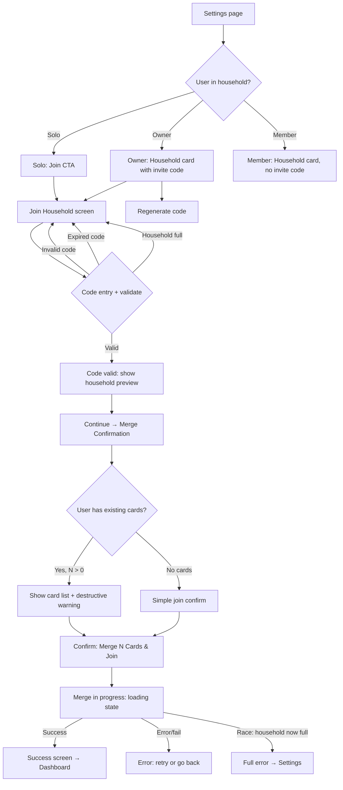

# Interaction Spec: Household Invite Code Flow

**Issue:** #1123
**Designer:** Luna
**Date:** 2026-03-16
**Status:** Ready for implementation
**Depends on:** #1120 (Firestore setup)

---

## Overview

Three screens form the household invite flow:

1. **Settings → Household section** (`settings-household.html`) — manage household, view/generate invite code
2. **Join Household** (`join-household.html`) — enter a 6-char invite code
3. **Merge Confirmation** (`merge-confirmation.html`) — review cards to merge, confirm join

---

## Flow Diagram



---

## Screen 1: Settings → Household Section

**Route:** `/ledger/settings`
**Component:** New `HouseholdSettingsSection` in `settings/page.tsx`
**Position:** Left column, below TrialSettingsSection

### States

| State | Trigger | View |
|---|---|---|
| Solo | User has no multi-member household | Join CTA button |
| Owner (has space) | User is household owner, members < 3 | Invite code + Regenerate button |
| Owner (full, 3/3) | Household at capacity | Full banner, invite code hidden |
| Member | User is a non-owner household member | Members list, owner name, no invite code |

### Invite Code Display

- 6-char alphanumeric code shown in monospaced display, letter-spacing 0.2em
- **Copy** button: copies code to clipboard, shows inline "Copied!" tooltip for 2s, then resets
- Expiry date shown below code: `Expires DD MMM YYYY`
- **Regenerate Code** button: owner only; triggers API call `POST /api/household/invite` with `{action: "regenerate"}`; replaces displayed code in-place (no page reload); new expiry shown immediately

### Member List

- Each row: avatar initials, display name, email, role badge (OWNER / MEMBER)
- "(you)" suffix on the current user's row
- Member count badge in section header: `N / 3 members`
- Badge for 3/3 is visually distinct (engineer: map to a warning/full token)

### Household Full State

- Invite code block replaced with a banner: "Household is full — max 3 members reached"
- Regenerate button not rendered (server also rejects with 409)

---

## Screen 2: Join Household

**Route:** `/ledger/join` or modal triggered from `/ledger/settings`
**(FiremanDecko to decide: full page route vs. settings modal)**

### Code Input

- 6 individual `<input>` elements (type="text", maxlength="1") wrapped in a `<fieldset>`
- Fieldset legend: `"Invite code (6 characters)"` (visually hidden, present for a11y)
- Auto-advance: on valid keypress (A–Z, 0–9), focus moves to next input
- Auto-uppercase: `text-transform: uppercase` + normalize on input event
- Paste handling: pasting a 6-char string fills all boxes and triggers validation
- Backspace on empty input: moves focus to previous input, clears it
- Tab/Shift-Tab: sequential navigation across all 6 inputs
- **Auto-validate on 6th character entry** — no additional "Validate" button needed

### Validation

| Result | API response | UX |
|---|---|---|
| Valid | 200 `{householdId, householdName, memberCount, members[]}` | Green success msg + household preview + Continue button |
| Invalid | 404 | Error msg + dashed border on all char boxes + "Try Again" clears all |
| Expired | 410 | Expired msg + "Ask the owner to regenerate" + "Try a New Code" clears |
| Household full | 409 `{reason: "household_full"}` | Full msg + "Try a Different Code" clears |
| Network error | 5xx / timeout | Generic error msg + Retry |

### Loading State

- All 6 inputs disabled (`aria-disabled="true"`)
- Submit button shows spinner + "Checking…" label
- `aria-busy="true"` on the form

### Focus Management

- On page load: focus on first char input
- On error: focus returns to first char input after clearing
- On success (valid code): focus moves to Continue button
- On retry clear: focus on first char input

---

## Screen 3: Merge Confirmation

**Route:** Continuation of join flow (no new URL — same page, next step, or query param `?step=confirm`)

### Card Count Resolution

The Join screen `POST /api/household/join/validate` response includes `{userCardCount: N}`.

- `N > 0`: Show merge confirmation with card list (max 4 shown, scroll for more), destructive warning
- `N === 0`: Show simple join confirm (no card list, no warning)

### CTA Copy

```
N > 0:  "Merge {N} Card{s} & Join Household"
N = 0:  "Join Household"
```

### Merge Operation

1. User taps confirm → `POST /api/household/join` with `{inviteCode, confirm: true}`
2. API executes in Firestore transaction:
   a. Validate invite code still valid
   b. Check household still has room (handles race)
   c. Copy all cards from old household to new household (update `householdId` on each)
   d. Delete old solo household doc
   e. Update user's `householdId` in auth session
3. Show loading state (non-cancellable) while in progress
4. On success → show success screen → auto-redirect to `/ledger` after 3s (or immediately on button tap)
5. On failure → show error with retry option; solo household MUST remain intact (idempotent)

### Cancel

- On merge confirmation screen: Cancel returns to join screen with code still displayed
- On loading screen: Cancel is disabled/hidden — operation in progress
- On success screen: Back is hidden — join is complete

---

## Responsive Breakpoints

| Breakpoint | Layout |
|---|---|
| ≥ 1024px (desktop) | Settings: two-column. Join/Merge: centered card max-width 440–480px |
| 600–1023px (tablet) | Settings: single-column. Join/Merge: centered card max-width 440px |
| < 600px (mobile) | Single column. Invite code/copy button stack vertically. Char boxes 44×56px min. All buttons full-width. |

**Minimum tested width: 375px.**

---

## Animation Notes

Per `../../interactions.md` principles (CSS-first, one well-orchestrated moment):

- **Code validation success:** Char boxes briefly animate to a "settled" state (engineer: `saga-enter` pattern, 300ms)
- **Household preview reveal:** Fade + translate-up in on appear (300ms expo-out)
- **Loading state:** Indeterminate progress bar — CSS `@keyframes` width oscillation, no JS
- **Success screen:** Icon enters with `saga-enter` stagger (icon first, then title, then sub text)
- **Error shake:** On invalid code, char boxes animate a brief horizontal shake (150ms ease-out) before showing dashed border
- All animations respect `prefers-reduced-motion: reduce` — fall back to instant transitions

---

## Component Suggestions for FiremanDecko

| New Component | File | Notes |
|---|---|---|
| `HouseholdSettingsSection` | `components/household/HouseholdSettingsSection.tsx` | Replaces hardcoded section in settings/page.tsx |
| `InviteCodeDisplay` | `components/household/InviteCodeDisplay.tsx` | 6-char display + copy button; state: idle/copied |
| `MembersList` | `components/household/MembersList.tsx` | List with avatar, role badge, "(you)" tag |
| `HouseholdFullBanner` | `components/household/HouseholdFullBanner.tsx` | Banner for 3/3 state |
| `JoinHouseholdScreen` | `app/ledger/join/page.tsx` or modal | Code entry form with all validation states |
| `CodeCharInput` | `components/household/CodeCharInput.tsx` | Single char input with auto-advance logic |
| `MergeConfirmationScreen` | Part of join flow | Card list + warning + confirm CTA |

### API Routes

| Route | Method | Purpose |
|---|---|---|
| `POST /api/household/invite` | `{action: "regenerate"}` | Generate new invite code (owner only) |
| `GET /api/household/invite/validate?code=X7K2NP` | — | Validate code, return household preview |
| `POST /api/household/join` | `{inviteCode, confirm: boolean}` | Execute join + merge transaction |
| `GET /api/household/members` | — | List current household members + roles |

All routes require `requireAuth(request)` per CLAUDE.md API auth rule.

---

## Acceptance Criteria Mapping

| AC | Wireframe coverage |
|---|---|
| Owner generates 6-char invite code from Settings | settings-household.html § A, B, C |
| Code expires after 1 month, owner can regenerate | settings-household.html § A (expiry label + Regenerate button) |
| Join Household screen: enter code → validate → join | join-household.html § A, B (States 1–6) |
| On join: solo user's cards merge | merge-confirmation.html § A (has cards) |
| Previous solo household cleaned up after merge | merge-confirmation.html § A (warning text) + § D (error idempotency) |
| Household size cap: max 3 members | join-household.html § B State 6; settings-household.html § C |
| Owner role preserved, only owner regenerates code | settings-household.html § B, F (role matrix) |
| Settings shows household members list with roles | settings-household.html § A, B |
| Mobile responsive 375px+ | All wireframes include mobile-frame sections at 375px |
