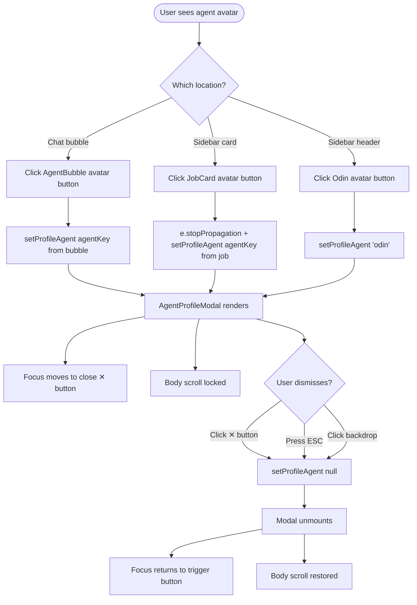

# Interaction Spec — AgentProfileModal (Issue #1062)

## 1. User Flow



## 2. Focus Management

| Event | Focus Destination |
|-------|-------------------|
| Modal opens | Close ✕ button (first focusable element) |
| Tab inside modal | Cycles: ✕ → ✕ (only one interactive element) |
| Shift+Tab inside modal | Same cycle |
| Modal closes | Returns to the button that triggered the open (triggerRef) |

Implementation:
```tsx
// Store trigger ref before opening
const triggerRef = useRef<HTMLButtonElement>(null);

// On open, focus the close button
useEffect(() => {
  if (profileAgent) closeButtonRef.current?.focus();
}, [profileAgent]);

// On close, return focus
const handleClose = () => {
  setProfileAgent(null);
  triggerRef.current?.focus();
};
```

## 3. Keyboard Interactions

| Key | Behaviour |
|-----|-----------|
| `ESC` | Closes modal |
| `Tab` | Moves focus forward (trapped inside modal) |
| `Shift+Tab` | Moves focus backward (trapped inside modal) |
| `Enter` / `Space` | Activates focused button (close) |

```tsx
// On the modal shell element:
onKeyDown={(e) => {
  if (e.key === 'Escape') handleClose();
  if (e.key === 'Tab') {
    // Trap focus — only one focusable element (close button)
    e.preventDefault();
    closeButtonRef.current?.focus();
  }
}}
```

## 4. Backdrop Click Behaviour

Click on the outer backdrop div should close the modal. Click on the modal shell itself should NOT close.

```tsx
// On backdrop div:
onClick={(e) => {
  if (e.target === e.currentTarget) handleClose();
}}
```

## 5. Body Scroll Lock

```tsx
useEffect(() => {
  document.body.style.overflow = 'hidden';
  return () => { document.body.style.overflow = ''; };
}, []);
```

## 6. JobCard — stopPropagation

The JobCard avatar button must call `e.stopPropagation()` to prevent the card's own `onClick` (session select) from firing.

```tsx
<button
  onClick={(e) => {
    e.stopPropagation();
    onAvatarClick?.(job.agentKey ?? '');
  }}
  aria-label={`View ${job.agentName} profile`}
>
  
</button>
```

## 7. Theme-Aware Portrait

The portrait image switches between light and dark variant based on the current theme:

```tsx
const portrait = theme === 'light'
  ? AGENT_LIGHT_AVATARS[agentKey]
  : AGENT_AVATARS[agentKey];
```

`AGENT_AVATARS` (existing) already maps to dark variants. Add new `AGENT_LIGHT_AVATARS` for light variants.

## 8. State Lifting

`profileAgent` state must live high enough to receive triggers from three separate component trees:

```
App
├── Sidebar (trigger: Odin)         → onOdinClick
├── LogViewer
│   └── AgentBubble (trigger: chat) → onAvatarClick
└── Sidebar → JobCard (trigger: card) → onAvatarClick
```

**Recommended approach:** Lift to App.tsx — pass `onAvatarClick={setProfileAgent}` and `onOdinClick={() => setProfileAgent('odin')}` as props.

**Alternative:** `AgentProfileContext` with `useContext` — avoids prop-drilling through LogViewer if the call chain is deep.

## 9. Entrance Animation (Optional)

If FiremanDecko adds an entrance animation (matching NorseVerdictInscription carve-in style):
- Modal shell: `scale(0.96) → scale(1)`, `opacity 0 → 1`, duration 200ms ease-out
- MUST have `@media (prefers-reduced-motion: reduce) { animation: none; transition: none; }`

## 10. Open Questions for FiremanDecko

1. **State location**: App.tsx props vs. React Context — which fits better with current LogViewer/Sidebar wiring?
2. **Asset pipeline**: build-time copy script vs. symlink (see wireframe §8) — symlinks may break in Docker.
3. **Odin constants**: Should Odin be added to AGENT_NAMES/AGENT_TITLES etc., or kept separate in an ODIN_PROFILE constant to avoid affecting existing agent-key lookups throughout the codebase?
4. **Entrance animation**: Carve-in animation same as NorseVerdictInscription, or simpler fade — design choice is yours.
