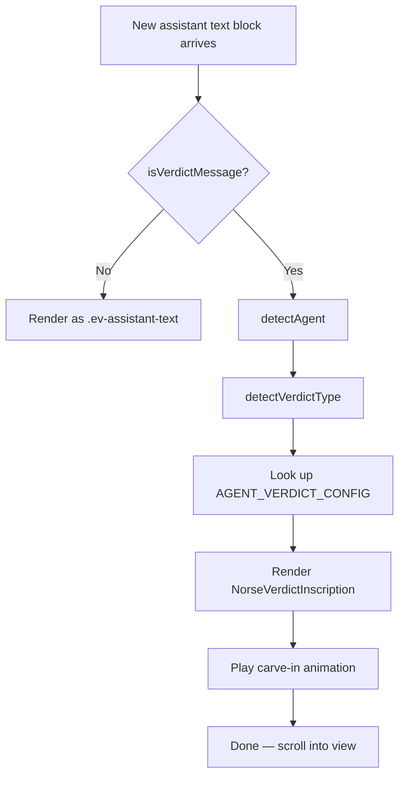

# Interaction Spec: NorseVerdictInscription (Issue #1019)

**Component:** `NorseVerdictInscription`
**File:** `development/monitor-ui/src/components/NorseVerdictInscription.tsx`
**Wireframe:** `ux/wireframes/monitor-ui/verdict-inscription.html`
**Designer:** Luna | **Issue:** #1019

---

## 1. Detection Logic

### Trigger Condition

Inspect the **last assistant-role message block** in the parsed session stream. If its raw markdown contains a level-1 or level-2 heading matching the pattern below, render as `NorseVerdictInscription` instead of `.ev-assistant-text`:

```ts
const VERDICT_HEADING_RE = /^#{1,2}\s+(Handoff|QA Verdict)/m;

function isVerdictMessage(text: string): boolean {
  return VERDICT_HEADING_RE.test(text);
}
```

**Scope constraint:** Only the final assistant text block triggers this. Mid-session mentions of "Handoff" inside tool outputs, code blocks, or earlier messages do **not** trigger. The stream renderer should run this check once per session when streaming completes (or on each new assistant block, replacing the previous .ev-assistant-text if it matches).

### Agent Detection

Agent identity is resolved in this priority order:

1. **Session metadata** — `session.agentName` field in parsed stream (most reliable)
2. **Heading text** — match `/(FiremanDecko|Loki|Luna|Heimdall|Freya)/i` in the verdict heading (e.g. "FiremanDecko → Loki Handoff")
3. **Generic fallback** — if neither source yields a match, use `agent: 'generic'` (ᛟ Othalan rune, gold accent, generic pledge)

```ts
function detectAgent(sessionAgentName: string | undefined, headingText: string): AgentKey {
  if (sessionAgentName) return normaliseAgentKey(sessionAgentName);
  const match = headingText.match(/(FiremanDecko|Loki|Luna|Heimdall|Freya)/i);
  if (match) return normaliseAgentKey(match[1]);
  return 'generic';
}
```

### Verdict Type Detection

```ts
function detectVerdictType(headingText: string): VerdictType {
  return headingText.toLowerCase().includes('qa verdict') ? 'qa-verdict' : 'handoff';
}
```

Subtitle rendering:
- `handoff`: `"[RoleLabel] — Handoff Complete"`
- `qa-verdict`: `"[RoleLabel] — QA Verdict Delivered"`

---

## 2. Rendering Flow



---

## 3. Agent Variant Config

All agent-specific values live in a static `AGENT_VERDICT_CONFIG` map. This is the single source of truth — no per-agent conditionals in JSX.

| Agent | Rune | Name | Meaning | Accent Token | Arch Title |
|---|---|---|---|---|---|
| `fireman-decko` | ᚲ | Kenaz | The Forge | `--agent-accent-fireman` | "The Forge Has Spoken" |
| `loki` | ᚾ | Naudhiz | Need / Trickery | `--agent-accent-loki` | "The Trickster Finds No Flaw" |
| `luna` | ᛚ | Laguz | Water / Moon | `--agent-accent-luna` | "The Moonpath Is Drawn" |
| `heimdall` | ᛏ | Tiwaz | Justice / Watchman | `--agent-accent-heimdall` | "The Bifröst Stands Unwavering" |
| `freya` | ᚠ | Fehu | Abundance / Wisdom | `--agent-accent-freya` | "The Völva Has Spoken" |
| `generic` | ᛟ | Othalan | Heritage / Estate | `--gold` (default) | "The Inscription Is Complete" |

### Pledges (verbatim)

**FiremanDecko:**
> "The forge cools. What was broken is reforged. I lay this work before the All-Father's throne upon Hliðskjálf."

**Loki:**
> "Every thread tested, every seam inspected. The Trickster finds no flaw worthy of Ragnarök. I present this verdict to Odin, Lord of Asgard."

**Luna:**
> "By moonlight I have drawn the path through the branches of Yggdrasil. These wireframes carry the vision of Freyja's hall. Odin, receive this design."

**Heimdall:**
> "From the Bifröst I have watched. No shadow passes unchallenged. This audit is sworn before Odin's one remaining eye."

**Freya:**
> "The Völva has spoken. What was foretold is now revealed. I deliver this wisdom to the throne of Valhalla."

**Generic:**
> "What was tasked is now complete. This work is laid before the All-Father. Let the runes bear witness."

### Norse Term Links per Agent

Only pre-defined terms within the pledge should be linked to Wikipedia (not auto-linked in arbitrary markdown content):

| Agent | Terms to link |
|---|---|
| fireman-decko | Hliðskjálf |
| loki | Ragnarök, Asgard |
| luna | Yggdrasil, Freyja |
| heimdall | Bifröst |
| freya | Völva, Valhalla |
| generic | — |

---

## 4. Markdown Rendering

Use `react-markdown` (already in the project). Provide custom component overrides to apply `.nvi-md-*` classes:

```ts
const markdownComponents = {
  h1: ({children}) => <h1 className="nvi-md-h1">{children}</h1>,
  h2: ({children}) => <h2 className="nvi-md-h2">{children}</h2>,
  h3: ({children}) => <h3 className="nvi-md-h3">{children}</h3>,
  p:  ({children}) => <p className="nvi-md-p">{children}</p>,
  ul: ({children}) => <ul className="nvi-md-ul">{children}</ul>,
  ol: ({children}) => <ol className="nvi-md-ol">{children}</ol>,
  code: ({inline, children, ...props}) =>
    inline
      ? <code className="nvi-md-inline-code" {...props}>{children}</code>
      : <pre className="nvi-md-code"><code>{children}</code></pre>,
  table: ({children}) => (
    <div style={{overflowX:'auto'}}>
      <table className="nvi-md-table">{children}</table>
    </div>
  ),
  a: ({href, children}) => (
    <a href={href} target="_blank" rel="noopener noreferrer"
       className="nvi-md-link" aria-label={`${children} (opens in new tab)`}>
      {children}
    </a>
  ),
};
```

**Checkmark bullets:** The `.nvi-md-ul li::marker` CSS sets content to `"✓  "` — this applies to all unordered lists inside the tablet, reinforcing the verdict/completion context. This is intentional and desirable for the triumph-arch mood.

---

## 5. Carve-In Animation

### Keyframes (to add to `styles/index.css`)

```css
@keyframes carveIn {
  from { opacity: 0; transform: translateY(-6px); }
  to   { opacity: 1; transform: translateY(0); }
}

@keyframes glyphBlaze {
  0%   { opacity: 0; transform: scale(0.6); }
  60%  { opacity: 1; transform: scale(1.04); }
  100% { opacity: 1; transform: scale(1.0); }
}

@keyframes sealStamp {
  0%   { opacity: 0; transform: scale(0.95); }
  70%  { opacity: 1; transform: scale(1.02); }
  100% { opacity: 1; transform: scale(1.0); }
}
```

### Stagger Schedule

| Element | Delay | Duration | Keyframe |
|---|---|---|---|
| `.nvi-shell` (border) | 0ms | 200ms | opacity fade |
| `.nvi-rune-band-top` | 50ms | 300ms | `carveIn` |
| `.nvi-glyph` | 200ms | 400ms | `glyphBlaze` |
| `.nvi-agent-name` | 350ms | 250ms | `carveIn` |
| `.nvi-arch-title` | 380ms | 280ms | `carveIn` |
| `.nvi-arch-subtitle` | 410ms | 250ms | `carveIn` |
| `.nvi-body > *` (each) | 500ms + (n×60ms) | 250ms | `carveIn` |
| `.nvi-seal` | calculated last | 350ms | `sealStamp` |
| `.nvi-rune-band-bottom` | same as seal | 300ms | `carveIn` |

### Reduced Motion

```css
@media (prefers-reduced-motion: reduce) {
  .nvi-shell,
  .nvi-rune-band-top,
  .nvi-glyph,
  .nvi-agent-header > *,
  .nvi-body > *,
  .nvi-seal,
  .nvi-rune-band-bottom {
    animation: fadeIn 150ms ease !important;
    animation-delay: 0ms !important;
  }
}
```

---

## 6. Responsive Behaviour

### Breakpoints

| Viewport | Width | Key changes |
|---|---|---|
| Mobile | < 600px | 1 rune row, 3.5rem glyph, 1.1rem arch title, reduced padding, overflow-x:auto on tables/code |
| Tablet | 600–1024px | 1.5 rune rows, 4rem glyph, 1.2rem arch title |
| Desktop | > 1024px | Full 2-row bands, 5rem glyph, 1.4rem arch title, max-width 720px |

### Overflow Handling

- **Tables:** Wrapped in `<div style="overflow-x:auto">`. Min-width 300px on the table itself.
- **Code blocks:** `overflow-x: auto; white-space: pre;` on `.nvi-md-code`.
- **Rune bands:** `word-break: break-all` prevents horizontal scroll on very narrow viewports.
- **Agent Futhark name in seal:** Truncate with ellipsis at < 360px if it overflows.

---

## 7. CSS Architecture

### New CSS Custom Properties (to add to `:root`)

```css
:root {
  /* Agent accent colours */
  --agent-accent-fireman:  #e05a10;  /* forge-orange  */
  --agent-accent-loki:     #22c55e;  /* trickster-green */
  --agent-accent-luna:     #cbd5e1;  /* moonlight-silver */
  --agent-accent-heimdall: #f0b429;  /* watchman-gold (brighter than --gold) */
  --agent-accent-freya:    #a855f7;  /* wisdom-violet */
  --agent-accent-generic:  var(--gold); /* fallback */

  /* Light theme overrides (add inside [data-theme="light"]) */
  --agent-accent-fireman:  #c44a08;
  --agent-accent-loki:     #16a34a;
  --agent-accent-luna:     #64748b;
  --agent-accent-heimdall: #8f6e0e;
  --agent-accent-freya:    #7c3aed;
}
```

**Note on contrast:** All dark-theme accent values must achieve ≥ 4.5:1 contrast ratio against `#07070d` (the parchment bg). Verify with a contrast checker before shipping. The provided values are design targets — the engineer must validate and adjust if needed.

### New CSS Classes (to add to `styles/index.css`)

All new classes use the `.nvi-` prefix (Norse Verdict Inscription). See wireframe Section 1 for the full CSS class list. Key additions:

- `.nvi-shell` — outer container, inline in stream
- `.nvi-rune-band-top` / `.nvi-rune-band-bottom` — double-row rune decorations
- `.nvi-agent-header` — triumph keystone region
- `.nvi-glyph` — large rune medallion
- `.nvi-body` — markdown content region
- `.nvi-md-*` — markdown element overrides
- `.nvi-seal` — pledge region at base
- `.nvi-norse-link` — gold dashed Wikipedia link

---

## 8. Reuse from NorseErrorTablet

The `NorseVerdictInscription` component **does not extend** `NorseErrorTablet` — they share aesthetic DNA but different structural purposes. However, the engineer can directly reuse:

- `RUNE_ROW_TOP` / `RUNE_ROW_BTM` constants (copy them, or export from a shared `runeConstants.ts` file)
- Font stack decisions: Cinzel Decorative for `nvi-arch-title`, Cinzel for `nvi-agent-name`, Source Serif 4 for body, JetBrains Mono for code/rune bands
- The `fadeSlideIn` animation for the reduced-motion fallback (already defined globally)
- Dark background `#07070d` — the NorseErrorTablet sets this explicitly; NorseVerdictInscription should use `var(--void)` with a CSS override for the dark parchment (so it works in light mode too — see note below)

### Light Mode Consideration

`NorseErrorTablet` hardcodes `background: #07070d` with an explicit note that it's dark-only. `NorseVerdictInscription` should instead use:

```css
.nvi-shell {
  background: var(--void);         /* respects light/dark theme */
  border-color: var(--agent-accent, var(--gold));
}
```

The agent's accent colour is applied via a CSS custom property set inline: `style="--agent-accent: var(--agent-accent-fireman)"` — so the border, glyph glow, and link colours all cascade from one per-instance variable.

---

## 9. Implementation Checklist for FiremanDecko

- [ ] Create `AGENT_VERDICT_CONFIG` map with all 6 entries (5 agents + generic)
- [ ] Create `NorseVerdictInscription.tsx` with props as specified in wireframe Section 10
- [ ] Wire `isVerdictMessage()` detection into the assistant text renderer
- [ ] Integrate `react-markdown` with `.nvi-md-*` custom components
- [ ] Add Norse term pre-linking to pledge text (static, not dynamic)
- [ ] Add `.nvi-*` CSS classes to `styles/index.css`
- [ ] Add `--agent-accent-*` CSS custom properties to `:root` and `[data-theme="light"]`
- [ ] Add carve-in keyframes: `@keyframes carveIn`, `glyphBlaze`, `sealStamp`
- [ ] Wire `animation-delay` stagger per element (see Section 5)
- [ ] Add `@media (prefers-reduced-motion)` override
- [ ] Responsive CSS: media queries at 600px and 1024px
- [ ] Tables: overflow-x:auto wrapper
- [ ] Code blocks: overflow-x:auto, white-space:pre
- [ ] ARIA: role="article", aria-hidden on decorative runes, role="img" on glyph, aria-label on Norse links
- [ ] Norse links: target="_blank", rel="noopener noreferrer"
- [ ] Verify all accent colour contrast ≥ 4.5:1 on dark bg
- [ ] Manual test: all 5 agent variants + generic
- [ ] Manual test: mobile 375px, tablet 768px, desktop 1280px
- [ ] Manual test: prefers-reduced-motion toggle

---

*Luna — UX Designer — Fenrir Ledger — Issue #1019*
