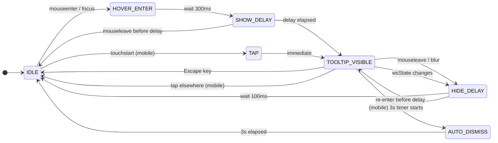

# Interaction Spec — WSS Icon Bare + Wolf-Voice Tooltip
**Issue:** #1443
**Component:** `StatusBadge` · Sidebar header
**Author:** Luna · UX Designer
**Date:** 2026-03-19

---

## Overview

Two changes to the WSS (WebSocket) status icon in the monitor-ui sidebar header:

1. **Remove the box** — the `.ws-badge-icon` span currently has a visible border and padding that creates a bounding box around the SVG icon. This must be stripped. The icon should float bare in the header row.
2. **Add wolf-voice tooltip** — hovering (desktop) or tapping (mobile) the icon shows a tooltip written from Fenrir's perspective, matching the current connection state.

---

## State Machine



---

## Tooltip Copy — Wolf-Voice per State

| `wsState` | Tooltip text | Voice note |
|---|---|---|
| `open` | "The thread holds. Fenrir watches." | Calm, present, vigilant |
| `connecting` | "The Norns weave. Hold fast." | Active, anticipatory, fate in motion |
| `closed` | "The chain is broken. Fenrir stirs." | Tense, on the edge of rupture |
| `error` | "The chain is broken. Fenrir stirs." | Same as closed — both mean severed connection |

**Copy rationale:** The WSS connection maps to Gleipnir's chain (see `product/mythology-map.md`). Connected = Fenrir is bound and watching the realm. Reconnecting = the Norns (fate-weavers) are re-threading the connection. Disconnected = the chain is broken, Fenrir is loose and stirring. The wolf speaks from its own perspective — not a system status message.

---

## Show / Hide Behaviour

### Desktop (mouse + keyboard)

| Event | Action |
|---|---|
| `mouseenter` on icon wrapper | Start 300ms show-delay timer |
| `mouseleave` before 300ms | Cancel timer, tooltip stays hidden |
| 300ms elapsed | Show tooltip |
| `mouseleave` on icon wrapper | Start 100ms hide-delay timer |
| Re-enter icon or tooltip within 100ms | Cancel hide-delay, keep visible |
| 100ms elapsed | Hide tooltip |
| `focus` (keyboard tab) | Show tooltip immediately (no delay) |
| `blur` | Hide tooltip |
| `Escape` key while visible | Hide tooltip immediately, return focus to icon |

### Mobile / Touch

| Event | Action |
|---|---|
| `touchstart` on icon | Show tooltip immediately |
| Start 3s auto-dismiss timer | — |
| Tap icon again | Dismiss immediately |
| Tap anywhere else | Dismiss immediately |
| 3s elapsed without re-tap | Dismiss |

**Touch target:** Icon wrapper must have minimum 44×44px touch target. If the SVG is 16×16, add transparent padding or use `min-width: 44px; min-height: 44px` on the wrapper.

---

## Tooltip Positioning

### Expanded sidebar (primary)
- Tooltip appears **below** the icon, centered horizontally on the icon.
- 6px gap between icon bottom and tooltip top.
- Pointing caret at the top of the tooltip bubble.
- If tooltip would clip the right viewport edge, shift left to stay within bounds.

### Collapsed sidebar (future consideration only)
- Icon is currently hidden when sidebar is collapsed (`{!collapsed && (...)}` in `Sidebar.tsx`).
- **No change to this behaviour in this issue.**
- If a future issue re-introduces the icon in collapsed mode, position the tooltip to the **right** of the icon with a left-pointing caret.

---

## CSS Architecture

### Remove from `.ws-badge-icon`
```css
/* DELETE these lines from index.css */
.ws-badge-icon {
  padding: 0.15rem;           /* REMOVE */
  border-radius: 3px;         /* REMOVE */
  border: 1px solid transparent; /* REMOVE */
}
.ws-badge-icon.open    { border-color: #22c55e33; } /* REMOVE */
.ws-badge-icon.connecting { border-color: #eab30833; } /* REMOVE */
.ws-badge-icon.closed  { border-color: var(--rune-border); } /* REMOVE */
.ws-badge-icon.error   { border-color: #ef444433; } /* REMOVE */
```

### Retain on `.ws-badge-icon`
```css
.ws-badge-icon {
  display: flex;
  align-items: center;
  justify-content: center;
  flex-shrink: 0;
  cursor: default;
}
```

### Add: `.wss-tooltip`
```css
/* Structural only — theme colours applied by engineer per Saga Ledger dark theme */
.wss-tooltip {
  position: absolute;
  top: calc(100% + 6px);
  left: 50%;
  transform: translateX(-50%);
  z-index: 200;
  padding: 0.3rem 0.5rem;
  font-size: 0.7rem;
  white-space: nowrap;
  max-width: 220px;
  white-space: normal;
  pointer-events: none; /* tooltip itself doesn't interfere with mouse */
}

/* Caret — pointing upward (tooltip is below icon) */
.wss-tooltip::before {
  content: "";
  position: absolute;
  top: -5px;
  left: 50%;
  transform: translateX(-50%);
  border-left: 5px solid transparent;
  border-right: 5px solid transparent;
  border-bottom: 5px solid; /* colour set by theme */
}

/* Reduced motion — suppress pulse on connecting icon */
@media (prefers-reduced-motion: reduce) {
  .ws-badge-icon.connecting { animation: none; }
}
```

---

## React Component Changes

### `StatusBadge.tsx` — updated structure

```tsx
// Conceptual only — exact implementation is FiremanDecko's call

const WOLF_VOICE: Record<Props["state"], string> = {
  open: "The thread holds. Fenrir watches.",
  connecting: "The Norns weave. Hold fast.",
  closed: "The chain is broken. Fenrir stirs.",
  error: "The chain is broken. Fenrir stirs.",
};

const ARIA_LABEL: Record<Props["state"], string> = {
  open: "WebSocket connected — the thread holds",
  connecting: "WebSocket reconnecting — the Norns weave",
  closed: "WebSocket closed — the chain is broken",
  error: "WebSocket error — the chain is broken",
};

// Wrapper element:
// - tabIndex={0} for keyboard access
// - role="status" (open/connecting) or role="alert" (closed/error)
// - aria-label from ARIA_LABEL map (technical + mythological)
// - aria-describedby pointing to tooltip element id
// - position: relative so tooltip can be absolutely positioned

// Tooltip element:
// - role="tooltip"
// - id referenced by aria-describedby
// - Conditionally rendered based on isVisible state
// - Children: WOLF_VOICE[state]
```

---

## Accessibility Checklist

- [ ] Icon wrapper is keyboard-focusable (`tabIndex={0}` or `<button>`)
- [ ] Tooltip shows on `focus`, hides on `blur`
- [ ] Tooltip dismisses on `Escape` key
- [ ] `role="tooltip"` on tooltip element
- [ ] `aria-describedby` on icon wrapper pointing to tooltip id
- [ ] `aria-label` on icon wrapper: technical + wolf hybrid (see matrix)
- [ ] `role="status"` for `open` / `connecting` states
- [ ] `role="alert"` for `closed` / `error` states
- [ ] `aria-live="polite"` for status, `aria-live="assertive"` for alert
- [ ] Touch target min 44×44px on mobile
- [ ] `prefers-reduced-motion` suppresses connecting pulse animation
- [ ] Tooltip visible only via pointer or focus — not auto-shown on mount

---

## Acceptance Criteria Mapping

| AC | Covered by |
|---|---|
| Box/border container removed from WSS status icon | Section D (CSS removes) + Wireframe Section A (Before/After) |
| Icon renders without any visible bounding box or button outline | Wireframe Section A AFTER column |
| Tooltip appears on hover with contextual wolf-voice message | State machine + Copy table + Wireframe Section B |
| Tooltip styling consistent with Saga Ledger dark theme | `.wss-tooltip` CSS skeleton (colour tokens = engineer's domain) |

---

## Implementation Flexibility

FiremanDecko has flexibility on:
- **Tooltip primitive:** Use an existing shared Tooltip component if one exists. Do not create a new one if there is already a reusable primitive in the codebase.
- **Animation:** A simple fade-in (opacity: 0 → 1) over 150ms is sufficient. Do not over-animate.
- **Touch handling:** A simple `onClick` toggle is acceptable on mobile if `onTouchStart` creates complications. The 3s auto-dismiss is a UX enhancement, not a hard requirement.
