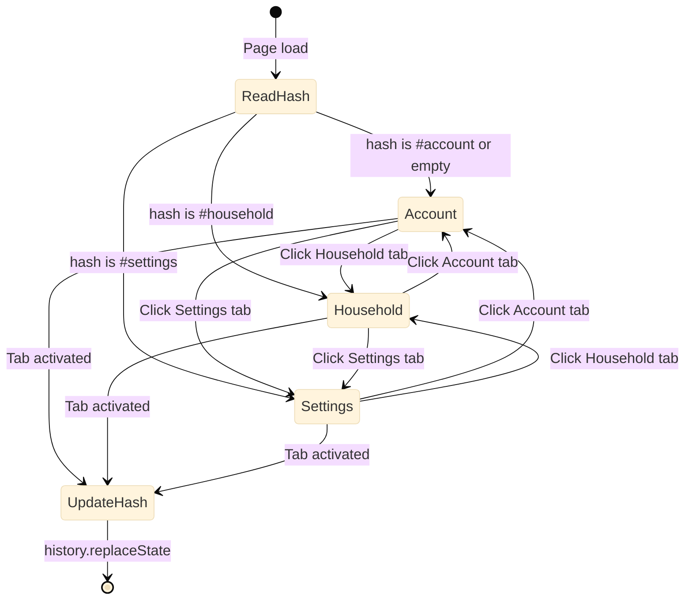

# Settings Tabs — Interaction Spec

Companion to `settings-tabs.html` wireframe. Covers tab switching, URL hash persistence, bling tier behavior, mobile pattern, and accessibility.

---

## 1. Tab Structure

| Tab ID | Label | Panel Contents | Subtitle |
|--------|-------|---------------|----------|
| `account` | Account | StripeSettings + TrialSettingsSection (50/50) | Manage your subscription and trial status. The wolf's chain awaits your command. |
| `household` | Household | HouseholdSettingsSection + SyncSettingsSection (50/50) | Configure your household and cloud sync. Forge the bonds that bind. |
| `settings` | Settings | RestoreTabGuides (full width) | Customize your experience. Shape the ledger to your will. |

Default tab: `account`.

---

## 2. Tab Switching

### User flow



### Behavior

1. On click (or keyboard activation), set `aria-selected="true"` on the target tab, `aria-selected="false"` on all others.
2. Show the matching `[role="tabpanel"]`, hide the others with the `hidden` attribute.
3. Update the subtitle text in the page header to match the active tab.
4. Update URL hash via `history.replaceState(null, '', '#' + tabId)` — no page reload, no new history entry.
5. Fire analytics: `track("settings-tab-switch", { tab: tabId })`.

---

## 3. URL Hash Persistence

- On page mount, read `window.location.hash`.
- Strip the `#` prefix and match against known tab IDs: `account`, `household`, `settings`.
- If match found, activate that tab. If no match or empty, default to `account`.
- On tab switch, call `history.replaceState` (not `pushState`) to avoid polluting browser history.
- The `hashchange` event listener is NOT needed — tab switches are driven by click/keyboard, not URL navigation.

---

## 4. Card Layout Per Tab

### Account tab

| Condition | Layout |
|-----------|--------|
| Trial active | 2-column grid: StripeSettings (left) + TrialSettingsSection (right) |
| No trial | StripeSettings spans full width (`grid-column: 1 / -1`) |

### Household tab

Always 2-column grid: HouseholdSettingsSection (left) + SyncSettingsSection (right).

### Settings tab

Always single column: RestoreTabGuides at full width.

### Responsive grid

| Viewport | Grid |
|----------|------|
| Desktop (>768px) | `grid-template-columns: 1fr 1fr` |
| Tablet + Mobile (<768px) | `grid-template-columns: 1fr` (stack) |

---

## 5. Karl Bling Tier Behavior

### New CSS class: `.karl-bling-tab`

Add to `karl-bling.css` following the existing cascade pattern:

```css
/* ── Karl: tab gold accent ─────────────────────────────────────────── */
/*
 * .karl-bling-tab — settings tab buttons get gold treatment for
 * Karl and trial tiers. Follows the same cascade as karl-bling-btn.
 *
 * Karl:  gold bottom border + hover glow animation
 * Trial: softer gold treatment (~60% intensity)
 * Thrall: no bling (default border)
 */

[data-tier="karl"] .karl-bling-tab[aria-selected="true"] {
  border-bottom: 2px solid #d4a520;
  box-shadow: 0 2px 10px rgba(212, 165, 32, 0.35);
}

[data-tier="karl"] .karl-bling-tab:hover {
  border-color: rgba(212, 165, 32, 0.55);
  animation: karl-gold-glow 2.8s ease-in-out infinite;
}

[data-tier="trial"] .karl-bling-tab[aria-selected="true"] {
  border-bottom: 2px solid rgba(212, 165, 32, 0.55);
  box-shadow: 0 2px 8px rgba(212, 165, 32, 0.18);
}

[data-tier="trial"] .karl-bling-tab:hover {
  border-color: rgba(212, 165, 32, 0.30);
  animation: karl-gold-glow-soft 3.2s ease-in-out infinite;
}
```

### Reduced motion

```css
@media (prefers-reduced-motion: reduce) {
  [data-tier="karl"] .karl-bling-tab:hover,
  [data-tier="trial"] .karl-bling-tab:hover {
    animation: none;
  }
}
```

### Touch devices

```css
@media (hover: none) {
  [data-tier="karl"] .karl-bling-tab:hover,
  [data-tier="trial"] .karl-bling-tab:hover {
    animation: none;
  }
}
```

### Card bling

All cards already carry `karl-bling-card` class. No changes needed — existing hover glow and rune corners work as-is.

---

## 6. Mobile Behavior (<600px)

### Pattern: Native `<select>` dropdown

The horizontal tab bar is replaced by a native `<select>` element on viewports below 600px.

**Why not a hamburger menu?** Three items do not justify hiding navigation behind a tap. A hamburger reduces discoverability. A native select is:
- Touch-friendly (44px minimum height, uses OS picker on iOS/Android)
- Accessible by default (screen readers announce it as a listbox)
- Compact (single line, no overflow issues at 375px)
- Scalable (works if more tabs are added later)

**Why not compressed horizontal tabs?** At 375px with padding, three tabs can feel cramped and may require text truncation. The select avoids this entirely.

### Implementation

```html
<!-- Show tab bar only on md+ -->
<div class="hidden md:flex" role="tablist">
  <!-- tab buttons -->
</div>

<!-- Show select only below md -->
<div class="md:hidden">
  <label for="settings-tab-select" class="sr-only">Settings section</label>
  <select id="settings-tab-select"
          aria-label="Settings section"
          class="w-full min-h-[44px] ...">
    <option value="account">Account</option>
    <option value="household">Household</option>
    <option value="settings">Settings</option>
  </select>
</div>
```

On `change` event, activate the corresponding panel (same logic as tab click). Update URL hash and subtitle.

### Mobile select bling

For karl/trial tiers, wrap the select in a container with the karl-bling treatment:

```css
[data-tier="karl"] .karl-bling-select {
  border-color: rgba(212, 165, 32, 0.40);
  box-shadow: var(--karl-shadow-sm);
}

[data-tier="trial"] .karl-bling-select {
  border-color: rgba(212, 165, 32, 0.20);
}
```

---

## 7. Accessibility

### ARIA pattern: Tabs (WAI-ARIA Authoring Practices)

| Element | Role | Properties |
|---------|------|------------|
| Tab bar container | `tablist` | `aria-label="Settings tabs"` |
| Each tab button | `tab` | `aria-selected`, `aria-controls`, `id` |
| Each panel | `tabpanel` | `aria-labelledby` (points to tab id), `hidden` when inactive |

### Keyboard navigation

| Key | Action |
|-----|--------|
| `Tab` | Moves focus into the tablist (lands on active tab), then out to panel content |
| `ArrowRight` | Move focus to next tab, wrapping from last to first |
| `ArrowLeft` | Move focus to previous tab, wrapping from first to last |
| `Home` | Move focus to first tab |
| `End` | Move focus to last tab |
| `Enter` / `Space` | Activate the focused tab (if using manual activation) |

**Activation mode:** Automatic (focus follows selection) is recommended for 3 tabs. The panel switches as soon as arrow keys move focus. This matches the WAI-ARIA tabs pattern for small tab sets.

### Focus management

- Only the active tab has `tabindex="0"`. Inactive tabs have `tabindex="-1"`.
- When a tab is activated, the panel becomes visible but focus stays on the tab button (user can `Tab` into panel content).
- On mobile, the `<select>` element handles focus natively.

### Subtitle announcements

The subtitle element should have `aria-live="polite"` so screen readers announce the context change when switching tabs:

```html
<p class="subtitle" aria-live="polite" id="settings-subtitle">
  Manage your subscription and trial status. The wolf's chain awaits your command.
</p>
```

### Color contrast

All tab labels must meet WCAG 2.1 AA contrast ratio (4.5:1 for normal text). Gold bling is decorative (border/glow) and does not affect text contrast. Tab label text uses the existing `text-foreground` token.

### Reduced motion

All karl-bling animations are suppressed via `@media (prefers-reduced-motion: reduce)` — static gold borders are retained for visual indication without animation.

---

## 8. Analytics Events

| Event | Payload | When |
|-------|---------|------|
| `settings-visit` | none | Page mount (existing) |
| `settings-tab-switch` | `{ tab: "account" \| "household" \| "settings" }` | Tab activated (click, keyboard, or select change) |

---

## 9. Implementation Notes for FiremanDecko

### What changes

- `page.tsx` — Refactor from 2-column grid to tabbed layout. Add state for active tab, hash reading/writing, subtitle mapping.
- `karl-bling.css` — Add `.karl-bling-tab` and `.karl-bling-select` classes (see Section 5 and 6).

### What does NOT change

- All child components (StripeSettings, TrialSettingsSection, HouseholdSettingsSection, SyncSettingsSection, RestoreTabGuides) remain unchanged. They render inside tab panels exactly as they do today.
- The Gleipnir Fragment #3 trigger in RestoreTabGuides is unaffected.
- The existing karl-bling-card treatment on all cards is unaffected.

### Flexibility

- The exact breakpoint for tab-bar-to-select switch (600px vs Tailwind's `md` at 768px) is implementation flexible. Use whichever reads better at the boundary. The wireframe uses 600px as the design intent; `md` (768px) is acceptable if it simplifies Tailwind classes.
- Tab activation mode (automatic vs manual) is flexible. Automatic is recommended but manual (activate on Enter/Space only) is acceptable.
- The "Section" label above the mobile select can be visually hidden (`sr-only`) if it feels redundant — keep it in the DOM for screen readers.
