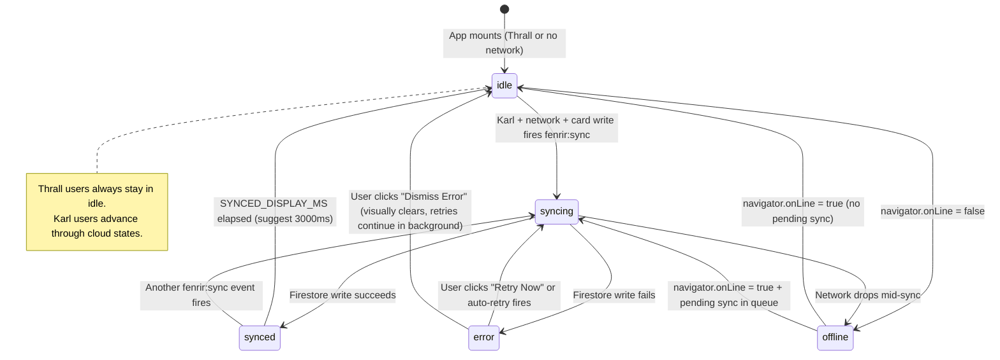
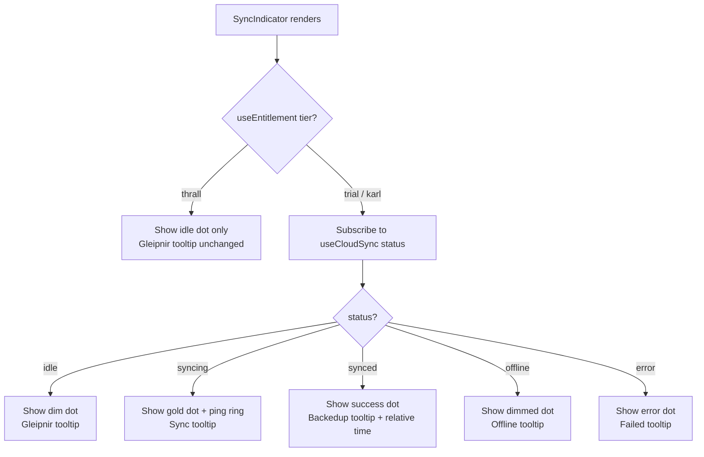
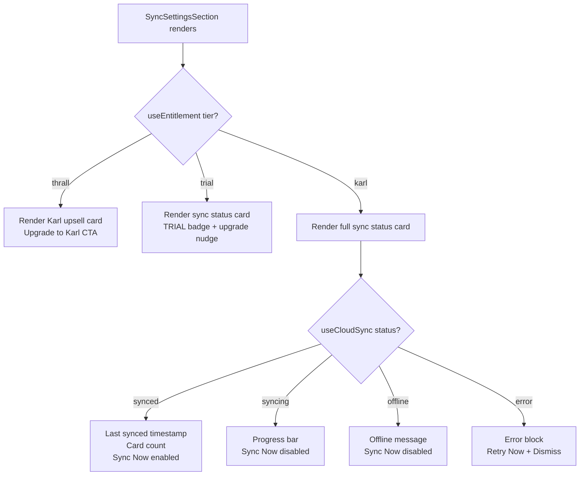

# Sync UX — Interaction Spec

**Issue #1125** · Luna · 2026-03-16

Companion to:
- `ux/wireframes/sync/sync-indicator-states.html`
- `ux/wireframes/sync/sync-settings-section.html`

---

## 1. State Machine — Cloud Sync Status



---

## 2. Tier Gating Flow





---

## 3. Gleipnir Fragment 1 — Easter Egg Preservation

The Gleipnir easter egg click handler is preserved on ALL indicator states:

| Condition | Click behavior |
|---|---|
| Not yet discovered | Fire `trigger()` → open GleipnirCatFootfall modal |
| Already discovered | No-op (existing behavior) |
| During active sync (Karl) | Still fires `trigger()` — easter egg is never suppressed |

**Tooltip precedence:**
- Thrall / idle: show Gleipnir tooltip ("The sound of a cat's footfall")
- Karl cloud states: show cloud tooltip (syncing/synced/offline/error copy)
- Both tooltips should NOT appear simultaneously — cloud tooltip takes precedence for Karl users in non-idle states

---

## 4. First-Sync Confirmation Toast

**Trigger:** First time `status` transitions from `syncing` → `synced` and `localStorage.getItem("fenrir:first-sync-shown") !== "true"`.

**Flow:**
1. `useCloudSync` detects `syncing → synced` transition
2. Check `fenrir:first-sync-shown` — if not set, dispatch toast
3. Set `fenrir:first-sync-shown = "true"` to prevent repeat
4. Toast copy: "Your N cards have been backed up / Yggdrasil guards your ledger."
5. `N` = card count from sync payload
6. Toast auto-dismisses after 5000ms
7. User can manually dismiss — no action required

**Note:** This toast fires once ever per browser session storage. Not per page load.

---

## 5. Sync Failure Toast

**Trigger:** `status` transitions to `error`.

**Behavior:**
- Non-blocking toast at bottom-right (or bottom-center — match existing toast position)
- Does NOT auto-dismiss (error persists until resolved)
- User dismisses the toast independently of the error state
- Dismissing the toast does NOT clear the error dot on the indicator
- Error dot persists until next successful sync or explicit "Dismiss Error" in Settings

**Toast content:**
- Title: "Sync failed"
- Body: "Your cards are safe locally. We'll retry shortly."
- Optional action: "View details in Settings" → navigates to `/ledger/settings`

---

## 6. "Sync Now" Button States

| Component context | State | Enabled? | aria-label |
|---|---|---|---|
| SyncSettingsSection | idle / synced | ✓ | "Sync cards to cloud now" |
| SyncSettingsSection | syncing | ✗ (disabled) | "Sync in progress" |
| SyncSettingsSection | offline | ✗ (disabled) | "Sync unavailable — offline" |
| SyncSettingsSection | error | ✓ (shown as "Retry Now") | "Retry cloud sync now" |

"Sync Now" click fires `useCloudSync().syncNow()`. This triggers `fenrir:sync` event flow and transitions status to `syncing` immediately (optimistic update).

---

## 7. Error Dismiss Behavior

Two dismiss actions exist:
1. **Toast "×" dismiss:** Hides the toast UI only. Error state persists in hook + indicator dot.
2. **Settings "Dismiss Error" button:** Clears the error from the visible Settings UI. Resets status to `idle` in the hook (but background retries may continue). Indicator dot returns to idle/dim.

**Note:** "Dismiss Error" does not cancel Firestore retry logic — it only clears the user-visible error state.

---

## 8. Reduced-Motion Spec

```css
@media (prefers-reduced-motion: reduce) {
  /* SyncIndicator: suppress ping ring */
  .sync-ping-ring {
    animation: none;
    display: none; /* or opacity: 0 — engineer discretion */
  }

  /* SyncIndicator: suppress dot color transition */
  .sync-dot {
    transition: none;
  }

  /* SyncSettingsSection: suppress progress bar animation */
  .sync-progress-fill {
    animation: none;
    /* Show static partial fill to indicate in-progress state */
    width: 50%;
  }
}
```

Color-only state communication (no motion) must still clearly distinguish all 4 states.

---

## 9. Responsive Breakpoints

| Breakpoint | Layout changes |
|---|---|
| Desktop ≥1024px | Settings: 2-column. Sync card in right column. Sync Now + subtitle inline. Error actions inline. |
| Tablet 600–1024px | Settings: single-column. Sync card full-width. Actions remain inline. |
| Mobile <600px (375px min) | Settings: single-column. Sync Now full-width. Error Retry + Dismiss stacked (full-width). Upsell feature list condensed (3 items). |

SyncIndicator: fixed position unchanged at all breakpoints. Tooltip max-width 200px on mobile to prevent clip.

---

## 10. `useCloudSync` Hook Interface Suggestion

```typescript
interface CloudSyncState {
  status: "idle" | "syncing" | "synced" | "offline" | "error";
  lastSyncedAt: Date | null;          // For Settings timestamp
  cardCount: number | null;           // For "N cards backed up" copy
  errorMessage: string | null;        // For Settings error detail block
  errorCode: string | null;           // e.g. "permission-denied"
  errorTimestamp: Date | null;        // For "failed at X" copy
  retryIn: number | null;             // Seconds until auto-retry
  syncNow: () => Promise<void>;       // Manual sync trigger
  dismissError: () => void;           // Clear visible error state
}
```

---

## 11. Acceptance Criteria → Wireframe Mapping

| AC | Wireframe section |
|---|---|
| SyncIndicator: syncing (pulse) | sync-indicator-states.html § A, F |
| SyncIndicator: synced (solid) | sync-indicator-states.html § A, F |
| SyncIndicator: offline (dimmed) | sync-indicator-states.html § A, F |
| SyncIndicator: error (red) | sync-indicator-states.html § A, F |
| Thrall upsell in Settings | sync-settings-section.html § B |
| Karl sync status in Settings | sync-settings-section.html § C |
| Last synced time + Sync Now | sync-settings-section.html § C |
| Error details in Settings | sync-settings-section.html § D |
| Sync failure toast (non-blocking) | sync-indicator-states.html § D |
| First sync confirmation ("N cards backed up") | sync-indicator-states.html § C |
| Mobile 375px responsive | sync-indicator-states.html § E, sync-settings-section.html § F |
| Reduced-motion: color only | sync-indicator-states.html § G, this spec § 8 |
| Gleipnir Fragment 1 preserved | sync-indicator-states.html § B, this spec § 3 |
